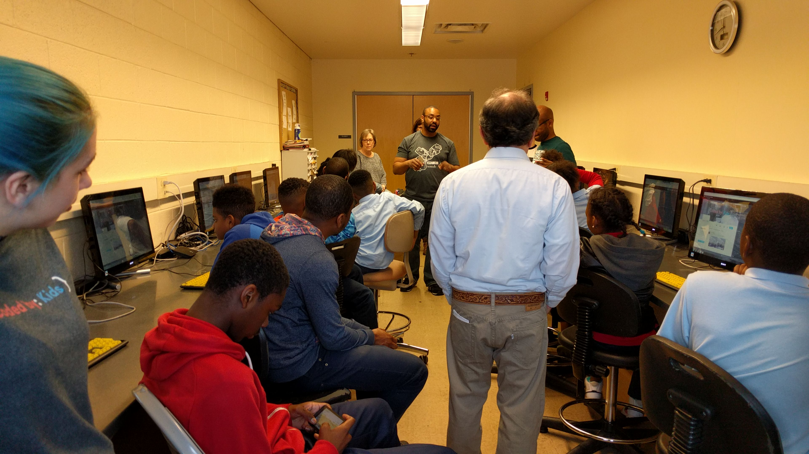
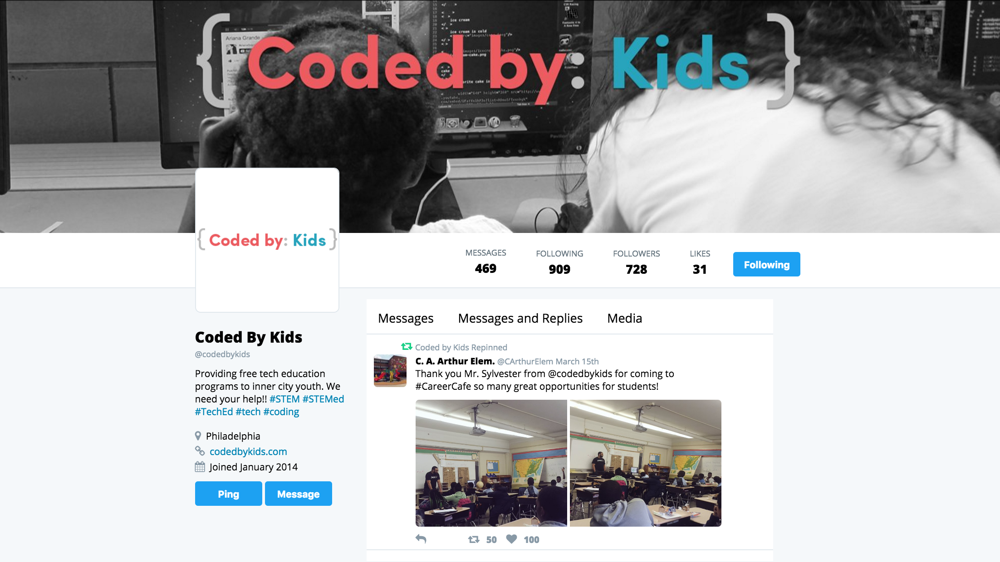
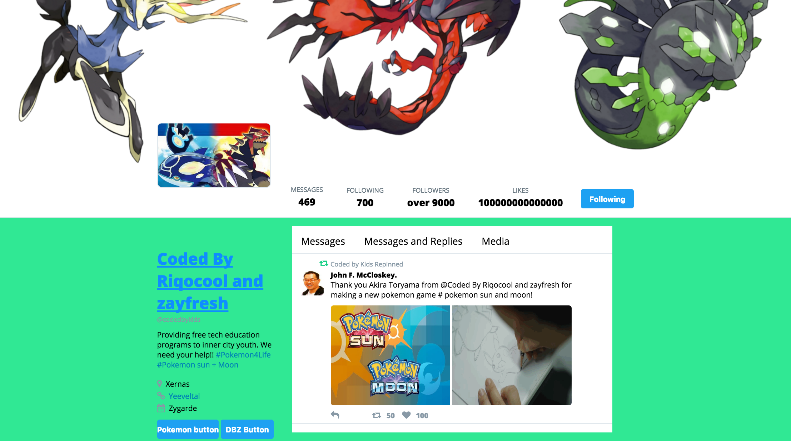
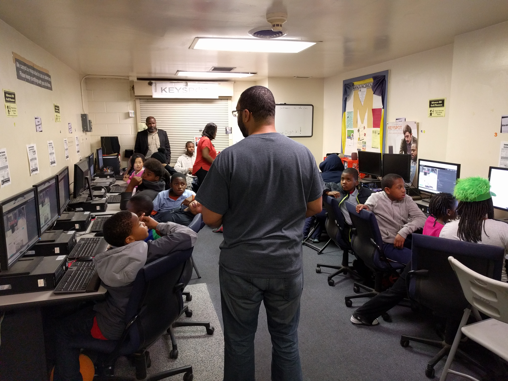
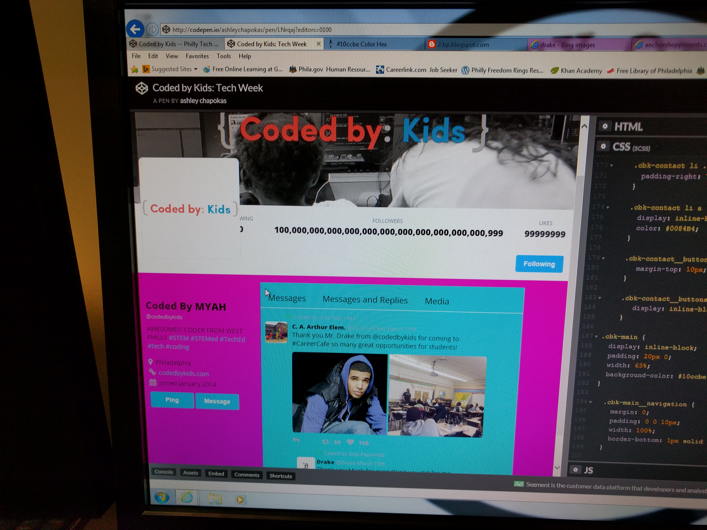

# Coded By Kids
## _or_
### "The Best PTW Event You Didn't Go To"

^ This week I attended two unusual Philly Tech Week events
^ They were "introduction to coding" sessions hosted by Coded by Kids
^ Organization which provides inner-city kids with tech skills
^ At rec centers in north philly and west philly

---

^ The session was two parts

---

# Coding 101

* What is coding? (_"Hacking!"_)
* Why do we need coding?
* Where do you find code? (_"Microwaves!"_)
* Who are coders? (_"Game makers, hackers!"_)
* What skills are useful for coding? (_"Math."_)
* Q&A (_"Are you a hacker?!"_)

^ Totally fascinated with games and hacking
^ Have a pretty good idea of where code lives and why we need it
^ Don't have any idea who coders are <- a good thing

---

# Hands On

* Pre-made HTML/CSS website (codepen.io)
* Try to make alterations to the site
  * Change text
  * Change font styling
  * Change colors
  * Change images

^ Paired up with Tyriq and his friend Jayden, 9 and 10 respectively

---

---

---

# What _They_ Learned

---

# Messing things up

^ Pretty worried about messing things up
^ At the very beginning, Tyriq accidentally typed a bunch of gibberish in a HTML comment
^ Was pretty upset that he had just messed up all his code
^ They have a pretty good idea that computers/code can be fragile, can be broken
^ Prevents them from experimenting

---

# Experimentation

---

^ Early in the hands-on portion, Tyriq wanted to change the images in the "tweet"
^ For the second one, he saw a GIF he wanted to use, but changed his mind
^ When I asked him why, he said he didn't think it would work, because it was animated
^ Had to push him to get him to at least try it and see what would happen
^ It worked!

---

# Coding?

^ Didn't really learn coding, but definitely got excited about it
^ Learned how images have addresses that can be used on website
^ Learned how colors are represented by codes
^ Learned how you have to tell a computer exactly what to do (text size, color, underline)
^ Syntax highlighting made a surprising amount of sense to them

---

# What _I_ Learned

---

> "This inequity makes me angry."

^ This is what Mayor Jim Kenney said when he came to the session
^ Computer labs in rec centers are way underfunded:
^ Water leaking from ceiling
^ 1/4 of computers don't work
^ Mice & Keyboards are broken, missing keys

---

^ 2-3 kids per computer
^ Not even enough chairs

---

# Technical Literacy

^ These kids are more technically literate than I expected:
^ They almost all have cellphones, some iPads, some laptops
^ They have Gmail accounts, and know how to use them
^ They don't have someone to focus that literacy or desire

---

# Colors

^ One last thing I learned

---

^ While we were changing the colors of things, I told Tyriq that instead of using hex codes, we could use the actual names of some colors
^ Expecting him to say something like "red", "green", or "blue", I asked him what color we should try
^ He said: "turquoise"
^ I thought turquoise sounded a little too exotic to be a HTML color name
^ So I told him I didn't think it would work
^ He told me we should try it to see what would happen!

---

# It worked!

---

# Questions?

---

# Thanks!

---

---

---

---

---

---
