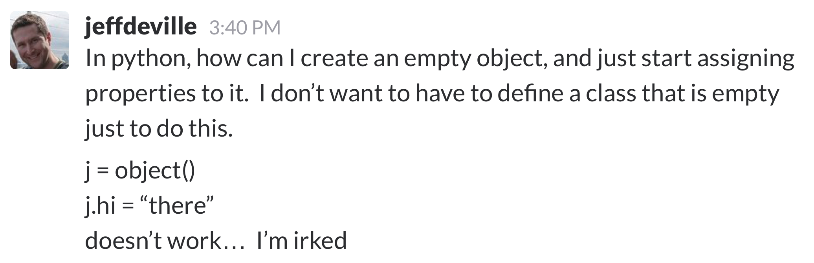

# What Is
### _and_
#What Can Be
### An Exploration from `type` to metaclasses

---


# I'm Dustin
## [`http://github.com/di`](http://github.com/di)

^ My name's Dustin Ingram

---


^ I work at PromptWorks, a software consultancy in Philadelphia

^ Promptworks got it's start years ago as a Ruby shop, and most of our reputation is for working with Ruby

^ But we actually we work with lots of different languages

^ And these days, it's more Python than anything else -- it's all I do

^ But we still have some Ruby devs who are occasionally writing Python

^ Which means that every now and then, we get questions like this in our Slack

---

# Irked.



^ So if you knew Jeff, you'd know that he's usually irked

^ But he has a pretty good question here

^ When I saw this, I asked myself, why _can't_ you do this?

---

# Irked.

```python
>>> j = object()
```

^ So I fired up my interpreter, and typed ...

^ I know that `object` is a built-in name in Python, and instantiable.

^ So this works fine.

---

# Irked.

```python
>>> j = object()
>>> j.hi = 'there'
```

^ Then I typed ...

^ I also know that this is how you set an attribute on an object instance

---

# Irked.

```python
>>> j = object()
>>> j.hi = 'there'
Traceback (most recent call last):
  File "<stdin>", line 1, in <module>
AttributeError: 'object' object has no
attribute 'hi'
```

^ But then this happens...

^ Why does this happen? Seems counter-intuitive.

^ Of course it doesn't have that attribute, we're trying to set it

^ But why doesn't it work? I'll tell you

^ But first, let's talk about type

---

# `type`

^ The `type` built-in in Python can be used as a function that tells us what something _is_

^ You can pass it just about anything as it's first argument

^ The return value is a type object

^ Let's have a little quiz with some examples of how type is used.

^ Please shout out the answers if you know them.

---

# `type`

```python
>>> type(['foo', 'bar'])
```

^ Here's an easy one. What's the type of this list?

---

# `type`

```python
>>> type(['foo', 'bar'])
<class 'list'>
```

^ Right, list.

---

# `type`

```python
>>> type(list)
```

^ So what's the type of list?

---

# `type`
```python
>>> foo = list()
```

^ I'm not talking about the type of an instantiated list

^ We _could_ instantiate a list like this

---

# `type`
```python
>>> foo = list()
>>> foo
[]
```

^ It would give us an empty list

---

# `type`
```python
>>> foo = list()
>>> foo
[]
>>> type(foo)
<class 'list'>
```

^ And the type of that list is still list, like before.

---

# `type`

```python
>>> type(list)
```

^ I'm asking what is the type of the `list` builtin

---

# `type`

```python
>>> type(list)
<class 'type'>
```

^ It's type

---

# `type`

```python
>>> type(type)
```

^ Uh-oh. What's the type of type?

---

# `type`

```python
>>> type(type)
<class 'type'>
```

^ It's type, of course.

^ Turtles all the way down

---

# `type`

```python
>>> type(None)
```

^ Some more. What's the type of None?

---

# `type`

```python
>>> type(None)
<class 'NoneType'>
```

^ We've all sure see that a lot I'm sure

^ "NoneType has no attribute blah blah"

---

# `type`

```python
>>> def func():
...     pass
...
>>> type(func)
```

^ What's the type of this function?

---

# `type`

```python
>>> def func():
...     pass
...
>>> type(func)
<class 'function'>
```

^ It's `function`.

^ Makes sense, but wait! Function isn't a builtin, like list!

^ We don't write "function func", we write "def func"

^ Where do these come from?

---

# `type`

```python
>>> import types
>>> dir(types)
['BuiltinFunctionType',
'BuiltinMethodType', 'CodeType',
'CoroutineType', 'DynamicClassAttribute',
'FrameType', 'FunctionType',
'GeneratorType', 'GetSetDescriptorType',
'LambdaType', 'MappingProxyType',
'MemberDescriptorType', 'MethodType',
'ModuleType', 'SimpleNamespace',
'TracebackType', ... ]
```

^ There's a module in the standard library, `types`

^ Import it, and there they are

---

# `type`

```python
>>> import types
>>> types.FunctionType
<class 'function'>
```

^ We can get our same FunctionType this way as well

---

# `type`

```python
>>> import types
>>> type(types)
```

^ While we've got the `types` module imported, what's the type of types?

---

# `type`

```python
>>> import types
>>> type(types) is types.ModuleType
True
>>> type(types)
<class 'module'>
```

^ It's a module. Makes sense

---

# `type`

```python
>>> class FooClass:
...     pass
...
>>> type(FooClass)
```

^ One more.

^ If I define this class called FooClass, what's the type of FooClass?

^ Again, I'm not talking about a new instantiated FooClass object

---

# `type`

```python
>>> class FooClass:
...     pass
...
>>> type(FooClass())
<class '__main__.FooClass'>
```

^ That would look like this

^ And the type of an instantiated FooClass would clearly be a FooClass

---

# `type`

```python
>>> class FooClass:
...     pass
...
>>> type(FooClass)
```

^ I'm talking about the class itself

---


# `type`

```python
>>> class FooClass: # Python 2.7
...     pass
...
>>> type(FooClass)
<type 'classobj'>
```

^ Trick question! Depends on our python version

^ In Python 2, this is a 'classobj' type

---

# `type`

```python
>>> class FooClass: # Python 3.5
...     pass
...
>>> type(FooClass)
<class 'type'>
```

^ In Python 3, (or as I like to call it, "Python"), it's a 'type' class

^ Just like `list` and `type` itself

^ And just to make this even more confusing...

---

# `type`

```python
>>> class FooClass(object): # Python 2.7
...     pass
...
>>> type(FooClass)
<type 'type'>
```

^ In Python 2 you can do this

^ You've probably heard of this before, we call this "new style classes"

^ It gives us a type of type

^ But it's basically the same as you would get in Python... 3.

^ And just to be clear...

---

# Python is dead.
# _Long live Python_

^ From here on out, we're only talking about Python, not Python 2.whatever

---

# `type`

```python
>>> type(42)
```

^ So let's review. When we call `type` on something, like the number 42, what do we get?

---

# `type`

```python
>>> type(42)
<class 'int'>
```

^ It tells us that it's an int, yes, but also

^ We get a class!

^ What we think of as the `int` type here is really just the `int` class

---

# `type`

```python
>>> type(42) is int
True
```

^ From this we can realize that the `int` keyword is just the name of a class

^ And what do we know about classes?

---

# `type`

```python
>>> type(42) is int
True
>>> type(42)()
0
```

^ They're instantiable!


---

# `type`

```python
>>> type(42) is int
True
>>> type(42)()
0
>>> int()
0
```

^ So instantiating the type of 42 is the same as just instantiating an int

^ In both cases we get zero

^ So if a type is just a class,

^ And calling type with an argument such as '42'  gives us the class...

---

# `type`

```python
>>> j = type()
```

^ Can we create a new class dynamically by instantiating type?

---

# `type`

```python
>>> j = type()
Traceback (most recent call last):
  File "<stdin>", line 1, in <module>
TypeError: type() takes 1 or 3 arguments
```

^ Nope, but this error looks promising.

^ One argument would just give us the type of the argument,

^ So what would be the three arguments?

---

# `type`

```python
>>> class
```

^ When you're creating a new class manually, what do you need to define?

---

# `type`

```python
>>> class FooClass
```

^ You need the name of the class

---

# `type`

```python
>>> class FooClass(object):
```

^ You need to specify what the class inherits from

---

# `type`

```python
>>> class FooClass:
```

^ (But if it's just `object`, and you're using Python, then this is implicit)

---

# `type`

```python
>>> class FooClass:
...     hi = 'there'
```

^ And the third thing is any attributes on that class

---

# `type`

```python
>>> j = type(
```

^ So the three arguments we need are...

---

# `type`

```python
>>> j = type(
...     'FooClass',
```

^ Class name (as a string)...

---

# `type`

```python
>>> j = type(
...     'FooClass',
...     (object,),
```

^ Base classes (as a tuple)...

---

# `type`

```python
>>> j = type(
...     'FooClass',
...     (object,),
...     {'hi': 'there'},
... )
```

^ And attributes (as a dict).

---

# `type`

```python
>>> j = type(
...     'FooClass',
...     (object,),
...     {'hi': 'there'},
... )
>>> type(j)
<class 'type'>
```

^ This works! We get a new class

^ And if you've been paying attention...

---

# `type`

```python
>>> j = type(
...     'FooClass',
...     (object,),
...     {'hi': 'there'},
... )
>>> j.hi
'there'
```

^ You may have realized that we've now come full circle!

^ Technically `hi` is a class attribute, not an instance attribute

^ But it's functionally the same as what Jeff wanted

^ And if we really wanted to get fancy,

---

# `type`

```python
>>> j = type(
...     '',
...     (object,),
...     {'hi': 'there'},
... )
>>> j.hi
'there'
```

^ We don't need to actually specify a classname...

---

# `type`

```python
>>> j = type(
...     '',
...     (),
...     {'hi': 'there'},
... )
>>> j.hi
'there'
```

^ Or any base classes...

---

# `type`

```python
>>> j = type(
...     '',
...     (),
...     {},
... )
>>> j.hi = 'there'
>>> j.hi
'there'
```

^ Or really even any attributes.

^ Now, that looks terrible

^ And I guarantee if you try to commit that, your teammates won't let you

^ But it works!


---

# (_side note_)

^ As a quick sidenote, if you find yourself wanting to do this, because it is pretty handy

---

# `stub`

```bash
$ pip install pretend
```

```python
>>> from pretend import stub
>>> j = stub(hi='there')
>>> j.hi
'there'
```


^ I would strongly recommend Alex Gaynor's excellent module `pretend`

^ Which let's you do basically the same thing, but calls them "stubs"

^ This is super useful for testing!

^ And far more readable

---

# Metaclasses

^ Now let's talk about metaclasses

---

# Metaclasses

> "The subject of metaclasses in Python has caused hairs to raise and even brains to explode."

^ A wise man once wrote...

^ Anyone know who said that?

---

# Metaclasses

> "The subject of metaclasses in Python has caused hairs to raise and even brains to explode."

— Guido van Rossum

^ Guido, of course

^ I promise none of your brains will explode

^ In fact, at the core, the idea is quite simple

^ And can be shown with a simple analogy

---

# Metaclasses

classes : instances : : metaclasses : classes

^ Classes are to instances as metaclasses are to classes

^ Classes create instances, metaclasses create classes

^ The word "metaclass" just means that it's one abstraction from a class

^ Not related to or used in conjunction with "metadata"

^ So. Can anyone name a metaclass in Python?

---

# Metaclasses

```python
>>> j = type(
...     'FooClass',
...     (object,),
...     {'hi': 'there'},
... )
>>> type(j)
<class 'type'>
```

^ We just learned this. Type is infact a metaclass

^ We can use it to create new classes

^ So how do we create a metaclass like type?

---

# Metaclasses

```python
>>> class MyMeta(type):
...     pass
...
```

^ Pretty simple. A metaclass is still a class after all

^ And since type is a class, we can extend from it

^ So how do we attach this to a class?

---

# Metaclasses

```python
>>> class MyMeta(type):
...     pass
...
>>> class FooClass(metaclass=MyMeta):
...     pass
...
```

^ We use a keyword arguement

---

# Metaclasses

```python
>>> class MyMeta(type):
...     def __new__(meta, name, bases, attrs):
...         return super().__new__(
...             meta, name, bases, attrs
...         )
...
>>> class FooClass(metaclass=MyMeta):
...     pass
...
```

^ To make metaclasses actually useful, we have to override __new__

^ But this time, new is not returning an instance, it's returning a class

^ Using super here is just like calling type with name, bases, attrs, but not just a new class

^ But by calling new of super, it becomes an instance of mymeta

^ By the way, there are so many names for all of these fields

^ There is not much consistency, this is what I like the best

---

# Metaclasses

```python
>>> class MyMeta(type):
...     def __new__(meta, name, bases, attrs):
...         print('New {}'.format(name))
...         return super().__new__(
...             meta, name, bases, attrs
...         )
...
>>> class FooClass(metaclass=MyMeta):
...     pass
...
New FooClass
```

^ Just to be clear, this line gets printed when the class is created

---


# Metaclasses

```python
>>> class MyMeta(type):
...     def __call__(cls, *args, **kwargs):
...         print('Call {}'.format(
...             cls.__name__
...         ))
...         return super().__call__(
...             *args, **kwargs
...         )
...
>>> class FooClass(metaclass=MyMeta):
...     pass
...
>>> f = FooClass()
Call FooClass
                                                            
```

^ When we initialize a class, call gets called

---

# Metaclasses

> "Metaclasses are deeper magic than 99% of users should ever worry about. If you wonder whether you need them, you don’t (the people who actually need them know with certainty that they need them, and don’t need an explanation about why)."

— Tim Peters

^ It's been said that ...

^ In the sprit of this, I'm not going to tell you why you need metaclasses

^ However, if I don't show you some examples of how one _can_ use metaclasses, you'll never know that the magic is available to you

^ So here's a somewhat contrived example

---

# Metadog

---

# Metadog

```python
>>> class Dog():
...     def sit(self):
...         print("*sitting*")
...
```

^ Let's imagine we have a dog Class which we have written for our client

^ The requirements call for a single function, sit, which makes the dog sit when we tell it to

^ Great. Now let's imagine our client comes back to us and says

^ "Actually, we forgot, we need the dog to make a dog-noise whenever it does anything"

^ OK, no problem

---

# Metadog

```python
>>> class Dog():
...     def sit(self):
...         print("Growl!")
...         print("*sitting*")
...
```

^ We make a small patch, and done.

^ But the client comes back to us and says

^ Actually we need the dog to be able to stay as well, it's rather useless to have a dog that sits but doesn't stay

---

# Metadog

```python
>>> class Dog():
...     def sit(self):
...         print("Growl!")
...         print("*sitting*")
...     def stay(self):
...         print("Growl!")
...         print("*staying*")
...
```

^ So another quick patch, but then more feedback from the client

^ "That's great but we did some user testing and the growl is making the dog seem too agressive and the users are scared,

^ Can we make it woof instead?"

---

# Metadog

```python
>>> class Dog():
...     def _woof(self):
...         print("Woof!")
...     def sit(self):
...         self._woof()
...         print("*sitting*")
...     def stay(self):
...         self._woof()
...         print("*staying*")
...
```

^ So then we think ok, let's DRY it up a bit and put our woof in a private woof function

^ And we'll call that from sit and stay

^ But then we remember we heard about decorators

---

# Metadog

```python
>>> from functools import wraps
>>> def woof(f):
...     @wraps(f)
...     def wrapper(*args, **kwargs):
...         print('Woof!')
...         return f(*args, **kwargs)
...     return wrapper
...
```

^ So we go to the functools docs and copy this decorator and add our woof statement

---

# Metadog

```python
>>> class Dog():
...     @woof
...     def sit(self):
...         print("*sitting*")
...     @woof
...     def stay(self):
...         print("*staying*")
...
```

^ And then we decorate our sit and stay functions and pat ourselves on the back

^ Because this is pretty good python!

^ And then the client says "We'd like the dog to play dead too, is that possible?"

^ And we say "We think we can get it done in a sprint"

---

# Metadog

```python
>>> class Dog():
...     @woof
...     def sit(self):
...         print("*sitting*")
...     @woof
...     def stay(self):
...         print("*staying*")
...     def play_dead(self):
...         print("*playing_dead*")
...
```

^ We write one more patch and deploy it to prod and then... oh no

^ We have a bug in production. We forgot to decorate the play_dead function

^ And now Dogs are not woofing when they are rolling over

^ Users are very confused, they think their dogs are actually dead

^ And we wish to ourselves: wouldn't it be great if we could just automatically decorate every function in this class

^ To meet the orignial requirement that a dog makes a dog noise whenever it does anything

^ And then we remember metaclasses!

---

# Metadog

```python
>>> from inspect import isfunction
>>>
```

^ So let's write a Metaclass

^ First we'll import the isfunction function from the inspect module

^ I'll explain why in a second

---

# Metadog

```python
>>> from inspect import isfunction
>>> class MetaDog(type):
...
```

^ Then we write our metadog metaclass, inheriting from type

---

# Metadog

```python
>>> from inspect import isfunction
>>> class MetaDog(type):
...     def __new__(meta, name, bases, attrs):
...
```

^ We want to squeeze in between the class definition and it's instantiation, so we'll override __new

^ Which, like I said before, takes these arguments

---

# Metadog

```python
>>> from inspect import isfunction
>>> class MetaDog(type):
...     def __new__(meta, name, bases, attrs):
...         for name, attr in attrs.items():
...
```

^ The functions we have defined are tucked away in the attrs dict

^ So we'll iterate over it

---

# Metadog

```python
>>> from inspect import isfunction
>>> class MetaDog(type):
...     def __new__(meta, name, bases, attrs):
...         for name, attr in attrs.items():
...             if isfunction(attr):
...
```

^ We'll check if a given attribute is a function

---

# Metadog

```python
>>> from inspect import isfunction
>>> class MetaDog(type):
...     def __new__(meta, name, bases, attrs):
...         for name, attr in attrs.items():
...             if isfunction(attr):
...                 attrs[name] = woof(attr)
...
```

^ And if it is, we'll wrap it in our woof decorator

^ This overrides the original function in the attrs dict

---

# Metadog

```python
>>> from inspect import isfunction
>>> class MetaDog(type):
...     def __new__(meta, name, bases, attrs):
...         for name, attr in attrs.items():
...             if isfunction(attr):
...                 attrs[name] = woof(attr)
...         return type.__new__(
...             meta, name, bases, attrs
...         )
...
```

^ And finally, we'll call new of our parent class, type

^ With the same arguments we originally had, but now we've wrapped all the functions

^ And return it!

---

# Metadog

```python
>>> class Dog(metaclass=MetaDog):
...     def sit(self):
...         print("(sitting)")
...     def stay(self):
...         print("(staying)")
...     def play_dead(self):
...         print("*playing_dead*")
...
```

^ We add it to our Dog class with the metaclass argument as so

---

# Metadog

```python
>>> my_dog = Dog()
```

^ And this works! We can instantiate a new Dog

---

# Metadog

```python
>>> my_dog = Dog()
>>> my_dog.sit()
Woof!
*sitting*
```

^ We tell it to sit, it woofs,

---

# Metadog

```python
>>> my_dog = Dog()
>>> my_dog.sit()
Woof!
*sitting*
>>> my_dog.play_dead()
Woof!
*playing dead*
```

^ We tell it to play dead, it also woofs

---

# Metadog

^ So what have we found? We can use metaclasses to dynamically control the creation of a class

---

# Metaclasses

```python
>>> class FooClass():
...     pass
...
```

^ Let's just go back to thinking about regular classes for a second

---

# Metaclasses

```python
>>> class FooClass():
...     pass
...
>>> a, b = FooClass(), FooClass()
>>> a is b
False
```

^ When you instantiate a class twice, you get two different instances

^ If I set some attribute on a, b does not change

---

# Singleton

^ A singleton is a design pattern which allows a class to be instantiated once

^ Any subsequent tries to instantiate it get back the first instance

---

# Singleton

```python
>>> class Singleton():
...


>>> class FooClass(Singleton):
...     pass
...
>>> a, b = FooClass(), FooClass()
>>> a is b
True
```

^ Let's implement a Singleton class

^ The goal here is to make it so that a and b _are_ the same

---

# Singleton

```python
>>> class Singleton():
...     _instance = None
...


>>> class FooClass(Singleton):
...     pass
...
>>> a, b = FooClass(), FooClass()
>>> a is b
True
```

^ We'll give it a class variable _instance to hold the instance

---

# Singleton

```python
>>> class Singleton():
...     _instance = None
...     def __new__(cls, *args, **kwargs):
...


>>> class FooClass(Singleton):
...     pass
...
>>> a, b = FooClass(), FooClass()
>>> a is b
True
```

^ Then we'll override the new method. Not the init method!

^ The new method is responsible for returning an instance

^ The init method initializes the instance returned by new

---

# Singleton

```python
>>> class Singleton():
...     _instance = None
...     def __new__(cls, *args, **kwargs):
...         if not cls._instance:
...


>>> class FooClass(Singleton):
...     pass
...
>>> a, b = FooClass(), FooClass()
>>> a is b
True
```

^ If cls._instance is None, this is the first time we are trying initialize

---

# Singleton

```python
>>> class Singleton():
...     _instance = None
...     def __new__(cls, *args, **kwargs):
...         if not cls._instance:
...             cls._instance = object.__new__(
...                 cls, *args, **kwargs
...             )
...

>>> class FooClass(Singleton):
...     pass
...
>>> a, b = FooClass(), FooClass()
>>> a is b
True
```

^ If that's the case, set the _instance to be a new instance

---

# Singleton

```python
>>> class Singleton():
...     _instance = None
...     def __new__(cls, *args, **kwargs):
...         if not cls._instance:
...             cls._instance = object.__new__(
...                 cls, *args, **kwargs
...             )
...         return cls._instance
...
>>> class FooClass(Singleton):
...     pass
...
>>> a, b = FooClass(), FooClass()
>>> a is b
True
```

^ Finally return the instance

^ It works! Great, we don't even need meta classes.

^ What's the biggest potential problem with this approach?

^ Multiple inheritance. FooClass could have another base class which overrides __new

^ We'd have to think way harder than is necessary

^ What we really want is a way to control the creation of each FooClass

---

# Singleton

```python
>>> class Singleton(type):
...


>>> class FooClass(metaclass=Singleton):
...     pass
...
>>> a, b = FooClass(), FooClass()
>>> a is b
True
```

^ So now we can use this new knowledge to write a Singleton metaclass

^ First things first, it must inherit from type

---

# Singleton

```python
>>> class Singleton(type):
...     def __new__(meta, name, bases, attrs):
...


>>> class FooClass(metaclass=Singleton):
...     pass
...
>>> a, b = FooClass(), FooClass()
>>> a is b
True
```

^ We'll override __new

---

# Singleton

```python
>>> class Singleton(type):
...     def __new__(meta, name, bases, attrs):
...         attrs['_instance'] = None
...


>>> class FooClass(metaclass=Singleton):
...     pass
...
>>> a, b = FooClass(), FooClass()
>>> a is b
True
```

^ We'll give the class an attribute instance, like before, set to None

---

# Singleton

```python
>>> class Singleton(type):
...     def __new__(meta, name, bases, attrs):
...         attrs['_instance'] = None
...         return super().__new__(meta, name, bases, attrs)
...


>>> class FooClass(metaclass=Singleton):
...     pass
...
>>> a, b = FooClass(), FooClass()
>>> a is b
True
```

^ And new will return a new class! Same as calling type.__new__

---

# Singleton

```python
>>> class Singleton(type):
...     def __new__(meta, name, bases, attrs):
...         attrs['_instance'] = None
...         return super().__new__(meta, name, bases, attrs)
...     def __call__(cls, *args, **kwargs):
...


>>> class FooClass(metaclass=Singleton):
...     pass
...
>>> a, b = FooClass(), FooClass()
>>> a is b
True
```

^ Next we'll override __call

---

# Singleton

```python
>>> class Singleton(type):
...     def __new__(meta, name, bases, attrs):
...         attrs['_instance'] = None
...         return super().__new__(meta, name, bases, attrs)
...     def __call__(cls, *args, **kwargs):
...         if not cls._instance:
...


>>> class FooClass(metaclass=Singleton):
...     pass
...
>>> a, b = FooClass(), FooClass()
>>> a is b
True
```

^ If the instance class attribute is not set, this is the first instantiation

---

# Singleton

```python
>>> class Singleton(type):
...     def __new__(meta, name, bases, attrs):
...         attrs['_instance'] = None
...         return super().__new__(meta, name, bases, attrs)
...     def __call__(cls, *args, **kwargs):
...         if not cls._instance:
...             cls._instance = super().__call__(*args, **kwargs)
...

>>> class FooClass(metaclass=Singleton):
...     pass
...
>>> a, b = FooClass(), FooClass()
>>> a is b
True
```

^ So we'll instantiate a new instance and store it

---

# Singleton

```python
>>> class Singleton(type):
...     def __new__(meta, name, bases, attrs):
...         attrs['_instance'] = None
...         return super().__new__(meta, name, bases, attrs)
...     def __call__(cls, *args, **kwargs):
...         if not cls._instance:
...             cls._instance = super().__call__(*args, **kwargs)
...         return cls._instance
...
>>> class FooClass(metaclass=Singleton):
...     pass
...
>>> a, b = FooClass(), FooClass()
>>> a is b
True
```

^ And finally return the value of instance

^ Why is this better? Because it will not be messed up by class inheritance

---

# Singleton

^ So what have we learned?

^ We can use metaclasses to control the instance being returned for a given class

^ And this is pretty useful

---

# Still irked, probably.

---

# Still irked, probably.

```python
>>> j = object()
>>> j.hi = 'there'
Traceback (most recent call last):
  File "<stdin>", line 1, in <module>
AttributeError: 'object' object has no
attribute 'hi'
```

^ So let's go back to Jeff's original question again.

^ We figured out that we could achieve the same thing with `type`

^ But why doesn't python let us do this?

---

# Still irked, probably.

```python
>>> class FooClass():
...     pass
...
>>> hasattr(FooClass(), '__dict__')
True
>>> hasattr(object(), '__dict__')
False
```

^ So the message is actually __setattr__ failing

^ objects have no __dict__ -- why?

^ Because object is the featureless base type of all built-in types

---

# Still irked, probably.

```python
>>> from stackoverflow import getsize¹
>>> getsize(object())
16
>>> getsize(0)
24
>>> getsize(dict())
280
>>> getsize(FooClass())
344
```

[^1]: <http://stackoverflow.com/a/30316760/4842627>

^ [^1]


^ Also, consider size.

^ If `object` had a `__dict__` attribute, everything would be bigger

^ Also, there's no reason for an int to have a dict, or attributes

^ Units are Bytes

---

# Conclusion

^ So, to conclude, we learned a few things

---

# Conclusion

```python
>>> j = type('', (), {})
```

^ We learned that the type builtin always gives us classes

^ And we learned that this is the bare minimum to create a new class

---

# Conclusion

```python
>>> class MetaDog(type):
...
```

^ We learned that when creating a metaclass, you inherit from type

---

# Conclusion

```python
>>> class FooClass(metaclass=Singleton):
...
```

^ And we learned that to give a class a metaclass, we use a keyword arg

---

# Conclusion

^ All that, and I don't see any brains explode. Not bad.

---

# Thanks!
## [`http://github.com/di`](http://github.com/di)
