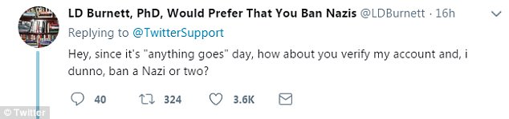
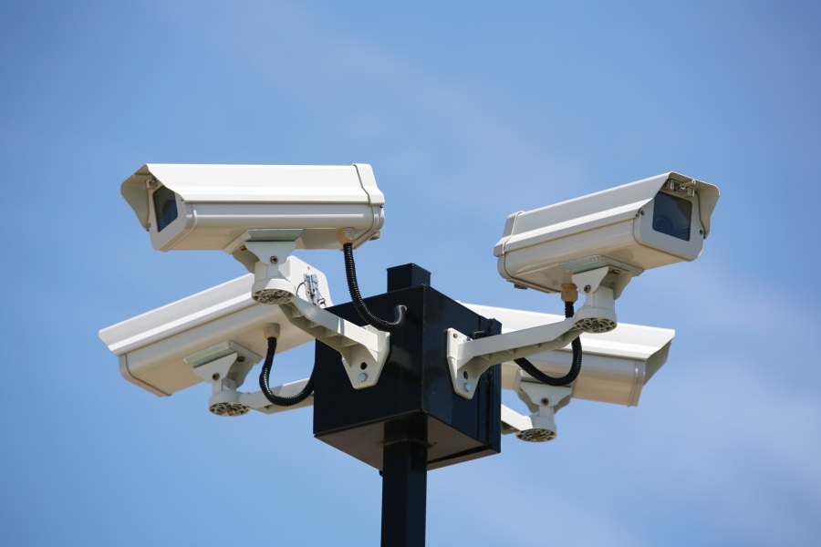
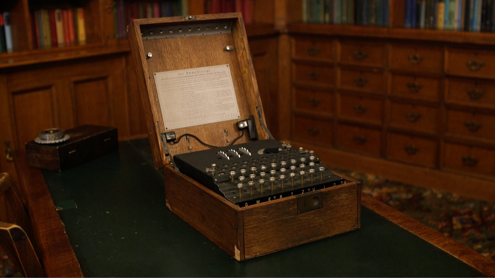
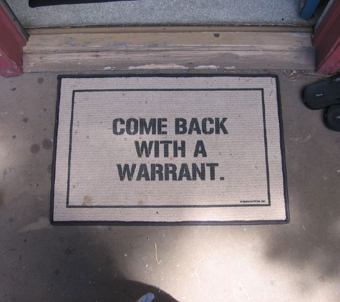
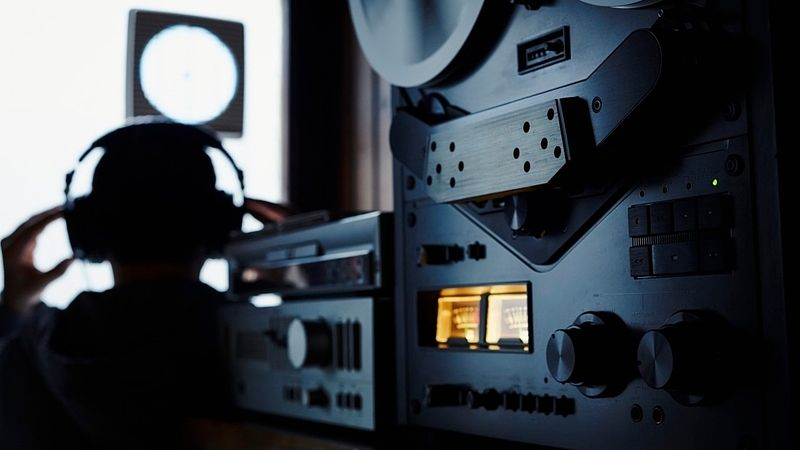
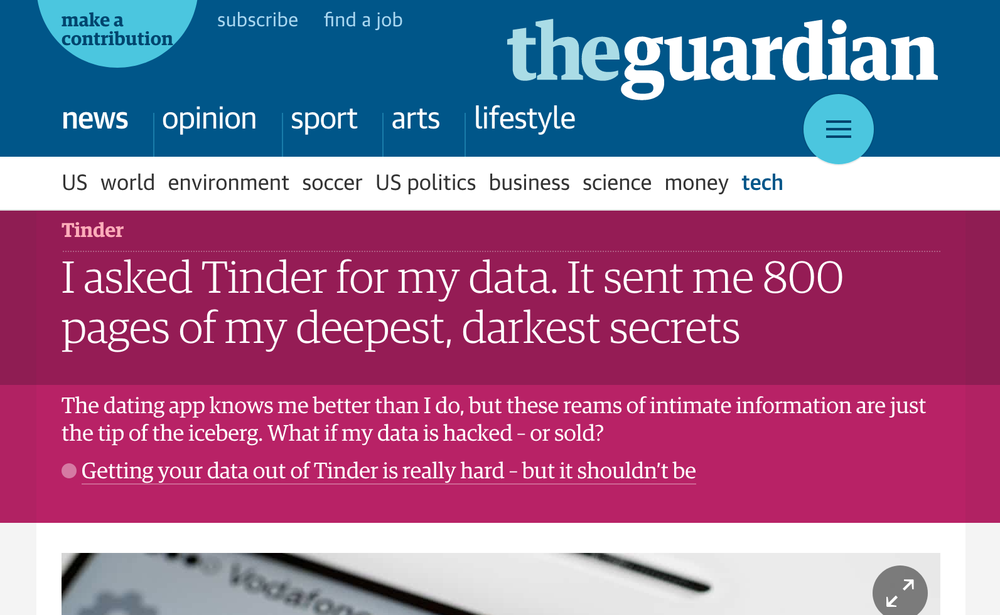

# [fit] Hi, I'm Dustin
# [fit] [`http://github.com/di`](http://github.com/di)

^ My name's Dustin Ingram

---

^ I work at PromptWorks, a software development shop and consultancy

---

^ austin

---

^ Somewhat involved with the Python community

^ Member of the PyPA

^ Maintainer for Warehouse

---

# "Welcome to the terrordome"

---

# Data Protection For Developers

# Past, Present, and Future

^ intersection of my interests in technology and law

---

# "I Am Not A Lawyer"

^ please don't take anything I'm about to talk about as legal advice

---

# What is data?

^ big data? small data?

^ collection of values for one or more variables

^ discrete pieces of information

---

# _datum_ → data

^ data is the plural of datum

^ "(thing) given"

---

# What data needs protected?

^ Counting how many pizza pies we all ate

^ Counting the number of peices each of you ate

^ There is an ethical issue with considering such data as "given"

^ Did you "give" me did that data? Or did I "take" it from you

^ Who's was it anyways?

---

# _capere_ → capta

^ as in capture, captive

---

# Personally Identifable Information

^ any data specific to one person

^ or which can be used to identify a given person

^ for the purposes of this, i'm talking about personal data

^ and we're going to start in

---

^ might not be the first place you think of as the birthplace of data protection

^ Germany was an interesting place after WW2

---

^ Many citizens were having a strong reaction to their previous govenment

^ ensure that a potential dictator would never again have the chance to come into power in the country

^ can't just pass a law that says "no hitlers"

---

# Basic Law (1949)

^ two key tenets

---

# 1. A person's dignity is inviolable

^ under all circumstances

---

# 2. Each person has the right to freely develop their personality

^ as long as it doesn't injure the rights of others

^ "personality" - no definition for privacy

---

# Persönlichkeitsrechte
## (Rights of the Personality)

^ besides these concerns about dictators

^ there were some other concerns that germans were increasingly having in the 50s and 60s

---

^ Nuclear Power

---

^ Pollution

---

^ Data Privacy

^ The "right" use of technological developments

^ So many complex and interconnected parts

^ An individual cannot grasp all the issues

^ for data privacy specifically, this comes from two places -- increasing use of computers

^ How did the nazis know who was jewish? census records, tax returns, synagogue membership lists

---

# Hessian Data Protection Act (1970)

^ german state of hesse

^ more legislation on top of the Basic Law

^ name is a bit of a misnomer, because it doesn't protect the data, it protects the people whose data are being processed

---

# _ex ante_

^ Mostly focused on what was done with the data after it was collected

---

# Public sector

^ Only for the processing of personal data in the public sector

---

# Data Protection Commissioner

^ called for a

^ In charge of overseeing violations of the data protection act

^ Ironically the first commissioner was somewhat of a dictator and held the post for 16 years

---

^ considered the first data protection act, ever

^ this was 1970

^ this law might seem somewhat primitive, only focused on uses

^ nothing about encryption, breaches, etc

---

^ this is what we had in terms of encryption at the end of WW2

^ it wasn't until 1975 that we got the first standard for encryption (DES)

^ so this is actually pretty good

---

^ meanwhile, in sweden, they had a completely different set of circumstances that were leading up to similar data protection

^ swedish government was using computers much earlier than most other countries

^ small population

^ high standard of living and income

^ could forsee usefulness of automation

---

# "A paradise for registers"

^ vast amounts of information about it's citizens

^ average adult would appear in 100 data systems

^ 200 if you're married! and this is the 1970s

---

# Swedish Constitution (1766)

^ there was already a strong notion of "the right of public access"

^ right of the public to be present at court hearings

---

# Swedish Freedom of the Press Act (1949)

^ right of the press to government information

^ generally, public access to official records

^ combining this with computers, private entities would gain vast amounts of information on citizens

---

# Swedish Data Act (1973)

^ first national data protection act

^ three tenets

---

# 1. The right to get data about oneself

---

# 2. The right to compensation when individuals suffer damage due to incorrect information about them

^ this is important

---

# 3. Criminalization of 'data intrusion'

^ In the law, this literally meant breaking into the offices where the data lived

---

^ The swedes were smart, but they weren't able to forsee the internet

---

^ Back in Germany

^ Since the Hessian law was enacted, other states were working on similar laws

^ Based on Sweden, it was determined thaty they needed a national law

---

# German Federal Data Protection Act (1977)

^ Several states had laws, combined them into a federal law

^ three parts

---

# 1. Ensure against the misuse of data

---

# 2. Prevent harm to personal interests

---

# 3. Prohibits the 'processing' of personal data without specifically being permitted

^ Can't just collect data and then decide what to do with it later

---

^ Over in the UK, people wanted some data protection

---

# UK Data Protection Act (1984)

^ only after much reluctance by the UK government

---

> "No evidence to suggest that fears about the improper use of computers in the public sector are justified by present practice"

^ One early commission actually found

^ widely criticised

^ In 1985, the UK joined the European Communities, which was a precursor to the European Union

---

^ The European Union was working on it's own policies

^ look how optimistic that flag is!

---

# EU Data Protection Directive (1995)

---

> A right to respect for one's private and family life, home and correspondence[^1]

[^1]: subject to certain restrictions

^ generally

^ more specifically, it had seven key recommendations

---

# 1. Notice

^ data subjects should be given notice when their data is being collected;

---

# 2. Purpose

^ data should only be used for the purpose stated and not for any other purposes;

---

# 3. Consent

^ data should not be disclosed without the data subject’s consent;

---

# 4. Security

^ collected data should be kept secure from any potential abuses;

---

# 5. Disclosure

^ data subjects should be informed as to who is collecting their data;

---

# 6. Access

^ data subjects should be allowed to access their data and make corrections to any inaccurate data; and

---

# 7. Accountability

^ data subjects should have a method available to them to hold data collectors accountable for not following the above principles.

^ this is awesome! except...

---

# It's A Directive

^ which means it's non-binding. it's just a suggestion/recommendation and not law

---

# We're in the late 90's now...

---

# ...notice anything missing?

---

^ The United States

^ can anyone name the major national data protection law we have?

---

^ Fourth Amendment? unreasonable search & seizures

---

^ closest we've come is challenging massive wiretapping and metadata by the US government

^ district court ruled that it "probably violated the 4th amendment"

---

# ALCU v. Clapper

^ global telephone data-gathering system is needed to thwart potential terrorist attacks

^ it can only work if everyone's calls are included

^ Congress legally set up the program and that it does not violate anyone's constitutional rights

^ even wiretapping every US citizen doesn't constitute unreasonable search and seizure

^ so, yeah, we don't really have a national data protection law

---

> In the US, there is no single, comprehensive federal law regulating the collection and use of personal data.

---

# Video Rental Protection Act (1988)

^ wrongful disclosure of video tape rental or sale records

^ so that's cool

^ don't get me wrong, we have a lot of laws like this

---

* The Federal Trade Commission Act
* The Financial Services Modernization Act
* The Health Insurance Portability and Accountability Act (HIPPA)
* The Fair Credit Reporting Act
* The Controlling the Assault of Non-Solicited Pornography and Marketing Act (CAN-SPAM)
* The Telephone Consumer Protection Act
* The Electronic Communications Privacy Act

^ All of these address a very small, specific part of data protection

^ HIPPA - just for health records

^ fair credit reporting - you can correct your credit history

^ CAN-SPAM - collection and use of email addresses

---

# S.J.Res.34 (April 2017)

^ senate joint resolution 34

^ Signed into law by somebody

---

> "This joint resolution nullifies the rule submitted by the Federal Communications Commission entitled "Protecting the Privacy of Customers of Broadband and Other Telecommunications Services."

^ TLDR; ISPs can sell your browsing history again

---

^ everything is terrible, i'm moving to sweden

^ Well, maybe if you live in the US

---

^ But remember that beautiful, shining, optimistic EU flag?

^ if you live in the EU, you're about to get the

---

# EU General Data Protection Regulation (2018)

---

# Scope

^ Applies if the data controller, data processor, or data subject is based in tne EU

^ If you're an american company that has customers in the EU, you must comply

---

# Single set of rules

^ Same rules for all member states

---

# Right of Erasure

^ maybe the most well known part

^ the right to be forgotten

---

# Right of Access

^ the right to get a copy of all the data a company has on you

---

^ what if it's hacked or sold?

---

# Data breaches

^ data breach must be reported within 72 hours

^ not a year: uber

^ Not a month: equifax

---

# Right to Compensation

^ if there has been a breach

^ for any person that has suffered material or non-material damage shall have the right to recieve compensation

^ this is amazing because there is no such thing as a class-action lawsuit in european states

---

# Pseudonymisation

^ read: encryption

^ resulting data cannot be attributed to a specific data subject without the use of additional information

^ what if it's sold?

---

# Consent

^ Data collectors must be explicit about what is being gathered and what it is being used for

^ can only use the data for the consented purposes!

---

# Data Protection Officer

^ a person with expert knowledge of data protection law and practices should assist the controller or processor to monitor internal compliance

---

# It's binding!

^ a warning in cases of first and non-intentional noncomplance

^ regulr periodic data protection audits

^ fine of 10M euros or 2% of annual worldwide revenue, whichever is greater, first offense

^ fine of 20M euros or 4% of annual worldwide revenue, whichever is greater, first offense

^ facebook 27 billion a year, more than a billion dollars

^ google 89 billion a year, 3.5 billion dollars

^ apple 229 billion a year, more than 9 billion dollars

---

# May 25, 2018 🎉

^ Goes into effect this year!

---

# Future of Data Protection

---

# 1. "GDPR Compliance" is going to be a big deal

^ Just like HIPPA compliance, but way more complex

---

# 2. Somebody is going to get sanctioned

^ Likely one of the big tech companies

---

# 3. Don't expect anything in the US to get better in the next ~3 years

^ Just a hunch

^ Instead, expect further dismantling of privacy laws and regulations

---

# Questions

---

# Thanks
