theme: Next

# FLPY 2017
## Detecting Asteroids with Neural Networks

---


# [fit] Hi, I'm Dustin
# [fit] [`http://github.com/di`](http://github.com/di)

^ My name's Dustin Ingram

---


^ I work at PromptWorks, a software consultancy in Philadelphia

---

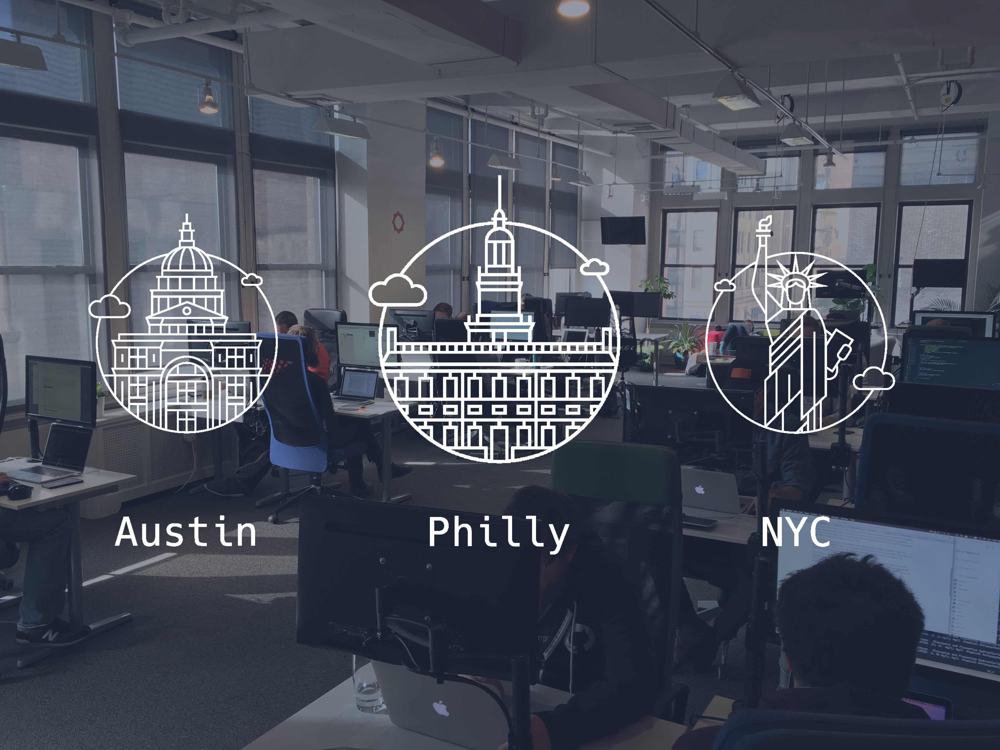

---

# Detecting Asteroids
## _with_
# Neural Networks


---

# Outline

* What's the goal?
* What's the data?
* Getting started
* Building a feature set
* Building the neural network
* Training the network
* Results


---

# Goal

Build and train a neural network to correctly identify asteroids in astrophotography data.


---

# The Data


---

# The Sloan Digital Sky Survey


---

# _"One of the most ambitious and influential surveys in the history of astronomy."_


---

# 35%

^ Approx 35% of sky

^ Largest uniform survey of the sky yet accomplished


---

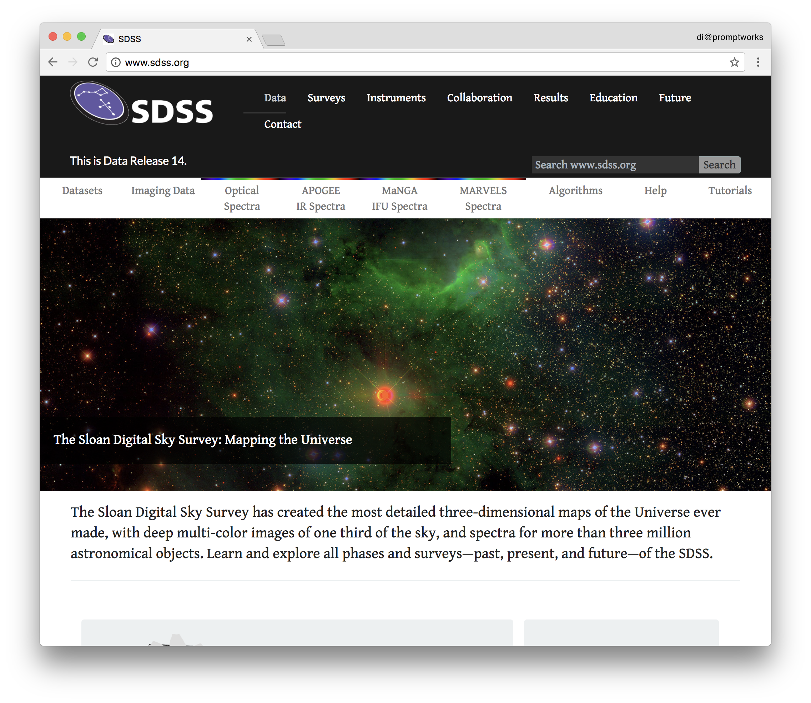

^ Data is freely available online

^ The data is just images! Literally a photograph

^ Each image is 922x680 pixels

---


^ Here's an example

^ Can you find the asteroid?

---

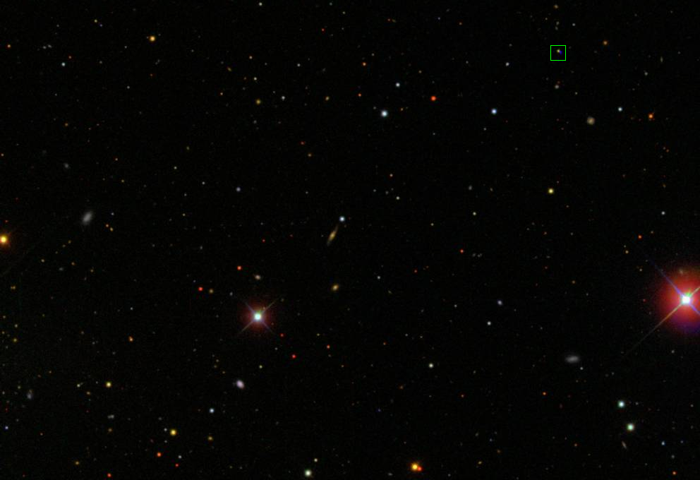

^ Here's the asteroid

^ Let's zoom in on that

---

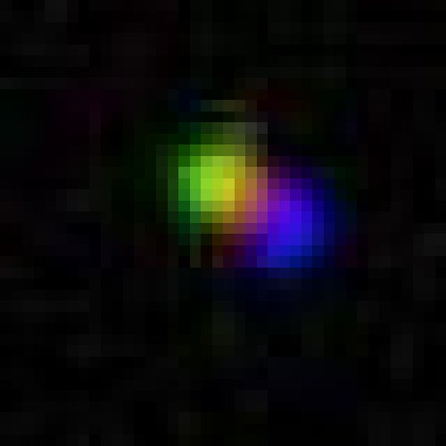

^ This is not what most people think an asteroid would look like

^ first, pretty fuzzy looking

^ very colorful

---


^ I bet you were expecting something like this?

^ gray cold rocky, menancingly large

^ this is not real, photoshopped

---

# How does this work?


^ Let's talk about why the first is what our asteroid looks like

^ and not the second

---


^ This is the Sloan Foundation Telescope

^ 2.5-m wide-angle optical telescope

---

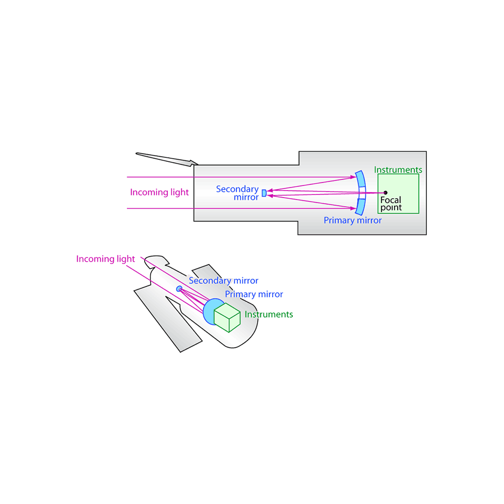

^ This is a diagram of the Hubble, but it's the same

^ At the back, where the instrument package goes, we have an array of CCD (charge coupled device) sensors

---

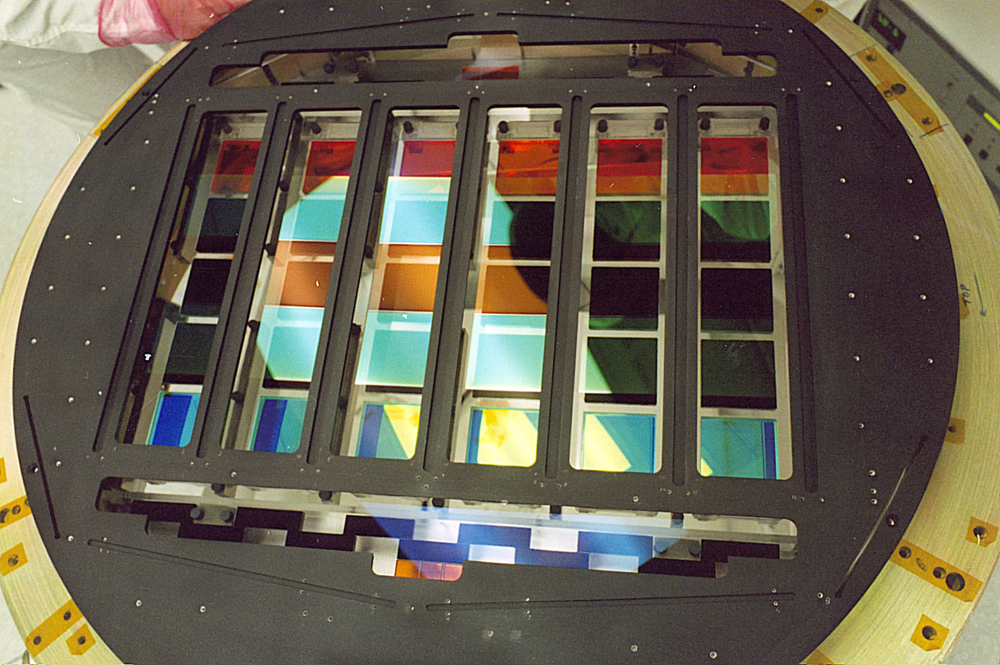

^ This is an actual photo of the sensors

^ They are arranged in a 5x6 grid

^ You can see they are quite colorful as well

---

# Filters:

* 355.1 nm (ultraviolet)
* 468.6 nm (blue)
* 616.5 nm (orange/yellow)
* 748.1 nm (red)
* 893.1 nm (infrared)

^ This is because they have filters which all but a small portion of the spectrum

^ They are not simultaneous, they fire one row at a time

^ Always the same order


---


^ let's go back to our photoshopped asteroid

^ So instead of this

---

# (#nofilter)


^ which is what it would look like with no filters at all

---

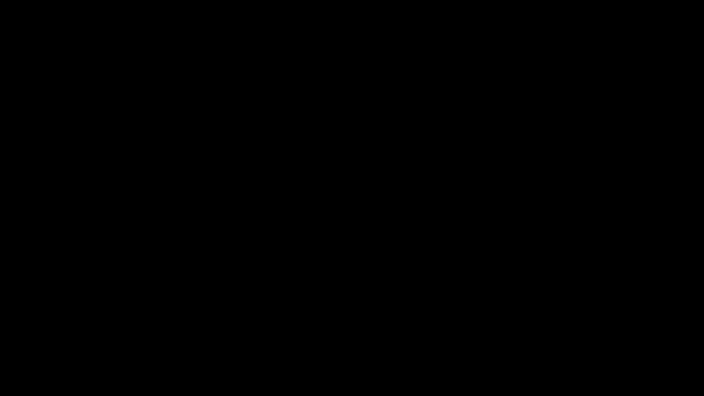

^ We start with this

---


^ First we record the blue filter

---


^ Then red

---


^ Then yellow

^ This is because while the camera is fixed to follow the background stars

^ The asteroid is moving across this field of vision

^ And as each filter fires, it's in a different spot relative to it's background

---


^ Which is why we end up with this representing an asteroid

^ Also raises an interesting phenomena

^ because while we can detect asteroids moving perpendicular to us this way

^ we can't detect asteroids moving directly towards us

^ Which is maybe the more important class of asteroids to be able to detect

---

# Getting started


^ First things first

^ we need to clean up our data

---


^ Again, when I say data I'm talking about an image just like this

^ There is a lot of wasted space here

^ We don't need to look at all the darkness

^ If it's just black, there's no asteroids there

---

# Extracting candidates

^ Small tool to extract potential candidates from full-scale images


---

# 40x40 px


^ Pull out each point of light into a 40x40 images

^ VERY BASIC filtering

---

# Lots of false positives

^ Extremely naive, approx 100:5 false positives to actual positives


---

# 1:1000
# false negatives

^ Very low false negatives (approx 1:1000)


---

# Slow

^ Incredibly slow (complex scan of 100Ks of potentials)


---

# Building training data

^ Manual classification, somewhat slow


---

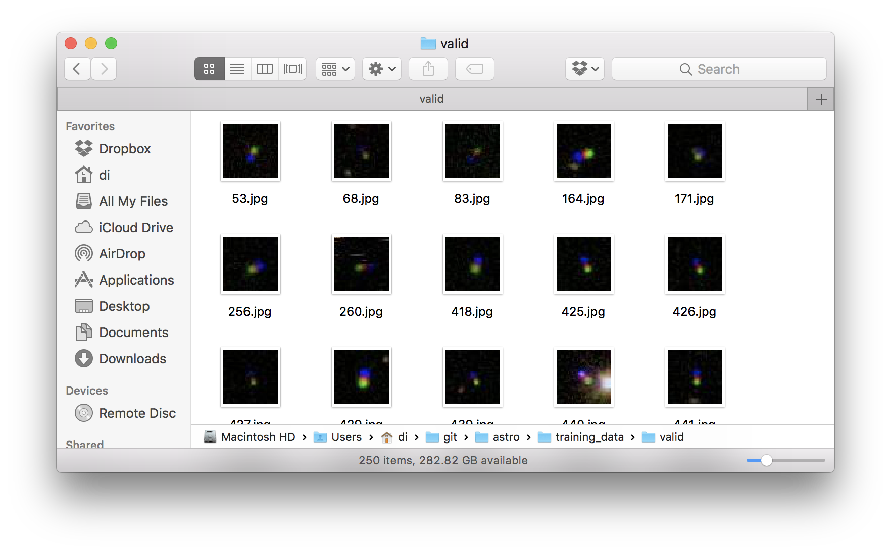

^ Because I literally had to do it by hand, separating valid images from invalid

^ Yields approx 250 valid items, 500 invalid items

---

# Features

^ Next step is to come up with some good features for our data

^ Features are a subset or a simplification of the original data


---

# Why use features?

^ Features allow us to reduce the number of data points into something more meaningful

^ less data = shorter training times

^ the downside is that we have to spend time coming up with good features

^ features are not always necessary


---

# MNIST

^ Modified National Institute of Standards and Technology

^ MNIST is a database of handwritten digits:


---


---


---

# 28px * 28px = 784

^ 784 different inputs


---

# `df_train = [0.0, 0.1, 0.9, ..., 1.0]`

^ These are already between zero and one as well


---

# SDSS

^ This isn't as feasible for our astrophotography data


---

# 40px * 40px = 1600

^ First, our images are 40 x 40 px


---

# RGB space

^ But on top of that, we're in RGB space

^ Can't reduce RGB to a number between 0 and 1


---

# 40px * 40px * 3 = 4800

^ We'd have to split each color into three channels

^ This is just way too many inputs


---

# Feature set

^ So instead, we develop a feature set

^ These are essentially functions

^ When we give them our input data, they return a number between 0 and 1


---

# Feature: Hue Ratio

^ The goal here is to match the colors, a.k.a. "hues":


---


^ Notice the colors

^ Let's say that a valid asteroid has to have a certain amount of yellow, and blue

---

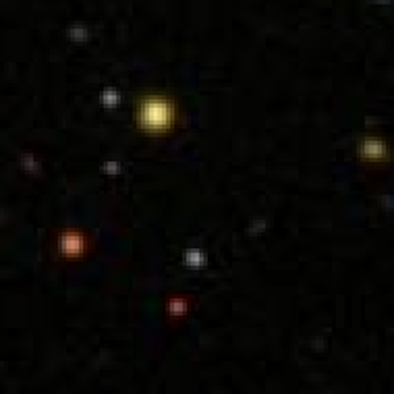

^ Each of these are missing some of those colors

---

# HSV plot

^ First step: convert to HSV space


---


^ here, i've removed pixesl with values close to black, or close to white

^ For pixels in the valid value-spectrum (0.25 < `v` < 0.90)

^ How many are within 2 standard deviations from an optimal value?

---

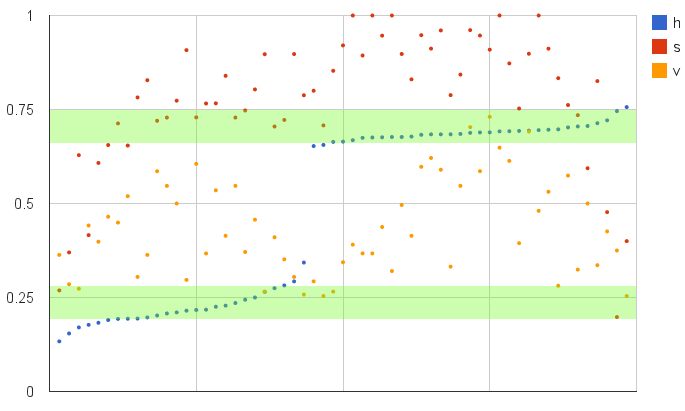

^ What's the ratio to ones that aren't?

^ Ratio will be between 0 and 1

^ on this graph, most are within the bounds

^ so it will have a high ratio

---

# Feature: Collinearity

^ The next feature we'll develop is cluster collinearity

^ in the previous feature, we just looked at the colors

^ we didn't care where they were located in the image


---

# `k`-means clustering

^ Using the valid hues from the previous feature

^ Attempts to cluster `n` points into `k` groups

^ Here, `k=3`

^ Produces three centroids


---


---

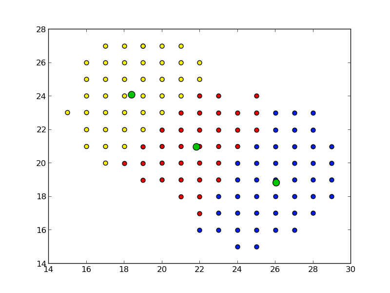

^ You can see how the values that don't fall into the graph have been removed

^ each point represents a color that has passed our test from before

^ the green dots mark the center of mass of the cluster

---

# Collinearity

^ The property of a set of points which lie on the same line


---

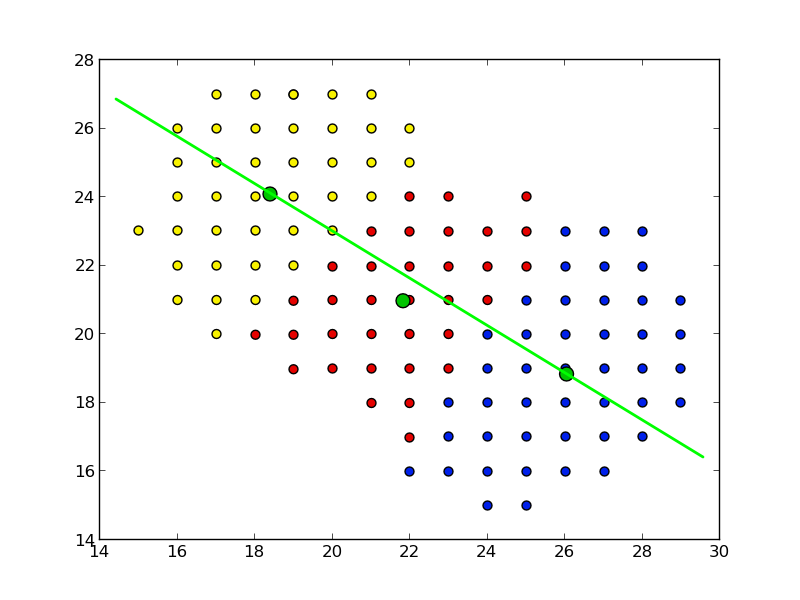

^ How close are all of these to being on the same line?

---

# A non-asteroid


---


---

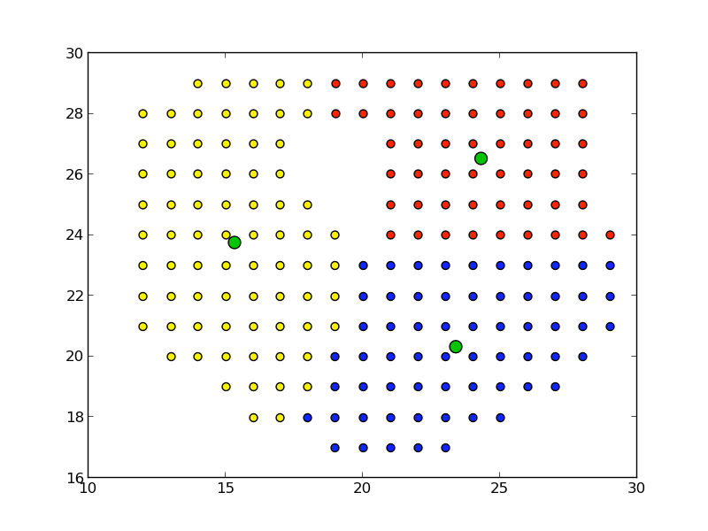

---

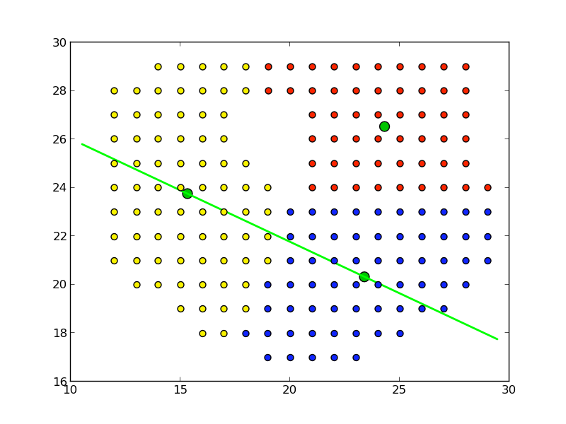

^ Hard to draw a line closely connecting all three

^ the three different exposures don't really represent movement here

---

# Feature: Average cluster distance

^ Using the same `k`-means clusters from the previous features

^ What is the average distance from any point in a cluster to the center of the cluster?


---


^ here, with our example asteroid, we see that the pixes of each cluster are relatively close to their center of mass

---


^ but with the non-asteroid, they're farther away

---

# Feature comparison

              | Hue Ratio | Collinearity | Avg. distance
 -------------|-----------|--------------|-----------------
 Asteroid     | 0.687     | 0.046        | 0.432
 Non-asteroid | 0.376     | 0.388        | 0.557

^ The hue ratio is much higher
^ The colinearity metric is much lower
^ The mean cluster disance is smaller


---

# Ok... where's the AI?

^ So far all we've done is a little bit of math

^ Where's the brains?

^ This type of classification is extrememly well suited for a neural network!


---

# Training Data

^ We have a clear set of training data


---

# Simplified Input

^ Each of the input features can be resolved to a `0 -> 1` metric

^ There is a small amount of input features which can accurately define an item


---

# Binary Result

^ The output is either affirmative (1) or negative (0)


---

# Slow


^ AI will make this way faster

---

# Neural Networks!


^ This is a perfect job for a neural network

---

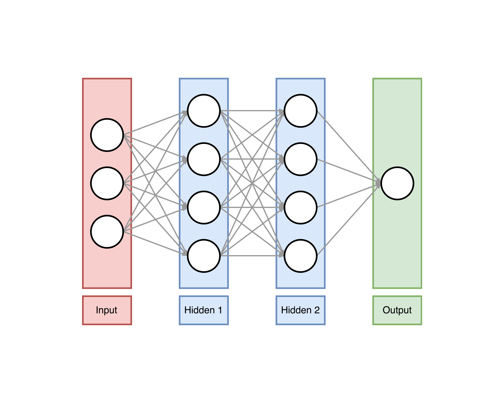

---

# Binary Classification

^ The output is either affirmative (1) or negative (0)

^ really we're going to get some % likelyhood that it's an asteroid


---


---

# Supervised Learning

^ supervised = labeled input & output data


---


---

# Backpropogation

^ We can calculate how much error each neuron contributes, and adjust accordingly


---


---

# Deep

^ deep = more than one hidden layer


---


^ Four layers,  154 neurons

^ 3 input neurons (hue ratio, collinearity metric, distance metric)

^ 150 hidden neurons (`100` in first layer, `50` in second)

^ 1 output neuron (`1` if valid asteroid, `0` if invalid)

---


^ TensorFlow is an open source library from google for machine learning

^ With a Python API!

---

# Make the training data


---

```
$ head astro.train.csv
0.720000000000, 0.023032679738, 0.265427036314, 1.0
0.223404255319, 0.453424956758, 0.620237280488, 0.0
0.625954198473, 0.282509136048, 0.489543705893, 0.0
0.297297297297, 0.217278447678, 0.456831265365, 0.0
0.526315789474, 0.125389748718, 0.520483696760, 1.0
0.400000000000, 0.430241745731, 0.597850990407, 0.0
0.079787234042, 0.375153031291, 0.601415832623, 0.0
0.403361344538, 0.268341944886, 0.485098390444, 0.0
0.592356687898, 0.347474824160, 0.559112235938, 0.0
0.097674418604, 0.021379020213, 0.586822094967, 0.0
```

^ Instead of having to run all my feature functions each time I want to make a model,

^ I can run them once to build the dataset


---

# Load training data


---

```python


import pandas as pd

df_train = pd.read_csv(
    tf.gfile.Open('./astro.train.csv'),
    names=[
        'hue_rat', 'col_min',
        'dis_min', 'label'
    ],
    skipinitialspace=True,
)
```


---

# Make the result binary

^ Right now our label for the data is a float

^ Need to turn it into a boolean


---

```python


df_train['label'] = (
    df_train["astro"].apply(
        lambda x: x == 1.0
    )
).astype(int)
```


---

# Build an estimator

^ This is where we define the features, the hidden layers, etc


---

```python


import tensorflow as tf

hue_rat = tf.contrib.layers.real_valued_column("hue_rat")
col_min = tf.contrib.layers.real_valued_column("col_min")
dis_min = tf.contrib.layers.real_valued_column("dis_min")

model = tf.contrib.learn.DNNClassifier(
    model_dir='./model',
    feature_columns=[hue_rat, col_min, dis_min],
    hidden_units=[100, 50]
)
```

^ DNNClassifier == Deep Neural Network Classifier


---

# Input function

^ The input function turns the pandas dataframe into tensorflow constants


---

```python


def input_fn(df):
    feature_cols = {
        'hue_rat': tf.constant(df['hue_rat'].values),
        'col_min': tf.constant(df['col_min'].values),
        'dis_min': tf.constant(df['dis_min'].values),
    }
    label = tf.constant(df['label'].values)
    return feature_cols, label
```


---

# Train the model

^ Fitting (training) the model is when we give it the training data

^ And adjust the strength of each neuron to get the best output


----

```python


model.fit(
    input_fn=lambda: input_fn(df_train),
    steps=200,
)
```

^ Approx 250 valid items;

^ Approx 500 invalid items;

^ Trained for 200 steps;

^ Took < 1 minute;


---

# Evaluating the model


---

```python


results = m.evaluate(
    input_fn=lambda: input_fn(df_test_1),
    steps=1
)
```


---

# Results

* Trial 1: 99.3% accuracy
* Trial 2: 94.4% accuracy
* Trial 3: 94.8% accuracy


---


^ This seems... too easy

---

# Conclusion

^ Using a neural network allows us to do it faster, and more accurately

^ Need to spend time coming up with good features for the data

^ TensorFlow is really nice (and fast!)


---

# Questions?


---

# Thanks!


