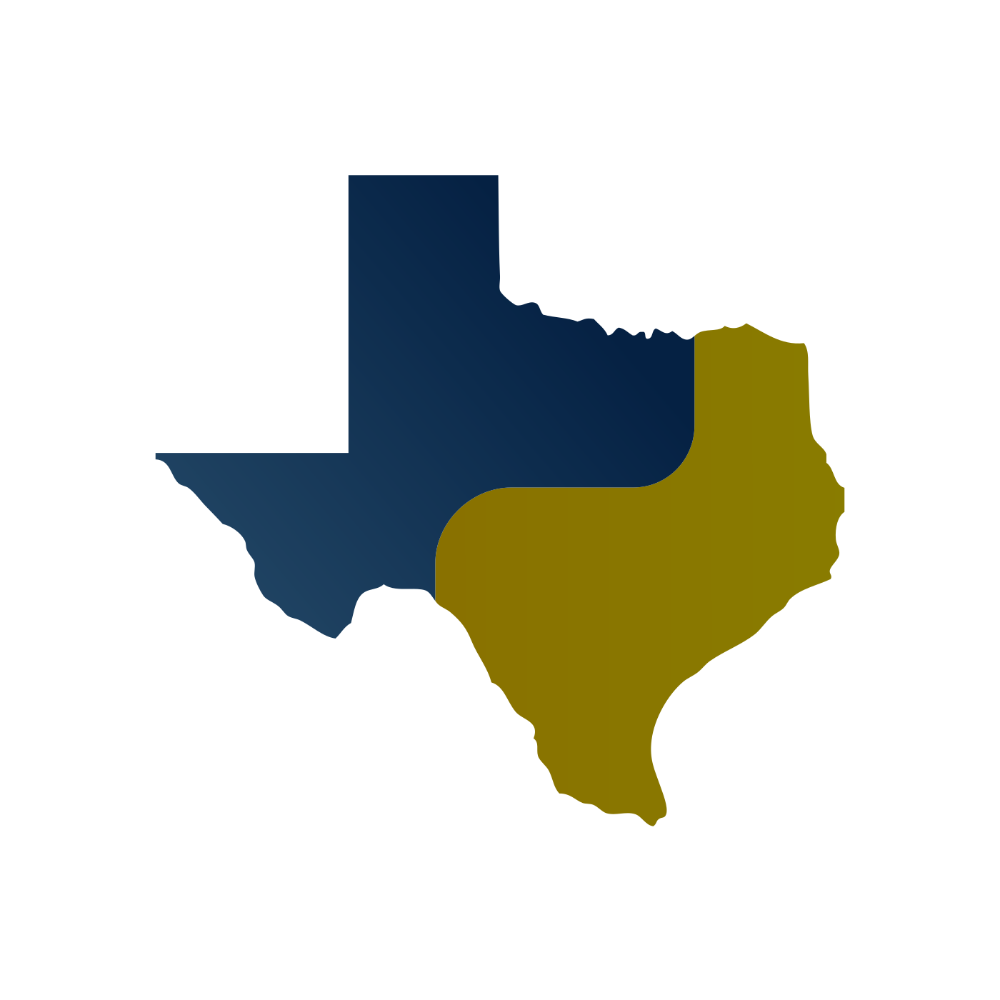
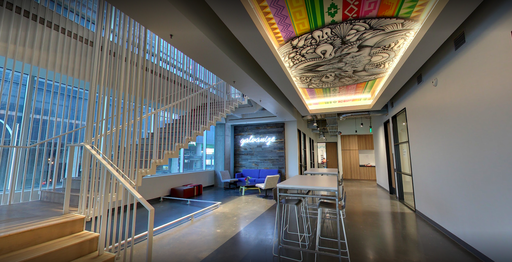

 
# PyTexas 2017

 

## November 18-19th
## Austin, TX

^ Saturday & Sunday

---

# About

- 9th annual regional gathering for the Python community in Texas
- Organized by the PyTexas Foundation, a 501(c)(3) non-profit
- Two days of talks on topics including:
  - Web Applications
  - Data Science & Scientific Computing
  - General Python programming & best practices

---

# Location

- Galvanize
  119 Nueces St
  Austin, TX

---

# Registration

| Student | Individual Earlybird | Individual |
| :-: | :-: | :-: |
| $25 | **$65** | $85 |
| Free breakfast, lunch & coffee | Free breakfast, lunch & coffee, plus good feelings about saving money | Free breakfast, lunch & coffee |
| | Ends Sept 27th | |

---

# Speaking

* Conference tracks: 20 or 50 minutes
  * Call for proposals closes October 4th
  * <https://www.papercall.io/pytexas-2017>

* Lightning talks: 5 minutes

---

# Sponsoring

* Highlight your company within the Texas Python community:
  * Recruit engineers
  * Increase awareness of your product
  * Show support for the community

* Help keep the costs of PyTexas low

* <sponsorship@pytexas.org>

---

# Questions?

* How can I volunteer?
* Is this for Python beginners, or just experts?
* How much of the ticket price goes to the conference?

---

# Thanks!

* Website: <https://pytexas.org>
* Contact: <conference@pytexas.org>
* Important dates:
  * Sept 27th: Earlybird pricing ends
  * October 4th: Call for proposals closes
  * November 12th: Registration closes
  * November 18-19th: PyTexas 2017

