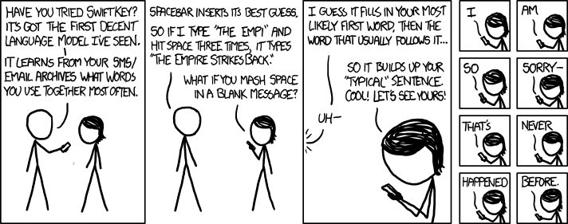
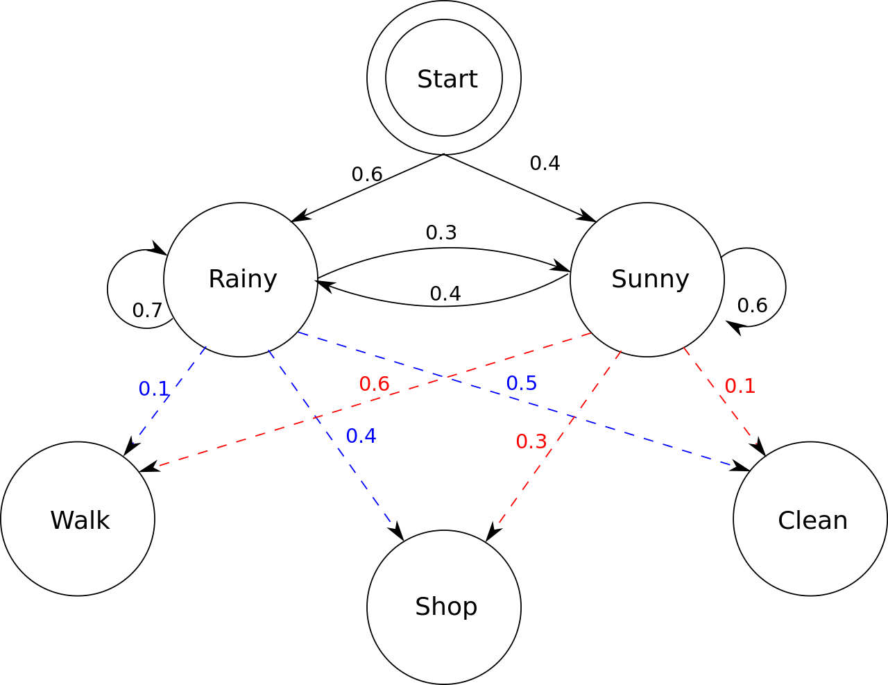
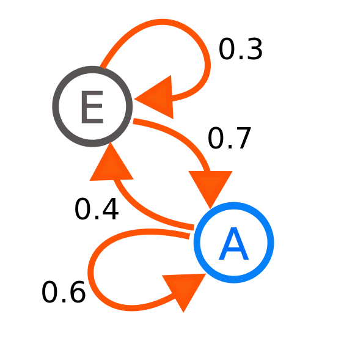
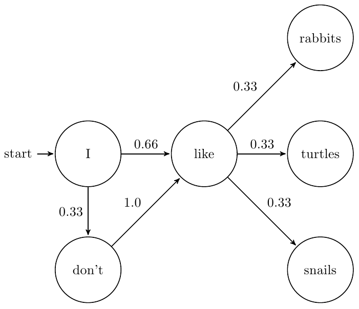

### MARKOV CHAINS



---

# [fit] SECRET
# [fit] SLACKER

^ Didn't realy have time to put together a presentation, so instead all my slides have been automatically generated from all of my previous talks based on a markov model, so bear with me

---

## [fit] 👏 to Yvonne

---

# [fit] What is a
# [fit] Markov
# [fit] Model?

^ A Markov Model finds patterns in data, such as text, by determining the probability that one word follows another.

---



---

# [fit] What is a
# [fit] Markov
# [fit] Chain?

^ Satisfies the "markov property"
^ it can make predictions for the future of the process based solely on the present state as well as one could knowing the full history
^ It's simple

---



---

```
$ cat roxanne_lyrics.txt
Roxanne you don't have to put on the red light
Those days are over you don't have to sell your body to the night
Roxanne you don't have to wear that dress tonight
Walk the streets for money you don't care if it's wrong or if it's right
Roxanne you don't have to put on the red light
Roxanne you don't have to put on the red light
Roxanne put on the red light
Roxanne put on the red light
Roxanne put on the red light
Roxanne put on the red light
...
```

---

<https://en.wikipedia.org/wiki/The_Complexity_of_Songs>

---

```python
import markovify

corpus = open('roxanne_lyrics.txt').read()
model = markovify.NewlineText(corpus)
print(model.make_sentence())
```

---



---

> "I told you once I won't share you with another boy"

"I told you once I won't tell you again it's a bad way"
+
"I won't share you with another boy"

---

> "Walk the streets for money you don't have to wear that dress tonight"
> "Walk the streets for money you don't have to put on the red light"
> "Walk the streets for money you don't have to tell you again it's a bad way"
> "Walk the streets for money you don't have to sell your body to the night"

"Walk the streets for money you don't care if it's wrong or if it's right"
+
"You don't have to ..."

---

> "Roxanne you don't care if it's right"
> "Roxanne you don't care if it's wrong or if it's wrong or if it's right"
> "Roxanne you don't care if it's wrong or if it's wrong or if it's wrong or if it's right"
> "Roxanne you don't care if it's wrong or if it's wrong or if it's wrong or if it's wrong or if it's wrong or if it's wrong or if it's right"

"Roxanne you don't have to put on the red light"
+
"Walk the streets for money you don't care if it's wrong or if it's right"

---

> "I won't tell you just how I feel"

"I won't share you with another boy"
+
"I have to tell you just how I feel"

---

# [fit] SLACK EXPORT

^ All messages in all public channels only

---

```
cat archive/foos/2014-08-28.json | head
[
    {
        "user": "U02HF1THP",
        "type": "message",
        "subtype": "channel_join",
        "text": "<@U02HF1THP|greg> has joined the channel",
        "ts": "1409240552.000002"
    },
...
```

---

```
  {
    "type": "message",
    "user": "U02HERT3M",
    "text": "foos?",
    "ts": "1409249749.000006"
  },
```

^ this is matt

---

* Filter 2016 only
* Filter current employees only
* Corpus for every user
* Generate sentences in a loop
* Write the good ones to a file

---

# [fit] The hard part

---

* Save the Slack web UI to static file
* Turn the file into a template
* Get emoji's to show😊
* Realize that browsers don't print background images 

---

# [fit] The really hard part

---

# [fit] ✂️Editing!✂️

^ 75% made no sense, unfunny, short, or didn't parse right
^ ~1% were kinda suggestive

---

# [fit] My favorites

---

> yvonne: "*@here* forgot to ask Patrick to join us for standup today. savor it.🙂"

---

> peter: "I am in the fridge if anyone wants some as a friendly reminder!"

---

> dan: "it’s ok, there's nothing we can do, as consultants, about the architecture"

---

> patrick: "everytime i hear french, i think they’re still working on that."

---

> jeff: "I have a plan in place to tell everyone how awful Patrick is at foos!"

---

> greg: "FYI I heard from Seagate last night and it looks like we’ll be starting as soon as today."

---

# [fit] Combining models

---


