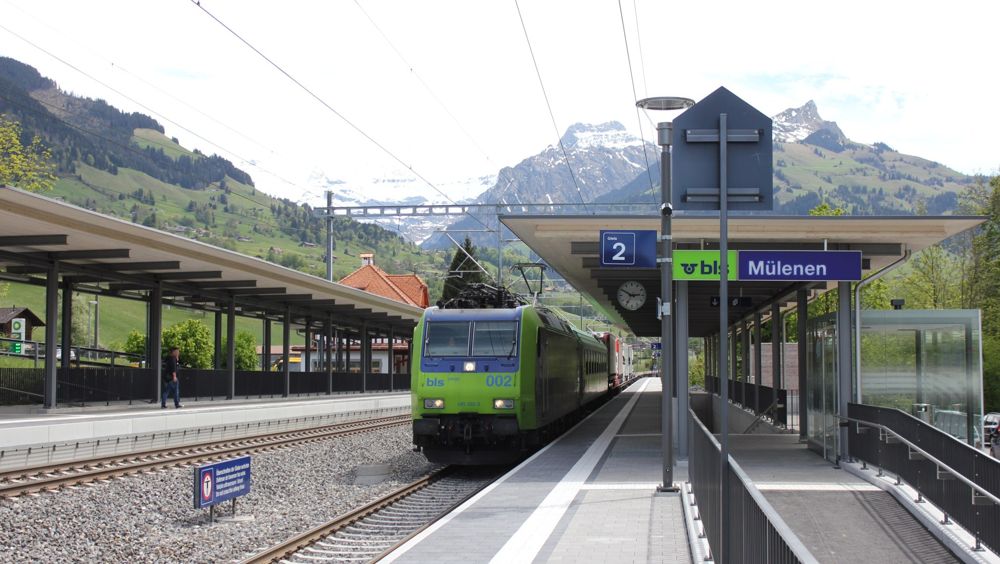
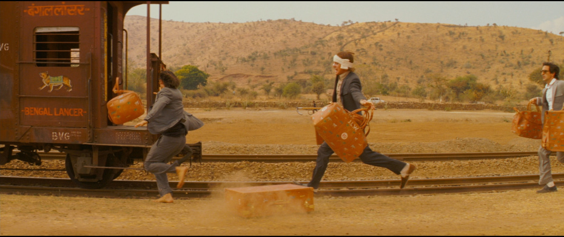
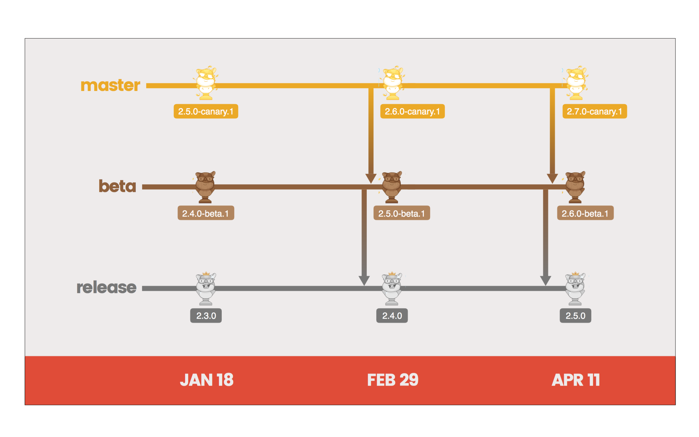
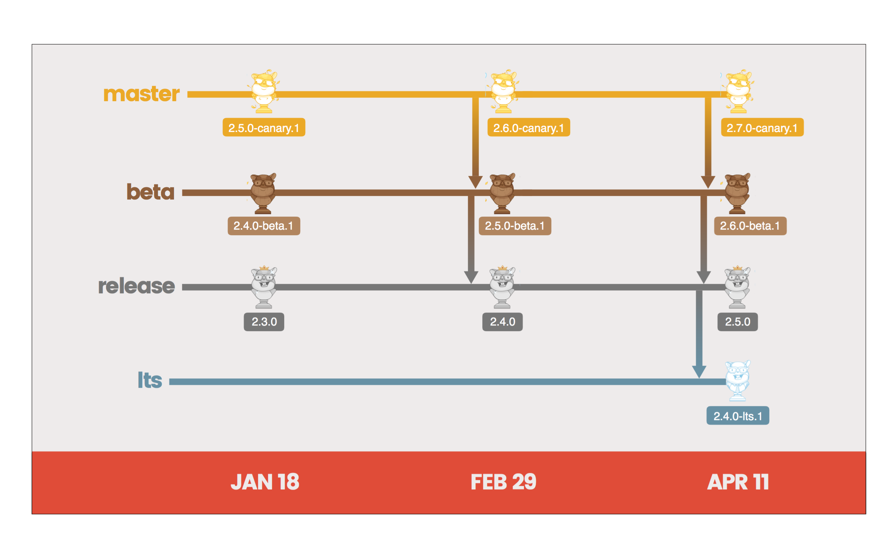
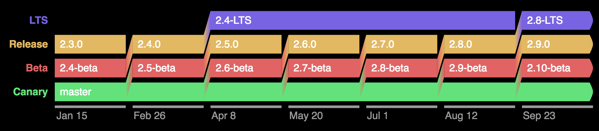
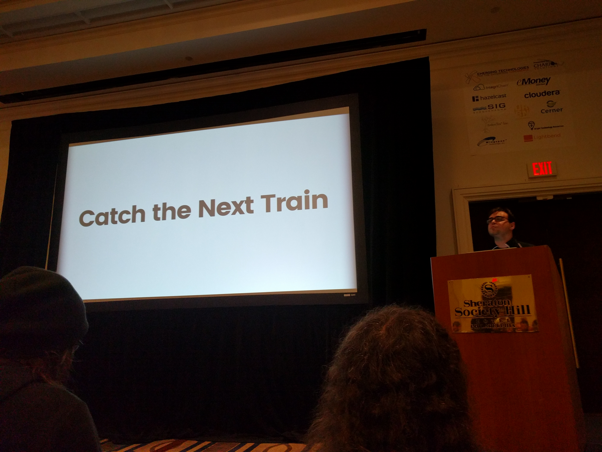
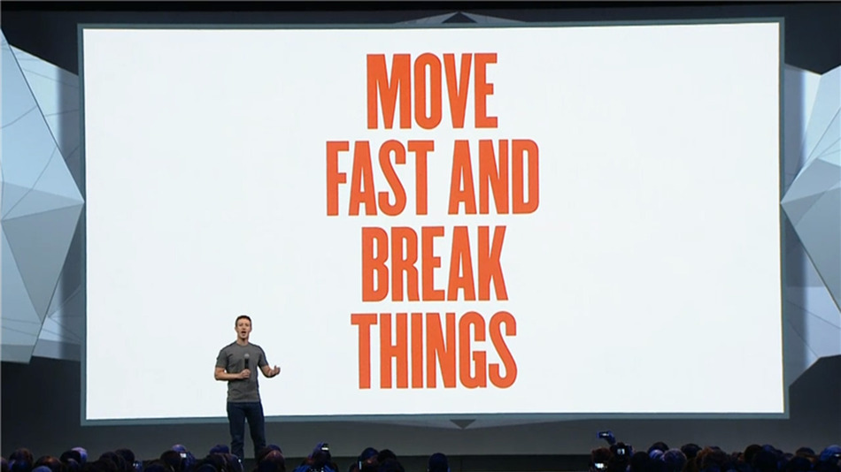
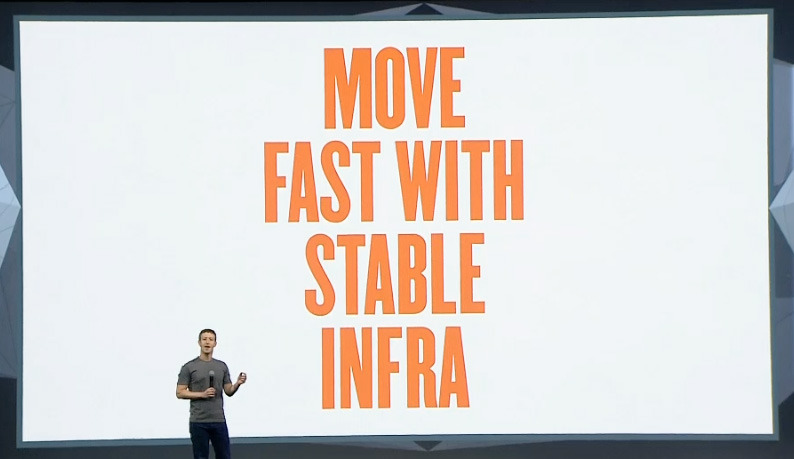

# Swiss Train Deployments

^ Let's start with a story

---

^ Five years ago, I was traveling europe and spent a few days in Switzerland with some family friends
^ The first night, my host offered to take me to his office in downtown Bern the next day
^ The next morning, as we were walking from his house to a light rail station just like this (including the beautiful snow-capped-peaks), I saw the downtown train heading into the station
^ Thinking we could catch it if we hustled, I started to pick up my pace
^ He reached out, stopped me, and said:

---

> "The Swiss don't run for trains."

^ As we walked towards the station, we watched the train that we could have caught pull away
^ We sat there for ~12 minutes until the next one arrived, and continued our journey
^ This thought has always stuck with me as sort of a personal philosophy

---

^ The idea is that life is already moving pretty fast

---

^ And that there's no need to rush it any more
^ But on top of that, have you ever _seen_ anyone run for a train?

---

^ They inevitably look like an idiot

---

# Stability Without Stagnation

^ In April I was at Philly ETE, and one of the best talks there was Yehuda Katz's talk
^ In it, he described a deployment process which enables rapid development, but still provides a stable platform for the people using your technology
^ He called his philosophy "Stability without Stagnation"
^ Basically, the SwS philosophy boiled down to two things, first...

---

# Ship Regularly

* "Release Channels"
  * Canary
  * Beta
  * Release
* "Six-Week Release Cycle"

^ Release channels are Canary, Beta, Release (a la chrome)
^ Canary - features ASAP, no guarantees
^ Beta - features after 6 weeks, bugs shook out
^ Release - features after 12 weeks, semver backwards-compatible guarantees
^ These are essentially tagged branches in your source
^ They balance new features with stability.
^ Release cycle means every channel cuts a release every cycle
^ Regardless of how many features have been shipped! Could have nothing

---

^ Looks something like this
^ A given feature is deployed to each channel, in order, one release after another
^ Part two is...

---

# Have Multiple "speeds"

* Canary/Beta/Release - Every 6 weeks
* LTS - Every 4th "release" has additional support

^ Yehuda gave credit to the Rust deploy process for most of the inspiration
^ Their inspiration came from browsers (chrome/firefox)
^ This basically amounts to an LTS release, which is a common practice in the linux/unix community
^ If the six-week releases are happening too quickly, the LTS release is guaranteed to exist and be stable for a longer window of time
^ Also, you get bugfixes for the entirety of the LTS release
^ Also, breaking changes are first deprecated in an LTS release

---

^ So they solved this by adding another channel, "LTS"
^ And making that channel's releases take 4x as long
^ Side note: if the thought of making your release process conform to this diagram frightens you, you're doing it wrong
^ All of these releases should be automated!

---

^ Here's another diagram showing how LTS was introduced

---

# From Ember to You

^ Obviously, we are not all writing OSS with lots of contributors, users, in an early stage of development
^ But there are direct paralells to all kinds of development processes
^ And benefits

---

# Benefits

* Maintainers (i.e., Management)
* Contributors (i.e., the Geeks Writing the Code)
* Add-on authors & developers (i.e., the Users)

^ Maintainers don't feel any rush to ship a feature in for a given release. If they miss one, there's another one in six weeks.
^ "Ship this feature ASAP because we don't know when we'll release next!"
^ Contributors can predict when their feature will be released and what the process is.
^ (Known window for bug fixes, etc)
^ End users, which yehuda splits into add-on authors and developers, can make a decision about their risk tolerance easily and build against an API that they know won't change unexpectedly
^ Yehuda summed that up by saying that everyone can just:

---

^ The swiss don't run for trains because they want to take it easy
^ They don't run for trains because they're concerned about their image
^ They don't run for trains becaues they know there's another one coming
^ And because they know that, they don't stress about catching trains, and they don't look dumb

---

^ Why do we run for trains here in Philly?
^ Because we're running late, maybe, but probably
^ Because we don't know when the next one's going to come.
^ We can't fix SEPTA, but we can fix our own deploy processes

---

# Swiss Train Deployments

^ I don't expect this to catch on, but it's what I'm going to call it to myself, and around all of you

---

# Swiss Train Deployments

* Requirements:
  * A reasonable VCS;
  * Automation;
  * Features to ship.

^ A few basic requirements you should already have
^ You need a VCS that lets you have branches and tags, or some equivalent
^ You need some kind of automation around deployment (and probably testing too)
^ You need to be in active development!
^ Then what do you do with it?

---

# Swiss Train Deployments

* Ship each channel reguarly;
* Automate releases!

^ This takes then "when?" out of releases! No more "when will x ship?"
^ This is easy when the only determinant is time. Also takes the "who?"
^ Both remove a lot of uncertainty and stress!

---

^ This might seem counter-intuitive with the mantra of big orgs like FB
^ But yehuda said they fell into the same trap

---

> We ourselves fell into the trap of believing the "move fast and break things" mantra.

^ It's easy to do when FB says you should

---

> We thought that if our competitors had a feature we didn't, our users would leave en masse.

^ Result is paranoia about losing users

---

> In fact, it was our instability that alienated early adopters. We got a bad reputation for it. People criticized us because they felt burned.

^ Paradoxically, it causes you to lose users!

---

> Users don't migrate over night. You have a much larger window than you think (although not infinite).

^ Stability is way more important.

---

^ Even FB eventually changed their tune
^ This is not photoshopped! It's really their new motto
^ Not as sexy, but it works better if you're a dev

---

# Stability without Stagnation

^ What is SwS reallly about? It's a philosophy, but
^ Developing a process which keeps you from getting stuck w/o innovating
^ But also giving you a stable foundation to build higher and faster on

---

# Swiss Train Deployments

---

# 1. Don't make your users run for a release

---

# 2. Let them
# decide how fast to
# get from A to B

^ They can take a faster track to a feature, but they might go off the rails

---

# Questions?

---

# Thanks!

