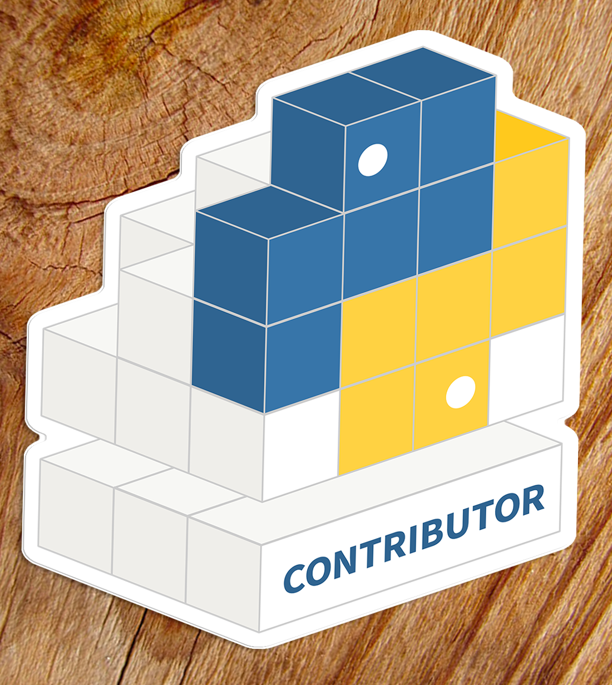

# Welcome!
## Bloomberg / PyPA Development Sprints 2018

---

# Mentors

* Dustin Ingram (`@di`)
* Paul Ganssle (`@pganssle`)
* Jason R. Coombs (`@jaraco`)
* Steve Dower (`@zooba`)
* Michael Sarahan (`@msarahan`)

^ please introduce yourself

---

# Python Packaging

^ python 1.6 in 2000

---

# Python Packaging Authority

---

# Goals

^ new contributors

---

# Issues

## <https://github.com/orgs/pypa/projects/1>

---
[.build-lists: true]

# Projects

* `pypa/setuptools`
* `pypa/pip`
* `pypa/virtualenv`
* `pypa/warehouse`
* `pypa/twine`
* `pypa/packaging`
* `pypa/wheel`

---
[.build-lists: true]

# Projects (cont'd)

* `pypa/bandersnatch`
* `pypa/python-packaging-user-guide`

---

---

# Thanks!

### <https://speakerdeck.com/di_codes/bloomberg-packaging-sprints>
