theme: Plain Jane, 3
footer: SciPy 2018 — Dustin Ingram — @di_codes

## SciPy 2018

^ https://scipy2018.scipy.org/ehome/index.php?eventid=299527&tabid=712461&cid=2233540&sessionid=21620161&sessionchoice=1&

---

[.hide-footer]

# [fit] Hi, I'm Dustin

^ My name's Dustin Ingram

---

# Who am I?

* Director @ PromptWorks in Austin, TX
* PyTexas Organizer
* Python Packaging Working Group (Packaging-WG) member
* Python Packaging Authority (PyPA) member
* Python Package Index (PyPI) maintainer

---

# [fit] **`{{ talk.title }}`**
# `{{ talk.subtitle }}`

^ I had a hard time coming up with the title of this talk

^ Not because naming things are hard (even though they are)

^ The reason I had a hard time coming up with the title of this talk is because I knew I wanted to talk about python packaging

^ but a lot of people have already given talks about python packaging

^ so many, in fact, that everytime I came up with a title for this talk

^ it seemed like someone had already given that talk

^ ---

^ at first I thought, what is the core of python packaging? i'll call my talk...

---

# [fit] **Python Packaging**
# Getting the Code You Wrote
# To People That Want It
# [fit] Using the Same Language You Wrote It In

---

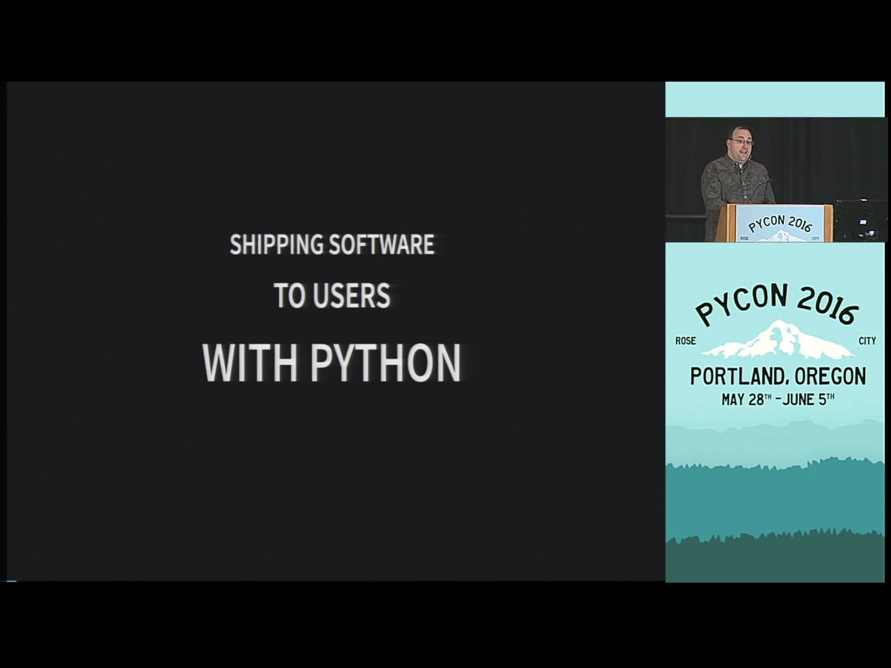

[.hide-footer]

^ that title's pretty long, maybe I should do something more clickbaity, like

---

# [fit] **Python Packaging**
# In Just Five Easy Steps!

---

[.hide-footer]

^ but that's been done

^ i thought maybe i could one-up this talk

---

# [fit] **Python Packaging**
# In Just FOUR Easy Steps!

---

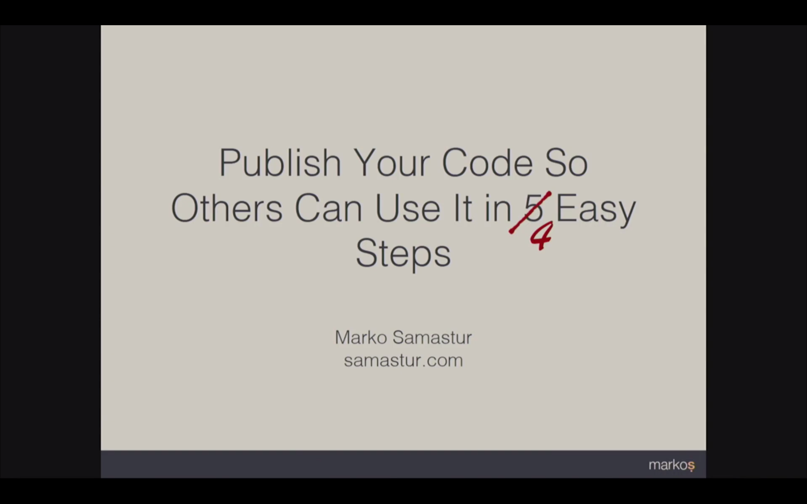

[.hide-footer]

^ he did that too!

^ perhaps I should be encouraging about python packaging

---

# [fit] **Python Packaging**
# It's Relatively Painless Now
## Go Ahead and Use It

---

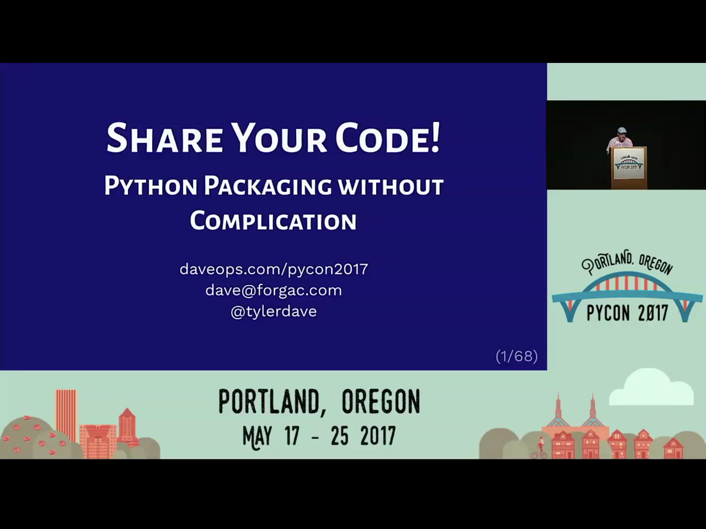

[.hide-footer]

^ but relatively painless is still painful

^ so maybe I should try to instill confidence that it's improving

---

# [fit] **Python Packaging**
# [fit] We're Still Trying To Make It Better

---

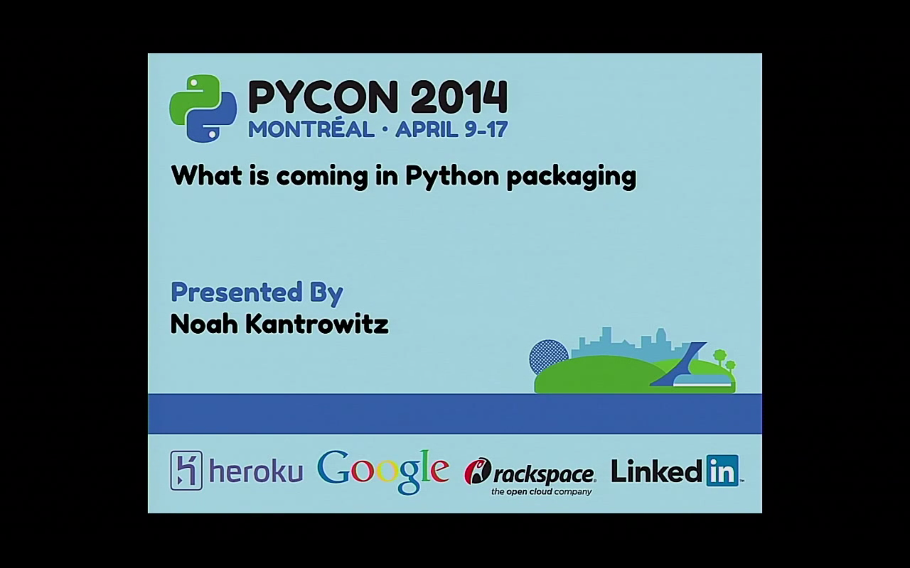

[.hide-footer]

^ ok, maybe i should take a stronger approach

---

# [fit] **Python Packaging**
# Let's Just Throw It All Away
## And Start Over From Scratch

---

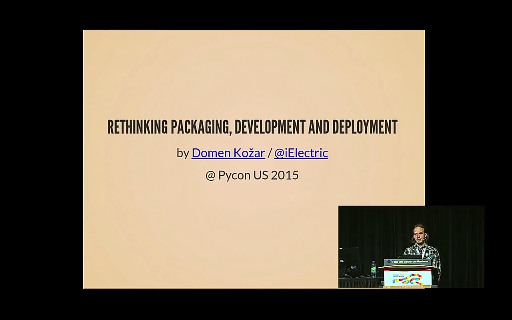

[.hide-footer]

^ maybe the problem is that too much has changed

---

# [fit] **Python Packaging**
# [fit] Let Me Just Get You Up To Speed
# [fit] On Everything That's Changed Since Last Time

---

[.hide-footer]

^ then i figured maybe not everyone cares about everything in packaging

---

# [fit] **Python Packaging**
# There's A Lot Of Stuff Here
## You Might Not Need All Of It

---

[.hide-footer]

^ maybe I should keep it simple

---

# [fit] **Python Packaging**
# [fit] In the Simplest Terms Possible
## For Anyone That Cares

---

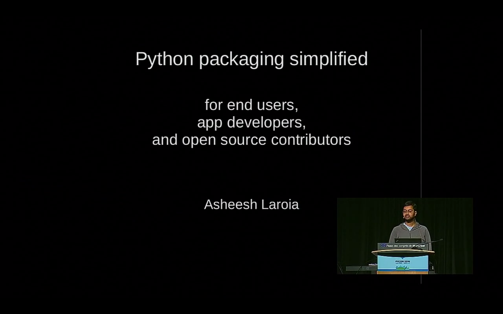

[.hide-footer]

^ maybe even simpler?

---

# [fit] **Python Packaging**
# [fit] So Easy A Caveman Could Do It

---

[.hide-footer]

^ really starting to run out of options at this point

^ maybe I should stick to something unique about my experience

---

## Hello
# [fit] **I Am a PyPI Maintainer**
## At the Very Least
## I Should Be Able To Tell You
## How To Use PyPI

---

[.hide-footer]

^ one last ditch effort

---

# [fit] **Python Packaging**

---

# [fit] **Python Packaging**
# But Indiana Jones-themed

^ for some reason

---

# [fit] **Python Packaging**
# But Indiana Jones-themed
## (Also In French)

^ no way this has been done before

---

[.hide-footer]

^ Ok, so it really seems like everything that could be said about python packaging has already been said

---

# Links

* <https://www.youtube.com/watch?v=qOH-h-EKKac>
* <https://www.youtube.com/watch?v=5BqAeN-F9Qs>
* <https://www.youtube.com/watch?v=gc9dkktg1gU>
* <https://www.youtube.com/watch?v=W8A2bOKPtJU>
* <https://www.youtube.com/watch?v=eLPiPHr6TVI>
* <https://www.youtube.com/watch?v=iLVNWfPWAC8>
* <https://www.youtube.com/watch?v=UtFHIpNPMPA>
* <https://www.youtube.com/watch?v=xSbezLCJ87E>
* <https://www.youtube.com/watch?v=bwwf_HbEJQM>
* <https://www.youtube.com/watch?v=eLPiPHr6TVI>
* <https://www.youtube.com/watch?v=jOiAp3wtx18>

^ at this point i should probably just give you a list of links to these talks on youtube

^ You can go home and watch them at 2x the original speed

---

# *The End*

^ and I can just wrap this talk up now

---

# [fit] **Inside The Cheeseshop**
# [fit] How Python Packaging Works

^ in the end, I picked this title, which is really awful, for a number of reasons

---

[.hide-footer]

^ First of all, it's got an obscure reference to something that makes no sense

^ Why am I talking about a cheese shop?

^ I know nothing about cheese

---

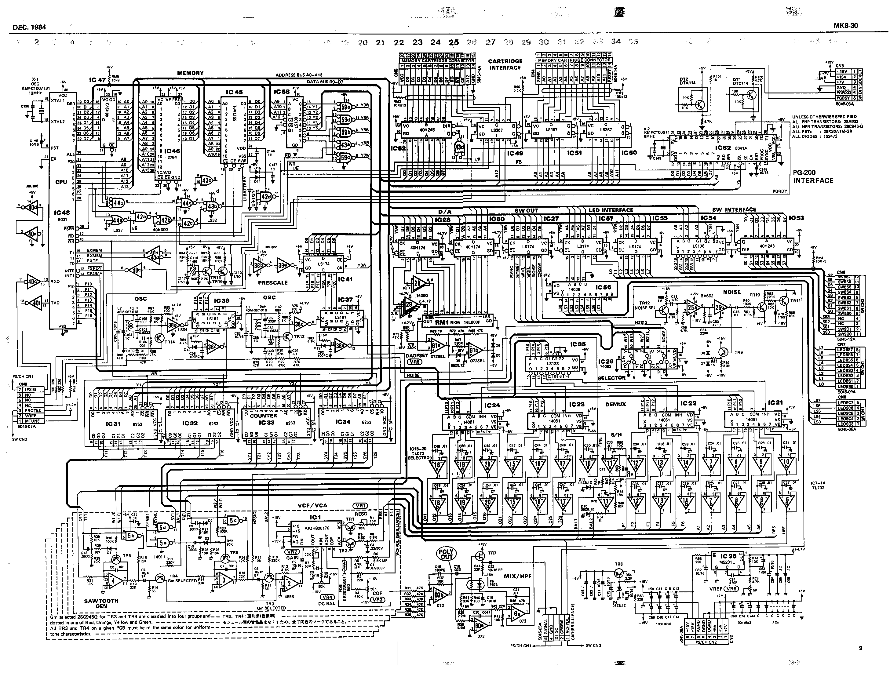

[.hide-footer]

^ Second, "python packaging" is an incredibly broad and complex subject

^ Trying to explain how it works is perhaps a lost cause

---

[.hide-footer]

^ And third, I'm making the assumption that python packaging actually works!

^ Which has, historically, been the biggest complaint about the topic

^ but here's the thing, I think python packaging actually works great

^ and we've just gotten used to how good we have it

---

[.hide-footer]

^ so I really truly do want some python packaging archeology with you all

^ i want to talk about the evolution of packaging through the years

^ to provide some context for why things are the way they are

^ and about how at each step, we had a new problem to solve, then a new solution for that problem, which begat a new problem, etc

---

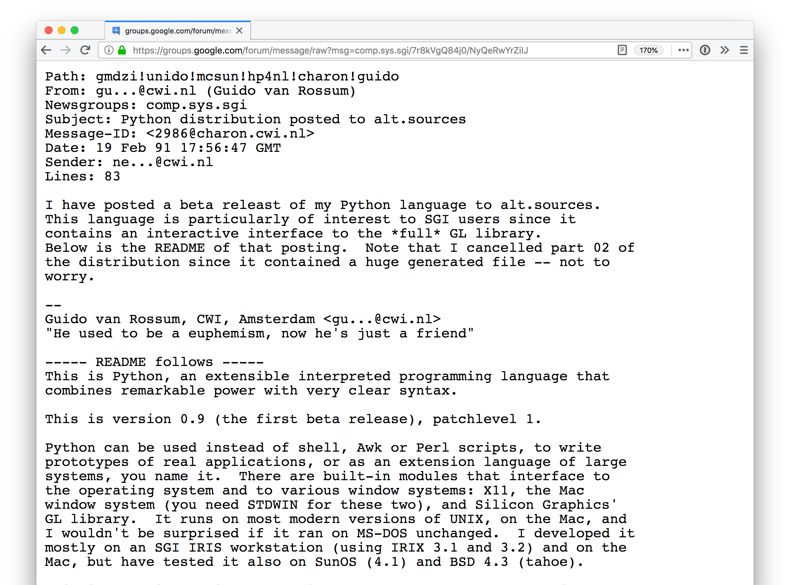

[.hide-footer]

^ so let's go back in time

^ back to a time when python was brand new and everything we're familiar with today didn't exist

^ back to the beginning where there was just python

---

# [fit] `totally_awesome_library.py`

^ pretty much as soon as there was python, there was something written in python

^ let's pretend you're the author of this totally awesome library

^ nice work! but really, at the moment, this code is only really useful for you

---

# **Problem:**
# How do I get this to users?

^ so you have a problem: how do you get code to users?

^ this is really the fundamental problem of packaging

^ maybe you talk to your friends, and say "i have this totally awesome library"

---

# **Solution:**
# Email?

^ you could email it to someone every time you found someone new that wanted it

^ but that would pretty quickly become a pain

---

# **Solution:**
# Personal Website?

^ you could put it up on your website somewhere with a link to download

^ this is nice because you could also add some documentation

^ but how will people find it if they want it?

^ python first released in 1991

---

[.hide-footer]

^ google wouldn't be around for another six years

^ this leads us to a new problem

---

# **Problem:**
# How do I find Python code?

^ so what we need is a place where people can go to find interesting python code

^ some sort of index for python packages

^ I think we'll call it...

---

# **Solution:**
# The Vaults of Parnassus

---

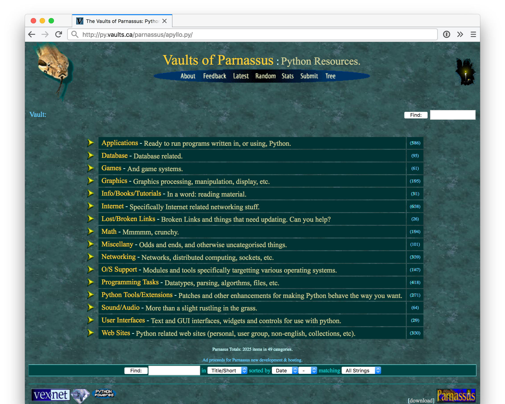

[.hide-footer]

^ this was the first index for python software

^ literally an index, this just linked to... something... on other peoples websites

^ i hesitate to the word package here, becasue at this point what a "package" is, is really loosely defined

^ end result is just whatever those people felt like putting on their website

^ no standard, or enforcement of any standard or quality level, etc

^ this leads us to a new problem

---

# **Problem:**
# How do I build this?

^ at this time, every project came with it's own, special little way to build it

^ maybe it was a python script, maybe it was a makefile, maybe it was just instructions in a text file

^ this is painful for users

---

# **Solution:**
# `distutils`

^ So at the "1998 international python conferece" (before it was called pycon)

^ a little project got started called distutils, for "distribution utilities"

^ this was included in the stdlib in python 1.6, circa 2000

^ and this gave us...

---

#[fit] `$ python setup.py <...>`

^ what is probably a familiar incantation

^ i think some people have run this without really thinking about what's going on here

^ it's just a python script! with a little magic thanks to the standard library

^ the idea was: why write a domain specific language or add a new config file when you already have the full power of Python at your disposal

^ let's just write more python! (we'll see why)

---

#[fit] `$ python setup.py build`

^ it was really just a build tool, to replace those makefiles

^ the goal was to MAKE something in a consistent way that could then be installed

---

# **Solution:**
# Source Distributions

^ distutils also gave us a way to package up source code for sharing

^ into a compressed archive like a zip or a tar.gz

---

# **AKA:**
# sdist

^ I like to say this like a snake

---

#[fit] `$ python setup.py sdist`

^ this command might be more familiar

^ but it was quickly obvious that sometimes, source distributions weren't going to cut it

---

# **Problem:**
# Building takes too long

^ sometimes, source distributions are fine

^ but sometimes they have so much to do during the build step, possibly even compiling some C code

^ that it becomes costly to do this every time you want to install some dependency

^ feels wasteful if you're doing it over and over again for the same architecture

---

# **Solution:**
# Built Distributions

^ the solution is built distributions

^ instead, you take a distribution that's been pre-built for your architecture

^ Just drop it in place, no build step necessary

---

# **AKA:**
# bdist

^ also known as a bdist

---

#[fit] `$ python setup.py bdist`

^ so, distutls was pretty great: having a consistent way to just build things was immensely helpful

^ but it punted on solving two key problems

---

# **Problem:**
# How can I "do" packaging?

^ the first of which is the generic idea of "packaging"

^ by this I mean: how do I get the user to the state right before they run the build command?

^ where they have everything they need, but it's not put together yet?

---

# **Solution:**
# Use platform packaging?

^ the original distutils authors saw this as a solved problem

^ all the platforms they wanted to run python on already had system-level package managers

^ I'm talking about linux package mangers like rpm

^ they couldn't imagine developers would ever want to do development on platforms that didn't have a package manager

^ guess what

---

# **Sub-Problem:**
# My platform doesn't have packaging

^ turns out developers _love_ developing on platforms that don't have official package managers

^ like macOS and windows

^ there's another problem with this solution

---

# **Sub-Problem:**
# My platform _does_ have packaging, but I want things now!

^ maybe your platform does have a package manager

^ but packages in platform distributions usually lag behind releases

^ because once the author has published the code some way,

^ the platform maintainers need to take that and package it up for the specific platform and put into the platform's specific index

^ and you want that fresh release _now_

---

# **Solution:**
# The Python Package Index

^ the solution was to create package index just for python

^ we call this, the python package index

---

[.hide-footer]

^ here it is in october 2002

^ it gave us an official, consistent, and centralized place to "put" python software

^ i say "put" because it still links to externally hosted files

^ but it's got a bit more structure

---

# **AKA:**
# "PyPI"

---

# [fit] 🥧🤢👁

^ not pypy, that's something else

^ again, naming things is hard

---

# **AKA:**
# "The Cheeseshop"

^ PyPI is sometimes called the cheeseshop

---

[.hide-footer]

^ "the cheeseshop" is a reference to this monty python skit

^ where a man goes into a cheeseshop which has no cheese for sale

^ the joke is that when pypi was first created, there was nothing in it

^ so it's not really even appropriate to call it that anymore, given the hundreds of thousands of packages

---

# **Problem:**
# How can I specify dependencies?

^ the other thing that distutils punted on was being able to specify dependencies

^ there was no way to say that a given package depended on some other package being installed as well

^ this makes sense: they didn't have a centralized index to point to

^ now that we have a package index, it's possible to not only point to some version of a package somewhere

^ but it's also possible to distribute something that does more than distutils

^ which again, was in the standard library and came with your python

---

# **Solution:**
# `setuptools`

^ setuptools essentally monkey-patched distutils in the stdlib

^ there are some advantages here: quicker to ship new code to users (don't have to upgrade their entire python distribution)

^ there are some disadvantages: monkeypatching is never really a good idea, especially monkeypatching the standard library

^ but once we had setuptools, all sorts of other things came along with it

---

# **Problem:**
# Installing is too hard!

^ now that we can specify dependencies easily, how can we make them easier to install

---

# **Solution:**
# `easy_install`

^ and this did in theory make it easier for users to install various projects

^ paired with setuptools, this would allow users to install dependencies for a project directly from pypi

^ introduced a new type of built distribution, because the existing ones weren't cutting it

---

# The Egg Distribution

^ There were other types of eggs too, but the built distribution type of egg is the important one

^ An egg is simply a zip file, with some metadata, could contain python byte code as well

---

[.hide-footer]

^ the name egg comes from python. pythons lay eggs

^ but easy_install gave us some new problems

---

# **Problem:**
# `easy_install` problems

^ it was really good at installing. so easy!

^ it couldn't uninstall

^ it couldn't tell you what you had installed on your system

^ also mucked around with sys.path, which is generally not great

---

# **Solution:**
# `pyinstall`

^ pyinstall (circa 2008)

^ you might have never heard of pyinstall, this is because

^ pretty much as soon as pyinstall was created, we had a new problem

---

# **Problem:**
# "`pyinstall`" is too long

^ also typing `pyinstall install` seems redundant

^ naming things is hard!

---

# **Solution:**
# `pip`

^ pyinstall becomes pip almost immediately

^ the name pip isn't an obscure reference, it stands for "pip installs packages"

^ we swapped redundancy for a recursive backronym

^ so while easy_install is still around, pip soon becomes the preferred installer

---

# ~~eggs~~

^ pip ignored eggs entirely, and only installed from source distributions

---

# **Problem:**
# Application dependencies?

^ at this point, people are using pip to install dependencies for applications

^ not dependencies for other packages

^ essentially, for an application there is no top-level project to install

^ so if we want a way to specify dependencies for an application, what do we do?

---

# **Solution:**
# `requirements.txt`

^ pip introduces a file, requirements.txt

^ including pinning specific versions of dependencies

---

# [fit] `pip install -r requirements.txt`

^ this gives us this familiar incantation

^ allows for semi-reproducible environments

^ so now everyone's happily pip installing, but we have a new problem

---

# **Problem:**
# Installing from PyPI is slow

^ remember, still just an index

^ so when pip has to install something, it has to crawl pypi, then a bunch of other domains

^ those domains might not be performant

^ for that matter, pypi might not be either

---

# **Problem:**
# Trusting 3rd Party Domains

^ another problem this introduces is that as a package maintainer, my users have to trust 3rd party domains

^ what happens when I forget to re-register the domain my package is hosted on?

^ attacker can go and register it, put malicious code in place

^ my users have no idea

^ they are so used to pip trying to connect to random domains that they'll never notice

---

# **Solution:**
# PyPI begins hosting releases

^ specified in PEP 438

---

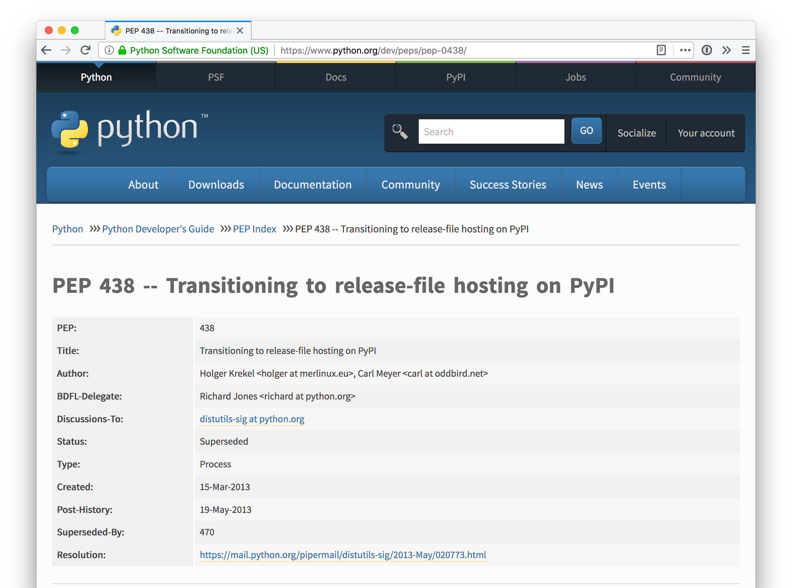

[.hide-footer]

^ PyPI now literally hosts distributions

^ around this time we start to notice a new problem

---

# **Problem:**
# Scientific Python is a thing

^ Somehow we didn't see that coming

^ using python for scientific computing or data science comes with a whole new set of challenges

---

# **Sub-Problem:**
# distutils is not up to the task

^ The original authors and contributors to the tools that you know and love today spent a lot of time and effort trying to make distutils work for things that it was never designed to handle

^ like compiling extensions that needed fortran-compiled libraries

---

# **Sub-Problem:**
# Build environments?

^ the main problem here was the lack of a way to define a build environment

^ distutils and setup.py make a lot of assumptions about what the user needs to build and install a package

^ doesn't provide a good framework for modifying those assumptions

---

# **Sub-Problem:**
# I need prebuilt binaries

^ it is painful to compile things from source

^ if you can nail down an ABI, it makes far more sense to build it once and distribute a binary

^ but when we got rid of eggs, we got rid of binary distributions!

---

# **Sub-Problem:**
# I need more than Python

^ maybe you need R, LLVM, HDF5, MKL

^ these are fundamentally unmanageable by any tools that are just focused on Python

---

# **Sub-Problem:**
# I don't even have Python

^ maybe you don't even have python on your system

^ these things are kinda outside the scope of the python packaging authority

^ which kinda assume that a) you have python

^ b) you really just want to do python (and of course, sometimes some C)

---

# **Solution:**
# Anaconda & Conda

^ Anaconda is a distribution of more than 1000 open source software packages, including many well-known Python projects

^ Conda is a python-agnostic packaging tool and installer

^ installing anaconda gives you both the python and non-python tools you need all at once

^ satisifies a lot of those use cases

---

# **Problem:**
# We need built distributions
## (again)

^ turns out all the problems we needed built distributions to solve are still problems

^ but we don't want eggs, Eggs are poorly defined

^ filenaming conventions are not enough to capture all potential platforms

^ also they have been given a bad rap by easy_install's behavior

---

# **Solution:**
# The Wheel Distribution

^ This is another built distribution

^ like eggs, it's also just a zipfile

^ but it has a specification

---

[.hide-footer]

^ and it has also learned from the mistakes of easy_install and the egg distribution

---

[.hide-footer]

^ name came from a "wheel of cheese", you put wheels in a cheeseshop

^ I like to think the authors of the spec really got this name right

^ because in addition, nobody can say they're going to "reinvent the wheel"

^ ---

^ at this point a lot of people are depending on pypi

^ we start to become a little more focused on making sure it's secure

---

# **Problem:**
# PyPI is showing it's age

---

[.hide-footer]

^ here's pypi in 2007, about four years old

---

[.hide-footer]

^ here's pypi almost a month ago

---

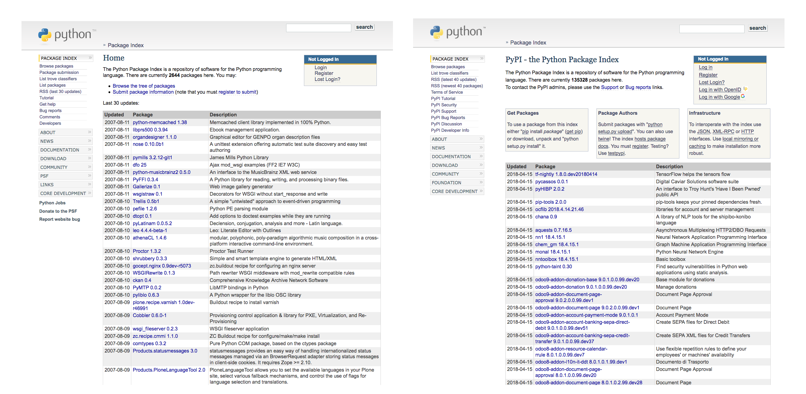

[.hide-footer]

^ here they are side by side, ten years apart

^ kinda like one of those "spot the difference games"

^ it's not really fair to just visually compare pypi in 2007 with pypi in 2018

---

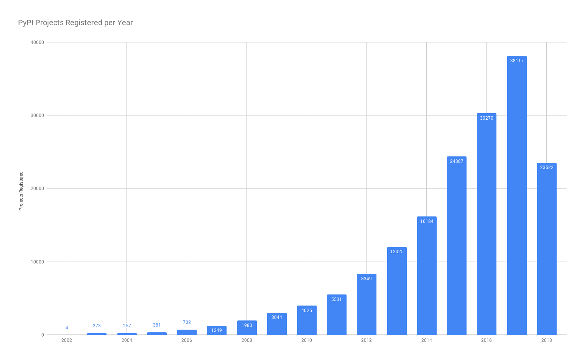

[.hide-footer]

^ one big difference that might be hard to see is the number of packages, from less than 3K to more than 130K

^ in that time pypi went from "_A_" place to get python packages to "_THE_" place to get python packages

^ this included lots of issues with PyPI being down or having outages

^ and there were a lot of things that had to happen behind the scenes so that pypi could continue to work

^ the other thing is that, by it's very nature, pypi predates almost all of the packages that exist on it

^ including all of the web frameworks and testing frameworks you're familiar with

^ so it's fifteen years old, pretty much no tests, no modern web framework

^ do run it locally to do development, you have to go comment out large parts of it

^ what should we do?

---

# **Solution:**
# Rewrite PyPI from scratch

^ normally if you ask me if a full-stack rewrite

^ ...of a core piece of infrastructure

^ ...depended on by hundreds of thousands of users

^ ...would ever succeed, I'd tell you no.

^ I don't know if anyone noticed but... this happened

---

[.hide-footer]

---

# **AKA:**
# Warehouse

^ aka warehouse, as in a place to put packages

^ this is a project that started more or less in 2011

^ has a number of goals, including HTTPS everywhere, using current best practices, a modern web framework, and tests!

^ it officially became PyPI last month

---

[.hide-footer]

^ and I have to say

^ this was a tremendous undertaking

^ this absolutely would not have been possible to have completed in a reasonable amount of time without support from mozilla

---

# *The End*

^ so that's it, right? we launched pypi, we've solved all the problems

^ good job everyone!

---

# **Current Problems**

^ no, we still have problems

^ but this is the nature of software

^ once we build the new shiny thing, we start to realize what else it can do

^ or what the need actually is

---

# **Problem:**
# Packaging is still kinda hard

^ especially if you're new to it all

^ there are a lot of different tools and things you've never heard of until maybe today

---

# **Solution:**
# The Python Packaging Guide
### <https://packaging.python.org>

^ it is a really carefully crafted and well maintained guide to python packaging

---

# **Solution:**
# `sampleproject`
### <https://github.com/pypa/sampleproject>

^ skeleton project for your python package

^ represents best practices for packaging

---

# **Solution:**
# General care & maintenance

^ In general, I think these more modern projects are more well specified

^ And easier to maintain

^ in addition, there is a serious focus on making these accessible to newcomers

^ in fact I would say we have a new problem now

---

# **Problem:**
# Packaging is a little _too_ easy

^ i could have called this talk...

---

# [fit] **Python Packaging**
# [fit] So Easy a Spammer Could Do It

^ Having packaging be hard actually has some unintentional benefits

^ namely, that folks that aren't truly invested in it can't figure out how to use it

^ unfortunately this excludes a lot of people that don't have malicious intent though

^ so while lowering that barrier is a priority, it does produce new problems

^ like spam on PyPI, typosquatting, etc.

^ there's another problem that's common these days

---

# **Problem:**
# Reproducible Environments

^ requirements.txt was a great step towards creating reproducible environments

^ we can use it to specifiy exact versions and hashes of any dependency for pip to install

^ however, creating and maintaining this file can be challenging

^ often we have multiple requirements files, for deployment, for development, for testing, for linting, for documentation, etc.

---

# **Solution:**
# `pipfile`/`pipfile.lock`
### <https://github.com/pypa/pipfile>

^ a single human-editable file

^ and a single generated file with fully deterministic dependencies

^ can be shared across multiple dependency-installing tools

^ this might feel familiar to gemfile.lock, yarn.lock, etc.

---

# **Problem:**
# Arbitrary code in `setup.py`

^ because setup.py is just a python script

^ no way to truly predict what dependencies a package will have without executing

^ I see questions about this so often that I wrote a blog post about it

---

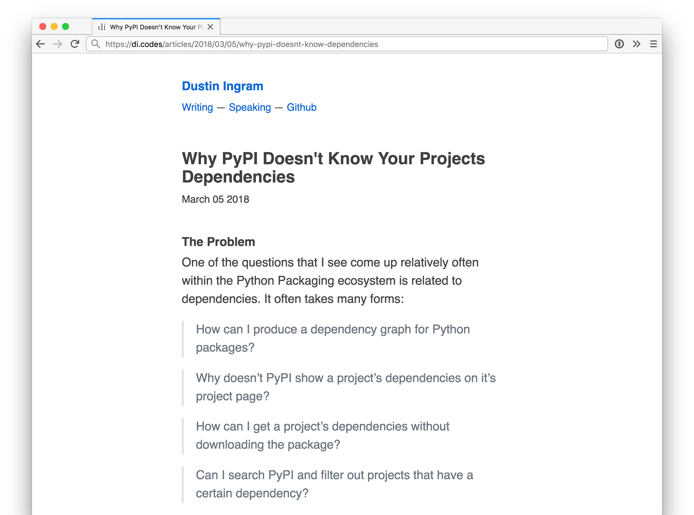

[.hide-footer]

^ the answer is: you can do anything you want in a setup.py

^ this makes it hard to reason about source distributions

^ there's an additional problem with setup.py as well

---

# **Problem:**
# A distutils/setuptools dance

^ extending/maintaining them is difficult, distutils because it's in the core python library, and setuptools because it's a big ball of mud

^ so while there do exist various solutions to the above problems, they're hard to implement and even harder to maintain

^ also, it's very difficult to use anything else, they are essentialy the de-facto standard interface

^ changing it becomes a chicken and egg problem

---

# **Solution:**
# PEP 517/518

---

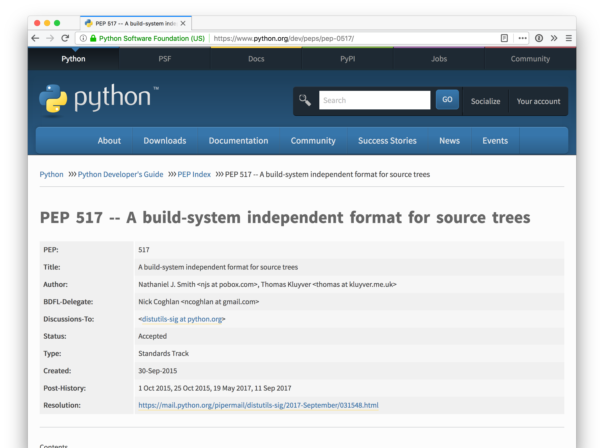

[.hide-footer]

---

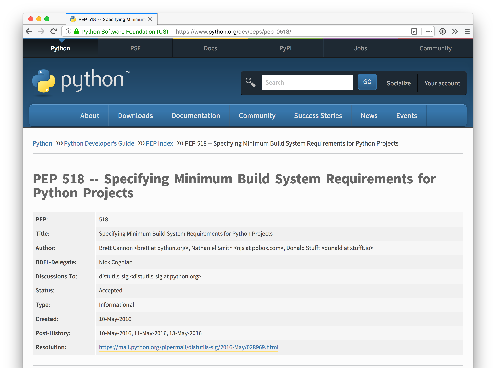

[.hide-footer]

---

# `pyproject.toml`

^ this is a way to step away from setuptools/distutils entirely

^ and allow users to specify their own build requirements for their project

^ which can then be installed prior to building

^ they could be setuptools, but they could be something else entirely

^ if you just saw jean-christophe's talk, could be scikit-build

---

# **How to help**

^ That sounds like a lot of problems, you might say

^ also consider Unlike conda, unlike NPM, and with only a few small exceptions, python packaging is entirely volunteer driven

^ maybe you'd like to help

---

[.hide-footer]

^ Both pypi and pip have a "good first issues" label in the issue trackers

^ so if you want to become a contributor today, you can

---

# **How to _get_ help**

^ i've told you how to help us, here's how we can help you

---

# **How to _get_ help**

* <https://packaging.python.org>
* Issue tracker for a given tool
* On IRC: `#pypa` Freenode channel
* <https://github.com/pypa/packaging-problems>

^ if you're having problems, you can do the following

^ in order of how quickly you need your problem solved, from very quick to "might take a while"

---

# **Talk to me**

* Github: [`@di`](https://github.com/di)
* Twitter: [`@di_codes`](https://twitter.com/di_codes)
* Email: <di@python.org>

^ you can also talk to me, I'm happy to help

---

# **Summary**

^ to summarize: packaging isn't bad! but there are always going to be problems to be solved

^ we've made gradual changes over a long period of time

^ and each change is a response to an evolving need

^ comparatively, it used to be really bad, and we might have for forgotten, or just never known, how hard it used to be

^ next time you are frustrated with python packaging, imagine a world with no pip, no pypi

^ and consider making a pull request

---

# **Thanks!**

---

# **Talk to me**

* Github: [`@di`](https://github.com/di)
* Twitter: [`@di_codes`](https://twitter.com/di_codes)
* Email: <di@python.org>
* **Or, ask me questions now!**
