theme: Plain Jane, 1
footer:  @di_codes

[.hide-footer]
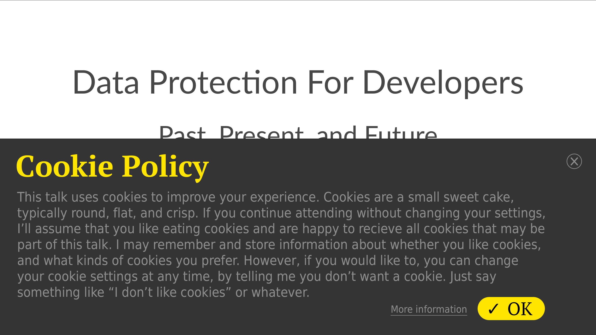

---

# Data Protection For Developers

## Past, Present, and Future

#### ·

## Dustin Ingram

---

[.background-color: #FF0000]
[.header: #000000]
[.hide-footer]

# [fit] DISCLAIMERS

---

# I am a Developer Advocate

---

[.background-color: #FF0000]
[.header: #000000]
[.hide-footer]

# I Am Not A Lawyer

---

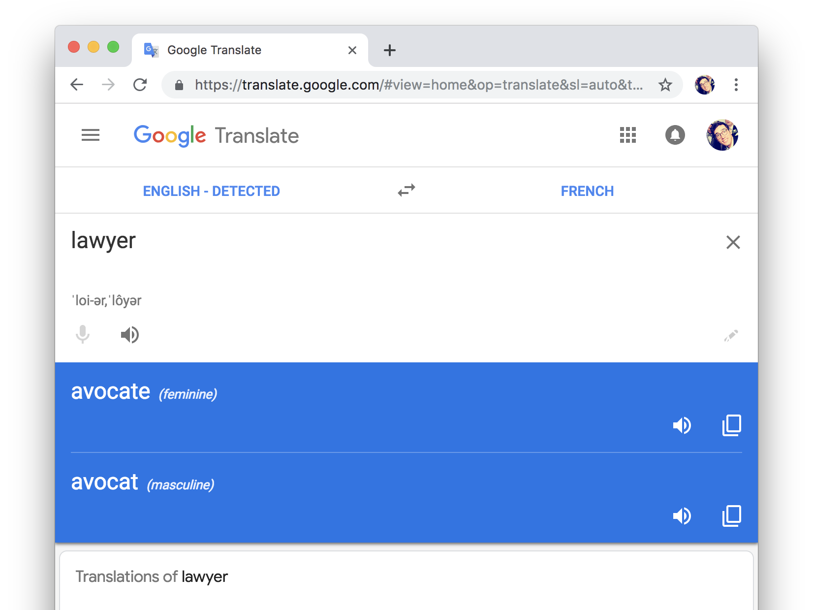

^ This might be confusing for you if you speak another language

^ please don't take anything I'm about to talk about as legal or policy advice

---

# I work for Google

---

[.background-color: #FF0000]
[.header: #000000]
[.hide-footer]

# This talk is not about Google

^ I'm not promising our products or services are “GDPR compliant”

^ or that they provide a GDPR fix or silver bullet (they definitely don't)

---

# I ❤️ Python

^ I'm one of the maintainers of the python package index

^ I organize PyTexas

^ I've given a bunch of talks about Python

---

[.background-color: #FF0000]
[.header: #000000]
[.hide-footer]

# This talk is not about Python

^ intersection of my interests in technology and law

^ and about something that's been building up and is kind of coming to a head now

^ but not a lot of people know about it!

---

# Data Protection

^ that thing is data protection

---

# What is data?

^ big data? small data?

^ collection of values for one or more variables

^ discrete pieces of information

---

# _datum_ ‚Üí data

^ data is the plural of datum

^ "(thing) given"

---

# What data needs protected?

^ Invite you all to a pizza party

^ Counting how many pizza pies we all ate

^ Counting the number of peices each of you individually ate

^ There is an ethical issue with considering such data as "given"

^ Did you "give" me did that data? Or did I "take" it from you

^ Who's was it anyways?

---

# _capere_ ‚Üí capta

^ as in capture, captive

---

# Personally Identifable Information

^ any data specific to one person

^ or which can be used to identify a given person

^ for the purposes of this, i'm talking about personal data, all data that you generate, or is about you

^ both data an capta

^ and we're going to start in

---

[.hide-footer]

^ might not be the first place you think of as the birthplace of data protection

^ Germany was an interesting place after WW2

---

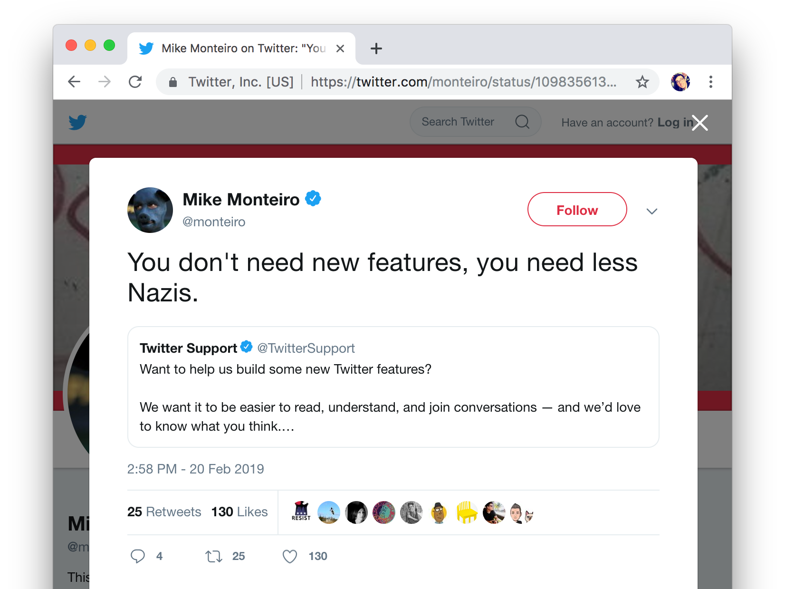

^ Many citizens were having a strong reaction to their previous govenment

^ ensure that a potential dictator would never again have the chance to come into power in the country

^ can't just pass a law that says "no hitlers"

^ but what you can do is pass laws that prohibit the things that give nazis power

^ and which make things that nazis like to do illegal

---

# Basic Law
## (1949)

^ two key tenets

---

# 1. A person’s dignity is inviolable

^ under all circumstances

---

# 2. Each person has the right to freely develop their personality

^ as long as it doesn't injure the rights of others

^ "personality"

---

# Persönlichkeitsrechte
## (Rights of the Personality)

^ besides these concerns about dictators

^ there were some other concerns that germans were increasingly having in the 50s and 60s

---

[.hide-footer]

^ Nuclear Power

---

[.hide-footer]

^ Pollution

---

[.hide-footer]

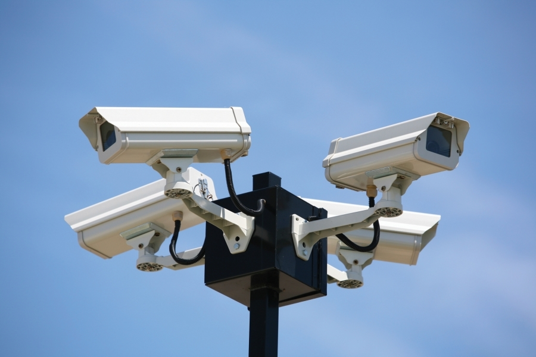

^ Data Privacy

^ All three concern the same thing: The acceptable use of new technological developments

^ So many complex and interconnected parts

^ An individual cannot grasp all the issues

^ for data privacy specifically, this comes from two places -- increasing use of computers

^ also country's history: How did the nazis know who was jewish? census records, tax returns, synagogue membership lists

^ seemingly harmless data their government had collected on them

---

# Hessian Data Protection Act
## (1970)

^ german state of hesse

^ more legislation on top of the Basic Law

^ name is a bit of a misnomer, because it doesn't protect the data, it protects the people whose data are being processed

---

# _ex ante_

^ Mostly focused on what was done with the data after it was collected

---

# Public sector

^ Only for the processing of personal data in the public sector

---

# Data Protection Commissioner

^ called for a

^ In charge of overseeing violations of the data protection act

^ Ironically the first commissioner was somewhat of a dictator and held the post for 16 years

---

[.hide-footer]

^ considered the first data protection act, ever

^ this was 1970

^ this law might seem somewhat primitive, only focused on uses

^ nothing about encryption, breaches, etc

---

[.hide-footer]

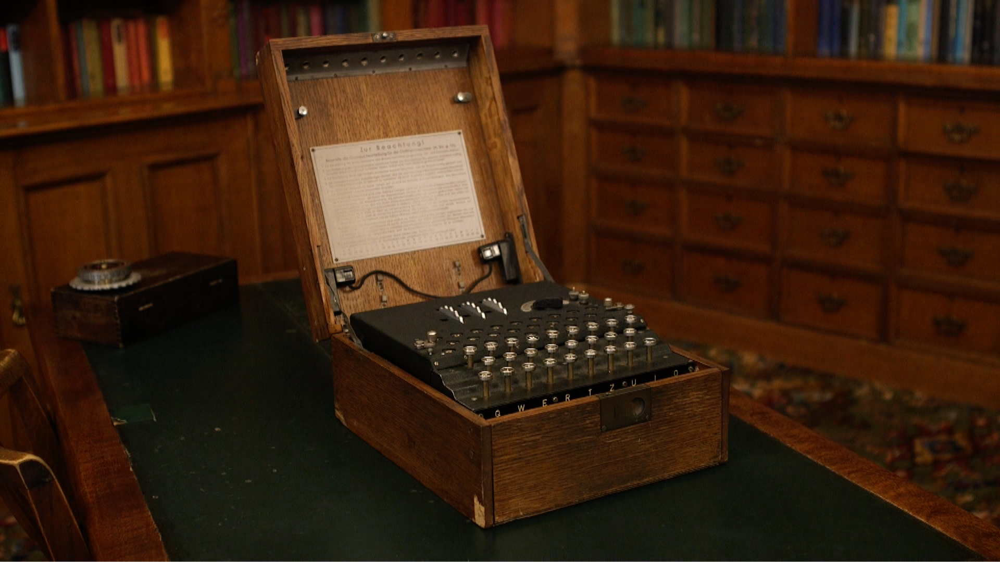

^ this is what we had in terms of encryption at the end of WW2

^ it wasn't until 1975 that we got the first standard for encryption (DES)

^ so this is actually pretty good

---

[.hide-footer]

^ meanwhile, in sweden, they had a completely different set of circumstances that were leading up to similar data protection

^ swedish government started using computers much earlier than most other countries

^ small population

^ high standard of living and income

^ could forsee usefulness of automation

---

# “A paradise for registers”

^ vast amounts of information about it's citizens

^ average adult would appear in 100 data systems. 200 if you're married!

^ might not seems like much, 100 apps on smartphone, but this is the 1970s

---

# Swedish Constitution
## (1766)

^ there was already a strong notion of "the right of public access"

^ right of the public to be present at court hearings

---

# Swedish Freedom of the Press Act
## (1949)

^ right of the press to government information

^ generally, public access to official records

^ great if you're a journalist: working on a lead, you need to know some details, you go down to city hall, they pull some files on the person and they make you a copy.

^ but, combining this with computers, private entities would gain vast amounts of information on citizens w/ very little effort

---

# Swedish Data Act
## (1973)

^ first national data protection act

^ three tenets

---

# 1. The right to get data about oneself

---

# 2. The right to compensation when individuals suffer damage due to incorrect information about them

^ really concerned about data being wrong

---

# 3. Criminalization of “data intrusion”

^ formally criminalized

^ In the law, this literally meant breaking into the offices where the data lived

---

[.hide-footer]

^ The swedes were smart, but they weren't able to forsee the internet

---

[.hide-footer]

^ Back in Germany

^ Since the Hessian law was enacted, other states were working on similar laws

^ Based on Sweden, it was determined thaty they needed a national law

---

# German Federal Data Protection Act
## (1977)

^ Several states had laws, combined them into a federal law

^ three parts

---

# 1. Ensure against the misuse of data

---

# 2. Prevent harm to personal interests

---

# 3. Prohibits the “processing” of personal data without specifically being permitted

^ created a regulating body that gave out permits for people to do data processing

^ Can't just collect data and then decide what to do with it later

^ go and get approval every time you want to do something different

---

[.hide-footer]

^ Over in the UK, people wanted some data protection

---

# UK Data Protection Act
## (1984)

^ eventually passed, but only after much reluctance and feet dragging by the UK government

---

> “No evidence to suggest that fears about the improper use of computers in the public sector are justified by present practice”

^ One early commission actually found

^ widely criticised

^ In 1985, the UK joined the European Communities, which was a precursor to the European Union

---

[.hide-footer]

^ The European Union was working on it's own policies

^ look how optimistic that flag is!

---

# EU Data Protection Directive
## (1995)

---

> A right to respect for one's private and family life, home and correspondence[^1]

[^1]: subject to certain restrictions

^ generally, baseline respect for privacy

^ more specifically, it had seven key recommendations

---

# 1. Notice

^ data subjects should be given notice when their data is being collected;

---

# 2. Purpose

^ data should only be used for the purpose stated and not for any other purposes;

---

# 3. Consent

^ data should not be disclosed without the data subject’s consent;

---

# 4. Security

^ collected data should be kept secure from any potential abuses;

---

# 5. Disclosure

^ data subjects should be informed as to who is collecting their data;

---

# 6. Access

^ data subjects should be allowed to access their data and make corrections to any inaccurate data; and

---

# 7. Accountability

^ data subjects should have a method available to them to hold data collectors accountable for not following the above principles.

^ this is awesome! except...

---

# It’s A Directive

^ which means it's non-binding. it's just a suggestion/recommendation and not law

---

# We’re in the late 90’s now...

---

# ...notice anything missing?

---

[.hide-footer]

^ The United States

^ can anyone name the major national data protection law we have?

^ gave this talk before, someone said "the patriot act"

^ i know we have some canadians in the audience

^ part of the patriot act authorizes a massive wiretapping and metadata gathering program by the US government

^ it's pretty much the exact opposite of a data protection laws

---

[.hide-footer]

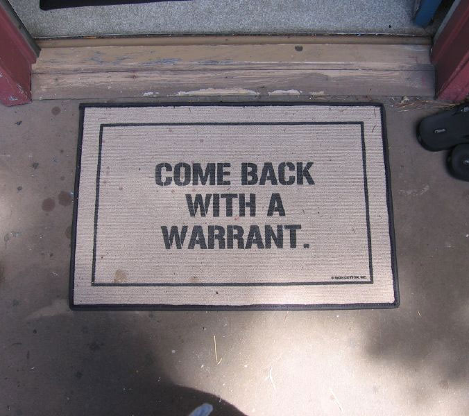

^ Fourth Amendment? unreasonable search & seizures

---

[.hide-footer]

^ in fact, the closest we've come is challenging this part of the patriot act is in klayman v obama

^ district court ruled that it "probably violated the 4th amendment"

---

[.hide-footer]

^ however in alcu v clapper it was determined that:

^ * the global telephone data-gathering system is needed to thwart potential terrorist attacks

^ * it can only work if everyone's calls are included

^ * Congress legally set up the program and that it does not violate anyone's constitutional rights

^ even wiretapping every US citizen doesn't constitute unreasonable search and seizure

---

> In the US, there is no single, comprehensive federal law regulating the collection and use of personal data.

^ so, yeah, we don't really have a national data protection law

---

# Video Rental Protection Act
## (1988)

^ wrongful disclosure of video tape rental or sale records

---

[.hide-footer]

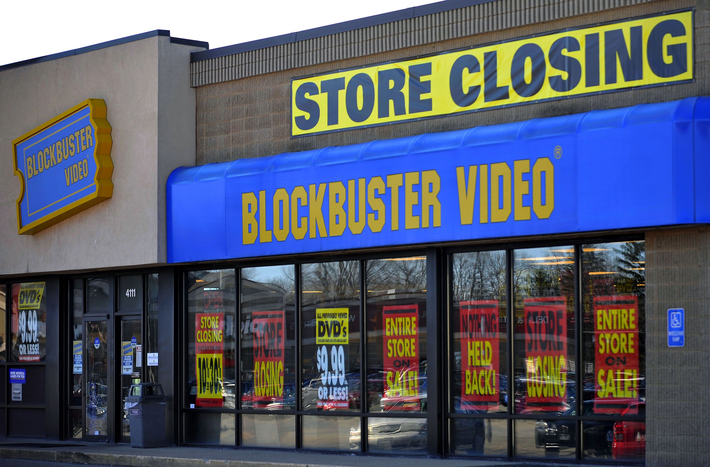

^ which I'm sure you're worried about

^ so that's cool

^ don't get me wrong, we have a lot of laws like this

---

* The Federal Trade Commission Act
* The Financial Services Modernization Act
* The Health Insurance Portability and Accountability Act (HIPPA)
* The Fair Credit Reporting Act
* The Controlling the Assault of Non-Solicited Pornography and Marketing Act (CAN-SPAM)
* The Telephone Consumer Protection Act
* The Electronic Communications Privacy Act

^ All of these address a very small, specific part of data protection

^ HIPPA - just for health records

^ fair credit reporting - you can correct your credit history

^ CAN-SPAM - collection and use of email addresses

^ tiny steps in the right direction

---

# S.J.Res.34
## (April 2017)

^ senate joint resolution 34

^ Signed into law by somebody

^ big step in the wrong direction

^ big step in the wrong direction

---

> “This joint resolution nullifies the rule submitted by the Federal Communications Commission entitled ‘Protecting the Privacy of Customers of Broadband and Other Telecommunications Services.’”

^ TLDR; ISPs can sell your browsing history again

---

[.hide-footer]

^ everything is terrible, i'm moving to sweden

^ Well, maybe true if you live in the US

---

[.hide-footer]

^ But remember that beautiful, shining, optimistic EU flag?

^ if you live in the EU, you just got the

---

# EU General Data Protection Regulation
## (2018)

^ or "GDPR" for short

---

# Scope

^ Incredibly broad. Applies if the data controller, data processor, or data subject is based in tne EU

^ If you're an american company that has customers in the EU, you must comply

---

# Single set of rules

^ Same rules for all member states

---

# Right of Erasure

^ maybe the most well known part

^ the right to be forgotten

---

# Right of Access

^ the right to get a copy of all the data a company has on you

---

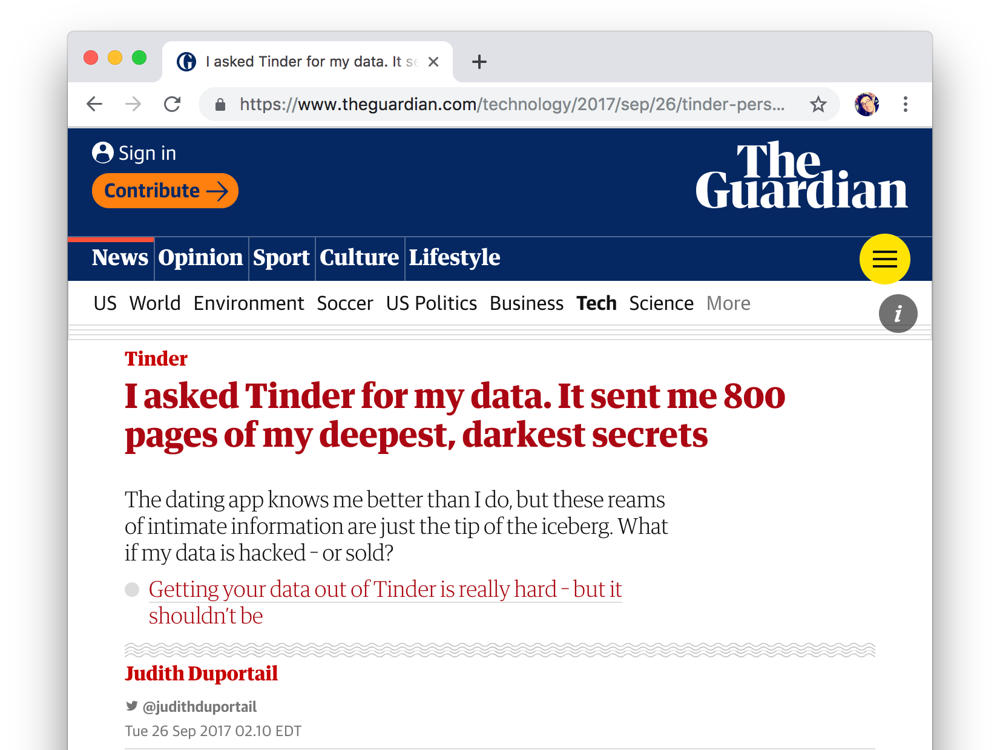

^ This has led to some pretty wild newspaper articles where some journalist calls up Tinder and gets their mind blown when they realize for the first time that tech companies actually store everything you do.

^ what if it's hacked or sold?

---

# Data breaches

^ data breach must be reported within 72 hours

---

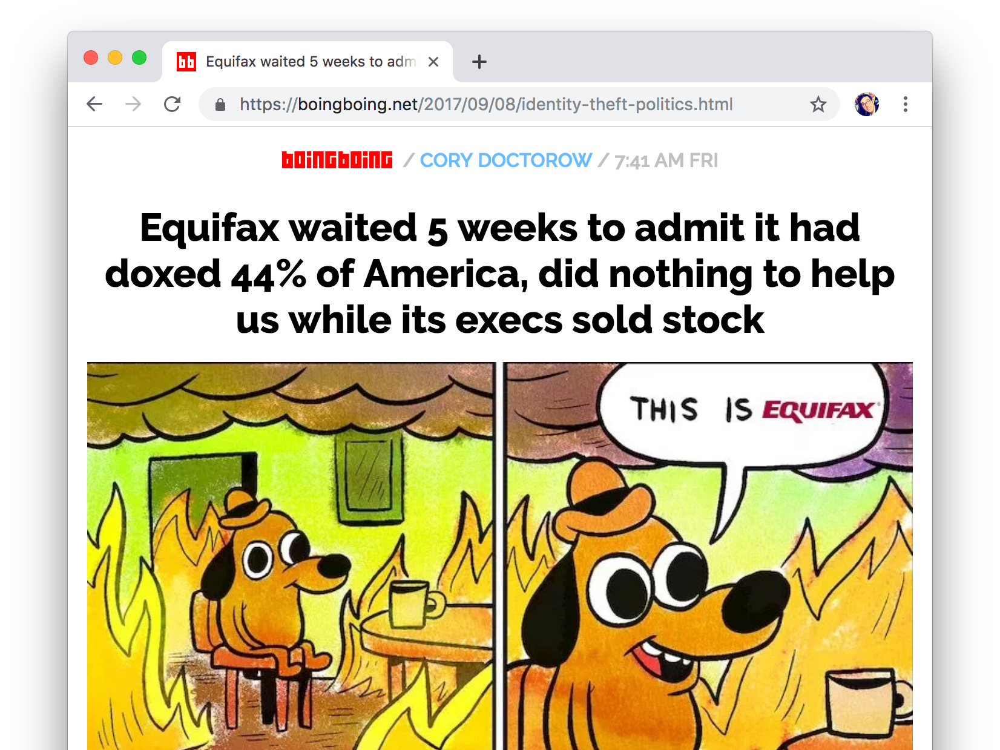

^ Not a month: equifax

---

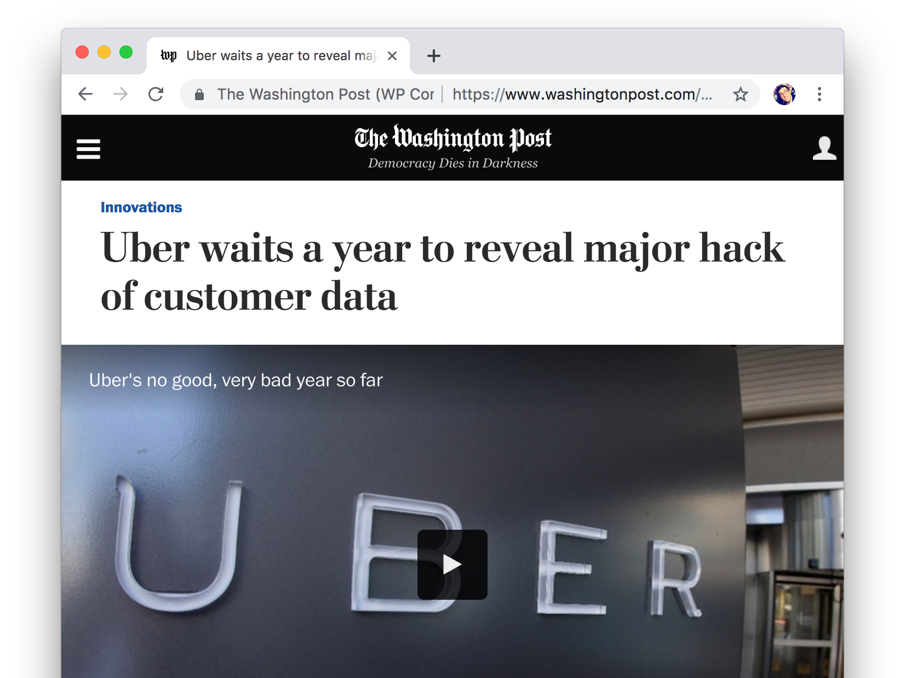

^ not a year: uber

---

# Right to Compensation

^ if there has been a breach

^ for any person that has suffered material or non-material damage shall have the right to recieve compensation

^ this is amazing because there is no such thing as a class-action lawsuit in european states

---

# Pseudonymisation

^ resulting data cannot be attributed to a specific data subject without the use of additional information

^ read: use encryption

---

# Consent

^ Data collectors must be explicit about what is being gathered and what it is being used for

^ can only use the data for the consented purposes!

---

# Data Protection Officer

^ a person with expert knowledge of data protection law and practices should assist the controller or processor to monitor internal compliance

---

# It’s binding!

^ a warning in cases of first and non-intentional noncomplance

^ regulr periodic data protection audits

^ upper: fine of 20M euros or 4% of annual worldwide revenue, whichever is greater, first offense

^ apple 229 billion a year, more than 9 billion dollars

---

# May 25, 2018 üéâ

^ Went into effect last year

---

# Future of Data Protection

^ The last time I gave this talk, it hadn't gone into effect yet

^ I made three predictions, and I thought I'd revisit

---

# 1. “GDPR Compliance” is going to be a big deal

^ Just like HIPPA compliance, but way more complex

---

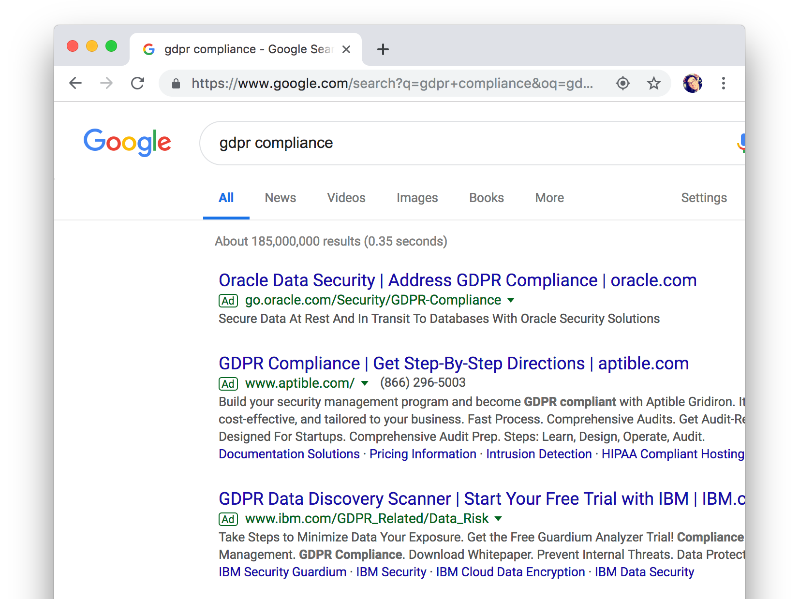

^ You can generally tell how big a moneymaker something is by the ads when you search for it

---

# 2. Somebody is going to get sanctioned

^ what good is a law you don't enforce

^ and that's exactly what happened

---

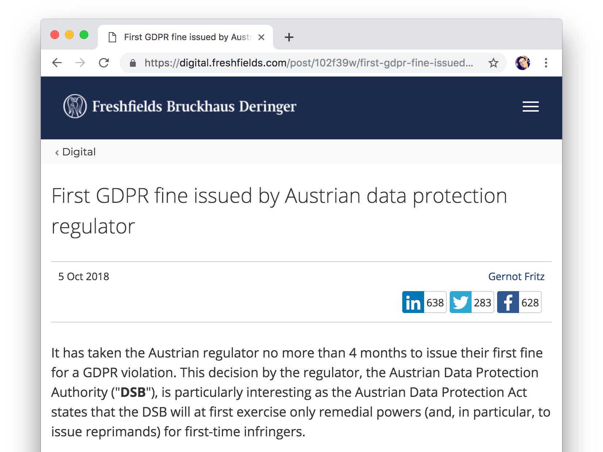

^ in october

^ A small business in austria had installed a security camera in front of their business that also recorded a large part of the sidewalk

^ no consent

^ 4,800 euros

---

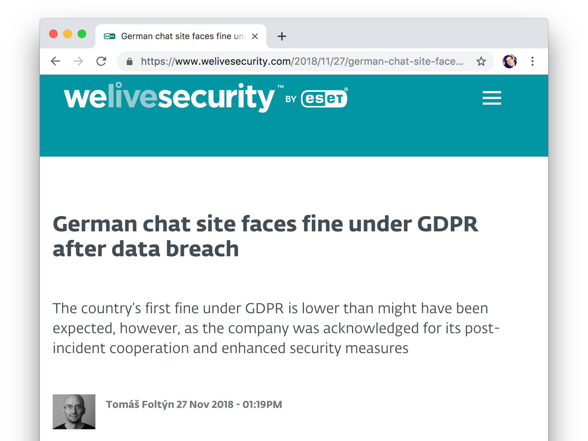

^ in november

^ german chat site reported a data breach to their local data protection agency

^ the agency investigated

^ determined the site had been storing user passwords in plaintext without hashing.

^ fined 20,000 euros for data storage practices

^ not for the breach itself, or their reporting of it

---

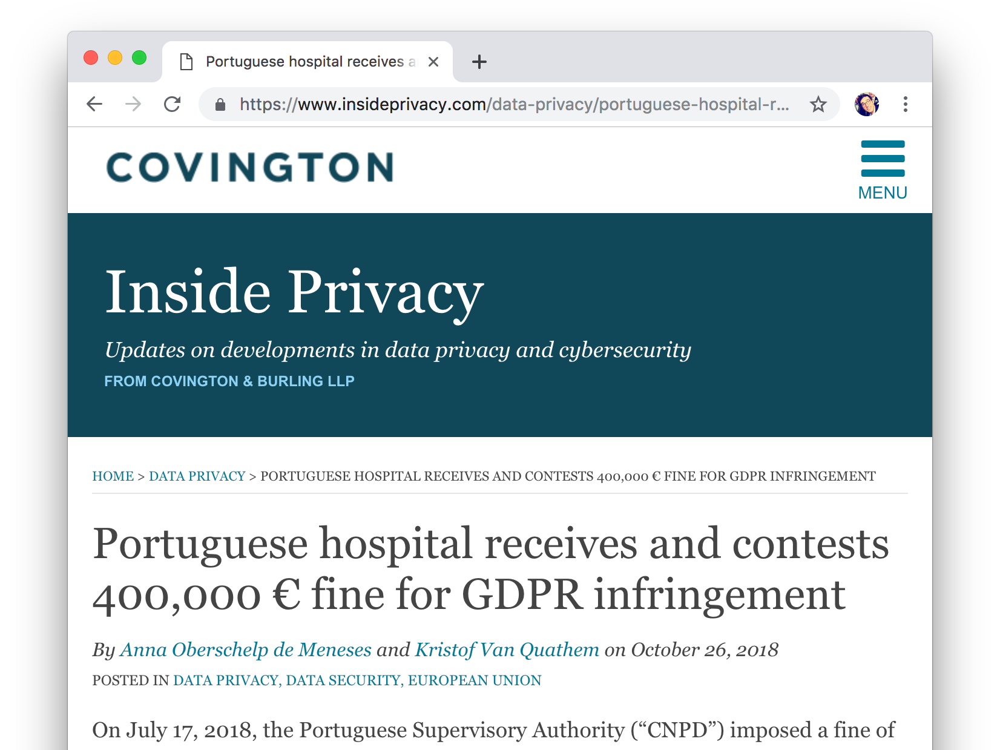

^ Staff at the hospital used bogus accounts to access patient records.

^ 400,000 euros

---

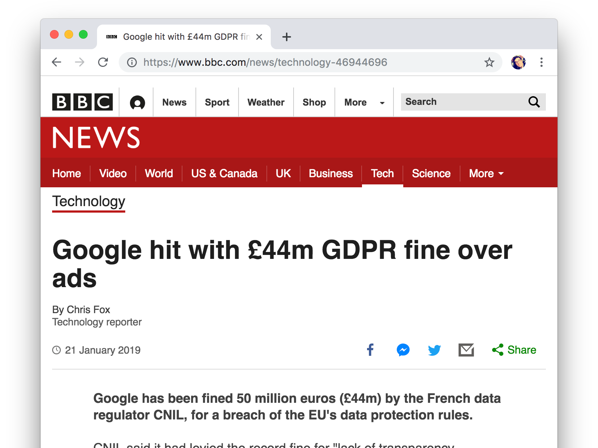

^ little software company you probably havent heard from

^ not sufficiently informed about how data was collected to personalise advertising

^ 50 million euros

^ i was a little more correct on that predection than i would have liked

---

# 3. Don’t expect anything in the US to get better in the next ~2 years

^ expect further dismantling of privacy laws and regulations

^ i was totally wrong!

---

^ california passed some amendments to existing policy

---

# California Consumer Protection Act
## (2020)

^ Any for-profit entity that collects consumers' personal information

^ which does business in California, and:

^ makes more than 25 million per year

^ Possesses the data of 50,000 or more consumers, households, or devices; OR

^ Earns more than half of its annual revenue from selling consumers' personal information.

^ pays $100-$750 per person for a data breach

^ fine of up to $7500 for each intentional violation

^ January 1, 2020

---

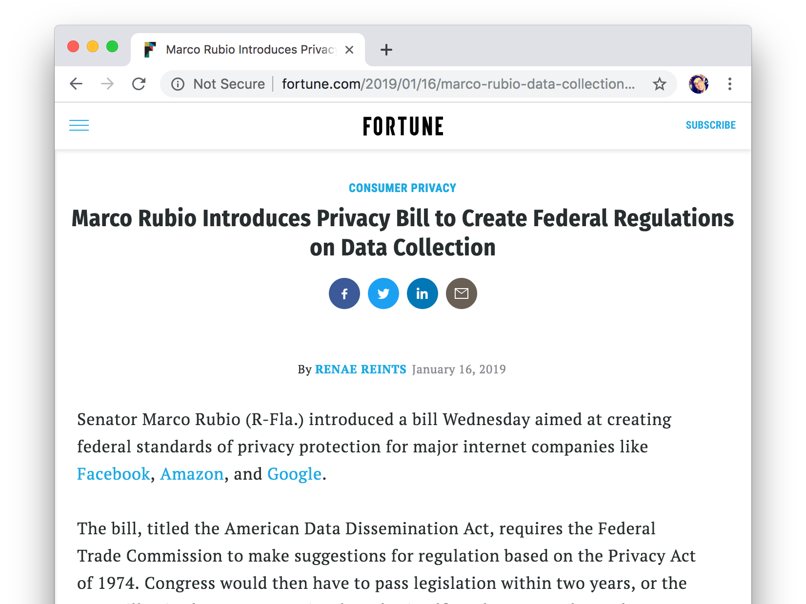

^ american data dissemenation act

^ one of two bill currently referred to the senate Committee on Commerce, Science, and Transportation.

^ so maybe everything is not so terrible after all!

---

# Conclusion

^ one last thing:

^ we live in an age where the ability to generate data about oneself and the capacity of others to collect it is enormous.

^ It might not come as a surpise to any of you that Tinder has so much data on it's users, but for the majority of them, they simply do not know.

^ We need to make sure on their behalf, and for our own sake, that this data is being protected, used responsibly, and that it will not and cannot endanger the people from which it has been taken.

---

# Thanks
