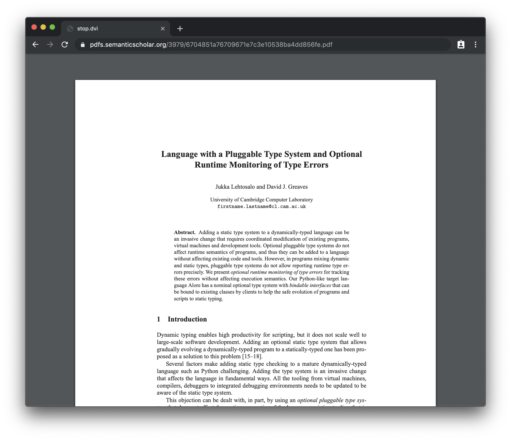
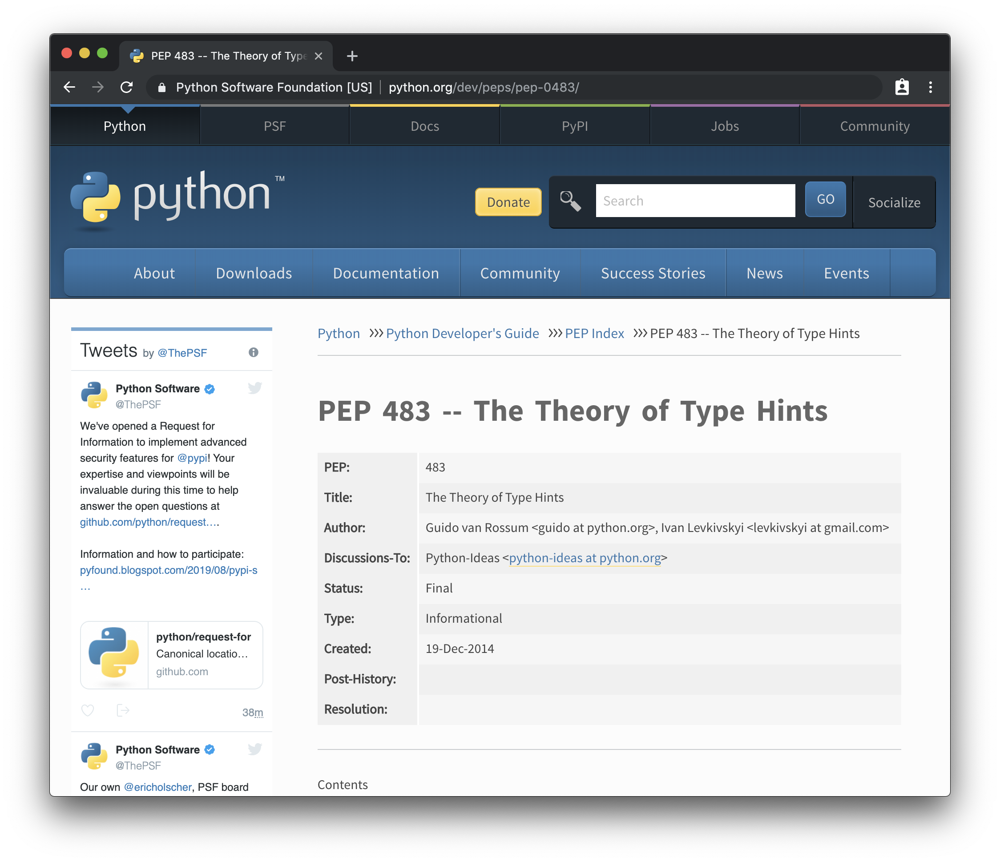
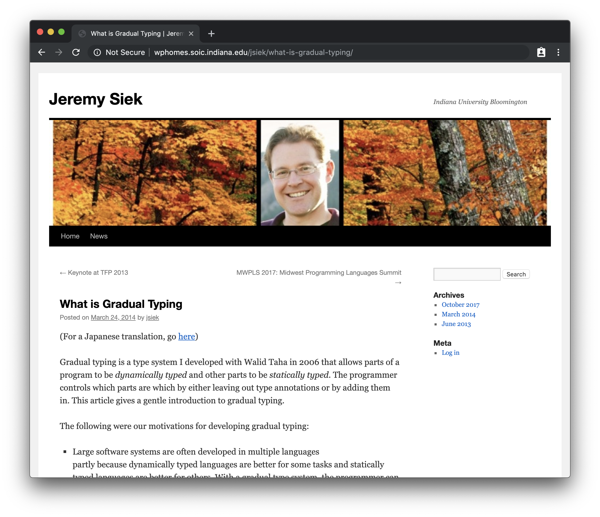
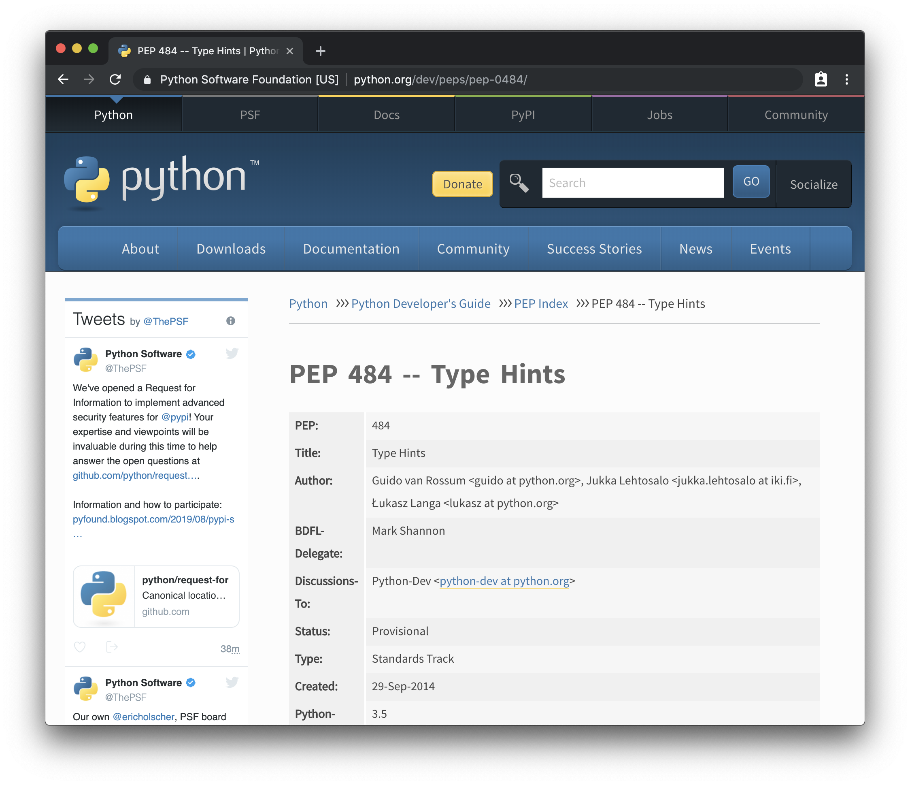
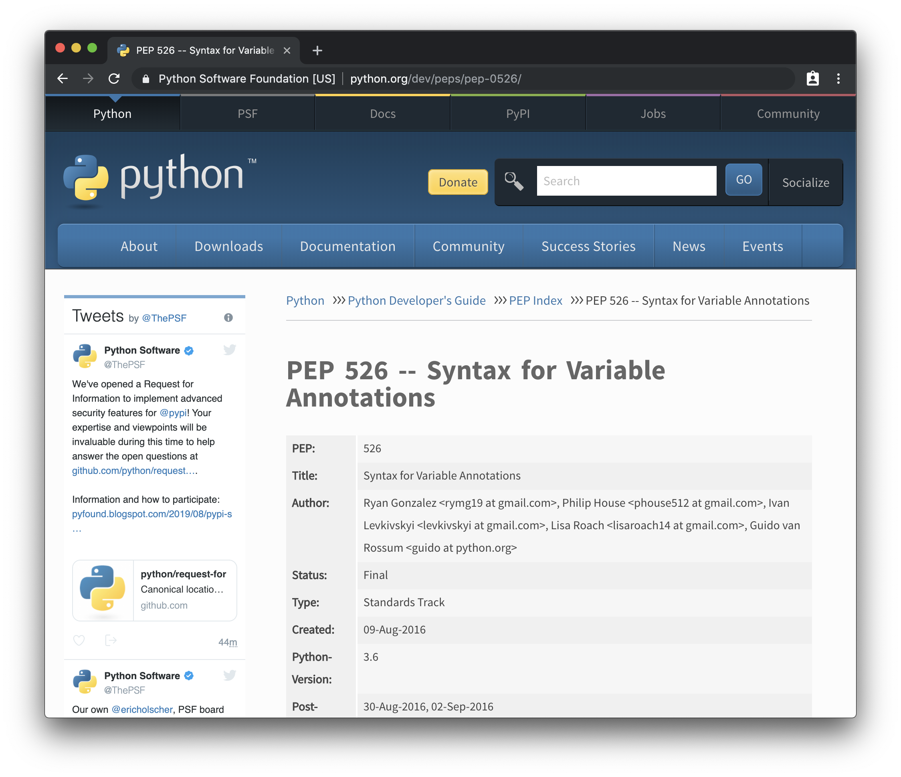

theme: Huerta, 2
footer:  @di_codes
[.code: auto(42)]

# *Static Typing in Python*
## PyColorado 2019

---


# [fit] *Hi, I'm Dustin*

---

# *Hi, I'm Dustin*

* Developer Advocate @ Google
* PyTexas (Austin, TX, May 16-17th 2020)
* Python Package Index

---

# Pop quiz:
## Is Python *dynamically* or *statically* typed?

---

# Answer:
## Dynamically typed... but can optionally be statically typed.

---

# Steps to understand that:
* Types in Python
* Type systems in general
* Dynamic typing in Python
* Static typing in Python

---

# Once we understand that:
* When you should use static typing
* When you _shouldn't_ use static typing
* How to use static typing

---

## Let's talk about
# types and `type`

---

```python
>>> type(42)
<cl​ass 'int'>
```

---

```python
>>> type(42)
<cl​ass 'int'>
>>> type(42.0)
<cl​ass 'float'>
```

---

```python
>>> type(42)
<cl​ass 'int'>
>>> type(42.0)
<cl​ass 'float'>
>>> type('foo')
<cl​ass 'str'>
```

---

```python
>>> type(42)
<cl​ass 'int'>
>>> type(42.0)
<cl​ass 'float'>
>>> type('foo')
<cl​ass 'str'>
>>> type(['foo', 'bar'])
<cl​ass 'list'>
```

^ oh I recognize these, these are builtins that I can change types with

---

```python
>>> a = 42
42
```

^ when we assign variables to these values, we say they are that type

---


```python
>>> a = 42
42
>>> float(42)
42.0
```

^ and we can use these builtins to convert or cast from one type to another

---


```python
>>> a = 42
42
>>> float(42)
42.0
>>> str(float(42))
'42.0'
```

---


```python
>>> a = 42
42
>>> float(42)
42.0
>>> str(float(42))
'42.0'
>>> list(str(float(42)))
['4', '2', '.', '0']
```

---

```python
>>> type(42) is int
True
>>> int
<cl​ass 'int'>
>>> isinstance(42, int)
True
```

^ it would seem like these are the types available to us

^ but these are just classes

^ basically we're doing class matching


---

```python
>>> type(None)
<cl​ass 'NoneType'>
>>> def func():
...     pass
...
>>> type(func)
<cl​ass 'function'>
>>> type(...)
<cl​ass 'ellipsis'>
```

^ there are other "type" classes as well, that don't correspond directly to builtins

---
```python
>>> import types
```

---

```python
>>> import types
>>> dir(types)
['AsyncGeneratorType', 'BuiltinFunctionType',
'BuiltinMethodType', 'ClassMethodDescriptorType',
'CodeType', 'CoroutineType', 'DynamicClassAttribute',
'FrameType', 'FunctionType', 'GeneratorType',
'GetSetDescriptorType', 'LambdaType',
'MappingProxyType', 'MemberDescriptorType',
'MethodDescriptorType', 'MethodType',
'MethodWrapperType', 'ModuleType', 'SimpleNamespace',
'TracebackType', 'WrapperDescriptorType',
...
```

^ all these can actually be used to instantiate a new
type

---

# Dynamic typing
## Variables can be _any_ type

---

```python
>>> import random
>>> a = random.choice([42, 42.0, '42'])
>>> type(a)
```

---

```python
>>> import random
>>> a = random.choice([42, 42.0, '42'])
>>> type(a)  # Could be str, int, float
```

---

# Dynamic typing
## Arguments and return values of functions can be _any_ type

^ same is true for function arguments and return values

---

```python
def frobnicate(a, b, c):
    "Frobnicates the bizbaz"
    return a + b + c
```

^ In python, when we write a function like this, how do we know that we're getting the types we're expecting?

---

```python
>>> def frobnicate(a, b, c):
...     return a + b + c
...
>>> frobnicate(1, 2, 3)
6
>>> frobnicate('hi', ' ', 'there')
'hi there'
```

---

```python
def frobnicate(a, b, c):
    """Frobnicates the bizbaz

    Args:
        a (int): The first parameter.
        b (int): The second parameter.
        c (int): The third parameter.

    Returns:
        int: The bizbaz
    """
    return a + b + c
```

^ sometimes we do this

---

```python
def frobnicate(a, b, c):
    "Frobnicates the bizbaz"
    assert type(a) is int
    assert type(b) is int
    assert type(c) is int
    bizbaz = a + b + c
    assert type(bizbaz) is int
    return bizbaz
```

^ we don't do this

---

# Duck typing
## If it walks like a duck and it quacks like a duck...

^ instead we rely on what we call duck typing

---

```
examples of duck typing
```

---

# Static typing
## As in, defined and not changing

---

```c
int frobnicate(int a, int b, int c) {
    return a + b + c;
}
```

^ c

---

```java
public static int frobnicate(int a, int b, int c) {
    return a + b + c;
}
```

^ java

---

```rust
fn frobnicate(a: u8, b: u8, c: u8) -> u8 {
    return a + b + c;
}
```

^ rust, with fine-grain control of integer type

---

```typescript
function frobnicate(a: number, b: number, c:number): number {
    return a + b + c;
}
```

^ typescript, because all numbers in JS are the same

---

| Dynamic      | Static  |
| ------------ | ------- |
| • Python     | • C/C++ |
| • Ruby       | • Rust  |
| • Clojure    | • Java  |
| • JavaScript | • TypeScript |

---


| Dynamic      | Static  |
| ------------ | ------- |
| • Python[^*] | • C/C++ |
| • Ruby       | • Rust  |
| • Clojure    | • Java  |
| • JavaScript | • TypeScript |

[^*]: Kinda.


---

# Python is dynamically typed
## But can optionally be statically typed

^ this wasn't always true

---


---



---



---

# Gradual typing
## Let's not try to do this all at once

^ python 2-3

^ Gradual typing allows one to annotate only part of a program, thus leverage desirable aspects of both dynamic and static typing.

---



---



---




---

# Type checking
# Compile-time, run-time, check-time

---

# Static typing in Python

---

# When you should use static typing

---

# When you _shouldn't_ use static typing

---

# How to use static typing

---

[.hide-footer]

# *Thanks!*
##  @di_codes

---

<!--


# Title

* Static Typing in Python

# Description

Python is well-known as a programming language without static types. This means that you don't need to say what a given variable will hold, or whether your function will return a string or an integer (or sometimes one, and sometimes another!). This has historically made Python a very flexible and beginner-friendly language.

In this talk, we'll discuss the advantages and disadvantages to a static type system, as well as recent efforts to introduce static typing to Python via optional "type hints" and various tools to aid in adding types to Python code. We'll see what this means for Python, for Python programmers, and what the future has in store for Python's type system.

# Audience

This talk is for Python programmers who either don't know what static typing is, don't know why why they might want it, or who do have some understanding, but aren't sure what benefits they might get by adding type annotations to their code.

Attendees should know that there is a distinction between typed and untyped code, and understand what some types (list, int, string, etc) are, but don't need to know exactly what static typing is or have direct experience with typed code.

After watching this talk, attendees should understand that Python is untyped by default but can be typed. They should understand the class of problems that adding type annotations seeks to alleviate, and some tools they can use to add and check type annotations.

# Outline

* About types ( min)
    * Types of type systems
    * Advantages of static typing
    * Disadvantages of static typing
* Types in other languages ( min)
    * C
    * Ruby
    * JavaScript
    * Go
* Types in Python ( min)
    * How Python did/does typing
    * The `type` function
    * PEP 484: Type Hints
    * The `typing` module
    * Tools
        * mypy
        * pytype
* The great benefits to static typing in Python ( min)
    * Static code analysis
    * More documentation
    * Code completion
* The disadvantages to static typing ( min)
* The challenges of static typing ( min)

# References
https://twitter.com/codinghorror/status/1141848007404425221?s=19
https://veekaybee.github.io/2019/07/08/python-type-hints/

-->
