footer:  @di_codes

# *Building a Sustainable Python Package Index*
### PyCon AU 2019

---

# [fit] *Hi, I'm Dustin*

---

# [fit] *Hi, I'm Dustin*

* Developer Advocate @ Google
* PyTexas (Austin, TX, May 16-17th 2020)
* Python Package Index

^ here to answer the most important question

---

# Q: How do you pronounce "PyPI"?

---

# Q: How do you pronounce "PyPI"?
# A: "pie-pea-eye"

---

---

- What PyPI is
- What PyPI *isn't*
- How PyPI works
  - Technically
  - Organizationally
  - Financially
- How we can improve

---

# *PyPI is...*

---

# *PyPI is...*

# the cannonical repository for Python software.

---

> "What happens when you type `google.com` into your browser and press enter?"

---

> "What happens when you type `pip install django` into your terminal and press enter?"

---

---

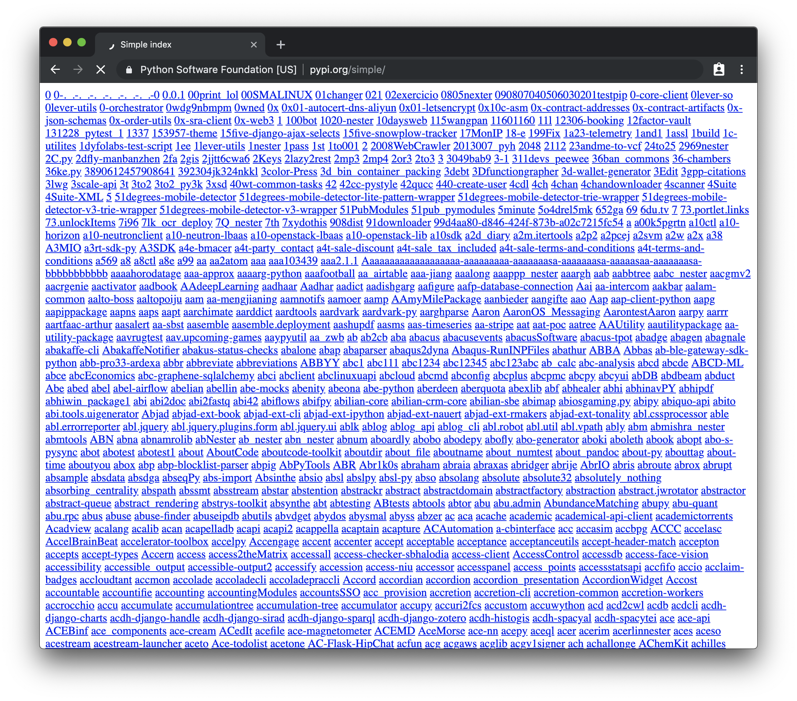

---

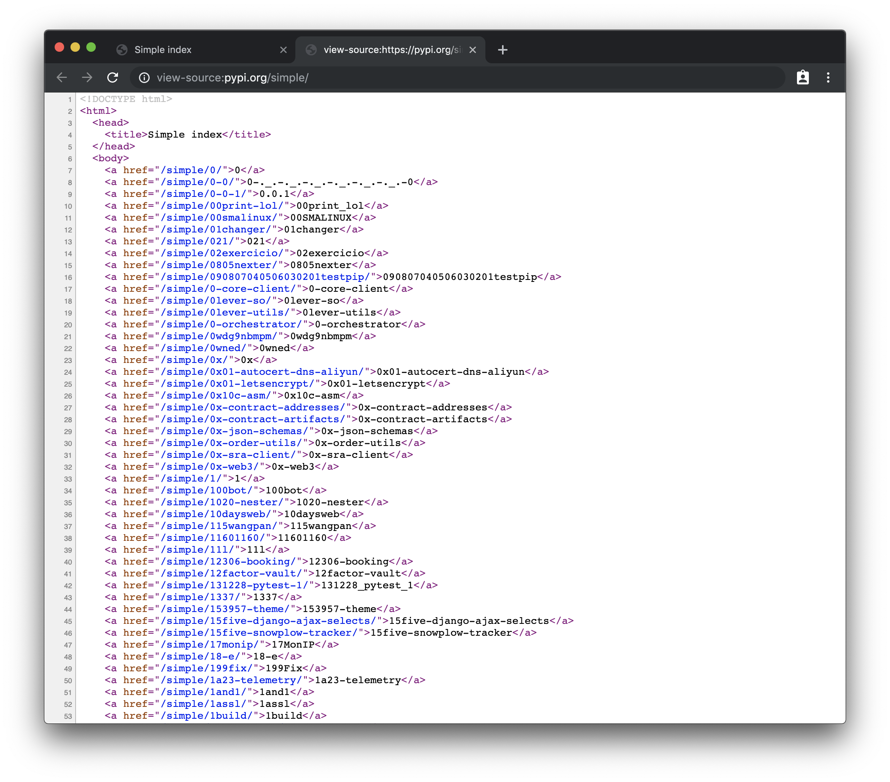

---

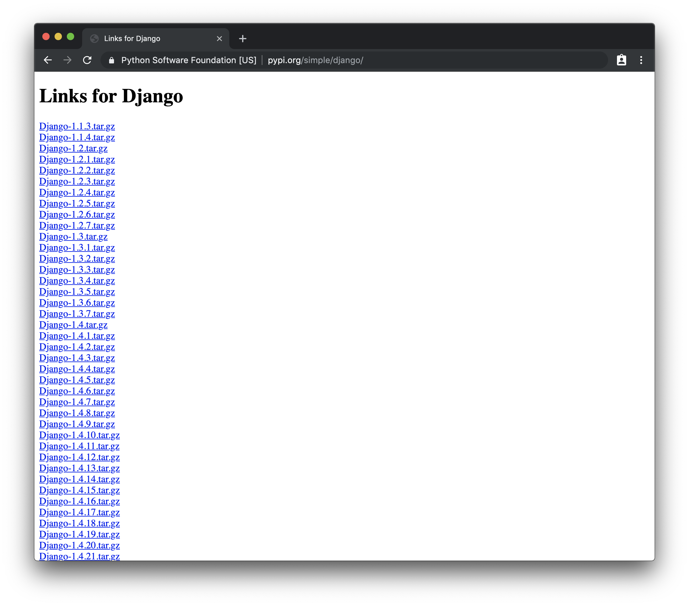

---

---

# *PyPI is...*

# basically just a huge list of links to files with very specific filenames.

---

# *PyPI is...*

# old.

^ first commit: 2002

---

^ didn't exist until a while after Python was created

^ hence "batteries included"

^ still, predates many other package language repos

---

# *PyPI isn't*...

---

# *PyPI isn't*...
# a collection of audited software.

---

^ kind of like Github

---

# *PyPI isn't*...
# literally Github.

---

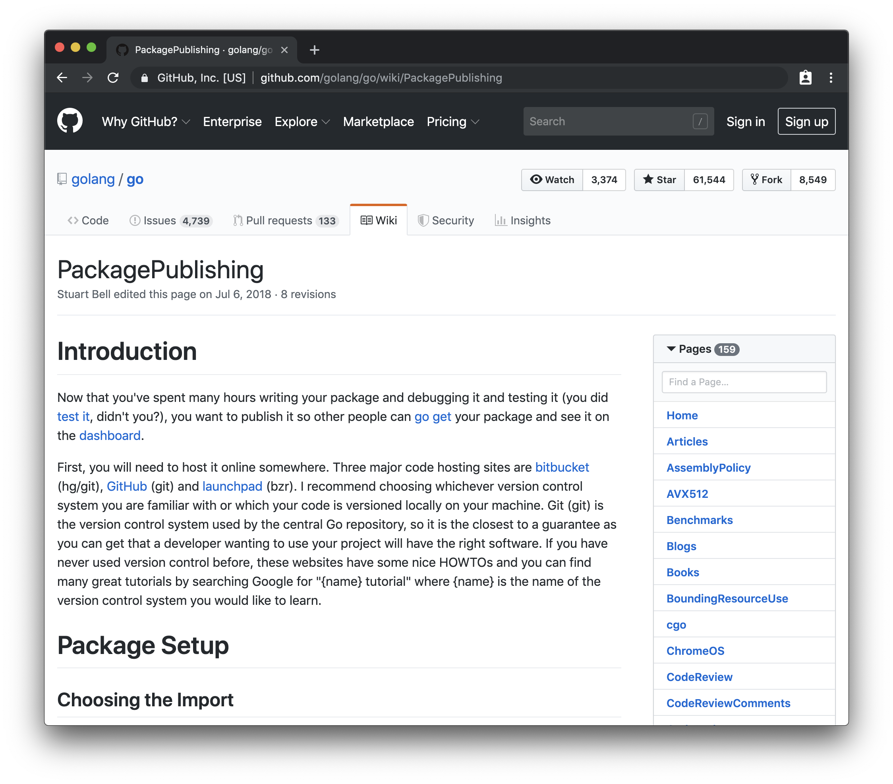

---

# *PyPI isn't*...
# a for-profit organization.

---

^ $10.6MM in VC funding, 60 employees

---

# How to build a PyPI

## *In just 5 easy steps!*

---

# 1. Define some APIs

## — Simple API — Upload API — JSON/XML-RPC APIs — Web UI

---

# 2. Implement said APIs

## — Python 3 — Pyramid web framework — Postgres/Redis — Kubernetes — A sprinkle of JS/SCSS

---

# 3. Put all of that behind a big ol' CDN

## (content distribution network)

---

---

---

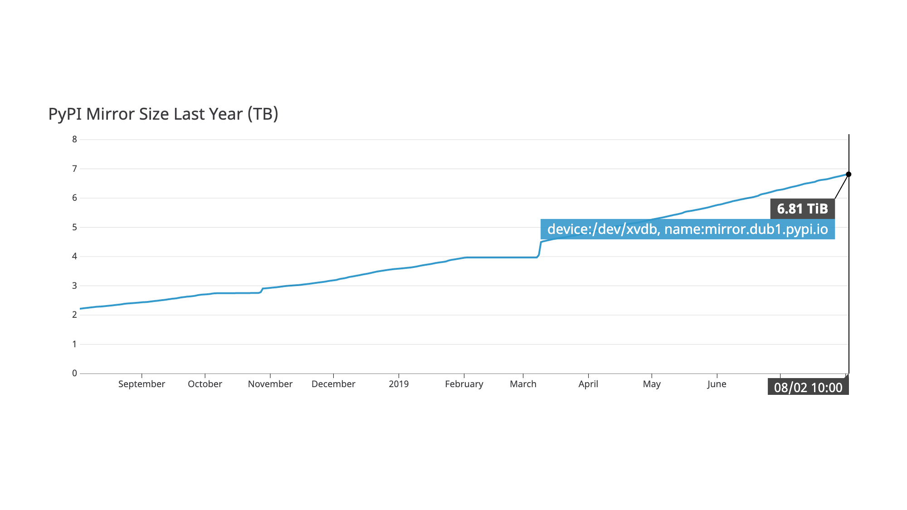

---

# 4. ???
#  
# 5. Profit!

---

# 4. ~~???~~ Try to make that sustainable 
# 5. Profit!

---

# 4. ~~???~~ Try to make that sustainable 
# 5. ~~Profit!~~ Hope you break even

---

# [fit] *Technical*
# [fit] *sustainability*

---

# *Technical sustainability*

## - Longevity - Maintainability - Transparency - Evolvability - Scalability

---

# *Technical sustainability*

## Using the latest and greatest

^ python 3, latest dependencies, releases, etc

^ evolvability

---

# *Technical sustainability*

## ...but not using anything too weird

^ maintainability

---

# *Technical sustainability*

## Everything is open source

^ transparency

---

# *Technical sustainability*

## Strong local development experience

^ maintainability

---

# *Technical sustainability*

## Tests!

---

# *Technical sustainability*

## Tests!  Lots of tests!!

---

# *Technical sustainability*

## Tests!  Lots of tests!!  100% test coverage!!!

---

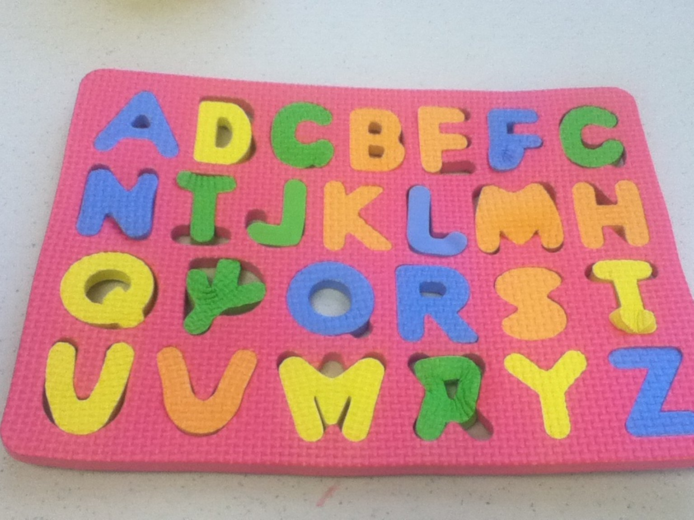

---

# *Technical sustainability*

## Read-heavy and cacheable

^ scaleability

---

# *Technical sustainability*

## Resilient to downtime

---

# [fit] *Organizational*
# [fit] *sustainability*

^ said before we're not for-profit, what are we?

---

# [fit] *Organizational sustainability*
#  

## PyPI is a project of the Python Software Foundation, a non-profit.

^ because we all know how sustainable non-profits are

---

# [fit] *Organizational sustainability*
#  

## PyPI is run (almost entirely) by a team of volunteers

^ and we all know how sustainable volunteers are as well

---

# [fit] *Organizational sustainability*
#  

## PyPI Administrators
### - Donald Stufft (Amazon)
### - Ernest Durbin (Python Software Foundation)
### - myself (Google)

---

# [fit] *Organizational sustainability*
#  

## PyPI Maintainers
### - Nicole Harris (Kabu Creative)
### - Sumana Harihareswara (Changeset Consulting)

---

# [fit] *Organizational sustainability*
#  

## PyPI Moderators
### - Pradyun Gedam
### - Jason Madden
### - Thea Flowers
### - Yeray Diaz Diaz

---

# [fit] *Organizational sustainability*
#  

## PyPI Contributors

### Almost 200 individuals

---

# [fit] *Organizational sustainability*
#  

## a) someones company is paying them to work on open source

---

# [fit] *Organizational sustainability*
#  

## b) someone is unemployed & bored

^ possibly because they spent too much time working on open source

---

# [fit] *Organizational sustainability*
#  

## c) someone is not getting enough sleep

^ I've been all three of these

---

# [fit] *Financial*
# [fit] *sustainability*

---

# *Financial sustainability*

## Sponsors: in-kind donations

###- Metrics: Datadog - Alerting: Sentry - Seach: Elastic - Compute/storage: AWS/GCP - CDN: Fastly

^ More than $200K per month, $2.5 million per year

---

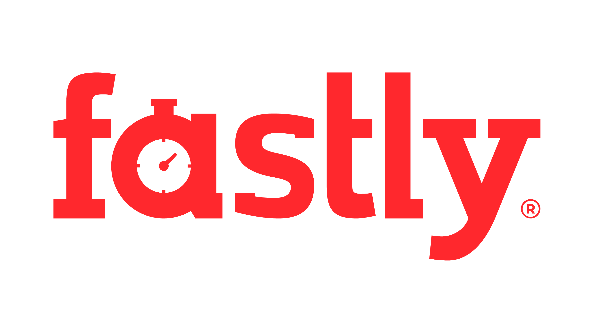

---

# *Financial sustainability*

## Sponsors: individual donors

### Total: USD $250/mo

^ $3000 per year

---

# *Financial sustainability*

## Grants & awards

^ for specific projects

---

---

---

---

^ less than 3K to almost 140K

---

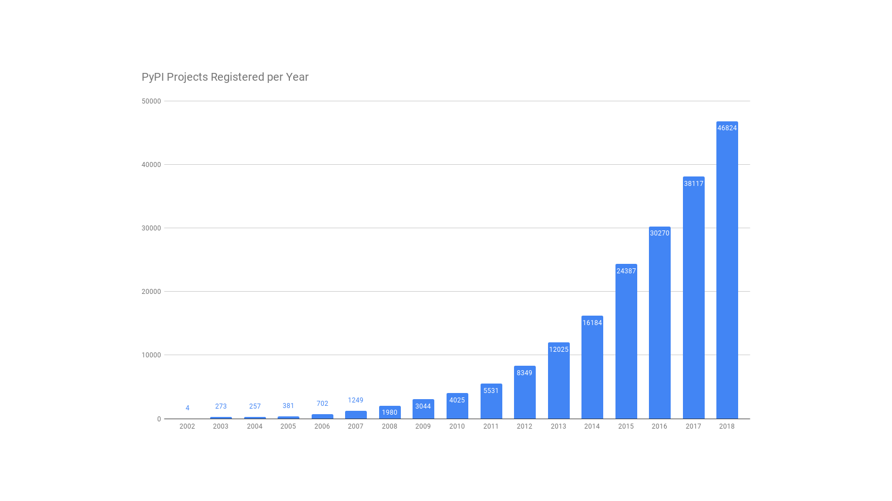

---

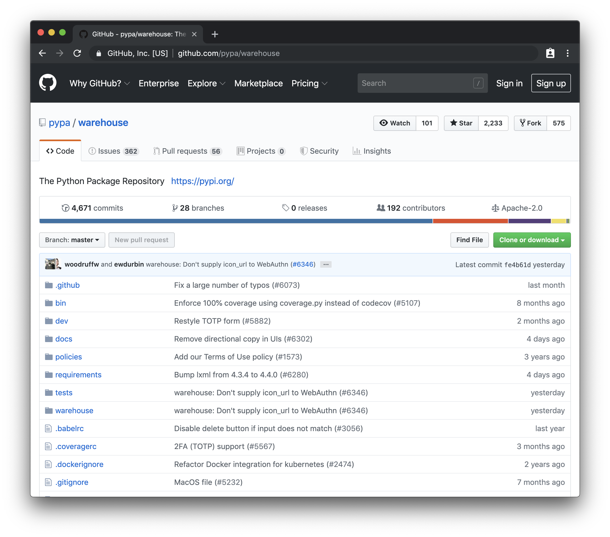

---

---

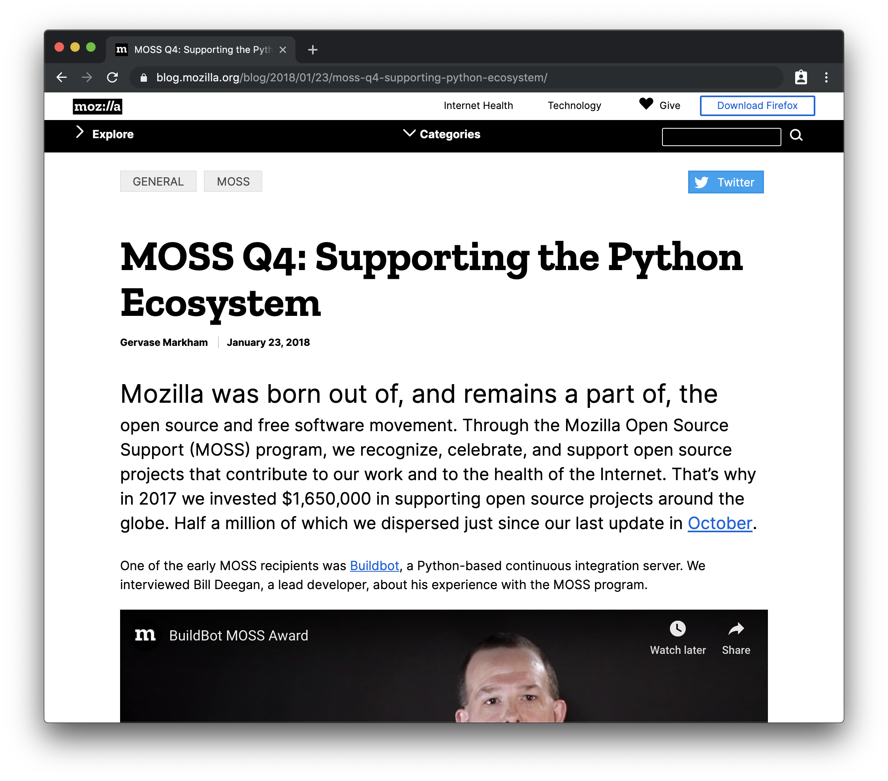

^ USD $170,000

^ 2 devs, 1 UI/UX, 1 PM

---

---

# *Financial sustainability*

## Mozilla Open Source Support

### Amount: USD $170,000 Goal: full-stack rewrite & launch Status: Finished, April 2018

---

---

---

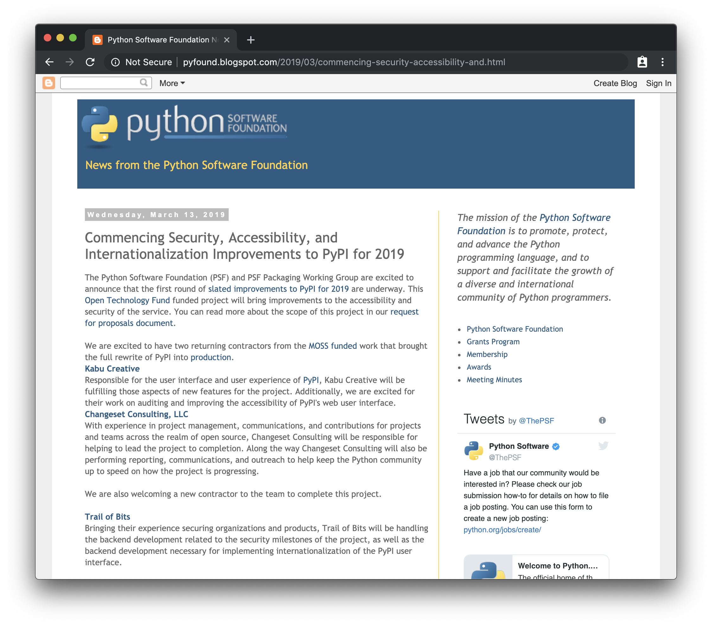

---

# *Financial sustainability*

## Open Technology Fund

### Amount: USD $80,000 Goal: security & accessibility & launch Status: Almost finished

---

---

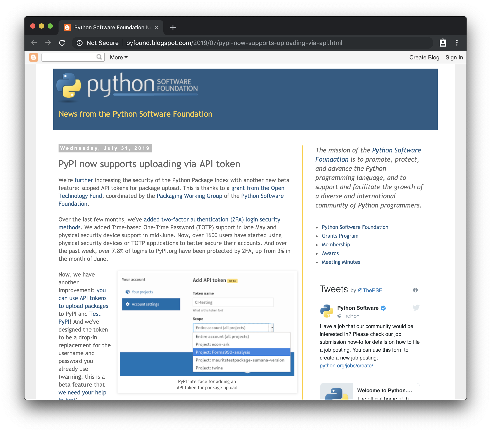

---

# *Financial sustainability*

## Facebook Award

### Amount: USD $100,000 Goal: cryptographic package signing & launch Status: Not yet started

---

# *Financial sustainability*

## <insert future award here>

---

# [fit] *More*
# [fit] *sustainability?*
# [fit]   
# [fit]   

---

# [fit] *A*
# [fit] *for-profit*
# [fit] *PyPI?*

---

# *A for-profit PyPI?*

## - private repositories - support for on-site mirrors - custom badges for PRO users - auction off the best package names to the highest bidder

---

# *A for-profit PyPI?*

## Challenge: our non-profit status

---

# *A for-profit PyPI?*

## Challenge: our donated services

---

# *A for-profit PyPI?*

## Challenge: the current ecosystem

^ bandersnatch, devpi

---

# *A for-profit PyPI?*

## Challenge: our volunteers

^ don't want to work for free for for-profit

---

# *A for-profit PyPI?*

## Challenge: the transition

^ pycon

---

---

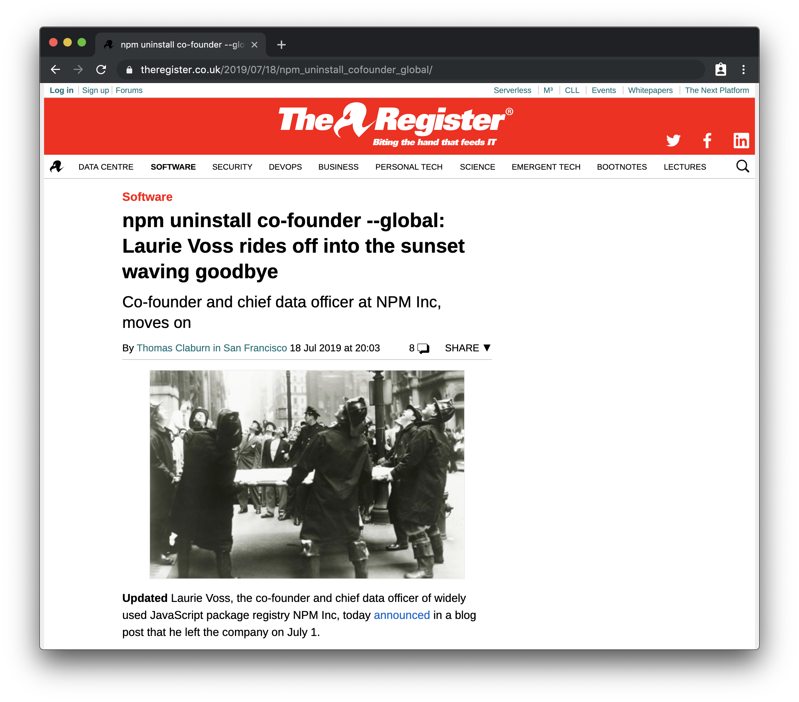

---

# *More sustainability?*

## Donate

---

# *More sustainability?*

## Donate your money:

### <https://www.python.org/psf/donations>

---

# *More sustainability?*

## Donate your time:

### <https://github.com/pypa/warehouse>

---

---

[.hide-footer]

# *Thanks!*
##  @di_codes

<!--

* pip is going to do this and that, look at the cache
* but at some point it's going to decide it doesn't have the source code you want

* and that's where PyPI comes in

* How PyPI works, architecturly ( mins)
    * What happens when you type "pip install ..."
    * PyPI Legacy vs Warehouse
    * A modern Python codebase
    * Handling traffic at scale
* How PyPI works, organizationally ( mins)
    * Administrators
    * Maintainers
    * Moderators
    * Volunteers
    * Contributors
* How PyPI works, financially ( mins)
    * Non-profit status, PSF sponsorship
    * In-kind donations from sponsors
    * Contributions from individual donors

* pip knows the URL for PyPI
* simple API
* package

* pypi used to not be behind a CDN

https://dustingram.com/articles/2019/04/02/pypi-as-a-service/

*

Most of us have installed a Python package, but do we know what it takes to make that work in a consistent, reliable way?

Unlike some other languages, Python has a centralized repository for third-party Python packages. Also unlike some other languages, this repository, the Python Package Index, is entirely supported by the community and operated by the non-profit Python Software Foundation.

In this talk, we'll discuss why we have the PyPI we all know and love, and why the current status quo is preferred.  We'll go a bit into how PyPI works, both from a technical perspective, and from the perspective as an open-source and non-profit project.

Finally, we'll have a call to action to help improve, and more importantly sustain, this critical piece of Python infrastructure.

# Audience

This talk is for any Pythonista that has installed a package before (read: everyone).

After watching this talk, attendees should have a better idea of how the infrastructure they depend on works, and why it is so important

# Outline

* Introduction ( mins)
* A call to action ( mins)
* Conclusion ( mins)

-->
