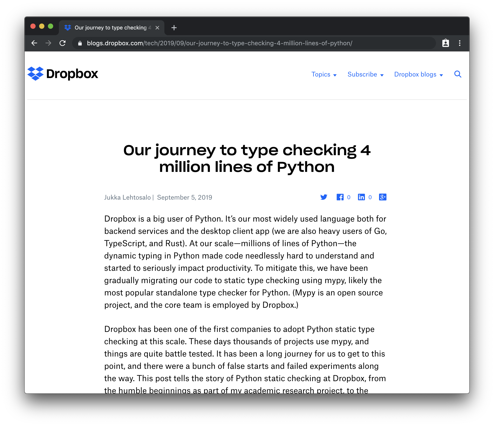
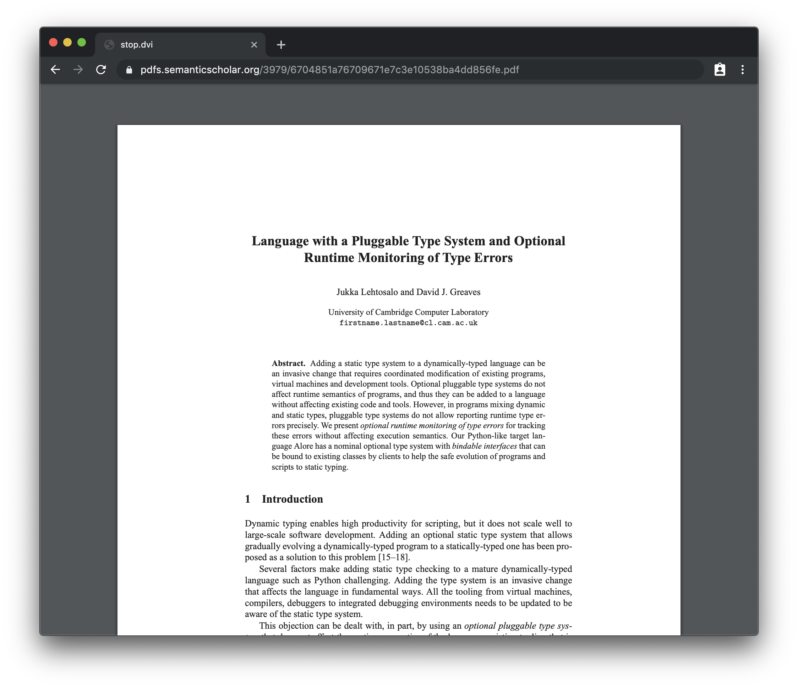
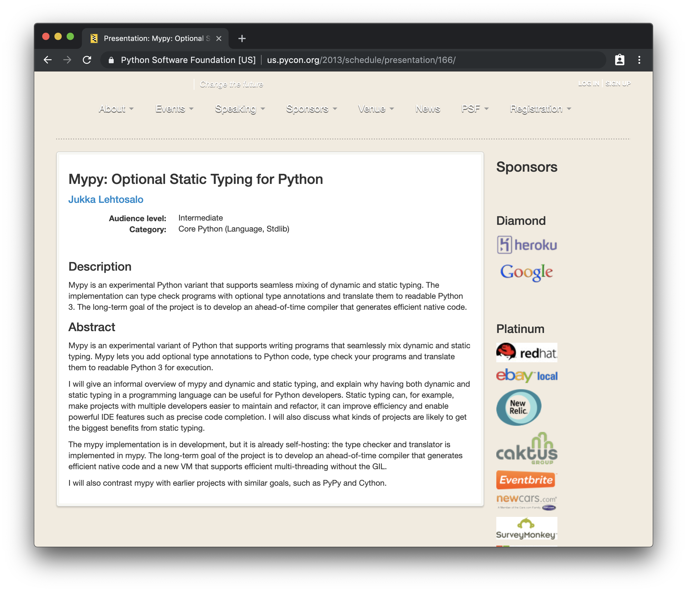
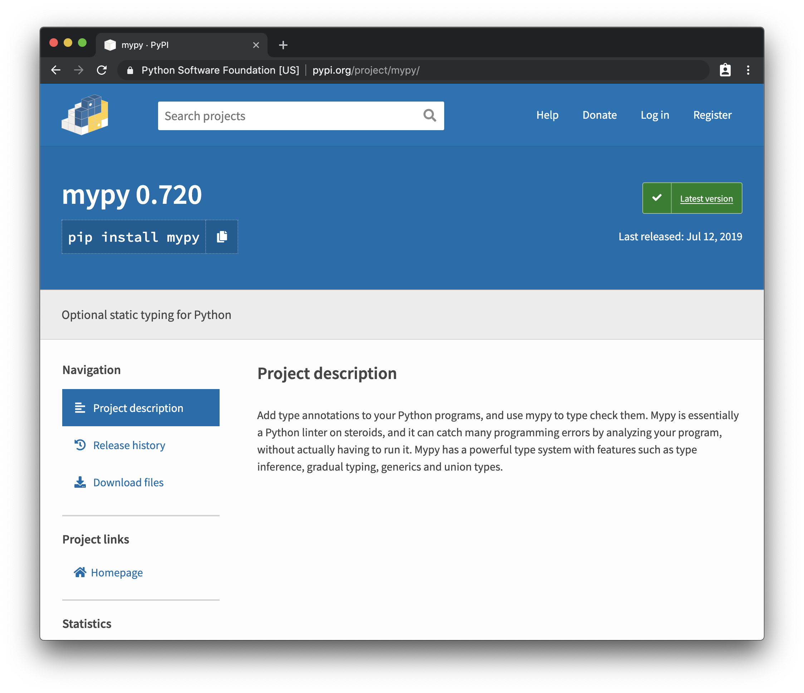
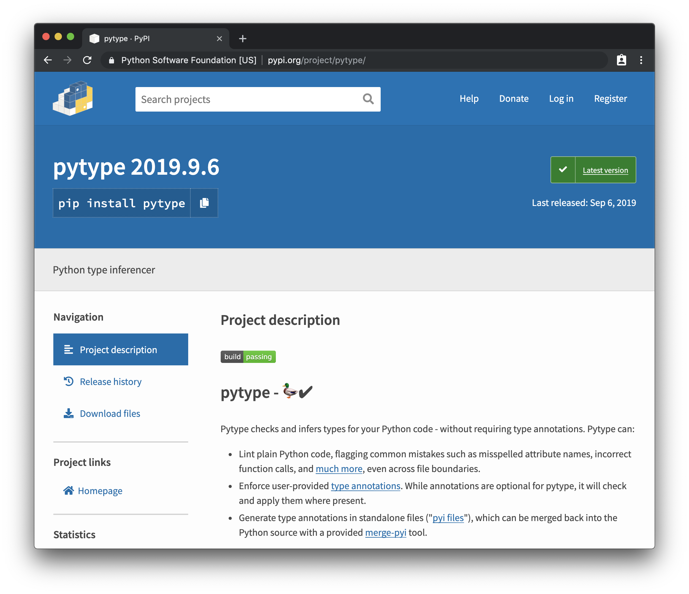
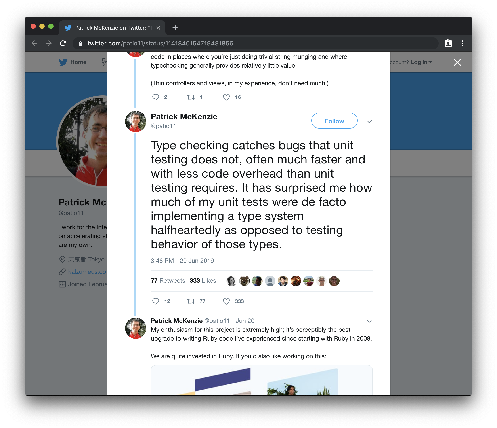
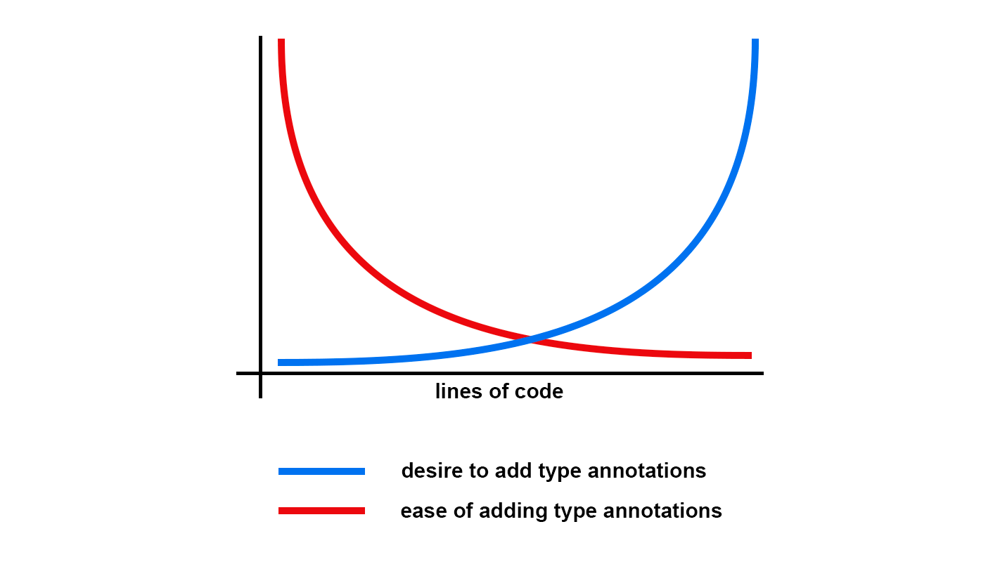
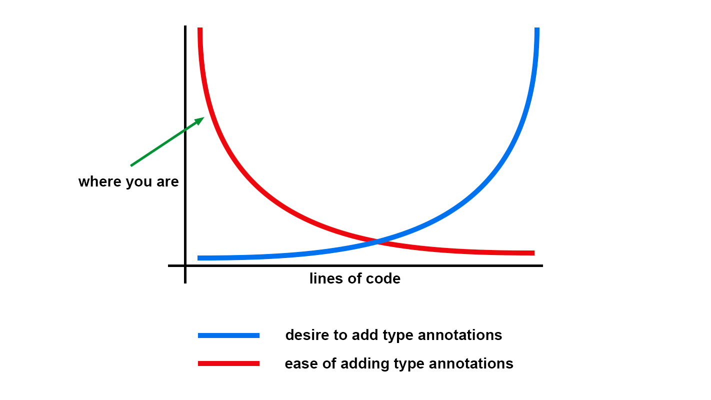
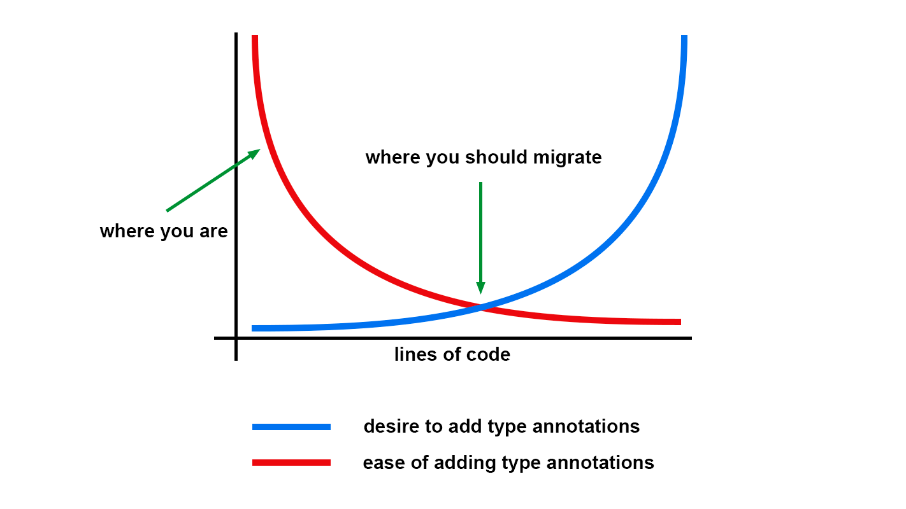
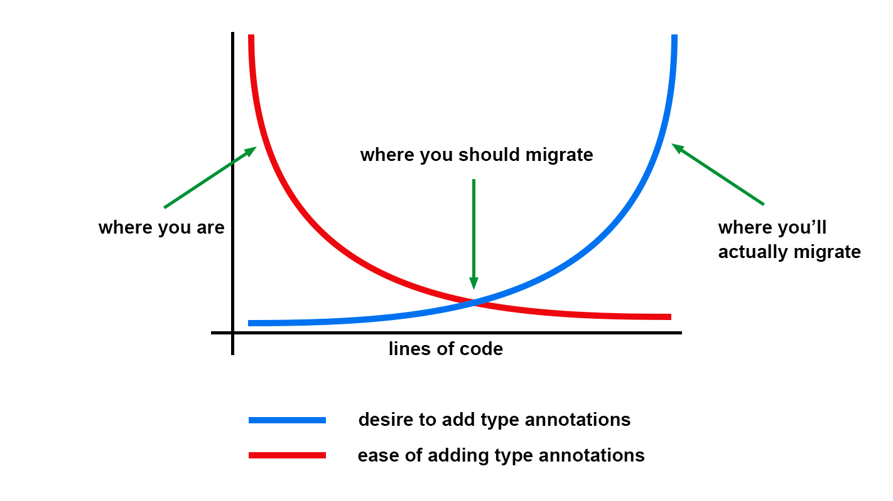

theme: Huerta, 2
<!--footer:  @di_codes-->
[.code: auto(42)]

# *Static Typing in Python*
## PyConDE 2019

^ PyConDE: also change below

^ Note: Converted to 4:3!

---


# [fit] *Hi, I'm Dustin*

---

# *Hi, I'm Dustin*

* Developer Advocate @ Google
* PyTexas ([pytexas.org](https://pytexas.org))
  * Austin, TX, May 16-17th 2020
* Python Package Index ([pypi.org](https://pypi.org>))

---

# Quick PyPI update

* Two-Factor Authentication (2FA) 🎉
  * TOTP and WebAuthN
* Accessibility audit (and fixes) 🎉
* Localization 🎉
  * We need your help!

---


[.hide-footer]

---

# Pop quiz:
## Is Python *dynamically* or *statically* typed?

---

# Answer:
## Dynamically typed... but can optionally be statically typed.

^ Python can be as statically typed as you want it to be.

^ That answer might not make sense to you, and that's OK

---

# Steps to understand that:
* Types in Python
* Type systems in general
* Dynamic typing in Python
* Static typing in Python

---

# Once we understand that:
* How to use static typing
* When you should use static typing
* When you _shouldn't_ use static typing

---

## Let's talk about
# types (and `type`)

---

```python
>>> type(42)
<cl​ass 'int'>
```

---

```python
>>> type(42)
<cl​ass 'int'>
>>> type(42.0)
<cl​ass 'float'>
```

---

```python
>>> type(42)
<cl​ass 'int'>
>>> type(42.0)
<cl​ass 'float'>
>>> type('foo')
<cl​ass 'str'>
```

---

```python
>>> type(42)
<cl​ass 'int'>
>>> type(42.0)
<cl​ass 'float'>
>>> type('foo')
<cl​ass 'str'>
>>> type(['foo', 'bar'])
<cl​ass 'list'>
```

^ oh I recognize these, these are builtins that I can change types with

---

```python
>>> a = 42
42
```

^ when we assign variables to these values, we say they are that type

---


```python
>>> a = 42
42
>>> float(42)
42.0
```

^ and we can use these builtins to convert or cast from one type to another

---


```python
>>> a = 42
42
>>> float(42)
42.0
>>> str(float(42))
'42.0'
```

---


```python
>>> a = 42
42
>>> float(42)
42.0
>>> str(float(42))
'42.0'
>>> list(str(float(42)))
['4', '2', '.', '0']
```

^ who's had a weird bug where a string accidentally got turned into a list?

^ guess what: that's a type error! you're in the right place

---

```python
>>> type(42) is int
True
>>> int
<cl​ass 'int'>
>>> isinstance(42, int)
True
```

^ it would seem like these are the types available to us

^ but these are just classes that have corresponding builtins

^ basically we're doing class matching


---

```python
>>> type(None)
<cl​ass 'NoneType'>
>>> def func():
...     pass
...
>>> type(func)
<cl​ass 'function'>
>>> type(...)
<cl​ass 'ellipsis'>
```

^ there are other "type" classes as well, that don't correspond directly to builtins

---
```python
>>> import types
```

---

```python
>>> import types
>>> dir(types)
['AsyncGeneratorType', 'BuiltinFunctionType',
'BuiltinMethodType', 'ClassMethodDescriptorType',
'CodeType', 'CoroutineType', 'DynamicClassAttribute',
'FrameType', 'FunctionType', 'GeneratorType',
'GetSetDescriptorType', 'LambdaType',
'MappingProxyType', 'MemberDescriptorType',
'MethodDescriptorType', 'MethodType',
'MethodWrapperType', 'ModuleType', 'SimpleNamespace',
'TracebackType', 'WrapperDescriptorType',
...
```

^ many of them live in the types module

^ all these can actually be used to instantiate a new
type

^ for example: a function. but we don't do that for a good reason: it's really messy

---

# Dynamic typing
## Variables can be _any_ type

^ when we say python is a dynamically typed language

---

```python
>>> import random
>>> a = random.choice([42, 42.0, '42'])
>>> type(a)
```

^ what type is a?

---

```python
>>> import random
>>> a = random.choice([42, 42.0, '42'])
>>> type(a)  # Could be str, int, float
```

---

# Dynamic typing
## Arguments and return values of functions can be _any_ type

^ same is true for function arguments and return values

---

```python
def frobnicate(a, b, c):
    "Frobnicates the bizbaz"
    return a + b + c
```

^ In python, when we write a function like this, how do we know that we're getting the types we're expecting?

^ if you saw this function and didn't know what it does

^ what would you expect the argument and return types to be?

---

```python
>>> def frobnicate(a, b, c):
...     return a + b + c
```

^ you might guess they're integers

---


```python
>>> def frobnicate(a, b, c):
...     return a + b + c
>>> frobnicate(1, 2, 3)
6
```

^ sure that would work

---

```python
>>> def frobnicate(a, b, c):
...     return a + b + c
>>> frobnicate(1, 2, 3)
6
>>> frobnicate('hi', ' ', 'there')
'hi there'
```

^ so would strings, and lists, and anything else that supports the addition operator

---

```python
>>> def frobnicate(a, b, c):
...     return a + b + c
>>> frobnicate(1, 2, 3)
6
>>> frobnicate('hi', ' ', 'there')
'hi there'
>>> frobnicate(1, 2, 'foo')
Traceback (most recent call last):
  File "<stdin>", line 1, in <module>
  File "<stdin>", line 1, in frobnicate
TypeError: unsupported operand type(s)
for +: 'int' and 'str'
```

^ but we couldn't mix integers and strings together

^ ok, so that's confusing, how would we fix it?


---

```python
def frobnicate(a, b, c):
    """Frobnicates the bizbaz

    Args:
        a (int): The first parameter.
        b (int): The second parameter.
        c (int): The third parameter.

    Returns:
        int: The bizbaz
    """
    return a + b + c
```

^ sometimes we do this

^ who does this, I don't

^ are they paying you enough to do this?

---

```python
def frobnicate(a, b, c):
    "Frobnicates the bizbaz"
    assert type(a) is int
    assert type(b) is int
    assert type(c) is int
    bizbaz = a + b + c
    assert type(bizbaz) is int
    return bizbaz
```

^ we don't do this

^ what do we do instead?

---

# Duck typing
## If it walks like a duck and it quacks like a duck...

^ instead we rely on what we call duck typing

---

```python
foo = [f(x) for x in bar]

foo = bar > 0

foo = bar(...)
```

^ in each of these you can kinda guess what bar is based on what's being done with it

^ but it's ambiguous: in the last one, is bar a function or a class? what is foo?

^ could be anything

---

# Static typing
## As in, defined and not changing

^ there are lots of statically typed languages

^ here are some examples of the same function in them

---

```c
int frobnicate(int a, int b, int c) {
    return a + b + c;
}
```

^ anyone know?

^ c

---

```java
public static int frobnicate(int a, int b, int c) {
    return a + b + c;
}
```

^ java

---

```rust
fn frobnicate(a: u8, b: u8, c: u8) -> u8 {
    return a + b + c;
}
```

^ rust, with fine-grain control of integer type

---

```typescript
function frobnicate(a: number, b: number, c:number): number {
    return a + b + c;
}
```

^ typescript

^ dead giveaway because all numbers in JS are the same

---

| Dynamic      | Static  |
| ------------ | ------- |
| • Python     | • C/C++ |
| • Ruby       | • Rust  |
| • Clojure    | • Java  |
| • JavaScript | • TypeScript |

---


| Dynamic      | Static  |
| ------------ | ------- |
| • Python[^*] | • C/C++ |
| • Ruby       | • Rust  |
| • Clojure    | • Java  |
| • JavaScript | • TypeScript |

[^*]: Kinda.

^ going to add an asterisk for Python

^ technically ruby is going to get optional type checking when Ruby 3 comes out in December 2020

---

# Python is dynamically typed
## But can optionally be statically typed

^ earlier I said:

^ this wasn't always true

---



^ the story of static typing in python is the story of static typing at dropbox

^ but there were some things that led up to it

[.hide-footer]

---

# PEP 3107
## Function Annotations

^ 2006, python 3

---

```python
def frobnicate(a, b, c):
    "Frobnicates the bizbaz"
    return a + b + c
```

^ allows us to take a function like this

---

```python
def frobnicate(a: 'x', b: 5 + 6, c: []) -> max(2, 9):
    "Frobnicates the bizbaz"
    return a + b + c
```

^ and add any metadata we want to annotate the arguments and return value

^ this has zero effect on the execution of the function

---

```python
>>> def frob(a: 'x', b: 5 + 6, c: []) -> max(2, 9):
...     return a + b + c
...
>>> frob.__annotations__
{'a': 'x', 'b': 11, 'c': [], 'return': 9}
```

^ anything compiling this function has access to the annotations

---

### • Providing typing information
###   • Type checking
###   • Let IDEs show what types a function expects/returns
###   • Function overloading / generic functions
###   • Foreign-language bridges
###   • Adaptation
###   • Predicate logic functions
###   • Database query mapping
###   • RPC parameter marshaling
### <br>
### • Other information
###   • Documentation for parameters and return values

^ the PEP listed a lot of uses

^ they all basically boil down to "typing"

---

```python
>>> def frobnicate(a: int, b: int, c: int) -> int:
...     return a + b + c
...
>>> frobnicate.__annotations__
{'a': int, 'b': int, 'c': int, 'return': int}
```

^ this allows us to write a function like this

^ but it doesn't give us a way to actually evaluate whether this function is being used correctly elsewhere

^ also doesn't give us any way to annotate variables, just functions

---

# Jukka Lehtosalo
## University of Cambridge

^ you-kah leck-ta-sah-low

^ PhD research

---

# Unification
## Of statically typed and dynamically typed languages

---

# Using the same language
## For tiny scripts and sprawling, multi-million line codebases

---

# Gradual growth
## from an untyped prototype to a statically typed product

^ you don't have to do it all at once

---



[.hide-footer]

^ 2011

---

_"Adding a static type system to a dynamically-typed language can be an invasive change that requires coordinated modification of existing programs, virtual machines and development tools."_
>
-- Jukka Lehtosalo

---

_"Optional pluggable type systems do not affect runtime semantics of programs, and thus they can be added to a language without affecting existing code and tools."_
>
-- Jukka Lehtosalo

^ this sounds great

---



[.hide-footer]

^ 2013, introducing mypy

---

_"Mypy is an experimental variant of Python that supports writing programs that seamlessly mix dynamic and static typing."_
>
-- Jukka Lehtosalo

^ This is not really true when we talk about mypy today

^ in his research, he didn't even use an existing language to determine how to do this

^ he created his own instead, which isn't that crazy for theoretical research

---

```python
int fib(int n):
    if n <= 1:
        return n
    else:
        return fib(n - 1) + fib(n - 2)
```

^ this is what the variant looked like, it could be compiled to Python

^ the issue was that even with function annotations, Python couldn't support everything necessary to be statically typed itself

---

_"I eventually presented my project at the PyCon 2013 conference in Santa Clara, and I chatted about it with Guido van Rossum, the BDFL of Python. He convinced me to drop the custom syntax and stick to straight Python 3 syntax."_
>
-- Jukka Lehtosalo

^ Mypy also included a type checker for this Python variant, which was modified to check Python instead, and that's what we think of mypy as today

---

# PEP 483
## The Theory of Type Hints

^ 2014

^ some ideas about how static typing should work in Python

---

# Optional typing
## Only gets in your way if you want it to get in your way

^ adding annotations shouldn't affect the runtime

^ an annotated function should run the same as an un-annotated function

^ lessons learned from the python 2-3 migration

---

# Gradual typing
## Let's not try to do this all at once
## <br>


^ Gradual typing allows one to annotate only part of a program, thus leverage desirable aspects of both dynamic and static typing.

---

# Variable annotations
## For annotating more than just functions

^ building on PEP 3107

---

```python
def frobnicate(a: int, b: int, c: int) -> int:
    bizbaz = a + b + c
    return bizbaz
```

---

```python
def frobnicate(a: int, b: int, c: int) -> int:
    bizbaz = a + b + c  # type: int
    return bizbaz
```

---

# Type hinting for Python 2
## Because even those stuck in the past deserve static typing

^ because function annotations didn't exist before Python 3

---

```python
# Python 3
def frobnicate(a: int, b: int, c: int) -> int:
    return a + b + c

# Python 2
def frobnicate(a, b, c):
    # type: (int, int, int) -> int
    return a + b + c
```

---

# Special type constructs
## Fundamental building blocks we need to do static typing

^ introduced some

---

### • Existing types: `int`, `float`, `str`, `NoneType`, etc.
### <br>
### • New types: (`from typing import ...`)
###   • `Any`
###   • `Union[t1, t2, ...]`
###   • `Optional[t1]`
###   • `Tuple[t1, t2, ...]`
###   • `Callable[[t1, t2, ...], tr]`

---

```python
def frobnicate(
    a: int, b: int, c: Union[int, float]
) -> Union[int, float]:
    return a + b + c
```

^ Once we have these special type constructs we can do things like this

---

# Container types
## For defining types inside container classes

^ container classes are things like lists and dictionaries

---

```python
users = []  # type: List[int]
users.append(42)  # OK
users.append('Some Guy')  # fails

examples = {}  # type: Dict[str, int]
examples['Some Guy'] = 42  # OK
examples[2] = None  # fails
```

---

# Generic types
## For when a class or function behaves in a generic manner

---

```python
from typing import Iterable

class Task:
    ...

def work(todo_list: Iterable[Task]) -> None:
    ...
```

^ Here Iterable is a generic type that takes a concrete type Task and returns a concrete type Iterable[Task].

^ I called the class "task" here a "concrete type" - pep 483 also defines the relationship between classes and types

---

# Type aliases
## To be more succinct

---

```python
from typing import Union
from decimal import Decimal

Number = Union[int, float, complex, Decimal]

def frob(a: Number, b: Number, c: Number) -> Number:
    "Frobnicates the bizbaz"
    return a + b + c
```

^ finally, we can define type aliases by using Union

^ so if we wanted to be more like javascript...

---

# PEP 484
## Type Hints

^ 2014

^ standardizes everything in PEP 483, and mypy's behavior

^ introduces the typing module to provide standard definitions, fundamental building blocks and tools

^ introduces a lot of details about edge cases and specific use cases

^ essentially "how to build a type checker"

^ leans heavily on what mypy's checker is already doing

---

# Python 3.5
## Released: September 13, 2015

^ with PEP 484 support, and the typing module

---

# PEP 526
## Syntax for Variable Annotations

^ 2016, kinda janky

^ great for Python 2, not great elsewhere

---

```python
# 'primes' is a list of integers
primes = []  # type: List[int]

# 'captain' is a string (initial value is
# a problem!)
captain = ...  # type: str

class Starship:
    # 'stats' is a class variable
    stats = {}  # type: Dict[str, int]
```

^ pep 526

---

```python
# 'primes' is a list of integers
primes: List[int] = []

# 'captain' is a string (initial value is
# a problem!)
captain = ...  # type: str

class Starship:
    # 'stats' is a class variable
    stats = {}  # type: Dict[str, int]
```

---

```python
# 'primes' is a list of integers
primes: List[int] = []

# 'captain' is a string
captain: str  # Note: no initial value!

class Starship:
    # 'stats' is a class variable
    stats = {}  # type: Dict[str, int]
```

---

```python
# 'primes' is a list of integers
primes: List[int] = []

# 'captain' is a string
captain: str  # Note: no initial value!

class Starship:
    # 'stats' is a class variable
    stats: ClassVar[Dict[str, int]] = {}
```

---

# Python 3.6
## Released: December 23, 2016

^ with PEP 526 support

^ almost had everything

---

# Type checkers
## Static vs. dynamic

^ the last piece of the puzzle

^ static doesn't actually run your code

^ dynamic would check types while your application is running

---



[.hide-footer]

^ by this point mypy had transitioned from a "python variant" to a type checker

^ that was available on PyPI

---

```
$ pip install mypy
...

$ cat frob.py
def frobnicate(a: int, b: int, c: int) -> int:
    return a + b + c

frobnicate('hi', ' ', 'there')

$ mypy frob.py
frob.py:4: error: Argument 1 to "frobnicate" has incompatible type
"str"; expected "int"
frob.py:4: error: Argument 2 to "frobnicate" has incompatible type
"str"; expected "int"
frob.py:4: error: Argument 3 to "frobnicate" has incompatible type
"str"; expected "int"
```

^ example of running it

^ there are a bunch of type checkers besides mypy

---

### • Static
###   • `mypy` (Dropbox)
###   • `pytype` (Google)
###   • `pyre` (Facebook)
###   • `pyright` (Microsoft)
###   • PyCharm, `$YOUR_EDITOR`
### <br>
### • Dynamic
###   • `enforce`, `typeguard`, `typo`, `ducktype`, `strictconf`, etc.

^ at this point there are several, these all support PEP 484

^ there are also others that don't support the PEP 484 spec

^ disclaimer, I work at google

---



[.hide-footer]

^ also available from PyPI

^ inevitable question: if they all support PEP 484,
what's the difference

---

# Differences between `mypy` and `pytype`
## Cross-function inference, runtime lenience

---

```python
# example.py

def f():
    return "PyConDE"

def g():
    return f() + 2019

g()
```

^ cross-function inference, un-annotated

---

```
$ python example.py
Traceback (most recent call last):
  File "example.py", line 5, in <module>
    g()
  File "example.py", line 4, in g
    return f() + 2019
TypeError: can only concatenate str (not "int") to str
```

---

```
$ mypy example.py


                                                                 
```

---
```
$ mypy example.py

$


                                                                 
```

---

```
$ mypy example.py

$ pytype example.py


                                                                 
```

---

```
$ mypy example.py

$ pytype example.py
Computing dependencies
Analyzing 1 sources with 0 local dependencies
[1/1] check test
FAILED: /tmp/.pytype/pyi/example.pyi pytype-single --imports_info
/tmp/.pytype/imports/test.imports --module-name test -V 3.7 -o
/tmp/.pytype/pyi/test.pyi --analyze-annotated --nofail --quick
/tmp/example.py
File "/tmp/example.py", line 4, in g: unsupported operand type(s)
for +: 'str' and 'int' [unsupported-operands]
  Function __add__ on str expects str

For more details, see
https://google.github.io/pytype/errors.html#unsupported-operands.
```

---

```python
# example.py

from typing import List

def f() -> List[str]:
    lst = ["PyConDE"]
    lst.append(2019)
    return [str(x) for x in lst]

print(f())
```

^ allows all operations that succeed at runtime and don't contradict annotations

^ totally valid, although might be confusing to mix

---

```
$ python example.py
['PyConDE', '2019']
```

---

```
$ pytype example.py
Computing dependencies
Analyzing 1 sources with 0 local dependencies
ninja: Entering directory `/private/tmp/.pytype'
[1/1] check example
Success: no errors found

```

---

```
$ pytype example.py
Computing dependencies
Analyzing 1 sources with 0 local dependencies
ninja: Entering directory `/private/tmp/.pytype'
[1/1] check example
Success: no errors found

$ mypy example.py
example.py:7: error: Argument 1 to "append" of "list"
has incompatible type "int"; expected "str"
```

^ does type inference inside the function

---

# y tho
## When (and why) we should use static typing

---

# When you _shouldn't_ use static typing
## Basically never

---

# Static typing:
## Not a replacement for unit tests

---



[.hide-footer]

^ there is somewhat of an argument here, because unit tests are kind of just a bad type system

^ really, you probably need both

---

# When you _should_ use static typing
## Basically as much as possible

---

## Use static typing:
# When you're millions-of-lines scale

---

_"At our scale—millions of lines of Python—the dynamic typing in Python made code needlessly hard to understand and started to seriously impact productivity."_
>
-- Jukka Lehtosalo

^ dropbox, google, facebook, etc have all invested a lot of money in the work that was done here

^ lack of static typing is a serious liability for Python at scale

---



^ the time to start is not when you're the size of dropbox or google

---



---



---



---

## Use static typing:
# When your code is confusing

^ let's be honest, we're all writing confusing code

^ "annotations are machine-verified documentation"

^ if you feel the need to document the input/output types of a function you're writing

^ it should probably just be statically typed

---

## Use static typing:
# When your code is for public consumption

^ e.g., a PyPI module

^ adding type annotations helps developers know how to use your APIs, and helps IDEs know how to consume your APIS

^ also, if your users are already using static typing, they will love you

---

## Use static typing:
# Before migrating or refactoring

---

## Use static typing:
# To experiment with static typing

^ it doesn't hurt

---

# How to use static typing in Python
## In just _five_ easy steps!

---

1. Migrate to Python >= 3.6 (optional)

^ you can do type comments in any version, but you should probably migrate anyways, let's be honest

---

1. Migrate to Python >= 3.6 (optional)
2. Install a typechecker locally

^ and integrate it into your editor

---

1. Migrate to Python >= 3.6 (optional)
2. Install a typechecker locally
3. Start optionally typing your codebase

^ start with your hairiest files, or your easiest

^ don't try to do it all at once, remember: it's gradual for a reason

^ pick critical areas and start there

---

1. Migrate to Python >= 3.6 (optional)
2. Install a typechecker locally
3. Start optionally typing your codebase
4. Run a typechecker with your linting

^ and run linting in CI, you should do that anyways

---

1. Migrate to Python >= 3.6 (optional)
2. Install a typechecker locally
3. Start optionally typing your codebase
4. Run a typechecker with your linting
5. Convince all your coworkers to join you

^ if you need help convincing them, you can show them this talk on youtube

---

[.hide-footer]

# *Thanks!*
##  @di_codes


<!--

# Title

* Static Typing in Python

# Description

Python is well-known as a programming language without static types. This means that you don't need to say what a given variable will hold, or whether your function will return a string or an integer (or sometimes one, and sometimes another!). This has historically made Python a very flexible and beginner-friendly language.

In this talk, we'll discuss the advantages and disadvantages to a static type system, as well as recent efforts to introduce static typing to Python via optional "type hints" and various tools to aid in adding types to Python code. We'll see what this means for Python, for Python programmers, and what the future has in store for Python's type system.

# Audience

This talk is for Python programmers who either don't know what static typing is, don't know why why they might want it, or who do have some understanding, but aren't sure what benefits they might get by adding type annotations to their code.

Attendees should know that there is a distinction between typed and untyped code, and understand what some types (list, int, string, etc) are, but don't need to know exactly what static typing is or have direct experience with typed code.

After watching this talk, attendees should understand that Python is untyped by default but can be typed. They should understand the class of problems that adding type annotations seeks to alleviate, and some tools they can use to add and check type annotations.

# Outline

* About types ( min)
    * Types of type systems
    * Advantages of static typing
    * Disadvantages of static typing
* Types in other languages ( min)
    * C
    * Ruby
    * JavaScript
    * Go
* Types in Python ( min)
    * How Python did/does typing
    * The `type` function
    * PEP 484: Type Hints
    * The `typing` module
    * Tools
        * mypy
        * pytype
* The great benefits to static typing in Python ( min)
    * Static code analysis
    * More documentation
    * Code completion
* The disadvantages to static typing ( min)
* The challenges of static typing ( min)

# References
https://twitter.com/codinghorror/status/1141848007404425221?s=19
https://veekaybee.github.io/2019/07/08/python-type-hints/

-->
