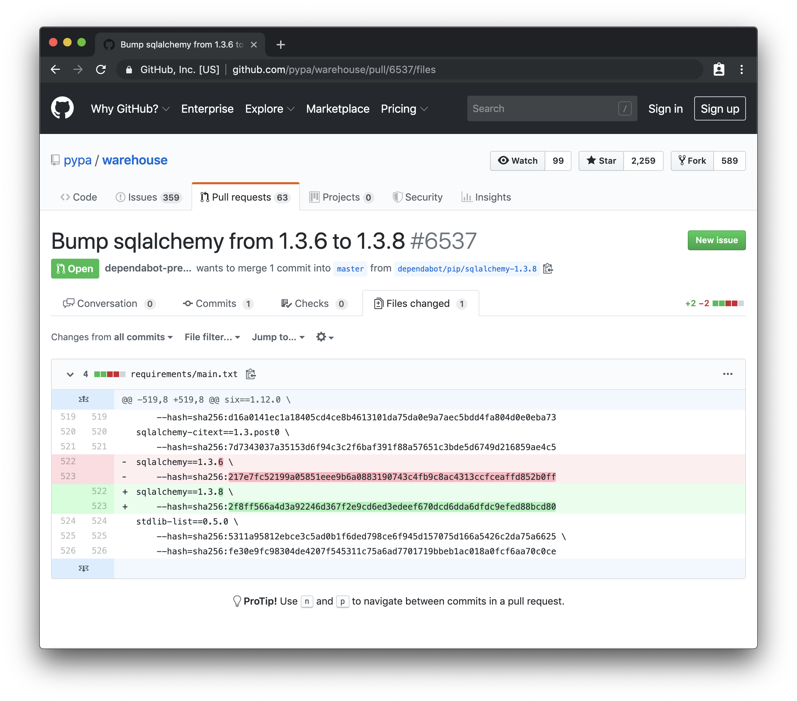
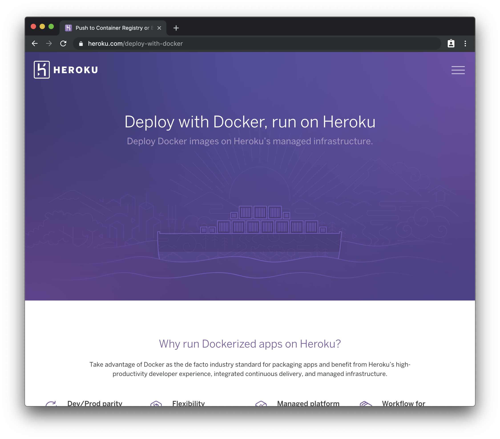

theme: Huerta, 2
footer:  @di_codes
[.code: auto(42)]

# *Modern development environments for Pythonistas*
## PyCon Latam 2019

---


# [fit] *Hi, I'm Dustin*

---

# *Hi, I'm Dustin*

* Developer Advocate @ Google
* PyTexas (Austin, TX, May 16-17th 2020)
* Python Package Index

---

# Python Package Index

* Critical piece of Python infrastructure
* About 75,000 lines of code
* Mix of Python/JS/CSS, multiple datastores

---

# Python Package Index

* Critical piece of Python infrastructure
* About 75,000 lines of code
* Mix of Python/JS/CSS, multiple datastores
* One of the best local development experiences I've ever seen

^ because it has 200+ contributors

^ because we've put a lot of effort into making it
good

^ i know this is true because I've seen some pretty
bad local development environments

---

# "Just follow the onboarding document..."

^ when getting set up for a new project

---

# "...let us know if you find any issues."

---

# "You'll need to install Python 3.x.y..."

---

# "...and also `openssl`, `xcode`, `gcc`, `pyenv`, `npm`, `node`, and `gulp`."

---

# "We've configured `flake8`, `pycodestyle`, and `pylint` to follow our code standard..."

---

# "...don't forget to run them and fix any linting errors before making a PR."

---

# "We broke the monolith up into individual repos..."

---

# "... which reference each other via git submodules."

---

# "There's a suite of 'integration' tests..."


---

# "...but they all use mocked out services."

---

# "We have a staging environment..."

---

# "...always deploy there first to make sure nothing's broken."

---

# It's 2019!
# <br>

## Don't let your development environment get stuck in 2009.

---

# Agenda

- Your development environment
- Your testing environment
- Dependency workflows
- Linting & autoformatting
- Going to prod

---

# What I'm _not_ going to talk about:
## Editors, operating systems, and other religious debates

^ deeply personal

^ your choice should have very little effect on that of your teammates

---

# What I _am_ going to talk about:
## Anything that's not code that you'd check into your repository

^ and lives alongside your code

---

# Caveat: "application" vs. "library"
## Trust me, there is a difference
## <br>

^ mostly going to focus on applications

^ assume a single version of Python, single platform

---

# Your development environment
## "But it works on my machine"
## <br>

---

# Your laptop is not production
## (and it never will be)
## <br>

---

# Literally anything can cause inconsistencies
## (and they will)
## <br>

---

* SSL certificates
* `/etc/hosts`
* differences in `openssl` providers
* global dependencies getting updated
* different Python versions
* machines set in different timezones

---

```
# requirements.txt
foo==1.0.0
bar==0.9.9
```

^ here's something that happens all the time

^ application has these dependencies

---

```
$ pip install -r requirements.txt
Collecting foo (from -r requirements.txt (line 1))
(1.0.0)
...
Collecting bar (from -r requirements.txt (line 2))
(0.9.9)
...
Successfully installed foo-1.0.0 bar-0.9.9
```

^ so you install them to run them locally: good.

---

```
$ pip freeze
foo==1.0.0
bar==0.9.9
```

^ and they get installed correctly: good

---

# "Check out
# [fit] $UNRELATED_LIBRARY!"
## <br>
## <br>

^ but then one of your coworkers comes along

---

```
$ pip install $UNRELATED_LIBRARY
Collecting $UNRELATED_LIBRARY
...
Collecting bar>=1.0.0 (from $UNRELATED_LIBRARY)
...
Successfully installed $UNRELATED_LIBRARY bar-1.0.0
```

^ you install it but little did you know that it requires newer bar

---

```
$ pip freeze
foo==1.0.0
bar==1.0.0
$UNRELATED_LIBRARY==1.0.0
```

^ surprise upgrade

^ now you have newer bar in your environment

^ could cause a mess of issues, hard to figure out

---

# "But that doesn't affect me!"
## "I _always_ use virtual environments."

---

# Do you also _always_ deactivate?
## (probably not)
## <br>

---

# Virtual envs only isolate Python
## Platform-level stuff is still shared
## <br>

---

# Virtual environments are good
## But they're not enough
## <br>

---

# What if we could fully
# [fit] isolate environments?
##### <br>
## And, a given environment was _reproducible_?

^ meaning you and your coworker could use the exact same environment

---

# And it was the same on all platforms?
## No difference between Windows, macOS, Linux

^ and it didn't matter what platform they were on

---

# News flash:
# This is Docker
## Also called "containerization"
## <br>

---


^ docker provides many base images

^ imagine these as a snapshot of an environment

---

```
$ docker run -it python
```

^ if I have docker installed I can run

---


```
$ docker run -it python
Python 3.7.4 (default, Aug 14 2019, 12:09:51)
[GCC 8.3.0] on linux
Type "help", "copyright", "credits" or "license"
for more information.
>>>
```

^ gives me a python REPL inside the container


---

```
$ docker run -it python bash
root@c85486e091c8:/#
```

^ I can also run arbitrary commands in this container, like bash, which gives me a shell

---

```
$ docker run -it python bash
root@c85486e091c8:/# pip freeze
root@c85486e091c8:/#
```

^ You can see that this environment is pristine, nothing installed


---

```
$ docker run -it python bash
root@c85486e091c8:/# pip freeze
root@c85486e091c8:/# pip install flask
Collecting flask
...
Successfully installed Jinja2-2.10.1 MarkupSafe-1.1.1
Werkzeug-0.15.5 click-7.0 flask-1.1.1
itsdangerous-1.1.0
root@c85486e091c8:/#
```

^ of course, you can install anything you want

---

```
$ docker run -it python bash
root@c85486e091c8:/# pip freeze
root@c85486e091c8:/# pip install flask
Collecting flask
...
Successfully installed Jinja2-2.10.1 MarkupSafe-1.1.1
Werkzeug-0.15.5 click-7.0 flask-1.1.1
itsdangerous-1.1.0
root@c85486e091c8:/# pip freeze
Click==7.0
Flask==1.1.1
...
```

^ and that will stick around as long as the session exists

---

```
$ docker run -it python bash
root@c85486e091c8:/# pip freeze
root@c85486e091c8:/#
```

^ But if I quit that (kill the container) and run it
again, flask is gone

---

# A container offers no persistence
## You can write to the filesystem, but it goes away

---

# The only way to change a container
## Is to create a new container that derives from it

---

```python
# app.py
from flask import Flask

app = Flask(__name__)

@app.route('/')
def hello():
    return 'Hello World!'
```

---

```python
# requirements.txt
flask
```

---

```Dockerfile
# Dockerfile
FROM python

COPY . .

RUN pip install -r requirements.txt
```

---

```
$ tree
.
├── Dockerfile
├── app.py
└── requirements.txt

0 directories, 3 files
```

---

```
$ docker build -t my_container .
Step 1/3 : FROM python
 ---> 60e318e4984a
Step 2/3 : COPY . .
 ---> 65d9fb3f795f
Step 3/3 : RUN pip install -r requirements.txt
 ---> Running in ea61bdcacc8d
Collecting flask (from -r requirements.txt (line 1))
...
Successfully installed ... flask-1.1.1 ...
 ---> 2a1feb5728c6
Successfully built 2a1feb5728c6
Successfully tagged my_container:latest
```

^ each time we mutate the base image, we get a new image

---

```
$ docker run -it my_container bash
root@46e7d8829aab:/#
```

^ we can run

---

```
$ docker run -it my_container bash
root@46e7d8829aab:/# pip freeze
Click==7.0
Flask==1.1.1
itsdangerous==1.1.0
Jinja2==2.10.1
MarkupSafe==1.1.1
Werkzeug==0.15.5
```

^ We've successfully produced a container with our dependencies in it

---

# What can we do with this?
## How about running our application locally?

^

---

# Docker is just a primitive here
## We shouldn't need to manually build/run/etc

---

# Docker Compose
# <br>
## a tool for defining and running Docker applications

^ also OK to use for single-container applications

---

```yaml
# docker-compose.yml
version: '3'
services:
  web:
    build: .
    ports:
      - "5000:5000"
    command: flask run --host=0.0.0.0
```

---

```
$ docker-compose up
Building web
Step 1/3 : FROM python
 ---> 60e318e4984a
Step 2/3 : COPY . .
 ---> 250dd705bbc3
Step 3/3 : RUN pip install -r requirements.txt
 ---> 3856cf3bc543
Successfully built 3856cf3bc543
Successfully tagged my_application_web:latest
Creating my_application_web_1 ... done
Attaching to my_application_web_1
web_1  |  * Environment: production
web_1  |  * Debug mode: off
web_1  |  * Running on http://0.0.0.0:5000/ (Press CTRL+C to quit)
```

---


---

```yaml
# docker-compose.yml
version: '3'
services:
  web:
    build: .
    ports:
      - "5000:5000"
    command: flask run --host=0.0.0.0
```

^ maybe you do need multiple containers

^ what about data storage?

---

```yaml
# docker-compose.yml
version: '3'
services:
  web:
    build: .
    ports:
      - "5000:5000"
    command: flask run --host=0.0.0.0
  cache:
    image: redis
```

^ maybe you need caching, and your app uses redis

---

```yaml
# docker-compose.yml
version: '3'
services:
  web:
    build: .
    ports:
      - "5000:5000"
    command: flask run --host=0.0.0.0
  cache:
    image: redis
  database:
    image: postgres
```

^ maybe you need relational data, and your app uses postgres


---

# An environment for your test suite
## Or linting, or whatever

---

```
$ docker-compose run web pytest
```

^ As simple as adding pytest (and some actual tests)

---

```Makefile
# Makefile
.build-success: Dockerfile requirements.txt
	docker-compose build web

	# Mark that we've made a build
	touch .build-success

serve: .build-success
	docker-compose up

tests: .build-success
	docker-compose run web pytest
```

^ makefiles

---

```
$ make tests
docker-compose run web pytest
================ test session starts =================
platform linux -- Python 3.7.4, pytest-5.1.1,
py-1.8.0, pluggy-0.12.0
rootdir: /
collected 1 item

test_app.py .                                  [100%]

============== 1 passed in 0.15s =====================
```

---

```
$ make serve
docker-compose up
Starting my_application_web_1 ... done
Attaching to my_application_web_1
web_1  |  * Environment: production
web_1  |  * Debug mode: off
web_1  |  * Running on http://0.0.0.0:5000/ (Press
CTRL+C to quit)
```

---

# Testing in the same environment
## Means there can be zero inconsistencies

^ you don't have one dependency in one and a different
one in another

---

# Testing in the same environment
## Means you can have true integration tests

^ use the databases or other containers as you need

---

# Compose abstracts away Docker
## You can write a single Dockerfile and reuse it

---

# `make` abstracts away Compose
## With commands that are simple and easy to remember

---

# Optimize for onboarding
## You may need to onboard yourself one day

^ and it improves the overall developer experience

---

# Your new onboarding doc:

1. Install Docker:
   <https://docs.docker.com/install/>
2. Run `docker-compose up`
3. Done!

^ here's your new onboarding document

---


# A modern workflow for dependencies

## Or, "how to never edit a `requirements.txt` file again"

---

# Have you done this?
# <br>
## `$ pip freeze > requirements.txt`
## <br>

---

# Don't do this:
# <br>
## `$ pip freeze > requirements.txt`
## <br>

---

```
$ pip install flask
...

$ pip freeze
Click==7.0
Flask==1.1.1
itsdangerous==1.1.0
Jinja2==2.10.1
MarkupSafe==1.1.1
Werkzeug==0.15.5
```

^ disadvantages: potentially get a ton of unrelated garbage

^ advantages: ?

---

# Version Pinning
# <br>
## Ensuring you don't get surprise-upgraded one day

---

# Managing subdependencies
## Ensuring they get installed and are also pinned

^ but you don't want to have to think about this

---

# Two birds, one stone:
# <br>
## `$ pip install pip-tools`
## <br>

^ extra tools on top of pip

---

```
# requirements.in
flask
```

^ this is where you declare top-level dependencies

---

```
$ pip-compile requirements.in
#
# This file is autogenerated by pip-compile
# To update, run:
#
#    pip-compile requirements.in
#
click==7.0                # via flask
flask==1.1.1
itsdangerous==1.1.0       # via flask
jinja2==2.10.1            # via flask
markupsafe==1.1.1         # via jinja2
werkzeug==0.15.5          # via flask
```

^ pins all versions

^ includes all subdependencies

^ even tells you where your subdependencies come from

^ you never have to touch this file

---

# Pinning & compiling

## Only gets you 90% of the way there

---


---


---


---


---

# Artifact hashing
# <br>

## Making sure what you got is what you want

---


---

# Artifact hashing
# <br>

## [fit] `pip install --require-hashes -r requirements.txt`
## <br>

---

```
# requirements.txt
flask==1.1.1 \
    --hash=sha256:13f9f196f330c7c2c5d7a5cf91af894110ca0215ac051b5844701f2bfd934d52 \
    --hash=sha256:45eb5a6fd193d6cf7e0cf5d8a5b31f83d5faae0293695626f539a823e93b13f6
```

---

# Artifact hashing
# <br>

## [fit] `pip compile --generate-hashes requirements.in   `
## [fit] `pip install --require-hashes -r requirements.txt`

---

```
$ pip-compile requirements.in --generate-hashes
#
# This file is autogenerated by pip-compile
# To update, run:
#
#    pip-compile --generate-hashes requirements.in
#
click==7.0 \
    --hash=sha256:2335065e6395b9e67ca716de5f7526736bfa6ceead690adf616d925bdc622b13 \
    --hash=sha256:5b94b49521f6456670fdb30cd82a4eca9412788a93fa6dd6df72c94d5a8ff2d7 \
    # via flask
flask==1.1.1 \
    --hash=sha256:13f9f196f330c7c2c5d7a5cf91af894110ca0215ac051b5844701f2bfd934d52 \
    --hash=sha256:45eb5a6fd193d6cf7e0cf5d8a5b31f83d5faae0293695626f539a823e93b13f6
itsdangerous==1.1.0 \
    --hash=sha256:321b033d07f2a4136d3ec762eac9f16a10ccd60f53c0c91af90217ace7ba1f19 \
    --hash=sha256:b12271b2047cb23eeb98c8b5622e2e5c5e9abd9784a153e9d8ef9cb4dd09d749 \
    # via flask
jinja2==2.10.1 \
    --hash=sha256:065c4f02ebe7f7cf559e49ee5a95fb800a9e4528727aec6f24402a5374c65013 \
    --hash=sha256:14dd6caf1527abb21f08f86c784eac40853ba93edb79552aa1e4b8aef1b61c7b \
    # via flask
...
```

---

# Now our deps are 100% frozen
#

## How/when do we ever upgrade them?
##

---

# When to upgrade?
# <br>

## Upgrade early and often
## <br>

---

# How to upgrade?
# <br>

## Use an automated dependency management service

---


---


---


---



---


---

# Linting & autoformatting

## \<a long and endless discussion>
## <br>

---

# Just use `black`
# <br>

## https://pypi.org/project/black/
## <br>

---


---


---

```
$ black my_unformatted_file.py
reformatted my_unformatted_file.py
All done! ✨ 🍰 ✨
1 file reformatted.
```

---

```
# Makefile
reformat: .build-success
	docker-compose run web black .
```

---


# Taking your environment to prod

## Because at the end of the day, that's our job

---



---


---


---

> "Your container image can run code written in
>   the **programming language of your
>   choice** and use **any base image**, provided
>   that it respects the constraints listed in this
>   page."

####     https://cloud.google.com/run/docs/reference/container-contract

---

```Dockerfile
# Dockerfile
FROM python

COPY . .

RUN pip install -r requirements.txt


```

---

```Dockerfile
# Dockerfile
FROM python

COPY . .

RUN pip install -r requirements.txt

CMD flask run --host=0.0.0.0 --port $PORT
```

---

```
$ gcloud builds submit --tag gcr.io/my_application/hello
...
```

---


```
$ gcloud builds submit --tag gcr.io/my_application/hello
...
$ gcloud run deploy --image gcr.io/my_application/hello
Deploying container to Cloud Run service [hello] in
project [my_application] region [us-central1]
✓ Deploying... Done.
  ✓ Creating Revision...
  ✓ Routing traffic...
Done.
Service [hello] revision [hello-00001] has been
deployed and is serving 100 percent of traffic at
https://hello-sovm4pm3pa-uc.a.run.app
```

---


---

# Conclusion
# <br>

## 1. Use Docker to create reproducible environments

---

# Conclusion
# <br>

## 2. Use Docker Compose to mirror production locally

---

# Conclusion
# <br>

## 3. Use `pip-compile` to pin, compile, and hash dependencies

---

# Conclusion
# <br>

## 4. Use Dependabot/Pyup to
## auto-upgrade dependencies

---

# Conclusion
# <br>

## 5. Use `black`
## <br>

---

# Conclusion
# <br>

## 6. Deploy your Docker containers to production

---

[.hide-footer]

# *Thanks!*
##  @di_codes


