footer:  `@di_codes`

## *PEP 572:*
## The Walrus Operator
### PyCon TW 2019
###  `@di_codes`

---

[.hide-footer]


# [fit] *Hi, I'm Dustin*

---

## *Hi, I'm Dustin*

### • Developer Advocate @ Google
### • PyTexas (Austin, TX, May 16-17th 2020)
### • Python Package Index

---

# *PEP 572*

---

# *Python Governance*

^ how do we govern the language?

---

# *BDFL*
## Benevolent Dictator
## For Life

^ dictator meaning he can do whatever he wants

^ benevolent meaning he's looking out for us

---

[.hide-footer]


^ guido doesn't make all these decisions himself

---

# *PEP*
## Python Enhancement Proposal

---

[.hide-footer]


^ peps are kind of like amendments to the constitution of a country

^ which similarly determines how the country is governed

^ and each PEP builds on that to codify changes to the "law of python"

^ can anyone name a PEP

---

# *PEP 8*
## Style Guide
## for Python Code

---

# *PEP 8*
## Style Guide
## for Python Code
### Author: Guido van Rossum

---

# *PEP 20*
## The Zen of Python

---

# *PEP 20*
## The Zen of Python
### Author: Tim Peters

---

# *PEP 566*
## Metadata for Python Software Packages 2.1

---

# *PEP 566*
## Metadata for Python Software Packages 2.1
### Author: Dustin Ingram
---

## *1) Draft*
## 2) Acceptance
## 3) Implementation

---

## 1) Draft
## *2) Acceptance*
## 3) Implementation

---

## 1) Draft
## 2) Acceptance
## *3) Implementation*

^ guido didn't approve my pep directly

^ quite sure he's never read it and has no idea who i am

---

# *BDFL*
# Delegates

---

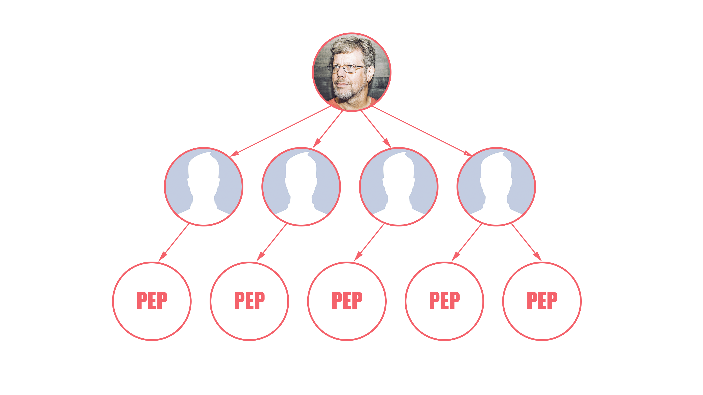

---

# *PEP 572*
## Assignment Expressions

^ might have heard, caused drama

---

# *`:=`*

^ has a name

^ not going to tell you it

---

[.hide-footer]


---

[.hide-footer]
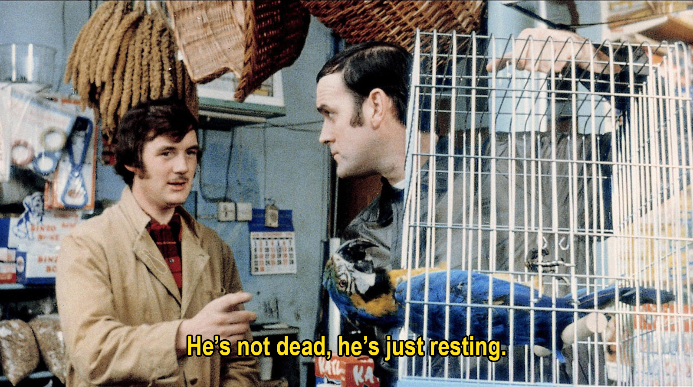

^ not dead, just resting

---

# *EXAMPLES*

^ what you can do with the walrus

---

# *Balancing*
## LOC and BIG O()

^ lines of code and complexity

---

```python
foo = [f(x), f(x)**2, f(x)**3]
```

^ let's say f(x) is expensive

---

```python
y = f(x)
foo = [y, y**2, y**3]
```

---

```python
foo = [y := f(x), y**2, y**3]
```

^ reuse a value that's expensive to compute

---

# *avoiding*
## inefficient comprehensions

---

```python
results = []
for x in data:
    result = f(x)
    if result:
        results.append(result)
```

^ usually this means list comprehension

---

```python
results = [
    f(x) for x in data
    if f(x)
]
```

^ but the problem here is that f(x) is computed twice

---

```python
results = [
    y for x in data
    if (y := f(x))
]
```

^ share a subexpression between a comprehension filter clause and its output

---

# *unnecessary*
## variables in scope

---

```python
match = pattern.search(data)
if match:
    do_something(match)
```

^ doing something conditionally with a result

---

```python
if (match := pattern.search(data)):
    do_something(match)
```

^ one less line

^ match isn't hanging around

---

# *Processing*
## Streams In chunks

---

```python
chunk = file.read(8192)
while chunk:
    process(chunk)
    chunk = file.read(8192)
```

^ updating a variable while reading it

---

```python
while chunk := file.read(8192):
    process(chunk)
```

---

# *WHY?*

---

# *Fewer lines*
## are better

^ Programmers hate change, minimizing diffs by at least one line is worth it

---

```python
y = f(x)
foo = [y, y**2, y**3]
```

^ if I can take these two lines...

---

```python
foo = [y := f(x), y**2, y**3]
```

^ in a single line, my coworkers will love me

^ that's a 50% reduction in code

---

# *Fewer lines*
## are more efficient?

^ went and found an example

---

```python
match = re.match(data)
group = match.group(1) if match else None
```

^ instead of writing

---

```python
group = re.match(data).group(1) if re.match(data) else None
```

^ they wrote

^ calling re.match twice here!

---

```python
group = match.group(1) if (match := re.match(data)) else None
```

^ with the walrus, they could have written

^ Ultimately a trade-off between developer and computer efficiency.

---

# *`=`*

^ you might say: kinda seems like the equals operator

^ even kinda looks like the equals operator

^ it's actually nothing like the equals operator

^ everywhere you can use equals, you can't use the walrus

---

```python
x = y = z = 0           # Yes
(z := (y := (x := 0)))  # No
```

^ multiple targets

---

```python
a[i] = x   # Yes
a[i] := x  # No
```

^ assignments to things other than a NAME

---

```python
self.rest = []   # Yes
self.rest := []  # No
```

^ assignments to things other than a NAME

---

```python
x = 1, 2     # Sets x to (1, 2)
(x := 1, 2)  # Sets x to 1
```

^ comma priority

---

```python
total += tax   # Yes
total +:= tax  # No
```

^ augmented assignment

---

# *`+:=`*

---

[.hide-footer]


---

[.hide-footer]


---

# *PEP 572*

---

# *Reception*

^ Most people hate change

^ Programmers especially hate change

---

# *Backwards compatibility*
## "Where will this work?"

^ not backwards compatible at all

---

# *Teachability*
## "What do we call this?"

^ can't call it walrus

^ Assignment operator (=)

^ Becomes operator (eh?)

^ Named expression (actual name)

---

# *Attractiveness*
## "It's just ugly!"

---

[.hide-footer]
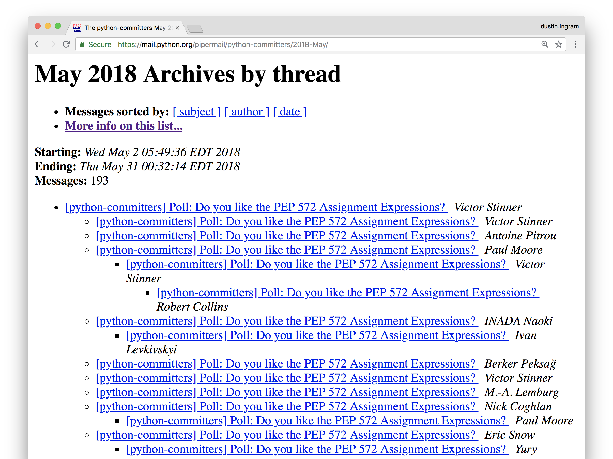

---

[.hide-footer]


---

[.hide-footer]
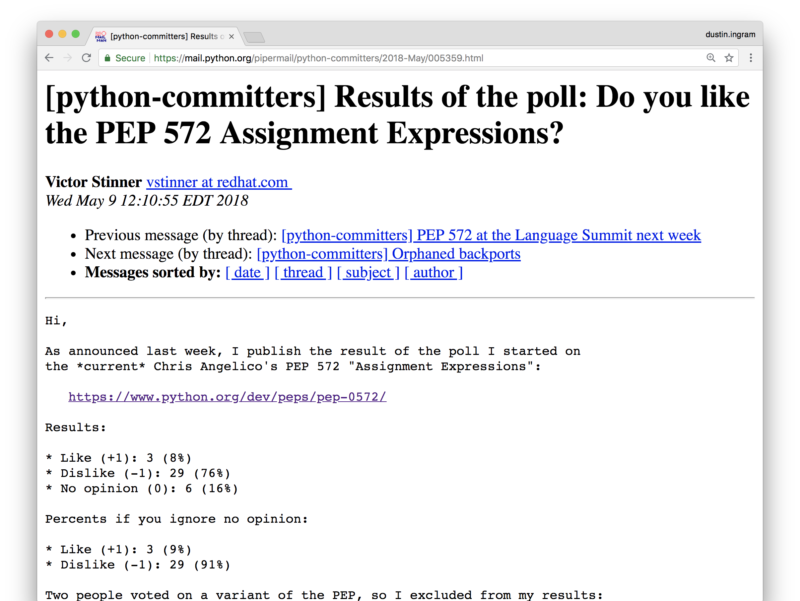

---

## *Tim Peters:*
### "The current proposal
### would have allowed a
### modest but clear improvement
### in quite a few bits of code."

---

## *Barry Warsaw:*
### "Since it changes the syntax of
### the language, people tend to focus
### on that without understanding
### the deeper semantic issues."

---

## *Łukasz Langa:*
### "Dictators should dictate"

---

## *Guido van Rossum:*
### Had to stop reading the threads
### so he wouldn't "go insane"

---

[.hide-footer]


---

[.hide-footer]
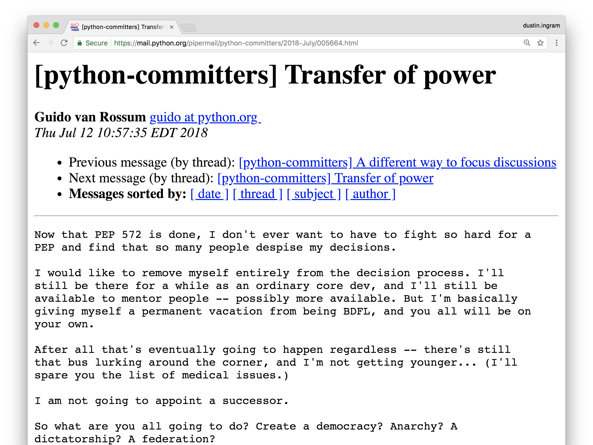

---

[.hide-footer]
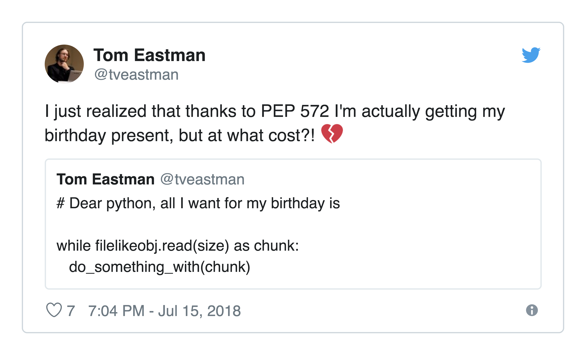

---

[.hide-footer]
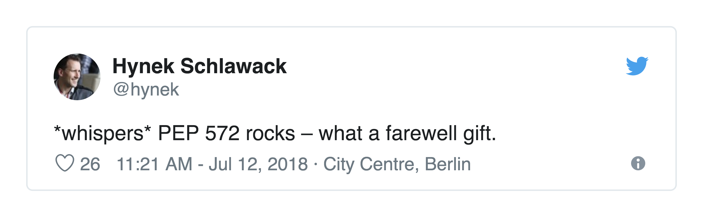

---

[.hide-footer]
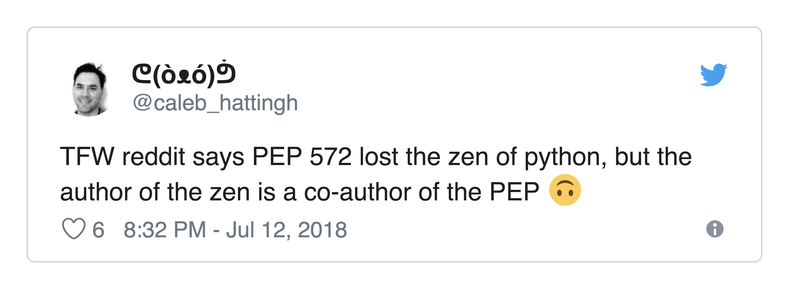

---

[.hide-footer]
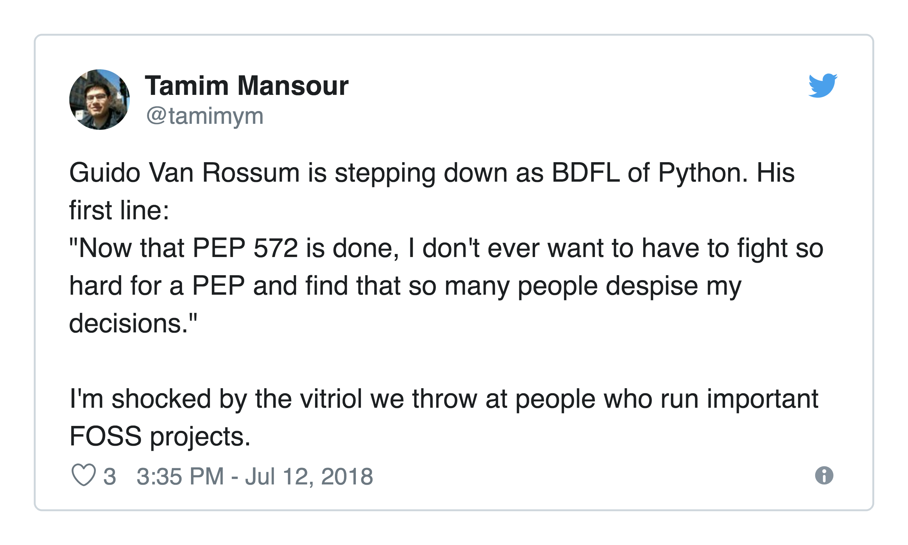

---

[.hide-footer]
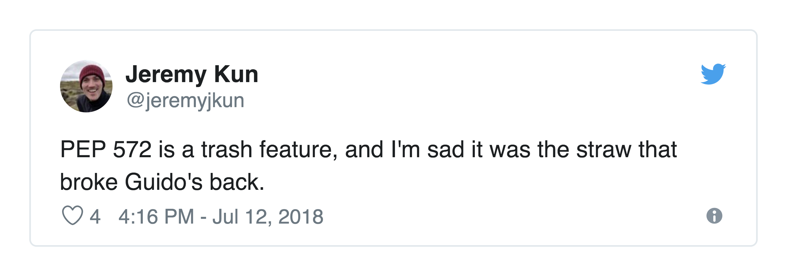

---

[.hide-footer]


---

[.hide-footer]
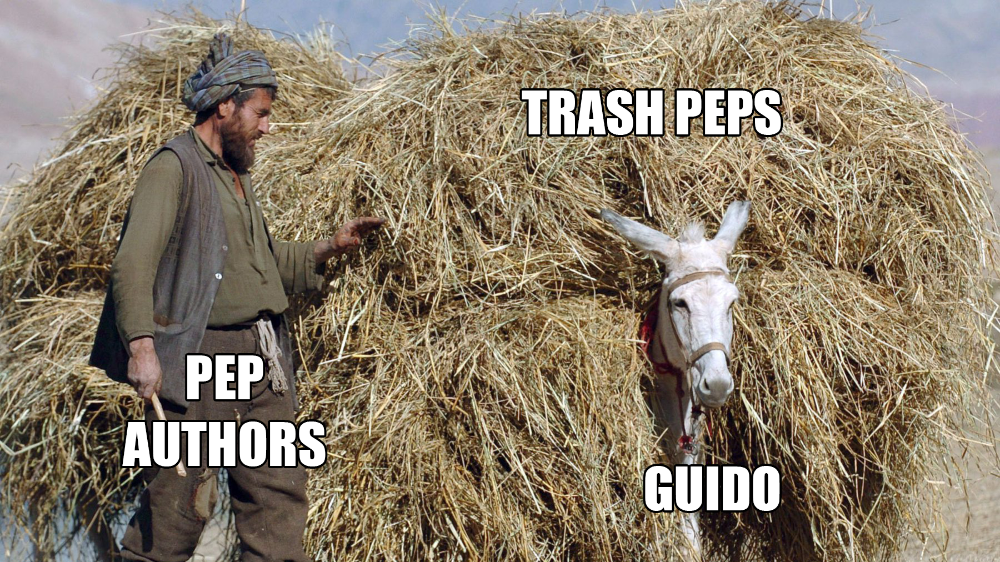

---

[.hide-footer]
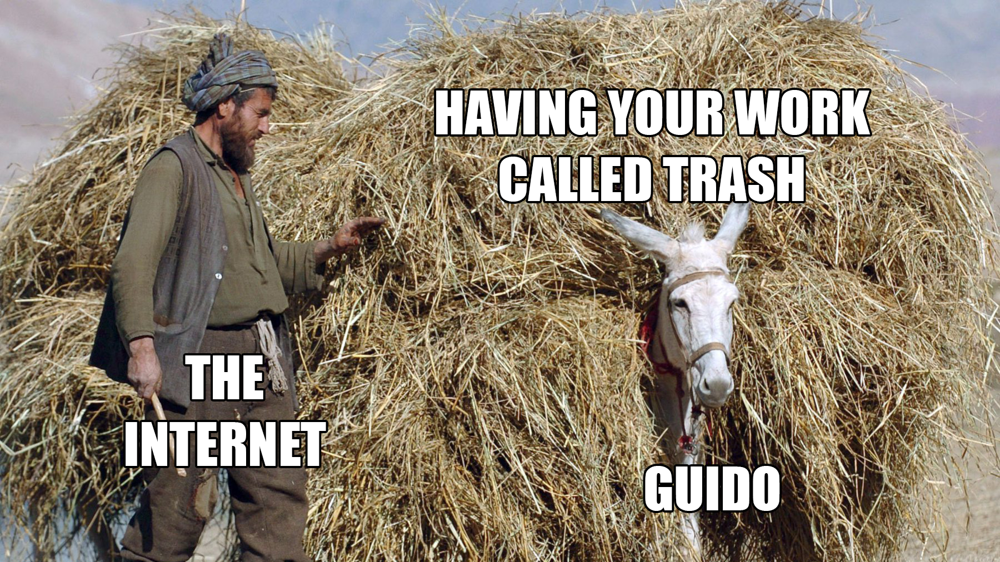

---

# *Dictators*
## Are people too

---

# *Maintainers*
## Are people too

---

# *PEOPLE*
## Are people too

---

# *Questions*

---

## What does this
## mean for Python?

^ jacob: is this going to be the pep to end all peps

---


^ like i said, power comes from guido

---

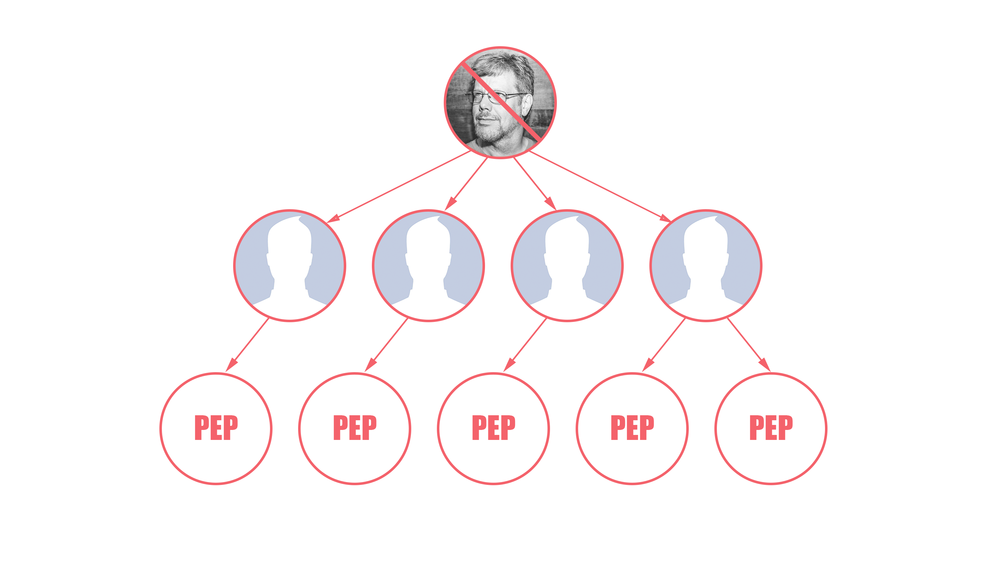

^ with no guido

---

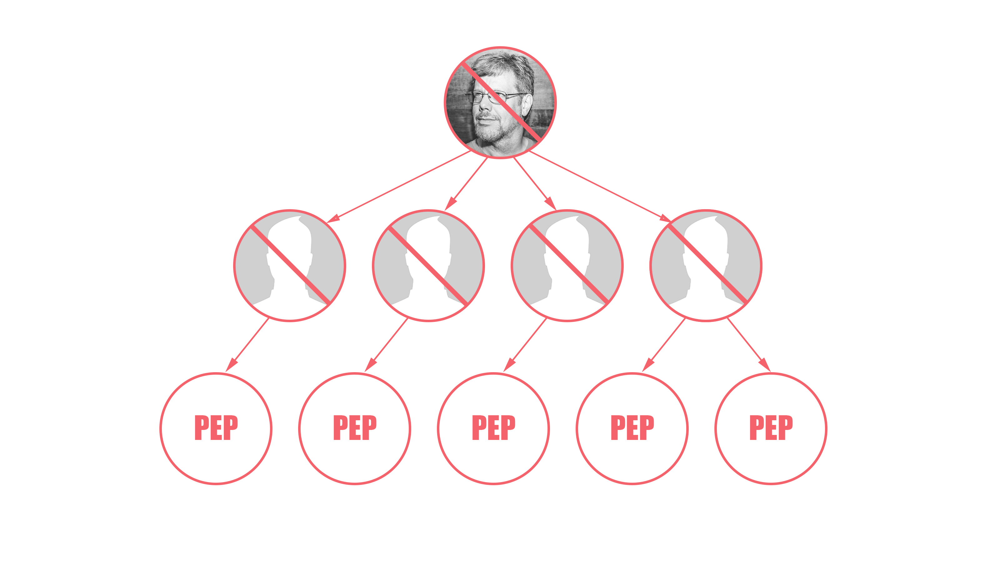

^ delegates have no powers

---

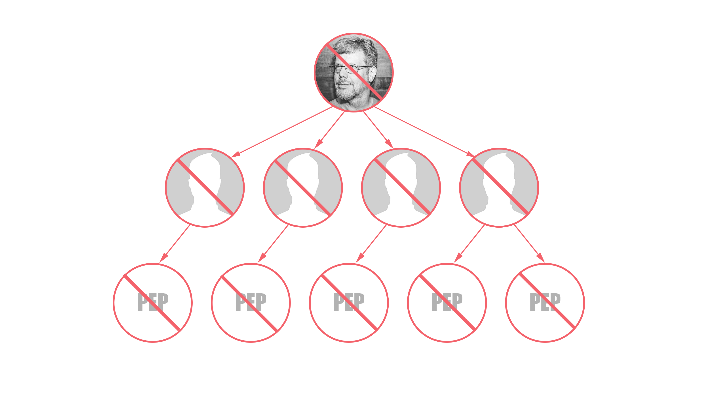

^ and thus we couldn't approve any peps

^ and thus couldn't change the language

---

## *It's going*
## *to be OK*

^ smart people immediately got to work on the governance problem

---

# *PEP 8000*
## Python Language
### Governance Proposal Overview

---

# *PEP 8001*
## Python Governance
### Voting Process

^ voting method, timeline, criteria for participation, and explicit list of eligible voters.

---

# *PEP 8002*
## Open Source
### Governance Survey

^ Surveys and summaries of governance models for similar open source and free software projects

---

* *PEP 8010* - The Technical Leader Governance Model
* *PEP 8011* - Python Governance Model Lead by Trio of Pythonistas
* *PEP 8012* - The Community Governance Model
* *PEP 8013* - The External Governance Model
* *PEP 8014* - The Commons Governance Model
* *PEP 8015* - Organization of the Python community
* *PEP 8016* - The Steering Council Model

---

# *VOTE*
## Dec 1st - 16th, 2018

^ only limited to core developers

---

[.hide-footer]
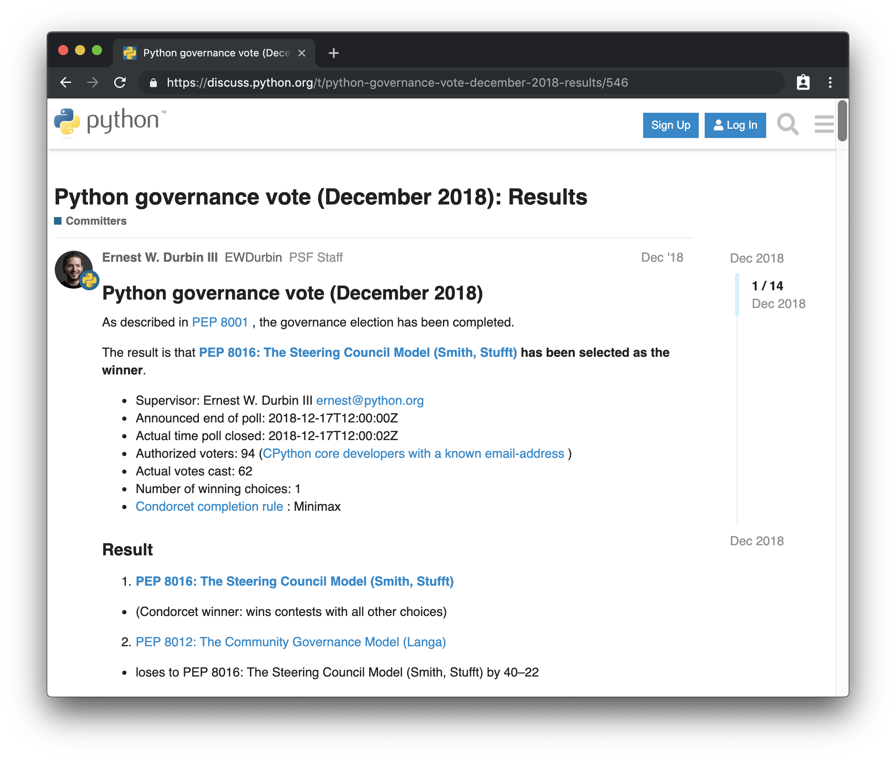

---

# *PEP 8016*
## Steering Council Model

^ Nathaniel J. Smith, Donald Stufft

---

# *VOTE*
## Jan 21st - Feb 4th, 2019

^ only limited to core developers

---

[.hide-footer]
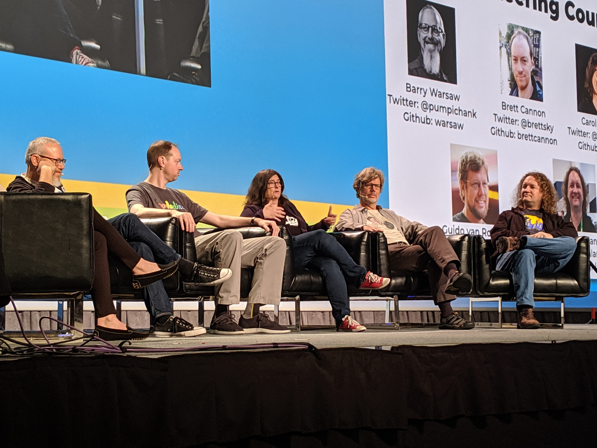

^

---

# *Q&A*

---

## Will this become
## part of Python?

---

## *It already has*
## *(in 3.8)*

^ emily moorehouse

---

## But I don't like it!

---

## *Then don't*
## *write it!*

^ No one's going to force you to write it

^ If someone on your team is using it, convince them not to!

---

## Is Guido
## coming back?

^ depends on what you mean

---

## To Python?

---

## *Yes!*

---

## As BDFL?

---

## *Nope*

^ Python is 27 years old, and guido is like it's parent

---

## Will this
## happen again?

^ depends on what you mean

---

## Will another PEP
## be this controversial?

---

## *Probably not*

^ this PEP was an outlier

---

## Will people be
## negative
## on the internet?

---

# *¯\\\_(ツ)\_/¯*

^ so many people use python now

^ for most of those people, the language already feels kinda perfect

^ perhaps this is the new status quo

---

[.hide-footer]

# *Thanks!*
###  @`di_codes`

---

