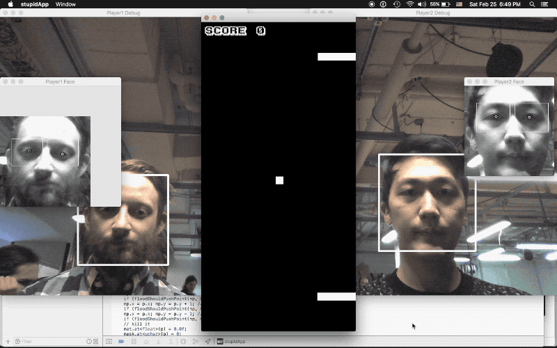
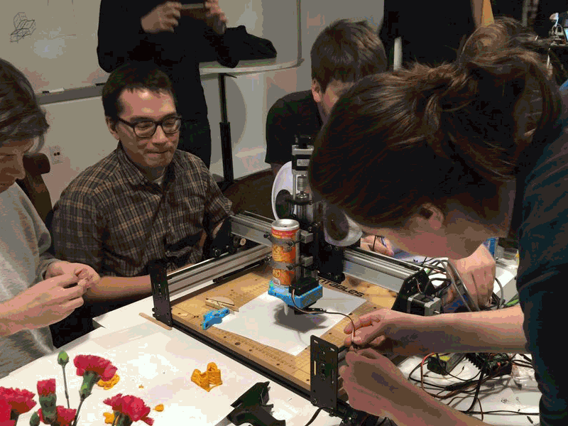

footer:  @di_codes

# *Fun in Computing*
### PyBeach 2020

---


# [fit] *Hi, I'm Dustin*

---


# [fit] *Hi, I'm Dustin*

* Python Package Index
* PyTexas (Austin, May 16-17th 2020)
* Developer Advocate @ Google

---

# [fit] *FUN*

---

# Alan Perlis


---

# Alan Perlis
## *First recipient of the Turing award*


^ for his influence in the area of advanced programming techniques and compiler construction

---

## "I think that it's extraordinarily important that we in computer science keep fun in computing. When it started out, it was an awful lot of fun."

---

## "[Eventually] we began to feel as if we really were responsible for the successful, error-free perfect use of these machines. I don't think we are."

---

## "I think we're responsible for stretching them, setting them off in new directions, and keeping fun in the house. I hope the field of computer science never loses its sense of fun."

---


---


---


---


---


---


---


---


---

# *FUN*
#& failure<br>& ambition<br>& curiosity<br>& Python

---

# [fit] *FUN*
# [fit] & failure

---

# Simone Giertz


^ "yutch"

^ is a Swedish inventor, YouTuber and robotics enthusiast.

---

# Simone Giertz

## *"Queen of Shitty Robots"*


---


---


^ She is world-renowned for her useless machines and has risen to the very top of the field

^ mainly because the field is very tiny and not of interest to the general populace.

---


---


---


---


---


---


---

> "Building things with hardware, especially if you're teaching yourself, is something that's really difficult to do."

---

> "It has a high likelihood of failure and moreover, it has a high likelihood of making you feel stupid."

---

> "I came up with a setup that would guarantee success..."

---

> "Instead of trying to succeed, I was going to try to build things that would fail."

---

> "It's this expression of joy and humility that often gets lost in engineering."

^ and for me it was a way to learn about hardware without having my performance anxiety get in the way."

---


^ simone's success

---


---

> "Welcome and accept failure."

^ when we play, we accept failure

^ when we're not playing, not accepting failure stifles us

---


^ coincidence

---

# [fit] *FUN*
# [fit] & ambition

---

# Danny Hillis


---

# Danny Hillis

## *Inventor, Clock of the Long Now*


---


^ lifetime building supercomputers, more in museums than still running

^ 90s -> 2000s

---


---

> "I want to build a clock that ticks once a year..."

---

> "...The century hand advances once every one hundred years, and the cuckoo comes out on the millennium..."

---

> "...I want the cuckoo to come out every millennium for the next 10,000 years."

^ 10000 years is just within the limits of plausability

^ we have found artifacts that are approximately that old, but nothing so complex

---


^ this is the clock that was finished january 31st, 1999

^ it's called "the clock of the long now"

^ this is actually a scale prototype

---


---


---


^ prototype 2, west texas

---


^ mount washington, nevada

^ biggest concerns are things like how the changing rotational speed of earth affects the length of the day

^ these are planetary concerns!

---

# Design Principles
## *of The Clock of the Long Now*


---


## - Longevity<br>- Maintainability<br>- Transparency<br>- Evolvability<br>- Scalability

^ turns out, the same principles to make a clock last 10K years are good principles for making anything last a long time

---

## "If there is no attention for long periods of time the Clock uses the energy captured by changes in the temperature between day and night on the mountain top above to power its time-keeping apparatus."

^ have you ever tried to build something so ambitious that it required an entirely new form of power?

---

> "Such a clock, if sufficiently impressive and well-engineered, would embody deep time for people."

---

> "It would do for time what the photographs of Earth from space have done for thinking about the environment."

---

> "Such icons reframe the way people think"

---

# [fit] *FUN*
# [fit] & whimsy

---


---


---

# Sam Lavigne & Amelia Winger-Bearskin
## *Stupid Shit No One Needs & Terrible Ideas Hackathon*


---

# Sam Lavigne & Amelia Winger-Bearskin
## *Stupid Hackathon*


---


^ infinte folders

---



^ eyeball pong

---


^ hypocondriapp

^ diagnoses you with worst possible disease

---


^ pink it, shrink it, double the price

---


^ publicly tweets everything you typed and every website you visit

---


^ non-ad block

---



^ 3d cheese printer

---

> "We get invited to a lot of stupid hackathons and decided we wanted to start our own."

---

> "So many hackathons are about solving problems that exist in a social, political or economic sphere..."

---

> "...problems that can't really (and probably shouldn't) be solved within the sphere of technology."

---

> "Our hackathon, ideally, acts as a critique of the tech industry as a whole..."

---

> "...and also a fun space to make things that aren't constrained by solutionism."

---

# [fit] *FUN*
# [fit] & curiosity

---

# Claude Shannon


---


# Claude Shannon

## *"The Father of Information Theory"*


^ mathemetician, electrical engineer and cryptographer

^ bell labs

^ codebreaking for WW2

---


^ wrote the first paper on making computers play chess, 1950

---


^ light up the next move to make

^ could only play final 6 moves of a match

^ for him this was play

---


^ 1996 - almost 50 years after shannon wrote the paper

---


^ labyrinth of 25 squares, flexible configuration

^ mouse would search through the corridors until it found the target.

^ the mouse could then be placed anywhere it had been before and go directly to the target.

^ If placed in unfamiliar territory, it was programmed to search until it reached a known location and then it would proceed to the target, adding the new knowledge to its memory and learning new behavior.

---


---

> "I think the history of science has shown that valuable consequences often proliferate from simple curiosity."

---

# Steve Jobs


---

# Steve Jobs

## *Founder, Apple Computers*


---

> "Much of what I stumbled into by following my curiosity & intuition turned out to be priceless later on."

---


^ met Jobs at a celebrity-filled birthday party for a nine-year old

^ Jobs had brought a new mac from california for the kid

^ he was showing the boy how to draw a circle when andy warhol and keith haring wandered in and asked to take a turn

---


---

> "Older people sit down and ask, 'What is it?' but the boy asks, 'What can I do with it?'"

---

# Albert Einstein


---

# Albert Einstein

# *Swiss Patent Clerk*


---

> "I have no special talent. I am only passionately curious."

---

# [fit] *FUN*
# [fit] & Python

^ monty python


---


---

# PEPs
## *"Python Enhancement Proposals"*

---

# PEP 8
## *"Style Guide for Python Code"*

---

# PEP 8
## *"Style Guide for Python Code"*

---

# PEP 20
## *"The Zen of Python"*

---

# PEP 569
## *"Python 3.8 Release Schedule"*

---

# PEP 404

---

# PEP 404
## *"Python 2.8 Un-release schedule"*

---


---


---


---

```python
>>> 1/2  # Python 2
0
>>>
```

---

```python
>>> 1/2  # Python 2
0
>>> from __future__ import division
```

---


```python
>>> 1/2  # Python 2
0
>>> from __future__ import division
>>> 1/2
0.5
```

---

```python
def print_message(num_of_times) {
    for i in range(num_of_times) {
        print("I love braces!");
    }
}

if __name__ == "__main__" {
    print_message(10);
}
```

---

```python
        def print_message(num_of_times) {
           for i in range(num_of_times) {
                 print("I love braces!");
                                        }
                                        }

              if __name__ == "__main__" {
                       print_message(10);
                                        }
```


---

```python
>>> from __future__ import braces
```

---
```python
>>> from __future__ import braces
  File "<stdin>", line 1
SyntaxError: not a chance
>>>
```

---

# <https://pypi.org>
## *"The Cheeseshop"*

---

# [fit] *FUN*
# [fit] & you

---

# Keeping fun in computing

* let yourself fail
* build something useless
* build something ambitious
* maintain a childlike curiosity
* keep writing Python

[.build-lists: true]

---

[.hide-footer]

# *Thanks!*
##  @di_codes
