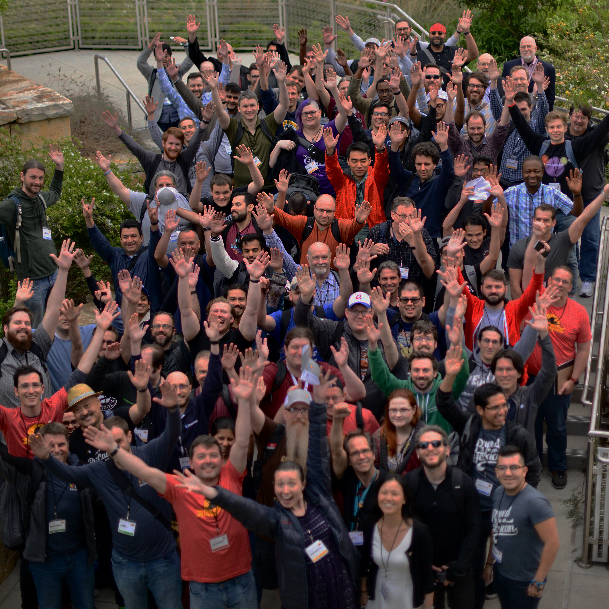

 
# PyTexas 2020
 
 
## May 16-17th
## Austin, TX

^ Saturday & Sunday

---

# About

- 11th annual, 300+ attendees
- Organized by the PyTexas Foundation
- Two days of talks on topics including:
  - Web Applications
  - Data Science & Scientific Computing
  - General programming & best practices

---

# Location

- Austin Public Library
  710 W. César Chávez St.

---

# Registration

| Student | Individual Earlybird | Individual |
| :-: | :-: | :-: |
| $25 | **$65** | $85 |
| Free breakfast, lunch & coffee | Free breakfast, lunch & coffee, plus good feelings about saving money | Free breakfast, lunch & coffee |
| | **Opens Jan 1st** | |

---

# Speaking

* Conference talk: 30 minutes
  * Call for proposals opens December 1st
  * Closes February 14th, AoE
  * <https://www.papercall.io/pytexas-2020>

* Lightning talks: 5 minutes
  * Submit at the conference

---

# Sponsoring

* Highlight your company:
  * Recruit engineers
  * Increase awareness of your product
  * Show support for the community

* Help keep the costs of PyTexas low

* <sponsorship@pytexas.org>

---

# Volunteering

* Lots of roles available
* Both before & during the conference
* Get a special t-shirt!

* <volunteers@pytexas.org>

---

# Questions?

* Is this for Python beginners, or just experts?
* How much of the ticket price goes to the conference?
* Do you offer opportunity grants?

---

# Thanks!

* Website: [pytexas.org]()
* Twitter: [@pytexas]()
* Contact: <conference@pytexas.org>
* CFP: Dec 1st, 2019
* Registration: Jan 1st, 2020
* Conference: May 16/17th, 2020

