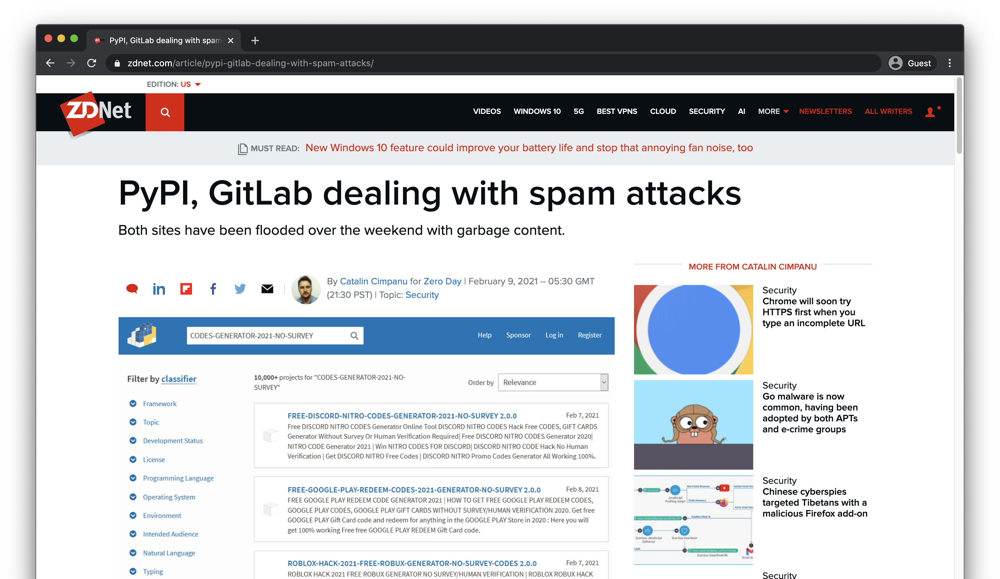
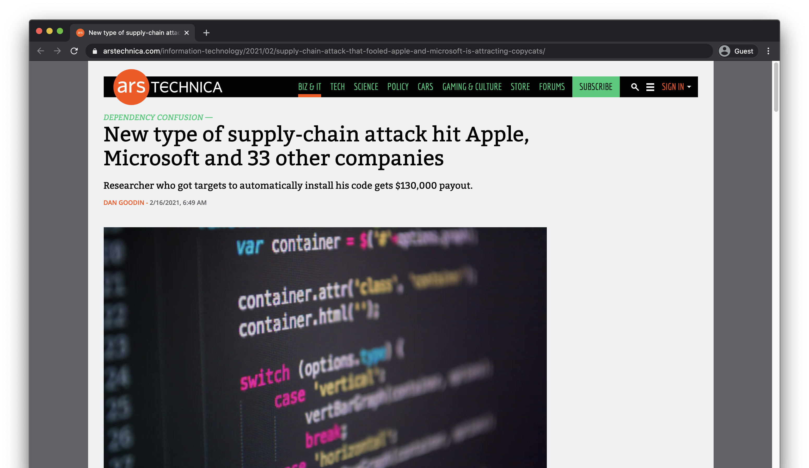
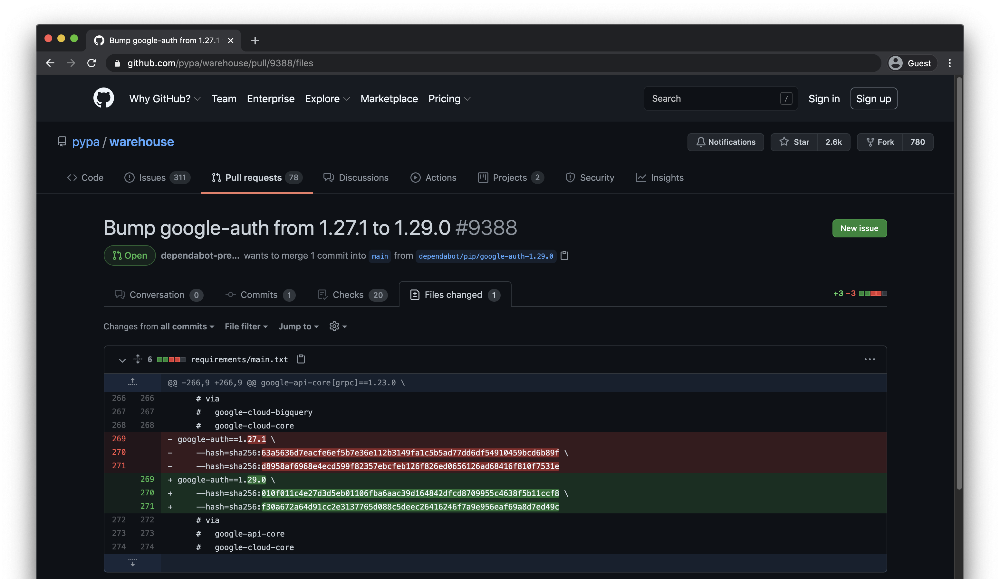

theme: Minty Next
footer:  @di_codes
[.code: auto(42)]

# *Secure Software Supply Chains*
# *for Python*
## PyCon US 2021

<!--

One of the most powerful parts of Python lies not within the language itself,
but within the robust ecosystem of open-source Python packages available to use
along with it. The Python Package Index, the canonical repository for Python
code, hosts nearly 300,000 different projects. However, integrating software
from so many third-parties comes at a cost: how can we be sure it's secure?

In this talk, we'll explore the common Python software supply chain, various
ways in which such a supply chain can be attacked, as well as protected. We'll
examine some tools and methodologies that help improve supply-chain security,
and discuss the challenges and benefits these tools provide. Finally, we'll
look at what fundamental improvements we can make to the overall ecosystem.

-->

---

# *Hi, I'm Dustin*

* Developer Advocate @ Google
* Director @ Python Software Foundation
* Maintainer @ Python Package Index

---

# Recent news
##

---

[.hide-footer]


---

[.hide-footer]


---

[.hide-footer]


---

## Software Supply Chain
# What is it?

^ by supply chain I don't mean a literal physical supply chain

^ talking about a SOFTWARE supply chain

---

# Software Supply Chain
## Everything it takes to produce your software

---

## Software Supply Chain

* All your 3rd-party dependencies
* The places those dependencies are distributed
* Everything used to build those dependencies

---

## Software Supply Chain

* All _their_ external dependencies
* The places _those_ dependencies are distributed
* Everything used to build _those_dependencies

---

## Software Supply Chain

* turtles
* more turtles
* even more turtles

^ source control repository you use
^ ftp server you host built software on
^ identity server you use to authenticate your team

---

## Python Software Supply Chain

* A library like `flask` or `pandas`
* A software repository like <https://pypi.org>
* Tools like `setuptools`, `wheel`, `twine`, etc.

---

## _Secure_ Software Supply Chain
# What is it?

---


# Secure Software Supply Chain:
## All those things, and they're definitely not compromised

---

# Supply Chain Attacks
## Let's see some examples

---

## Supply Chain Attack:
# Man-in-the-middle

---

[.hide-footer]


---

## Supply Chain Attack:
# Typosquatting

---

[.hide-footer]


---

[.hide-footer]


---

## Supply Chain Attack:
# Dependency Confusion

^ similar to typosquatting, but taking it to the next level

---

[.hide-footer]


---

## Supply Chain Attack:
# Being a target of "research"

---

[.hide-footer]


---

## Supply Chain Attack:
# Getting SolarWinded

---

[.hide-footer]


^ ultimately about compromised build infrastructure

^ solarwinds was distributing software to their customers

^ software was securely sealed, signed and delivered!

^ it was just comprimised before that even happened.

---

## Other "upstream" attacks

* Compromised maintainers
* Compromised source control
* Leaked passwords/API tokens
* Social engineering

^ just regular old non-malicious bugs

---

# What can we do
## To have a more secure supply chain?

---

## What we can do:
# HTTPS everywhere

---

[.hide-footer]


^ we did this, four years ago

---

## What we can do:
# Use lockfiles

^ could have basically prevented all of these attacks

^ one huge downside: no standardization

^ if you come from

---

## Important components of a lockfile:

* Version pins
* Hashes
* Full dependency tree

^ version pins mean that each package is pinned to ONE specifc version

^ hashes mean that we're verifying the hashes of the files we download match

^ full dependency tree means we have our dependencies and sub-dependencies

^ also non-typo'd package names, but this is a given


---

# Is this a lockfile?
## `requirements.txt`

---

```
$ cat requirements.txt

flask
alembic>=0.7.0
google-cloud-bigquery
boto3
```

---

# Is this a lockfile?

* Version pins ❌
* Hashes ❌
* Full dependency tree ❌

---

# Is this a lockfile?
## `pip freeze > requirements.txt`

^ don't do this!

---

```
$ pip freeze
amqp==2.6.0                      first==2.0.2                     packaging==20.8                   PyYAML==5.3.1
apispec==1.0.0b6                 flake8==3.8.1                    pathspec==0.8.0                   readme-renderer==29.0
appdirs==1.4.3                   Flask==1.1.1                     pathtools==0.1.2                  regex==2020.4.4
argcomplete==1.11.1              flit==3.0.0                      peppercorn==0.6                   requests==2.23.0
asgiref==3.2.10                  flit-core==3.0.0                 pip-api==0.0.14                   requests-oauthlib==1.3.0
attrs==19.3.0                    future==0.18.2                   pip-tools==5.5.0                  requests-toolbelt==0.9.1
bashlex==0.15                    google-api-core==1.24.1          pkginfo==1.5.0.1                  rfc3986==1.4.0
beautifulsoup4==4.9.1            google-auth==1.24.0              pluggy==0.13.1                    rsa==4.6
billiard==3.6.3.0                google-cloud-bigquery==2.6.2     pretend==1.0.9                    six==1.14.0
black==20.8b1                    google-cloud-core==1.5.0         proto-plus==1.13.0                soupsieve==2.0.1
bleach==3.1.5                    google-cloud-firestore==2.0.2    protobuf==3.14.0                  SQLAlchemy==1.3.18
build==0.3.1.post1               google-crc32c==1.1.0             publicsuffixlist==0.7.7           sqlparse==0.3.1
bump==1.2.0                      google-resumable-media==1.2.0    py==1.9.0                         test-test==1.2.0
cachetools==4.2.0                googleapis-common-protos==1.52.0 pyasn1==0.4.8                     toml==0.10.1
celery==4.4.6                    grpcio==1.34.0                   pyasn1-modules==0.2.8             tox==3.21.2
certifi==2020.4.5.1              gunicorn==20.0.4                 pycodestyle==2.6.0                tqdm==4.45.0
cffi==1.14.0                     idna==2.9                        pycparser==2.20                   tweepy==3.8.0
chardet==3.0.4                   iniconfig==1.0.1                 pyflakes==2.2.0                   twilio==6.44.0
cibuildwheel==1.7.1              isort==4.3.21                    Pygments==2.6.1                   twine==3.3.0
click==7.1.2                     itsdangerous==1.1.0              PyJWT==1.7.1                      typed-ast==1.4.1
cloudevents==1.2.0               Jinja2==2.11.2                   pyparsing==2.4.7                  typing-extensions==3.7.4.2
cmarkgfm==0.4.2                  keyring==21.8.0                  PyPika==0.37.16                   urllib3==1.25.9
colorama==0.4.3                  kombu==4.6.11                    PySocks==1.7.1                    virtualenv==20.0.18
colorlog==4.1.0                  Markdown==3.2.2                  pytest==5.4.3                     watchdog==1.0.2
corvid==1.1.0                    MarkupSafe==1.1.1                pytest-mock==3.2.0                wcwidth==0.2.5
delocate==0.8.2                  mccabe==0.6.1                    python-dateutil==2.8.1            webencodings==0.5.1
deprecation==2.1.0               more-itertools==8.4.0            python-frontmatter==0.5.0         Werkzeug==0.16.1
distlib==0.3.0                   mypy-extensions==0.4.3           pytoml==0.1.21                    wlc==1.10
docutils==0.16                   nox==2019.11.9                   pytz==2020.1                      xerox==0.4.1
filelock==3.0.12                 oauthlib==3.1.0                  pyxdg==0.27                       youtube-dl==2020.12.22
```

---

## Is this a lockfile?

* Version pins ✅
* Hashes ❌
* Full dependency tree 🤷

---

# Is this a lockfile?
## `pipenv install` / `pipenv lock`

---

```
$ cat Pipfile.lock
{
   "default": {
        "certifi": {
            "hashes": [
                "sha256:1a4995114262bffbc2413b159f2a1a480c969de6e6eb13ee966d470af86af59c",
                "sha256:719a74fb9e33b9bd44cc7f3a8d94bc35e4049deebe19ba7d8e108280cfd59830"
            ],
            "version": "==2020.12.5"
        },
        "chardet": {
            "hashes": [
                "sha256:0d6f53a15db4120f2b08c94f11e7d93d2c911ee118b6b30a04ec3ee8310179fa",
                "sha256:f864054d66fd9118f2e67044ac8981a54775ec5b67aed0441892edb553d21da5"
            ],
            "markers": "python_version >= '2.7' and python_version not in '3.0, 3.1, 3.2, 3.3, 3.4'",
            "version": "==4.0.0"
        },
        "idna": {
            "hashes": [
                "sha256:b307872f855b18632ce0c21c5e45be78c0ea7ae4c15c828c20788b26921eb3f6",
                "sha256:b97d804b1e9b523befed77c48dacec60e6dcb0b5391d57af6a65a312a90648c0"
            ],
            "markers": "python_version >= '2.7' and python_version not in '3.0, 3.1, 3.2, 3.3'",
            "version": "==2.10"
        },
        "requests": {
            "hashes": [
                "sha256:27973dd4a904a4f13b263a19c866c13b92a39ed1c964655f025f3f8d3d75b804",
                "sha256:c210084e36a42ae6b9219e00e48287def368a26d03a048ddad7bfee44f75871e"
            ],
            "index": "pypi",
            "version": "==2.25.1"
        },
        "urllib3": {
            "hashes": [
                "sha256:2f4da4594db7e1e110a944bb1b551fdf4e6c136ad42e4234131391e21eb5b0df",
                "sha256:e7b021f7241115872f92f43c6508082facffbd1c048e3c6e2bb9c2a157e28937"
            ],
            "markers": "python_version >= '2.7' and python_version not in '3.0, 3.1, 3.2, 3.3, 3.4' and python_version < '4'",
            "version": "==1.26.4"
        }
    },
    ...
}
```
---

# Is this a lockfile?

* Version pins ✅
* Hashes ✅
* Full dependency tree ✅

^ you could probably tell by the fact that it had lock in the name

---

## An underused workflow
# Compiled Dependencies

---

[.hide-footer]


^ specifically the pip-compile sub-tool

^ powerful because this reuses vanilla pip's existing files and formats

---

[.hide-footer]


---

```
$ cat requirements.in
flask
alembic>=0.7.0
google-cloud-bigquery
boto3

$ pip-compile
    --generate-hashes
    --output-file=requirements.txt
    requirements.in
```

---

```
$ cat requirements.txt
#
# This file is autogenerated by pip-compile
# To update, run:
#
#    pip-compile --generate-hashes --output-file=requirements.txt requirements.in
#
alembic==1.5.8 \
    --hash=sha256:8a259f0a4c8b350b03579d77ce9e810b19c65bf0af05f84efb69af13ad50801e \
    --hash=sha256:e27fd67732c97a1c370c33169ef4578cf96436fa0e7dcfaeeef4a917d0737d56
    # via -r requirements.in
boto3==1.17.57 \
    --hash=sha256:2783947ec34dd84fc36093e8fc8a9a24679cf912a97bc9a0c47f4966ed059a29 \
    --hash=sha256:6b4a79691a48740816f03c4cb1e8ef46f8335ad2019d9c4a95da73eb5cb98f05
    # via -r requirements.in
botocore==1.20.57 \
    --hash=sha256:ae4ac72921f23d35ad54a5fb0989fc00c6fff8a39e24f26128b9315cc6209fec \
    --hash=sha256:fa430bc773363a3d332c11c55bd8c0c0a5819d576121eb6990528a1bdaa89bcd
    # via
    #   boto3
    #   s3transfer
...
```

^ note that it included the sub-dependency of botocore

---

[.hide-footer]


---

[.hide-footer]


^ this works because pip has a feature called hash-checking mode

^ nice thing about this is to enable hash-checking, you have to hash-check every file

---

## What can we prevent with
# lockfiles?

---

## What can we prevent with lockfiles?

* Man-in-the-middle ✅
* Typosquatting ✅
* Dependency confusion ✅
* Being a target of "research" ❌
* Getting Solarwinded ❌

---

## What we can do:
# Vulnerability notifications

^ goes hand-in-hand with lockfiles

^ services that notify you about changes to your dependencies

^ new versions or new vulnerabilties

---

[.hide-footer]


---

[.hide-footer]


---

[.hide-footer]


---

[.hide-footer]


---

## What can we prevent w/ notifications?

* Man-in-the-middle ❌
* Typosquatting ❌
* Dependency confusion ❌
* Being a target of "research" ✅
* Getting Solarwinded ✅

^ can't really _prevent_ it

^ but we can know when it happens and we're aware of it

^ we can also have a faster upgrade path

---

# Improvements
## What _else_ can we do to fix this?

^ Going to outline some things that have been proposed or are in progress

---

## Improvemnt:
# Package Signing

^ not the holy grail! e.g. solarwinds

^ tools like GPG are incredibly confusing for unfamiliar users, raise the barrier to entry

---

[.hide-footer]


^ donald has the definitive post on this topic

---

## Improvement:
# Fully audited/curated PyPI

^ pypi is successful because anyone can publish to it

^ pypi can compromise you because anyone can publish to it

^ we also don't have the staff to do this even if we wanted to

---

## Improvement:
# Standardized lock files

^ improve the usabilty and usefulness of lockfiles

^ don't wait, use lockfiles today

^ the original plan for pipenv's pipfile was that it would become a standard, hasn't happened

---

## Improvement:
# The slow but inevitable death of `setup.py`

^ at the end of the day, a python package can execute arbitrary source code via setup.py

^ removing the need for this or using built distributions

---

## Improvement:
# Better docs

^ let's be honest, we can always use better docs

---

[.hide-footer]


^ i think we have pretty good docs already

^ better inform users about the power and potential to misconfigure their tools

^ and specifically about supply-chain security

^ I don't think restricting the power of the tools is the right path

---

## Improvement:
# The Update Framework

^ like hashes, but better

---

[.hide-footer]


^ packages are signed by the repository, not the package author

^ although the next step could allow that

---

## Improvement:
# Namespaces on PyPI

---

[.hide-footer]


^ anything beginning with google- you could know was owned by Google

---

## Improvement:
# More funding for projects

---

[.hide-footer]


---

[.hide-footer]


---

[.hide-footer]

# *Thanks!*
##  @di_codes


^ I also want to give a huge thank-you to the PyCon staff for everything they've dealt with and everything they've done to bring this conference online.

^ They absolutely deserve your thanks as well, be sure to let them know you appreciate all the hard work they're doing.

^ See you next year!
