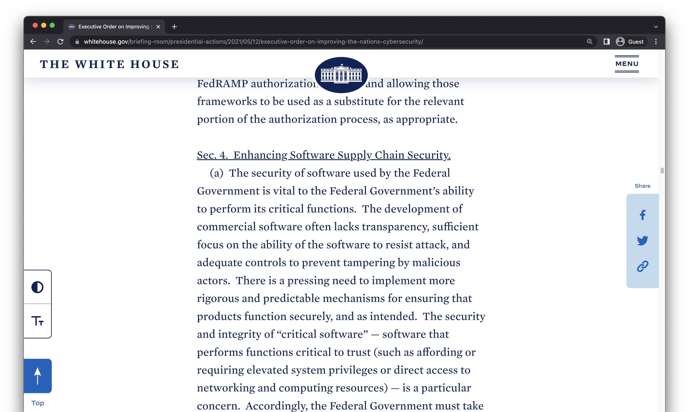
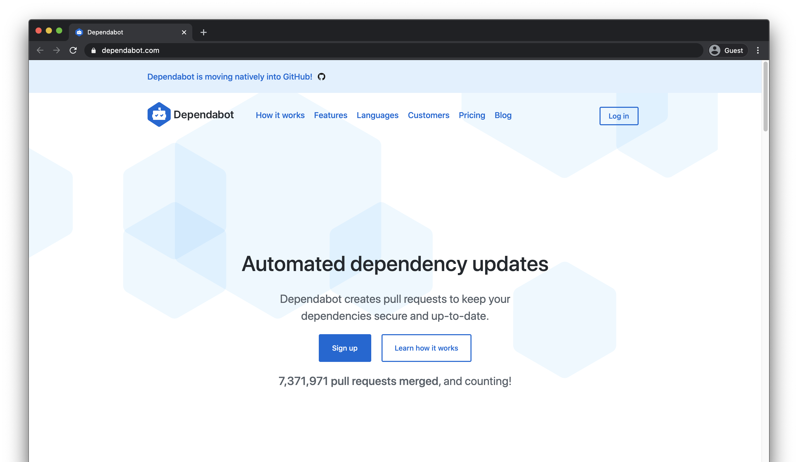
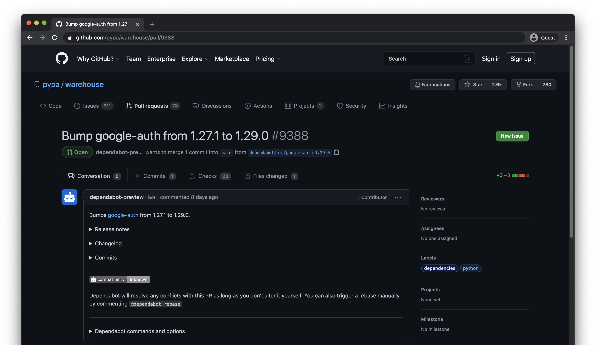

theme: Minty Next
footer:  @di_codes
[.code: auto(42)]

# *Understanding*
# *Open Source*
# *Supply-Chain Security*
## Open Source 101 2022

<!--

Supply Chain Security: so hot right now. With the recently increased focus on
securing software systems, there has been a incredible explosion of tools,
methodologies, standards, best practices, and more. Given the sheer quantity,
it’s hard to keep track and stay informed: how can you know what’s right for
you?

The same attributes that make open source software desirable to use also make
it challenging to secure. When anyone can publish an open-source library, how
can you decide what’s safe to use? If anyone can contribute, how can you trust
the maintainers? If source code and development is in public, how can we
identify and respond to vulnerabilities when attackers will know about them as
soon as we do?

In this talk, we’ll explore new tools and best practices that you can use today
as open-source software user to improve the security of your software supply
chain and trust in the ecosystem. We’ll show how each of these serves a
different purpose, and protects you from a unique way in which your software
supply chain could be vulnerable. Finally, we’ll discuss upcoming and potential
improvements to the entire open-source ecosystem.

-->

---

# *Hi, I'm Dustin*

* Software Engineer, Google Open Source Security Team (GOSST)
* Director, Python Software Foundation
* Maintainer, Python Package Index

^ GOSST, where our mission is to make the open source software that google -- and the rest of the world -- more secure

^ PSF, where I help ensure the long-term success of one very big open-source Python project you've probably heard of: python itself

^ PyPI, where I help ensure the long-term success of hundreds of thousands of tiny python projects you've never heard of

---

## Part 1:
# Q&A

^ I'm going to be a bit unconventional, start with a Q&A, but also I'm going to be asking the questions, and also answering them

^ I think there's some important questions we should all be asking around open-source security right now

---

# Is it safe to use open-source software?

^ This might be the question you came here today with

^ maybe heard a lot about security challenges open-source is having in the news

^ you might have doubts or fears about the viability of using open-source

---

## Is it safe to use open-source software?
# Yes!

^ the reality is that every day, all kinds of open source software is deployed, used by billions, and it works

^ And as someone whose career exists because people use open source software, I want to tell you yes!

^ You might say, 'but dustin, didn't you just say your job is to make open source more secure'

^ "Doesn't that also imply that open-source software isn't as safe as it could be"

^ kinda also yes

---

## Is it safe to use open-source software?
# Yes![^*]

[^*]: Use only as directed. Open source software is not guaranteed to be safe and usually amounts to allowing strangers to run arbitrary code on your machine. Don't talk to strangers. Talk to your doctor if you are considering switching to an ecosystem with more security guarantees. Any ecosystem claiming to be more secure probably can't make those guarantees anyway. All software is vulnerable, all we can do is accept the reality of bugs, outages, vulnerabilities, and the inevitable heat death of the universe. We don't make mistakes, we just have happy little accidents. Exposure to vulnerabilities may prevent you from ever trusting any software ever again. Close-source software isn't less vulnerable, it just gets less press. Open source doesn't have a security problem, it has a sustainability problem. Don't blame the maintainers, pay the maintainers. Apply directly to the forehead. If your job doesn't let you use open source, apply directly for a new job. Exposure to open source may lower your expectations. If you expect nothing from anybody, you’re never disappointed. Void where prohibited. Not all practices described in this talk are applicable to all persons or at all locations. Literally nothing you do will void the warranty, because there is no warranty. Use of open source may cause upset stomach, headache, and long threads of hot takes on Twitter.

^ so realistically, yes, but with a big asterisk

^ basically: it depends how you use it

---

## A better question:
# How can we use open-source software safely?

^ so maybe a better question to be asking is this

^ if we're already using open source, how can we use it more safely?

^ and if you're not, what should you be aware of

---

# Why is software-supply chain security such a big deal?

^ because: virtually everyone uses open-source source software

^ anyone who says they don't likely just don't have a good sense of what what they're using

^ in the past, we made a fair amount of assumptions about how open-source software is created, distributed, consumed, etc.

^ some of these assumptions where that things wouldn't go wrong, and these assumptions were wrong

^ but why now?

---

# Why is software-supply chain security such a big deal
# _right now_?

^ part of this is that there's an incredible amount of scrutiny being paid

---

[.hide-footer]


^ malicious libraries published

---

[.hide-footer]


^ new types of supplychain attacks affecting large corperations

---

[.hide-footer]


^ we have an unintentional remote code execution in extremely widely used java logging library

---

[.hide-footer]


^ ...and another one

---

[.hide-footer]


^ an entirely new class of malware: protestware

---

[.hide-footer]


^ and we have solarwinds, which everyone and their mother has heard about by now

---

[.hide-footer]


^ and was a 'worst nightmare' cyberattack

---

[.hide-footer]


^ mostly in the sense that it directly attacked the US government

---

# But the main reason...

^ is really that part of the response to the solarwinds attack

---

[.hide-footer]


^ because the president said so

^ for anyone not based in the US, or for anyone based in the US but not up on how their government works, an executive order is kinda like an email from your boss telling you what to do.

^ this has the effect of setting policy for the entire executive branch and federal government

^ it's also kind of like placing an order at a restaurant, in the sense that you kinda say what you want to happen, and people go off and try and figure out how to make it happen, and maybe this takes a while

^ this EO was published almost a year ago, and we're still at the 'everyone is trying to figure out how to make it happen' stage

---

[.hide-footer]


^ this executive order has a number of directives, but it specifically calls out the software supply chain

^ and if you think this is just limited to government entities, remember that the government uses a lot of softaware

^ they also use a lot of the same software you and I do

^ so the terms of this order sort of have a 'viral' effect of improving software security for everyone

---

## Part 2:
# The Software Supply Chain

^ so let's talk about what the software supply chain is

^ by supply chain I don't mean software for a literal physical supply chain

^ talking about a SOFTWARE supply chain

---

## Software Supply Chain:
# Everything it takes to produce your software

---

## Software Supply Chain

* All your 3rd-party dependencies
* The places those dependencies are distributed
* Everything used to build those dependencies

---

## Software Supply Chain

* All _their_ external dependencies
* The places _those_ dependencies are distributed
* Everything used to build _those_ dependencies

---

## Software Supply Chain

* turtles
* more turtles
* even more turtles

^ source control repository you use

^ ftp server you host built software on

^ identity server you use to authenticate your team

^ going to vary from one ecosystem to the next

---

## _Secure_ Software Supply Chain
# What is it?

---


## Secure Software Supply Chain:
# All those things, and they're definitely not compromised

---

## Supply Chain Attacks:
# Let's see some examples

---

## Supply Chain Attack:
# Typosquatting

---

[.hide-footer]


---

[.hide-footer]


---

## Supply Chain Attack:
# Dependency Confusion

^ similar to typosquatting, but taking it to the next level

---

[.hide-footer]


---

## Supply Chain Attack:
# Being a target of "research"

---

[.hide-footer]


---

## Supply Chain Attack:
# Getting SolarWinded

---

[.hide-footer]


^ ultimately about compromised build infrastructure

^ solarwinds was distributing software to their customers

^ software was securely sealed, signed and delivered!

^ it was just comprimised before that even happened.

---

## Other "upstream" attacks

* Compromised maintainers
* Compromised source control
* Leaked passwords/API tokens
* Social engineering

^ just regular old non-malicious bugs

---

## Part 3:
# How can we use open-source software safely?

^ Every ecosystem varies. I can't make specific recommendations for your ecosystem

^ But there's some commonalities of best practices that you can apply to any ecosystem

^ And there's new tools and services that work for any ecosystem

^ I'll go over the big ones

---

## What we can do:
# HTTPS everywhere

^ at this point, pretty much everyone has moved to HTTPS-only

^ transport layer security provides protections against man-in-the-middle attacks and tampering by providing bidirectional encryption

^ it's unlikely that you're getting your software over plain HTTP, but if you are, this is an easy fix

---

## What we can do:
# Avoiding vulnerabilities

---

## Avoiding vulnerabilities:
# Use your ecosystems advisory database

---

## Advisory databases:

* Python: pypa/advisory-database
* Go: golang/vulndb
* Rust: rustsec/advisory-db
* Ruby: rubysec/ruby-advisory-db

^ these exist for most major ecosystems

---

[.hide-footer]


^ Most of these use the OpenSSF Open Source Vulnerability format, provided by the Open Source Vulnerabilities project

^ OSV also acts as a vendor-neutral aggregator and mediator for vulnerabilities

^ but are you supposed to read each of these by hand? no!

---

## Avoiding vulnerabilities:
# Use vulnerability auditing software

---

## Use vulnerability auditing software:

* Python: `pip-audit`
* Go: `vulncheck`
* Rust: `cargo-audit`
* Ruby: `bundler-audit`

^ these use the advisory databases previously mentioned

^ run these locally, run these as part of your release process, your integration tests, etc

^ you should be confident that you're not deploying something with a known vulnerability

---

## Avoiding vulnerabilities:
# Upgrade early and often

^ eventually you're going to need to update a dependency, possibly because of a vulnerability

^ one thing you can do to make your life easier is to have a process for keeping your dependencies as up to date as possible

^ makes it easier to respond when something needs updated. you don't have to go from v1 to v2 to v3 to v4

---

## Avoiding vulnerabilities:
# But don't upgrade automatically!

^ this has an oversized effect on software stability: semver is not to be trusted

^ it really only takes one breaking change to learn this lesson

^ but it has an effect on software security as well:

^ what if that latest release was because the maintainer or project was compromised?

^ getting blindly and automatically upgraded to some protestware should not be possible

---

## What we can do:
# Use lockfiles

^ could have basically prevented all of these attacks

^ one huge downside: no standardization

^ if you come from

---

## Important components of a lockfile:

* Version pins
* Hashes
* Full dependency tree

^ version pins mean that each package is pinned to ONE specifc version

^ hashes mean that we're verifying the hashes of the files we download match

^ full dependency tree means we have our dependencies and sub-dependencies

^ also non-typo'd package names, but this is a given


---

# Is this a lockfile?
## `requirements.txt`

---

```
$ cat requirements.txt

flask
alembic>=0.7.0
google-cloud-bigquery
boto3
```

---

# Is this a lockfile?

* Version pins ❌
* Hashes ❌
* Full dependency tree ❌

---

# Is this a lockfile?
## `pip freeze > requirements.txt`

^ don't do this!

---

```
$ pip freeze
amqp==2.6.0                      first==2.0.2                     packaging==20.8                   PyYAML==5.3.1
apispec==1.0.0b6                 flake8==3.8.1                    pathspec==0.8.0                   readme-renderer==29.0
appdirs==1.4.3                   Flask==1.1.1                     pathtools==0.1.2                  regex==2020.4.4
argcomplete==1.11.1              flit==3.0.0                      peppercorn==0.6                   requests==2.23.0
asgiref==3.2.10                  flit-core==3.0.0                 pip-api==0.0.14                   requests-oauthlib==1.3.0
attrs==19.3.0                    future==0.18.2                   pip-tools==5.5.0                  requests-toolbelt==0.9.1
bashlex==0.15                    google-api-core==1.24.1          pkginfo==1.5.0.1                  rfc3986==1.4.0
beautifulsoup4==4.9.1            google-auth==1.24.0              pluggy==0.13.1                    rsa==4.6
billiard==3.6.3.0                google-cloud-bigquery==2.6.2     pretend==1.0.9                    six==1.14.0
black==20.8b1                    google-cloud-core==1.5.0         proto-plus==1.13.0                soupsieve==2.0.1
bleach==3.1.5                    google-cloud-firestore==2.0.2    protobuf==3.14.0                  SQLAlchemy==1.3.18
build==0.3.1.post1               google-crc32c==1.1.0             publicsuffixlist==0.7.7           sqlparse==0.3.1
bump==1.2.0                      google-resumable-media==1.2.0    py==1.9.0                         test-test==1.2.0
cachetools==4.2.0                googleapis-common-protos==1.52.0 pyasn1==0.4.8                     toml==0.10.1
celery==4.4.6                    grpcio==1.34.0                   pyasn1-modules==0.2.8             tox==3.21.2
certifi==2020.4.5.1              gunicorn==20.0.4                 pycodestyle==2.6.0                tqdm==4.45.0
cffi==1.14.0                     idna==2.9                        pycparser==2.20                   tweepy==3.8.0
chardet==3.0.4                   iniconfig==1.0.1                 pyflakes==2.2.0                   twilio==6.44.0
cibuildwheel==1.7.1              isort==4.3.21                    Pygments==2.6.1                   twine==3.3.0
click==7.1.2                     itsdangerous==1.1.0              PyJWT==1.7.1                      typed-ast==1.4.1
cloudevents==1.2.0               Jinja2==2.11.2                   pyparsing==2.4.7                  typing-extensions==3.7.4.2
cmarkgfm==0.4.2                  keyring==21.8.0                  PyPika==0.37.16                   urllib3==1.25.9
colorama==0.4.3                  kombu==4.6.11                    PySocks==1.7.1                    virtualenv==20.0.18
colorlog==4.1.0                  Markdown==3.2.2                  pytest==5.4.3                     watchdog==1.0.2
corvid==1.1.0                    MarkupSafe==1.1.1                pytest-mock==3.2.0                wcwidth==0.2.5
delocate==0.8.2                  mccabe==0.6.1                    python-dateutil==2.8.1            webencodings==0.5.1
deprecation==2.1.0               more-itertools==8.4.0            python-frontmatter==0.5.0         Werkzeug==0.16.1
distlib==0.3.0                   mypy-extensions==0.4.3           pytoml==0.1.21                    wlc==1.10
docutils==0.16                   nox==2019.11.9                   pytz==2020.1                      xerox==0.4.1
filelock==3.0.12                 oauthlib==3.1.0                  pyxdg==0.27                       youtube-dl==2020.12.22
```

---

## Is this a lockfile?

* Version pins ✅
* Hashes ❌
* Full dependency tree 🤷

---

## An underused workflow
# Compiled Dependencies

^ varies from one ecosystem to the next

^ idea is that you only specify the top-level dependencies that you need to be available for your own use

^ then there is a 'compilation' steps that resolves all sub-dependencies, which produces a lock file

^ and this lock file is what you actually install from

---

```
$ cat requirements.in
flask
alembic>=0.7.0
google-cloud-bigquery
boto3

$ pip-compile
    --generate-hashes
    --output-file=requirements.txt
    requirements.in
```

---

```
$ cat requirements.txt
#
# This file is autogenerated by pip-compile
# To update, run:
#
#    pip-compile --generate-hashes --output-file=requirements.txt requirements.in
#
alembic==1.5.8 \
    --hash=sha256:8a259f0a4c8b350b03579d77ce9e810b19c65bf0af05f84efb69af13ad50801e \
    --hash=sha256:e27fd67732c97a1c370c33169ef4578cf96436fa0e7dcfaeeef4a917d0737d56
    # via -r requirements.in
boto3==1.17.57 \
    --hash=sha256:2783947ec34dd84fc36093e8fc8a9a24679cf912a97bc9a0c47f4966ed059a29 \
    --hash=sha256:6b4a79691a48740816f03c4cb1e8ef46f8335ad2019d9c4a95da73eb5cb98f05
    # via -r requirements.in
botocore==1.20.57 \
    --hash=sha256:ae4ac72921f23d35ad54a5fb0989fc00c6fff8a39e24f26128b9315cc6209fec \
    --hash=sha256:fa430bc773363a3d332c11c55bd8c0c0a5819d576121eb6990528a1bdaa89bcd
    # via
    #   boto3
    #   s3transfer
...
```

^ note that it included the sub-dependency of botocore

---

# Is this a lockfile?

* Version pins ✅
* Hashes ✅
* Full dependency tree ✅

^ this works because nothing except what we've explicitly listed can be installed

^ and we know exactly what's being installed

---

## What we can do:
# Vulnerability notifications

^ goes hand-in-hand with lockfiles

^ services that notify you about changes to your dependencies

^ new versions or new vulnerabilities

^ but we can know when it happens and we're aware of it

^ we can also have a faster upgrade path

---

[.hide-footer]


---

[.hide-footer]


---

[.hide-footer]


---

[.hide-footer]


---

## Part 4:
# What _else_ can we do to fix this?

^ I'm going to guess you've at least heard of most of that

^ if not already doing it yourself

^ Going to outline some things that are new, are in progress or have been proposed

---

## Improvement:
# Artifact Signing

^ historically this meant GPG, which works but has it's challenges

^ tools like GPG are incredibly confusing for unfamiliar users, raise the barrier to entry

^ require users to maintain private keys

^ doesn't solve the problem of trust: even if an artifact is signed, how do you know you can trust the signature?

---

[.hide-footer]


^ sigstore is a new project by the linux foundation across multiple vendors including google

---

## Understanding sigstore

* Ephemeral keys
* Certificate authority
* Transparency log
* Timestamping service
* OpenID Connect

^ ephemeral keys mean the signing keys are used once and then thrown away, forever. no keys to maintain

^ a certificate authority binds these cryptographic keys to an identity and an artifact

^ every signature is stored in a log that can be searched and can't be tampered with

^ signing certificates are only valid for a short period to prevent reuse

^ oidc, built on the oauth protocol, allows fine-grained identities, e.g. github actions workflows

---

## Improvement:
# Better, more secure build infrastructure

^ there's a lot of different environments and ecosystems upon which software can be built

^ some properties increase security, while others don't

---

[.hide-footer]


---

## Understanding SLSA ('salsa')

* Security framework
* Checklist of standards and controls
* A series of levels

^ many build environments are working on making it possible to achieve various slsa levels

^ a given build process might produce an artifact at SLSA level 1 (least secure) or higher

^ these levels depend on the properties of the build

^ how do we know?

---

## Improvement:
# Attestations

^ attestations are a way of proving the state of the build process for some piece of software

---

[.hide-footer]


---

## Understanding in-toto

* A universal standard
* For all ecosystems
* Ensuring integrity of an artifact
* Proof of what was done at each step

^ designed to ensure the integrity of a software product from initiation to end-user-installation

^ by making it transparent what steps were performed, in what order, and by who

---

## Improvement:
# Enforcing security policies for source control

^ above and beyond what your source control repo can provide

---

[.hide-footer]


---

## Understanding Allstar

* A GitHub app
* Enforces best practices
* Allows you to set policy
* Across an entire organization

^ e.g. branch protection, binary artifacts, outside collaborators, etc

---

## Improvement:
# Vendor neutral collaboration

^ everyone working together across ecosystems and companies

---

[.hide-footer]


^ new organization as part of the linux foundation

---

## Improvement:
# More funding for projects

^ much of the cost for these larger projects is being suppored by big vendors

^ but there's likely a need for support in your ecosystem as well

^ financially sponsoring your local software foundation makes things like this possible

---

[.hide-footer]


^ or, become a member of the open ssf foundation

---

## Improvement:
# More users and contributors!

^ This means you!

^ Try this stuff out, tell us how it works for you, share your experience

^ Possibly become a contributor, it's all open source!

---

[.hide-footer]

# *Thanks!*
##  @di_codes


^ I also want to give a huge thank-you to the PyCon staff for everything they've dealt with and everything they've done to bring this conference online.

^ They absolutely deserve your thanks as well, be sure to let them know you appreciate all the hard work they're doing.

^ See you next year!
