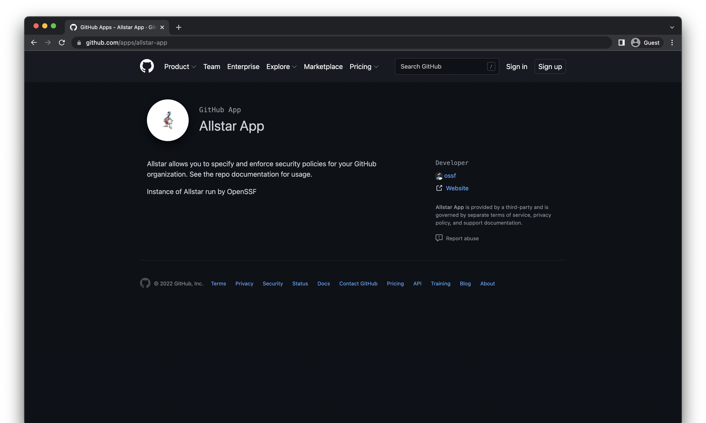

theme: Minty Next
footer:  @di_codes
[.code: auto(42)]

## *PyCon APAC 2022*
# Protecting the
# Collective Good

---

# *Hi, I'm Dustin*

* Director, Python Software Foundation
* Maintainer, Python Package Index
* Software Engineer, Google Open Source Security Team (GOSST)

^ PSF, where I help ensure the long-term success of one very big open-source Python project you've probably heard of: python itself

^ PyPI, where I help ensure the long-term success of hundreds of thousands of tiny python projects, many of which you've never heard of

^ GOSST, where our mission is to Improve the security of open-source software that Google -  and the world - relies on.

---

# Disclaimer

^ Opinions expressed are solely my own and do not express the views or opinions of my employer, or of the PSF.

---

## _About this talk_
# A Foreword

^ this talk is about protecting the collective good

---

## _We are_
# Builders

^ as developers, as programmers, we are really good at building things

^ we have a near infinite amount of tools and raw material at our disposal -- and usually for free

^ I think sometimes we tend to get caught up in the building, because it's fun, because we're good at it

---

## _What are we building?_
# And why are we building it?

^ and sometimes I think we don't stop often enough to ask ourselves what are we building? why are we doing it?

^ what outcome are hoping to achieve with what we build? what outcome is someone else hoping to achieve with what we build?

---

## _What is the 'collective good'?_
# Why does it need protected?

^ in this talk, I'll explain what I mean by the 'collective good'

^ why I think it needs protected

^ what we're building, and why we're building it.

^ and why I think it's important to reflect on what we're building and why we're building it.

^ and how you can help.

---

## _Part 1:_
# A story

^ But first, I want to tell you all a story, a true story about about two very similar women, who traveled two very different paths.

---

[.hide-footer]


^ This is gertraud junge. She was born in Munich, Germany in 1920.

^ When she was 15, she joined the Bund Deutscher Mädel (League of German Girls).

^ She was a dancer and wanted to be a ballerina in Berlin, but by 1941, the start of the second world war prevented her from joining a dance school, so instead she trained to be a secretary.

---

[.hide-footer]


^ This is sophia scholl. She was born in Forchtenberg, Germany, which is about 300km from Munich, in 1921.

^ At the age of 12, like gertraud, she also chose to join the BDM.

^ She had a talent for drawing and painting, and in 1940, she graduated from seconday school and became a kindergarten teacher.

---

[.hide-footer]


^ after finishing training to be a secretary, in 1942, at the age of 22, gertraud heard about a job opening for a secretary at the the government office of the Chancellor of Germany, applied for it, and got the job.

---

[.hide-footer]


^ that same year, sophie scholl enrolled in the university of munich.

^ Later that year, after becoming increasingly disillusioned with the Nazi regime, she, her brother Hans, and several other students founded The White Rose, which was a nonviolent, underground resistance group.

^ The members adopted a strategy of passive resistance against Nazi policies and regieme, writing and distributing leaflets which called on the German people to take action to stop the injustice and genocide happening in their country.

---

[.hide-footer]


^ In 1943, gertraud is given the opportunity to transfer to Hitler's headquarters and began working directly for him as one of his private secretaries.

^ Despite being so close to the Nazi leader, she has little to no idea about what the regieme is doing.

^ She later said:

---

"I was 22 and I didn't know anything about politics; it didn't interest me."
<br>
—Gertraud Junge

---

[.hide-footer]


^ On february 18th, 1943, Sophie and her brother Hans were arrested by the Gestapo while distributing flyers at the Ludwig Maximilian University.

^ In her defense in court four days later, Sophie said:

---

"Somebody, after all, had to make a start. What we wrote and said is also believed by many others. They just don't dare express themselves as we did."
<br>
—Sophie Scholl

^ The court found Scholl, her brother, Hans, and their friend, Christoph Probst, to be guilty of treason.

^ they were executed later that day. Sophie was 21 years old.

---

[.hide-footer]


^ gertraud remained in berlin with hitler until the end of the war in 1945, and was responsible for typing Hitler's last private and political will and testament on the day before his death

^ because of this, she is known as 'hitlers last secretary'

^ after being captured by the soviets and americans, and being interrogated about her role in the end of the nazi regieme, she was freed in 1946, and allowed to live in West Germany.

^ Eventually she died from cancer in Munich in February 2002 at the age of 81.

^ Throughout her life, she was interviewed about her experiences during and after the war a number of times.

^ In one of these interviews, she said:

---

"Of course, the horrors, of which I heard in connection of the Nuremberg trials... shocked me greatly, but, at that time, I could not see any connection between these things and my own past."
<br>
—Gertraud Junge

---

"I was only happy that I had not personally been guilty of these things, and that I had not been aware of the scale of these things."
<br>
—Gertraud Junge

---

[.hide-footer]


^ One day, in munich, Gertraud walked past a plaque on the wall in memory of Sophie Scholl, and learned about her for the first time.

---

"I must often have walked past the commemorative plaque to Sophie School without noticing it. One day I did, and I was terribly shocked when I realized that she was executed in 1943, just when I was beginning my own job with Hitler."
<br>
—Gertraud Junge

---

"Sophie Scholl had originally been a BDM member herself, a year younger than me, and she saw clearly that she was dealing with a criminal regime."
<br>
—Gertraud Junge

---

"All of a sudden, I had no excuse anymore. It was no excuse to be young. It would have been possible to find things out."
<br>
—Gertraud Junge

---

# Why am I telling you about this?

^ I was reminded of the story of Sophia and Gertraud, the story of two very similar women, one who confronted politics head on, and one who ignored them, from this tweet by Al Sweigart

---

[.hide-footer]


^ if you don't know Al, he's the author of 'automate the boring stuff with python', and many other excellent books on Python

^ and if you do know al, you know he's also not someone to shy away from politics

^ (explain: he got a DM, etc)

^ I feel like I've started seeing a trend where people really want to separate tech from politics, or just generally put politics in this tidy little box somewhere they don't have to think about it

^ and look, I get it. politics isn't really particularly fun, and lately, for some of us, it's been a challenging and potentially traumatizing part of our lives

^ so Like Al, I _also_ want to live in a world where I can just come and talk to you about Python

^ but here's the thing:

---

## _Python doesn't exist_
# In a world without politics

^ python doesn't exist in a world without politics

^ python is a product of our world, of the individuals that created it, _AND_ of their politics

^ if you think Python is a piece of pure technology completely devoid of politics, you're wrong

^ Python is an incredibly powerful piece of technology, built and maintained for free by a collective of volunteers, and distributed for free to anyone entirely without restriction whatsoever.

^ if that's not political, I don't know what is

^ and, look, it's not just Python. it's everything

---

## _We don't live_
# In a world without politics

^ we don't live in a world without politics

^ this means that...

---

## _Technology is inherently political_
# Attempts to remove politics from tech, doubly so.

^ all tech is inherently political.

^ sometimes, attempting to remove politics is just akin to putting your head in the sand and pretending like poltics doesn't affect you, like gertraud junge

^ but sometimes, it's an active attempt to suppress legitimate dissent, like what happened to sophie scholl.

^ either way, the act of trying to remove politics is, in and of itself, political!

^ and even inaction is political, and, potentially, dangerous

---

## _Part 2:_
# The collective good

^ so what is the collective good? let's take Python as an example

^ this community exists an is successful because WE made it

^ python, and everything related to python, exists and is successful because WE made it

^ and I think we all, collectively, can agree that it's good. Python is incredibly useful. It might not be perfect, but it's a net good for the world

^ it exists because at millions of tiny points in it's history, people made the conscious decision to make it good, and keep it good.

^ and the sum of all those decisions were more powerful than anyone that chose inaction instead

---

## _Protecting the collective good_
# Is your responsibility

^ you might not feel personally responsible for the collective good of python. that's OK!

^ you might have never written a line of python, and this is your first Python conference: to that I say, welcome!

^ you might not be a maintainer of a popular package on PyPI: don't worry, there's plenty already :)

^ you're probably not a core developer: that's ok, I'm not either :)

^ but I fundamentally believe that as a member of this community (and if you're listening, I do consider you a member of this community) it's your responsibility

^ that's why python exists: some people put some time and effort into it, sometimes more than they got out of it, but usually not

^ and if you don't know how to do that, don't worry, I'm going to show you how

---

## _Sometimes it means_
# Doing things that are hard

^ I'll give you a personal example: I'm currently the primary person who responds to reports of spam or malware on PyPI.

^ dealing with it is not fun. it's time consuming, it's thankless, it's somewhat demoralizing and it's never-endless

^ and yet... I do it anyways.

^ not saying I'm sophie scholl

^ but my ultimate desire is to make things collectively better, and I think, in at least some small part, I have

---

## _Sometimes it means_
# Not doing things that are easy

^ Another personal example: when I finished college, I had a job all lined up with the research lab I had worked with in grad school.

^ it would have been so easy for me to continue on that path, keep doing the same work, with the same people.

^ but I spent a lot of time thinking about what the total outcome of everything I did would be if I had

^ and I decided that morally, I wasn't OK with it. because I couldn't see how it would be a benefit to the collective good. and I thought I could do better

^ more or less restarting my career wasn't easy. but: I'm incredibly glad I did.

---

## _Generally it means_
# Just doing something

^ Remember: even inaction has effects, but usually, they're negative.

^ So what can you do?

---

## _Part 3:_
# A call to action

^ Here's the thing, I work in software security, specifically open source software security

---

## _It takes two_
# To tango

^ you know the phrase 'it takes two to tango'?

^ this means that the only reason my job exists is because there are people want to do harm to open source

^ to the users of open source

^ So most of things I think you should do are going to be related to open source software security

^ The good thing is: I'm guessing almost all of you are open-source software users

^ So most of this should be applicable

---

## _The three levels_
# Of software security threats

^ these are three wildly different levels of threats to open source software users!

---

## _The three levels_
# Of software security threats

1. trying to steal your monkeys

^ the first one is by far the most common. the NFT and cryptocurrency community is, essentially rife with people trying to rob you.

---

[.hide-footer]


^ when you hear about things like malware on PyPI, it's almost definitely #1. this includes things like stealing compute to mine cryptocurrency, encrypting file systems and holding them ransom, etc. it's for financial gain. these are fairly harmelss, but still harmful.

---

## _The three levels_
# Of software security threats

1. trying to steal your monkeys
2. trying to do you some harm

^ the second is less common. an attacker wants to do you, or your organization, some harm. maybe it's financially motivated, maybe not. maybe it's for a bug bounty, or maybe it's just for the lulz.

---

[.hide-footer]


^ an example of this is this particular type of supplychain attack which directly targeted large corporations

---

## _The three levels_
# Of software security threats

1. trying to steal your monkeys
2. trying to do you some harm
3. trying to do some cyber-war


^ the third is the 'low frequency, high impact' threat, usually perpetuated by state actors. this is attacks like solarwinds

---

[.hide-footer]


^ I'm assuming everyone and their mother has heard about Solarwinds by now, but if you haven't

^ it was described as the 'largest and most sophisticated attack' ever

---

[.hide-footer]


^ and was called a 'worst nightmare' cyberattack

---

[.hide-footer]


^ because it was extremely sophisticated and directly attacked the US government

^ all of these types of threats could affect any of us

^ I want you -- our collective community -- to be protected against all of these

^ Partly because I care about protecting the collective good, and partly because it's my job

---

[.hide-footer]


^ you see, the solarwinds attack was almost directly responsible for the creation of US executive order 14028, on improving the nation's cybersecurity

^ for anyone not based in the US, or for anyone based in the US but not up on how their government works, an executive order is kinda like an email from your boss telling you what to do.

^ this has the effect of setting policy for the entire executive branch and federal government

^ it's also kind of like placing an order at a restaurant, in the sense that you kinda say what you want to happen, and people go off and try and figure out what that means, and how to make it happen, and maybe this takes a while

^ this EO was published almost a year ago, and we're still at the 'everyone is trying to figure out how to make it happen' stage

---

[.hide-footer]


^ this executive order has a number of directives, but it specifically calls out the software supply chain

^ and if you think for a minute this is just limited to government entities, remember that the government uses a lot of software

^ they also use a lot of the same software you and I do

^ so the terms of this order sort of have a 'viral' effect of improving software security for everyone. This is a good thing

^ as a result, a number of organizations, including Google, have stepped up to make improvements here

^ not just for google, not just for the US government, but for the entire ecosystem

^ this means that many of my suggestions are going to be a little biased, because these are the things that I think are worthwhile improvements, and that my team things are worthwhile improvements

^ also, remember: inherently political!

---

## _What you can do_
# To protect the collective good

^ Most of these are going to seem focused on your personal software security

^ And taking these steps, or adopting these tools, will likely help protect you and your organization

^ But consider that any attack against you might be part of a bigger, larger attack

^ against the collective good

^ all of these require some effort on your part -- some more than others

^ even inaction has effects, but usually, they're negative.

---

## _First:_
# Enable 2FA

^ enable it everywhere, but specifically, enable it on PyPI

---

[.hide-footer]


^ you might have heard recently that PyPI was the target of a phishing attack

^ and some user accounts, which were not protected with 2FA, were compromised

^ for users with 2FA enabled with security keys, they were unaffected

^ but additionally, PyPI users may also be vulnerable to credential stuffing due to password reuse, leaked credentials, etc.

^ which 2FA also protects against.

---

# pypi.org/2fa

^ Seriously, if you do one thing after this talk, go and enable 2FA on PyPI if you have an account

^ even if you don't maintain any projects there, if there's even a chance you will in the future: go do it

^ not only will you protect your current or future users, but you'll also save the PyPI team from having to deal with a potential future compromise of your account

---

[.hide-footer]


^ additionally, if you're the maintainer of a critical project

^ we're giving away 4000 titan security keys for free to maintainers of critical projects

^ to help them enable 2fa with hardware keys

---

[.hide-footer]


# [fit] pypi.org/security-key-giveaway

^ available until october 1st

---

## _Second:_
# Be aware of known vulnerabilities

^ Humans are humans, bugs will get written

^ You should be immediately aware of the presence of known vulnerabilities in your applications, environments, libraries, etc.

^ And be able to quickly remediate them

^ How does this help the collective good? If your software is vulnerable, and an attacker knows about it, but you don't, you or your users might become a target. This has potentially far-reaching effects, beyond your own software. E.g., what if your software is a dependency for something more widely used?

^ Two things that will help with that:

---

## *New!*
# Community advisory databases

^ The Python Packaging Authority has created a centralized, ecosystem-specific public repository for security advisories

^ With the goal of making it easier to report and discover security advisories

---

[.hide-footer]


^ these exist for most major ecosystems

---

[.hide-footer]


^ This use the Open Source Vulnerability format, provided by the Open Source Vulnerabilities project

^ OSV also has an API and acts as a vendor-neutral aggregator and mediator for vulnerabilities

---

[.hide-footer]


^ here's an example of a recent advisory for django

^ but are you supposed to read each of these by hand? no!

---

## *New!*
# Vulnerability auditing software

^ these aren't specifically new -- similar software has existed before

^ but what's new is that these are community-owned tools, which use the advisory databases previously mentioned

---

[.hide-footer]


^ in the last year I helped create and release pip-audit, which is a third party tool

^ you can run this locally, run as part of your release process, your integration tests, etc

^ run it in a container or against a requirements file

^ will tell you if any known vulnerabilties are present

^ you should feel confident that you're not deploying or releasing something with a known vulnerability

---

# *Using `pip-audit`*

* Audit the local environment
  * `$ pip-audit`

* Audit a requirements file
  * `$ pip-audit -r requirements.txt`


---

# *Using `pip-audit`*

```
$ pip-audit
Found 2 known vulnerabilities in 1 package
Name  Version ID             Fix Versions
----  ------- -------------- ------------
Flask 0.5     PYSEC-2019-179 1.0
Flask 0.5     PYSEC-2018-66  0.12.3
```

---

# *Using `pip-audit`*

```
$ pip-audit --fix
Found 2 known vulnerabilities in 1 package and fixed 2 vulnerabilities in 1 package
Name  Version ID             Fix Versions Applied Fix
----- ------- -------------- ------------ ----------------------------------------
flask 0.5     PYSEC-2019-179 1.0          Successfully upgraded flask (0.5 => 1.0)
flask 0.5     PYSEC-2018-66  0.12.3       Successfully upgraded flask (0.5 => 1.0)
```


---

## _Third:_
# Enforce security policies for source control

^ above and beyond what your source control repo can provide

^ reduces the surface area for ways in which your source repository could be compromised

---

[.hide-footer]


---

[.hide-footer]


# [fit] github.com/apps/allstar-app

---

# *Understanding Allstar*

* A GitHub app
* Enforces best practices
* Allows you to set policy
* Across an entire organization

^ e.g. branch protection, binary artifacts, outside collaborators, fuzzing, etc

---

[.hide-footer]


^ for example, just created this issue the other day

^ the org had set a policy and the repo was in violation of that policy

---

## _Fourth:_
# Use Security Scorecards for OSS projects

---

[.hide-footer]


^ Security Scorecards assesses open source projects for security risks through a series of automated checks

^ You can use it to proactively assess and make informed decisions about accepting security risks within your codebase.

^ You can also use the tool to evaluate other projects and dependencies, and work with maintainers to improve codebases you might want to integrate.

---

[.hide-footer]


---

[.hide-footer]


# [fit] securityscorecards.dev

^ these run in CI against your project, give you a score

---

## _Fifth:_
# Sign with Sigstore

^ signing helps ensure integrity as artifacts move from one place to another, are published, redistributed, etc.

^ historically, signing meant using GPG, and that technology has been around forever

---

[.hide-footer]


^ sigstore is a new project by the linux foundation across multiple vendors including google

^ it's a new way to think about signatures, identities and trust

^ I could do an entire talk on sigstore and how it works alone

---

[.hide-footer]


^ the short version is it's easier to use than GPG, and it's not just cryptographic signing

^ GPG requires humans to not be humans, because GPG requires users to maintain private keys, and humans lose things

^ someone once said to me, "gpg would be great if you could also go around permanently stapling everyones private keys to their foreheads", can't do that

^ with sigstore, it's easier to establish trust in individual identities, a common problem with GPG

^ and it integrates incredibly well with existing cloud platforms and CI systems

---

[.hide-footer]


# sigstore.dev

---

[.hide-footer]


^ to make sigstore easy to use for Python users, we've built a native python client for signing and verifying signatures

^ includes detecting ambient credentials, which means if you try to sign something in an environment that provides an appropriate identity, will use that automatically

^ not feature complete yet, but working towards a 1.0 release

---

## _Sneak peak!_
# Signing CPython releases with Sigstore

^ something I'm so excited to announce

^ the upcoming CPython 3.11 release will be signed with Sigstore in addition to GPG

^ been working on this for a long time!

---

[.hide-footer]


^ fully detailed explanation of how to verify Sigstore signatures for CPython

---

[.hide-footer]


# [fit] python.org/download/sigstore/

^ stay tuned for more!

---

## *Sixth:*
# Be a user

^ This means you!

^ Try this stuff out, tell us how it works for you, share your experience

^ Possibly become a contributor, it's all open source!

---

## *Seventh:*
# Take open source security seriously

^ it might take some investment of your time and energy

^ but I promise you it's worth it, to protect the collective good

^ remember, that's why python exists: some people put a little time and effort into it, sometimes more than they got out of it, but usually not, to make it better

---

## *The end... but first:*
# Thank you.

^ That's the end of my talk, but before I end, I want to say thank you

^ Thank you all for listening

^ Thank you to the PyCon APAC organizers for inviting me to speak, and for putting a ton of work into what I'm sure will be an amazing conference

^ Thank you to the PyCon Taiwan organizers for acting as host for the event this year

---

[.hide-footer]


^ This is not the first time I've spoken at your conferences. I was at PyCon JP in 2019 (do you know pycon japan?)

---

[.hide-footer]


^ and I spoke at PyCon taiwan in 2019

---

[.hide-footer]


^ remains to be the only conference I've ever been at with a string ensemble

^ both of these are among my favorite Python conferences and communities I've seen.

---

## _My wish_
# For the future

^ You all have amazing countries, culture, and community. There is collective good there.

^ I want to say my wish is that I could be there in person this year, but I admire that your primary concern is keeping everyone safe. Thank you for that.

^ If the pandemic has taught me anything, it's that we really don't know what the future will bring, but keeping each other safe, keeping our community together, and protecting the collective good is of the utmost importance.

^ Instead, my wish we can all be together again at some point in the future.

^ And I wish you all the best in everything necessary to make that wish a reality.

---

[.hide-footer]

# *Thanks!*
##  @di_codes
