autoscale: true

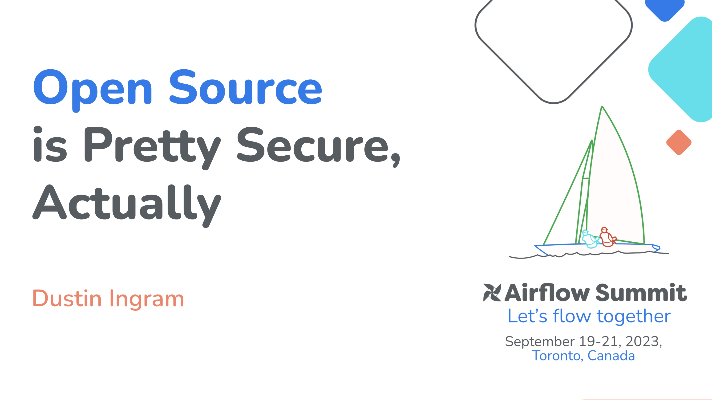

---

# Knoll's Law
## *of media accuracy*

^ do y'all know about knolls law?

---

# Knoll's Law

"Everything you read in the news is absolutely true...

---

# Knoll's Law

"Everything you read in the news is absolutely true... except for the rare story of which you happen to have firsthand knowledge"

^ For me, that area of firsthand knowledge is around open source and security

---

# Firsthand knowledge

* Google's Open Source Security Team
* Python Software Foundation
* Python Package Index
* Open Source Software Security Foundation

^ I have a little bit of firsthand knowledge!

^ GOSST, where our mission is to make the open source software that google -- and the rest of the world -- more secure

^ PSF board, where I help ensure the long-term success of one very big open-source Python project you've probably heard of: python itself

^ PyPI maintainers, where I help ensure the long-term success of hundreds of thousands of tiny python projects, many of which you've never heard of

^ OpenSSF TAC, where I help guide the success of the next generation of open source security technologies.

^ so, it's literally my job to figure out the ways in which open source is insecure, and how to fix it.

^ and lucky for me, there has been a lot of attention paid to this area recently

---

# Headlines

* "The Next Supply Chain Attack Vector: Open-Source Software"
* "Attacks on Software Supply Chains To Increase in Severity in 2023"
* "Software Supply Chain Attacks Hit 61% of Firms"
* "Banking Sector Targeted in Open-Source Software Supply Chain Attacks"
* "Coder unpublished 17 lines of JavaScript and 'broke the internet'"
* "Researchers find 633% increase in cyber-attacks aimed at open-source repositories"
* "The Internet Is on Fire"

^ I've seen so many headlines like ...

---

# Headlines (continued...)

* "Dozens of malicious PyPI packages discovered targeting developers"
* "Malicious PyPI packages stealing credit cards and injecting code"
* "Malicious software libraries found in PyPI posing as well known libraries"
* "3500 packages uploaded to PyPI, pointing to a malicious URL"
* "This malicious PyPI package mixed source and compiled code to dodge detection"
* "Frankenstein malware stitched together from code of others disguised as PyPI package"

^ even some python-specific examples

^ heres a headline for you:

---

# Headline:
## *I'm tired of these headlines*

^ You'd think, "great dustin! half your job is already done, just go fix those things". but no.

^ It's not that they're wrong, per se. Just that it's sort of like declaring "water is wet!"

^ For anyone with firsthand knowledge, this is stuff that has been known for a long time, frankly ignored for a long time.

^ But to be honest, I'm tired of these headlines

^ So tired, in fact, that I'm just going to write the one headline to end all headlines

^ So let me just get this out of the way

---

# Headline:
## *Python Is Not "Secure"*

^ I'm not going to lie! It's not, not by any means

^ Anybody can publish anything they want on PyPI

^ Python itself doesn't have sandboxing by default, and can do anything it wants on the machine it's running on

^ and while Python is generally considered memory-safe, it's built on C and many libraries make heavy use of the CFFI to call native, potentially memory-unsafe code.

^ really, this isn't limited to just Python, the truth is...

---

# Headline:
## *Open Source Is Not "Secure"*

^ there is no perfectly secure software ecosystem, programming language, deployment environment, cloud provider. open source is no exception.

^ some are better than others in some ways, and yes, we still have very real problems to solve

^ none of them are perfectly secure, and never will be

^ but, overall:

---

## ...*but open source is __pretty__ secure, actually!*

^ this is my premise for my talk

^ no matter what you hear about the insecurity of open source

^ it's but a small flaw in an otherwise iceberg sized secure ecosystem

^ and in fact, many things we consider security issues are not necessarily flaws, but tradeoffs we have made over time, for usability, etc.

^ I want to give you a bit of context about these tradeoffs

^ what I think you should be worried about, and what you shouldn't be worried about

^ and how we've continued to get better over the years -- especially recently

---

# This talk

* Understanding tradeoffs
* Evaluating impact
* Making progress

^ overall, I want to give you some context for security in our ecosystem

^ but generally, this advise should be applicable to any ecosystem, software project, not just limited to security

^ I want to give you an overall sense that the Python ecosystem has generally made the right decisions when it comes to security

^ and if you already feel that way, I want to show you how to help continue to keep it that way

---

## **Part 1:**
# Understanding tradeoffs

^ so here's the thing you need to understand about tradeoffs:

---

# Everything
## *is a tradeoff*

^ there are tradeoffs in every decision, and there is never just one best solution.

^ in literally every engineering decision, a tradeoff has been made

---

# Bugs
## *are tradeoffs*

^ Your code probably has bugs. Sorry, but it's true. But it's ok!

^ You wrote those bugs, maybe not intentionally, but as part of a tradeoff

^ You could have spendt 10x, 20x the time writing the code, reviewing the code, testing the code, and it probably would have had less bugs. Still not perfect, but better.

^ Instead, you had more time to add a new feature. Or you got a feature out faster. Or you were able to fix more issues your users were experiencing.

^ This is a tradeoff. Overall, your project is probably better because it has those bugs.

---

# Breaking changes
## *are tradeoffs*

^ A breaking change is also a tradeoff

^ Rather than spending an order of magnitude more time getting the design exactly right the first time (and, let's be honest, probably still getting something wrong), you got it into the hands of users faster, got feedback faster, and hopefully can iterate on it.

^ at the expense of a somewhat rough or expensive transition down the road

---

# Insecurities
## *are tradeoffs*

^ Not unlike bugs: you can devote your entire engineering budget to security, and as a result, you would have less vulnereabilities. But you wouldn't get anything done.

---

# Python is a success
## *because of its tradeoffs*

^ Python is more than 30 years old, PyPI is 20 years old, and we've made some significant tradeoffs in that time

^ This is not to say that every tradeoff we made was the _right_ tradeoff -- we've definitely learned some lessons as well (like how and when to do a major version bump)

^ But overall, each of these is a tradeoff that has ultimately led to Python's success.

^ Here's a headline:

---

# Headline:
## *Python is a success!*

---

# What's important:
## *how we handle our tradeoffs*

^ The important thing is not whether we make a tradeoff, but how we handle the issues that arise as a result

^ If you're writing mildly buggy code but have no system to catch, triage and fix those bugs, that's the problem.

^ Similarly in Python, we have made tradeoffs, but overall we have good systems to handle the side effects of those tradeoffs

---

# Example:
## _Malware on PyPI_

^ I'll give you one example: malware on PyPI. lots of news about it! happens all the time.

---

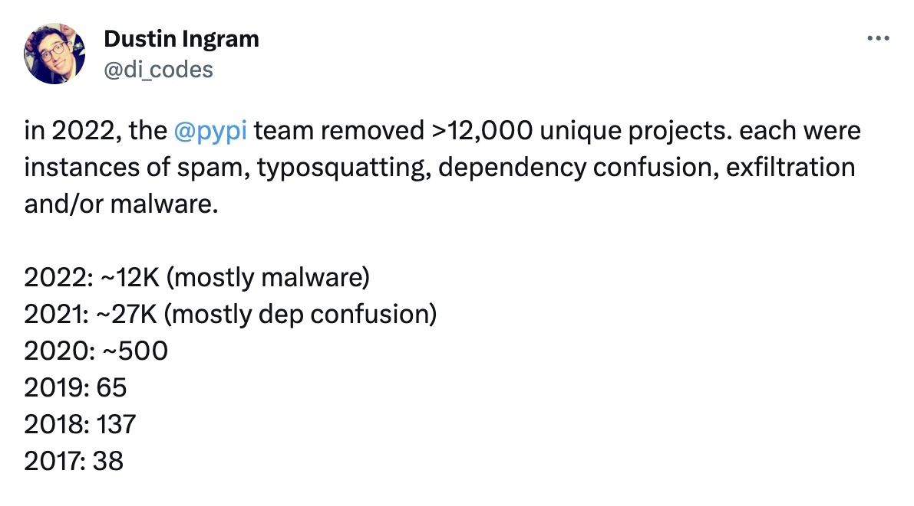

^ I personally have removed thousands of malware packages from PyPI, almost all of them reported by third-party security researchers

^ take my word for it: this is not a thing I enjoy doing

^ but also take my word for it: I'm glad that I have to do it

---

# Malware
## *is a tradeoff*

^ if you look for solutions to this problem, a lot of people will say "just block all malware on pypi" or "add additional obstacles to publish" or "require an audit before a release can go live".

^ putting aside, for a moment, whether that's even possible. is it even desireable, overall?

^ people complain all the time about the complexity of python packaging, but challenges publishing to PyPI is rarely part of that, because we've put a ton of effort into making that as easy as possible.

^ the fact that it's easy to publish some random malware package on PyPI is because it's easy for anyone to publish anything on PyPI.

^ this is noticible and not imagined

---

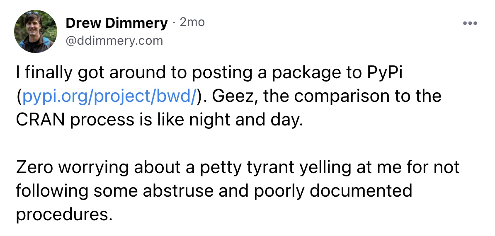

^ when you compare the experience as a maintainer on PyPI to the experience of a maintainer on other ecosystems

^ this is not to say that this other ecosystem is bad, to be clear.

^ just that they have made a different set of tradeoffs.

^ it's easy to say that the solution to malware on pypi is "well, just block all malware"

^ repos like CPAN and CRAN has almost no malware on it, as far as I'm aware. but this comes at the cost of signficiant friction for it's users

^ classifying software is hard. especially hard in a powerful and dynamic language like Python, and harder at scale like PyPI.

^ a false negative means that malware becomes trusted. a false positive means something legitimate, that people might need, is getting blocked or removed in error.

^ as a result, you need a human in the loop, because the last thing we want to do is accidentally wipe someones legitimate project off of PyPI

^ at pypi's scale, something like what CRAN does is not really feasible

^ but we're OK with that, because we've evaluated the overall impact and decided it's worth it

---

## **Part 2:**
# Evaluating impact

^ one of the key thing to take into account when evaluating a tradeoff is impact

^ in the example before, I said bugs were tradeoffs. you're ok with having a few bugs in your software because the overall impact of the average bug is probably not that bad.

^ and, you probably have good procedures around detecting, triaging and resolving bugs.

^ hopefully, you also have a way to evaluate the impact of bugs and generally can limit their scope

^ but sometimes, perhaps rarely, bugs can have an outsized impact

---

# Example:
## *The Knight Capital bug*

^ knight capital was an american financial services firm

^ you'll note that I say "was"

^ in 2012 they had 1400 employees and were the largest trader in U.S. equities with a market share of around 17 percent of the New York Stock Exchange

^ managed an average daily trading volume of more than 3.3 billion trades, trading over $21 billion daily.

---

# Knight Capital:
## *In memorium, 1995–2012*

^ knight capital doesn't exist anymore

^ in fact, knight capital went from existing to not existing in the course of about 45 minutes, when a bug in it's automated trading system caused it to purchase nearly $7 billion of stocks in less than an hour.

^ the team at knight weren't even the once that noticed this was happening. analysts at the NYSE noticed that trading volume was more than twice the normal amounts and determined Knight to be the source, and literally called them up to let them know.

---

# Knight Capital:
## *And the very impactful bug*

^ If you read about the downfall of Knight Capital, you'll see a lot of people claiming that the bug that caused this was impossible to predict

^ that's fair, most bugs are impossible predict. if you have a way to predict bugs, let me know

^ however, the issue isn't that they couldn't predict the bug. it's that once the bug manifested itself, they didn't have a good system for handling it, which let it grow in impact.

^ and that overall, they underestimated the potential impact of bugs like this, that they had insufficient safeguards

^ if the bug could have been stopped or reverted within a few minutes, they would likely would exist.

^ this is an example where there probably should have been more time spent on preventing bugs!

---

# Example:
## *The Python 2→3 migration*

^ I think another, more familiar example of the importance of understanding impact can be found in the python 2-3 migration

^ I mentioned before that this was a tradeoff: it was a collection of improvements via breaking changes that, if they hadn't been done, would have seriously hampered Python's ability to succeed and grow in a sustainable way

^ But I think we (the ecosystem at the time) seriously underestimated the impact the migration would have on Python users. I think we also underestimated the amount of Python users as well!

^ And the complexity of the systems they had built in Pyton 2

---

# Example:
## *Malware on PyPI*

^ I want to bring this back to our previous example about malware on PyPI being a tradeoff.

^ here's a question: is malware actually an impactful problem? I don't mean by number of articles written, but end users affected adversely.

^ obviously it'd be preferrable to not have malware on PyPI. and dealing with malware uses up a nontrivial amount of our time that could be better used elsewhere.

^ but in the grand scheme of all the things we can work on to make PyPI users more secure, is preventing malware the most impactuful thing we should focus on?

^ based on my experience, I would argue that it's not. It's a high occurence, low impact sort of thing. It happens often, but doesn't actually affect the large majority of users

^ on the other hand, an attacker getting access to the account of a single maintainer of a somewhat popular package and making a malicious release becuase their password leaked and they didn't have 2fa enabled would be highly impactful

^ this has happened exactly once, as far as I'm aware, but I would estimate that the number of users affected exceeds that of all users affected from random malware in the last year combined.

---

## **Part 3:**
# Making progress

^ Just because you've made a tradeoff doesn't absolve you from continuing to try to make progress against that which you've traded off against

^ I want to share some of the substantial and significant progress the Python community has made towards increased open source security

---

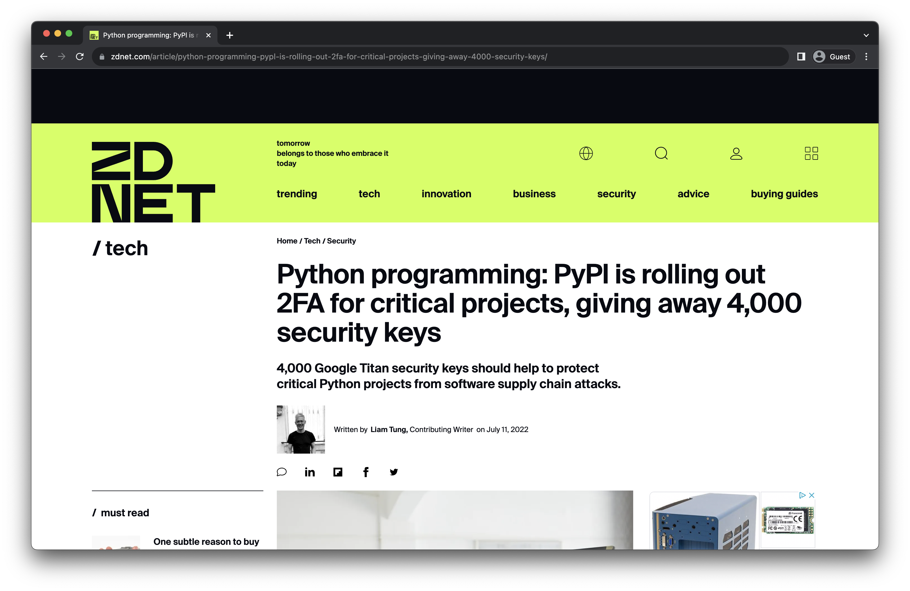

^ last year, you might have heard that we gave away a few thousand 2fa security keys to select critical projects

---

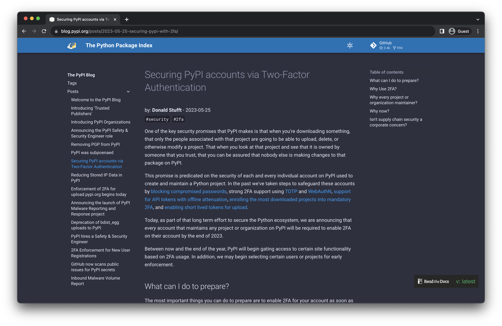

^ in may this year, we announced that every account that maintains any project or organization on PyPI will be required to enable 2FA on their account by the end of 2023.

---

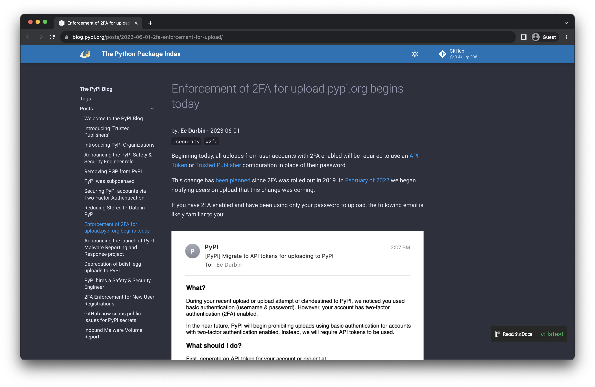

^ in june we required anyone with 2FA enabled to upload via API tokens

---

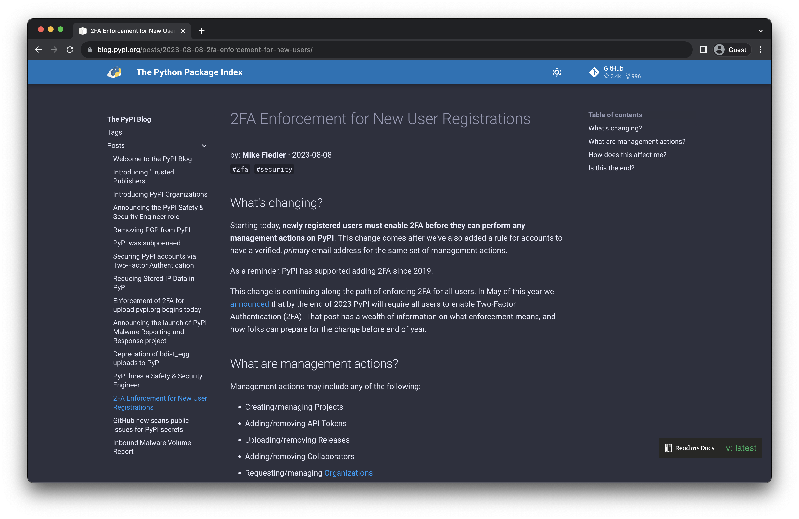

^ and in august we required 2FA for any new account

---

# Progress:
## *2FA key giveaway and mandate*

^ by the end of this year, we will require that for all accounts pushing code to pypi

^ why? we took a look at the number of users that were vulnerable to password leaks, phishing attacks, and the number of users that would be affected if just a small number of those accounts were compromised

^ we decided that the tradeoff, specifically the work we have to do to implement this, and support this, as well as the work each maintainer has to do to adopt 2FA if they haven't already, is worth it.

^ because the alternative is that we, the maintainers, waste a lot of time responding to what amounts to a very preventable class of attacks.

---

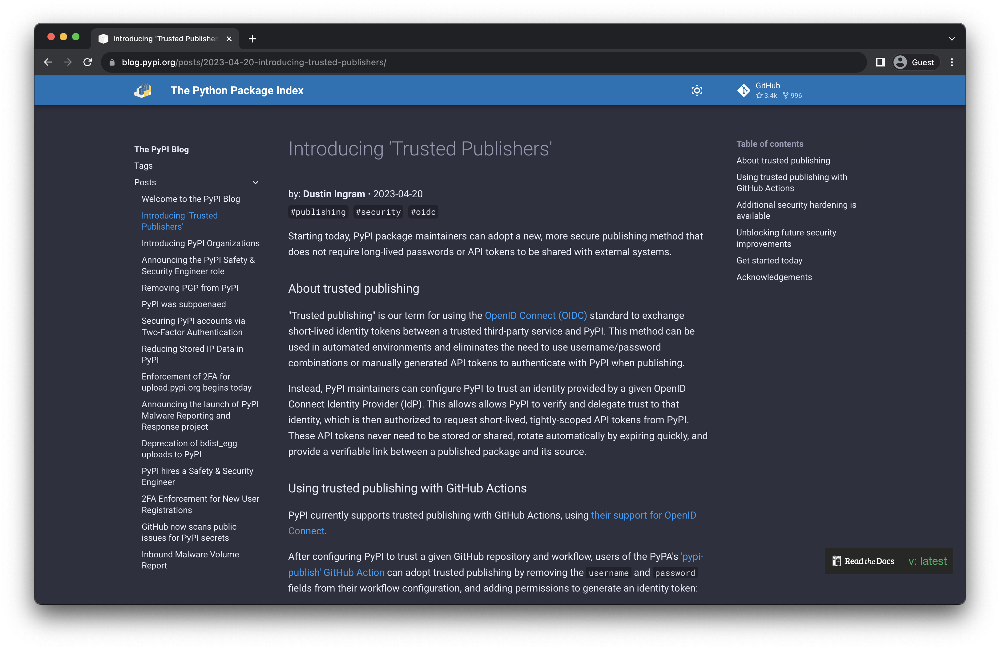

^ this is a new way for maintainers to publish to PyPI from hosted services like github actions, that does not require long-lived passwords or api tokens

^ this is something that requires maintainers to make a change, but we put a lot of effort in to miminimizing how much churn is necessary

---

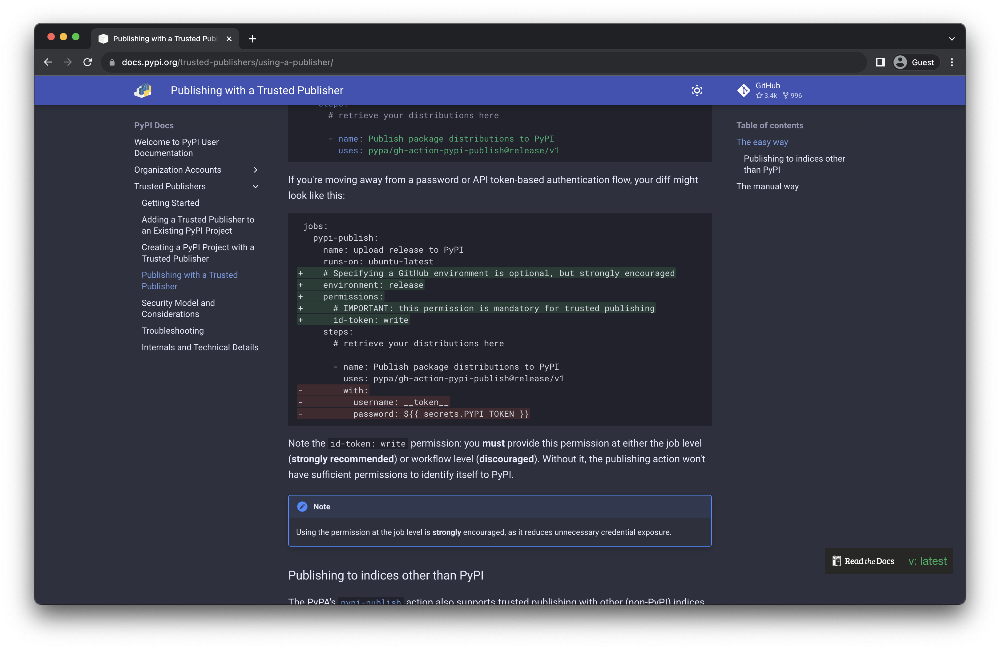

^ if you're already using the PyPA's provided github actions workflow, this is almost entirely abstracted away, and the diff is extremely small

^ most of these lines are to remove the api token from your workflow configuration and repo!

---

# Progress:
## *Trusted Publishing*

^ why? we looked at the impact of leaked credentials across hosted providers and the frequency of such leaks in the past, and found this was a good way to prevent the leak of credentials entirely

^ in terms of tradeoffs, there also isn't much of a downside to this, aside from implementation effort

^ there are other add-on benefits as well: trusted publishing provides a nice verified link between an upstream source repository and the artifacts hosted on PyPI that we never had before.

---

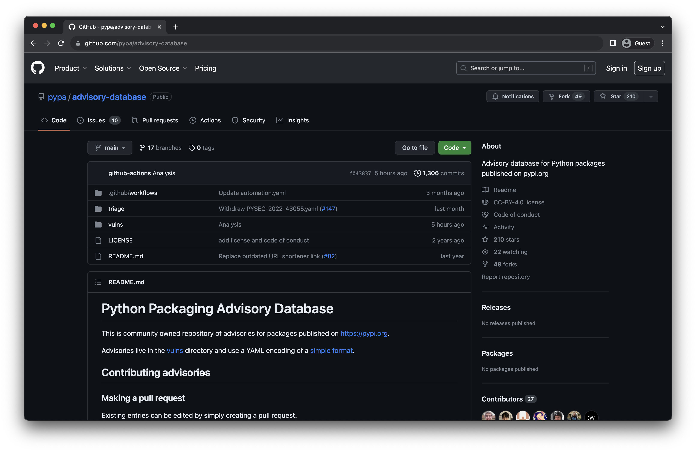

^ we created the python packaging advisory database, which is a community-owned collection of all vulnerabilities in python packages

^ and served these up via an API on PyPI

---

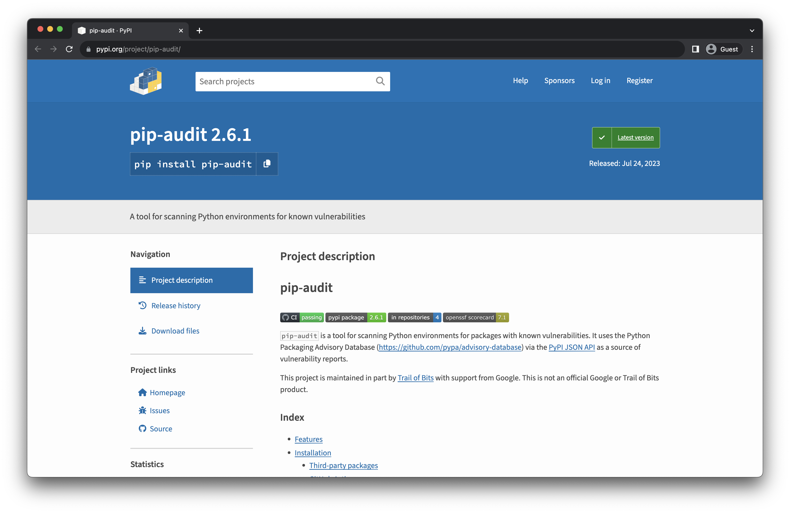

^ and built a corresponding tool to audit requirements files, lockfiles, and virtual environments for vulnerable versions, which includes functionality to automatically fix those respective things as well

---

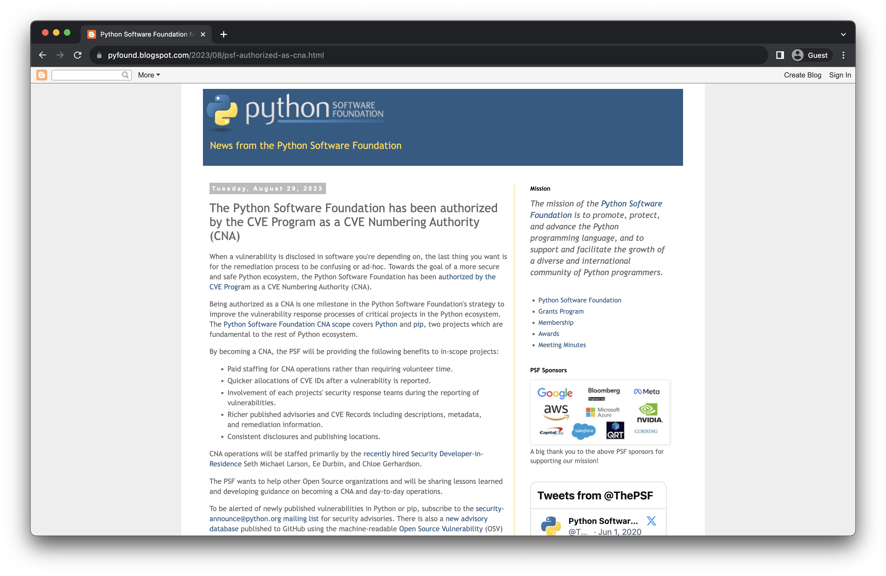

^ finally, last month we announced that the PSF has become a CNA.

^ lots of benefits, but overall this helps ensure that the advisories being published about python and related packages are meaningful and actionable to end users

---

# Progress:
## *advisories & `pip-audit`*

^ why? the impact of vulnerabilities in packages on PyPI could be potentially high

^ vulnerability auditing will always come with tradeoffs: it takes work to review the result of audits and take action on them as necessary

^ overall though, by providing tools that make it easier to find and fix

---

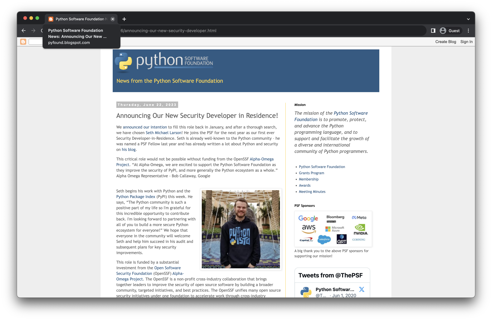

^ in june, the PSF announce the hire of the first security developer in residence, seth michael larson

---

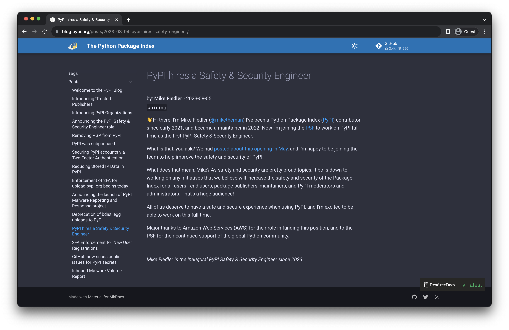

^ not to be outdone, in august PyPI hired a full time safety & security engineer, mike fiedler

---

# Progress:
## *PSF security staff*

^ there have been lots of people over the years who have contributed to security at the PSF

^ nobody that was paid to do it and had it in their job title

^ there are obvious tradeoffs here: the money spent to pay their salaries could go into PSF infrastructure, or grants for global conferences, etc.

^ but the impact so far has been great: seth has led the CNA process, and mike has been leading the...

---

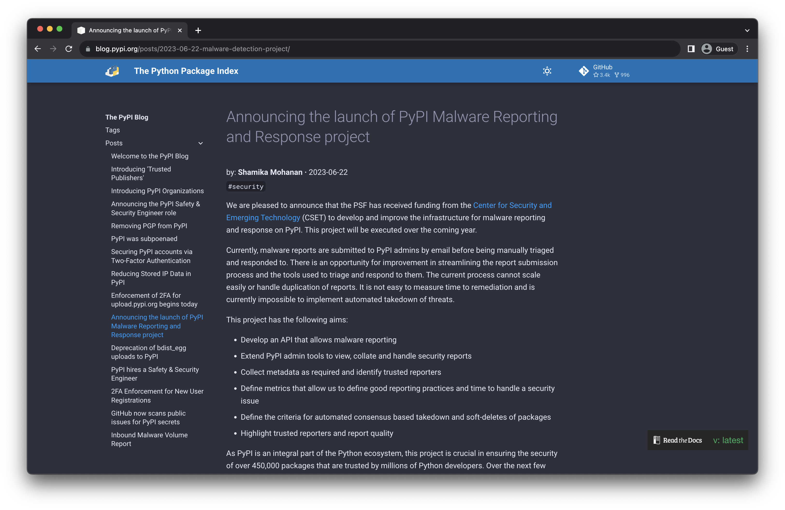

^ launch of PyPI Malware Reporting and Response project

^ just to bring it full circle

^ even though we've made this tradeoff, and the impact is low, we're still working to make this even better

^ right now, PyPI recieves malware reports from third-party security researchers, via email

^ responding to these, triaging them, handling duplicates and taking action can be time consuming

^ so we're building an API for reporters, and

---

# Progress:
## *Malware reporting project*

^ we're still a little early in this project to say that we've made a lot of progress

---

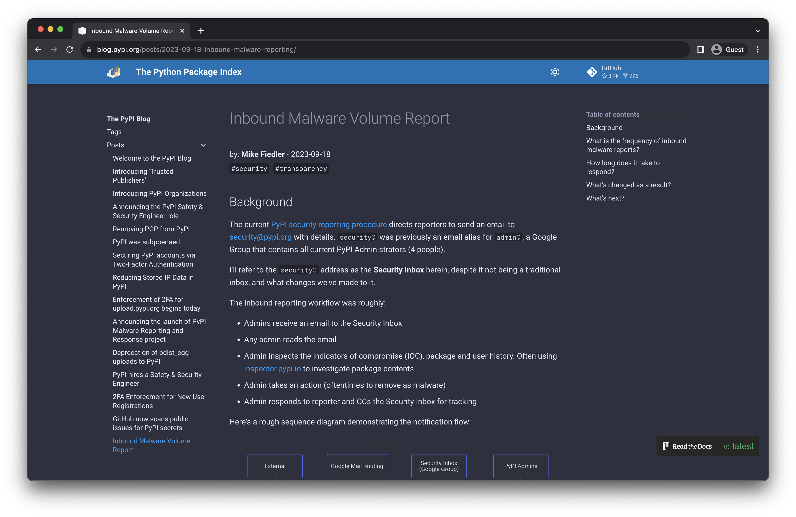

^ but mike just published a blog post yesterday looking at some of the key metrics around the volume of malware reports we recieve, with lots of details

---

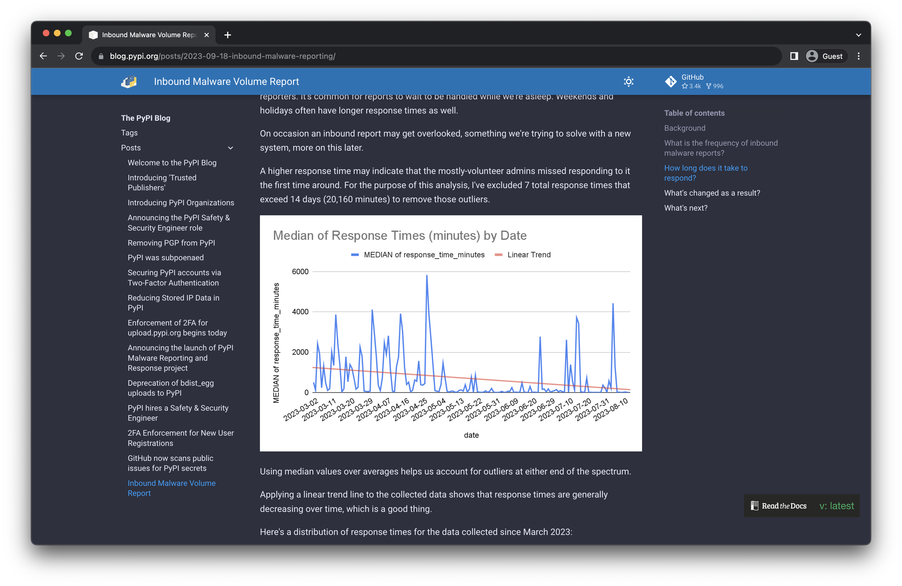

^ one of the findings is that even though we haven't officially started the project yet, response times to malware reports have already dropped over the last six months

^ currently, 80% all reports are responded to within 60 minutes of receipt, with 100% are responded to within 12 hours.

^ this is due to a mix of small process improvements, additional bandwidth to respond, etc.

^ strongly suggest taking a look at the post for more details if you're insterested

^ there's one final thing I want to say about progress

---

# Progress:
## *Is built on trust*

^ I just showed you a slice of the python ecosystem, but this is playing out across the entire open source ecosystem

^ Ultimately, this community exists because we trust each other

^ Part of that trust is that we can share code with each other and it will not do surprising things like erase our hard drive

^ Part of that trust exists because there are expectations, expectations like taking reasonable security measures to keep your users safe.

^ you put your trust in me to make the right tradeoffs

^ and likewise, I put that same trust in you.

---

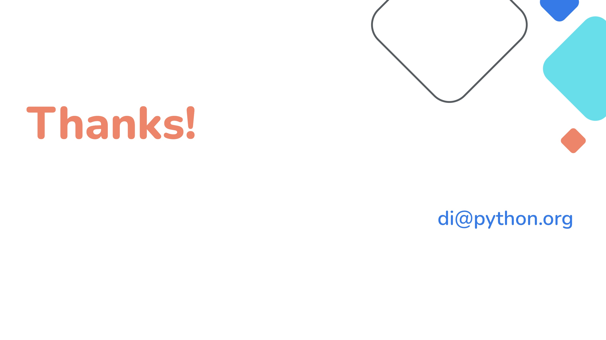

^ thanks to organizers and conference staff, for inviting me to join you at your conference

^ thanks to the open source security foundation for funding the Python Security Developer in Residence role

^ thanks to AWS for funding the PyPI safety and security engineer role

^ thanks to the Center for Security and Emerging Technology at Georgetown for funding the malware reporting project

^ thanks to my team at Google for funding security keys, pip-audit development and trusted publishing implementation, and much more

^ shoutout to everyone who has already enabled 2FA on PyPI

^ and thanks to you all for listening
