theme: Minty Next
footer:  @di_codes
[.code: auto(42)]

# Software Security
# _(and slippery slopes)_
## How to elevate
## an entire ecosystem at scale
### _PyCon US 2022_

<!--
https://us.pycon.org/2023/schedule/presentation/74/

Software security is a critical aspect of developing and maintaining reliable
and safe systems. In the case of large and popular open source ecosystems, such
as Python, ensuring security across a wide and diverse set of users and use
cases can be a daunting task.

In this talk, we will discuss the challenges of applying security improvements
to a widely used open source ecosystem like Python, and explore strategies for
addressing these challenges at scale. We will discuss the importance of
community involvement and collaboration, and the role of automation and tools
in facilitating the adoption of security best practices.

By the end of this talk, attendees will have a better understanding of the
challenges with and opportunities for improving software security in the Python
ecosystem, and will have some practical takeaways for adopting and facilitating
these changes in their own work.

-->

---

# Hi, I'm Dustin

* Google Open Source Security Team
* Python Software Foundation
* Python Package Index
* Open Software Security Foundation _(new!)_

^ GOSST, where our mission is to make the open source software that google -- and the rest of the world -- more secure

^ PSF board, where I help ensure the long-term success of one very big open-source Python project you've probably heard of: python itself

^ PyPI maintainers, where I help ensure the long-term success of hundreds of thousands of tiny python projects, many of which you've never heard of

^ OpenSSF TAC, where I help guide the success of the next generation of open source security technologies.

---

## How do we secure
# _an entire ecosystem?_

^ my focus at google is to think about how to increase adoption of security improvements across many open source ecosystems, including python's

^ and as a maintainer of PyPI, I also deeply care about making sure the Python ecosystem is safe and secure for all our users

^ so, I definitely care about how one would go about elevating an entire ecosystem at scale

^ but you don't have those same responsiblities. you probably don't have that job. so why do I think you should care?

---

# What I want you to get from this

* why this is hard
* why some churn is necessary
* how security increases sustainability
* how you can help

^ hard: what are the actual challenges that make this hard to do

^ churn: i'll explain what I mean by this, and why I think it's necessary, and how to deal with it

^ sus: there is more of a relationship between the two that you might expect

^ help: yes, there are ways for you to help

^ overall: give you insight into how these things change and the tradeoffs necessary at each point

---

## Everything is a
# _tradeoff_

^ there are tradeoffs in every decision, and there is never just one best solution.

---

## Part 1
# _Why this is hard_

---

## Security is hard enough
# _on a small scale_

^ some of you might be familiar with implementing or adopting security changes on your teams or at your organizations

^ my guess is that they were somewhat challenging!

^ if you were implementing, you probably had to: articulate the problem, get signoff that it's worthwhile, make a plan, check it twice, get everyone on board, convince all the holdouts, announce, rollout, adjust, beg and plead the holdouts, etc: not easy!

^ if you were adopting, you probably had to deal with a confusing change that nobody ever told you about that probably broke something you're responsible for

^ these things are already hard enough on a small scale

---

## Security is _really_ hard
# _on an ecosystem scale_

^ these things are _extremely_ hard on a large scale

^ especially on an ecosystem scale. why?

---

## Users don't ask for security
# _They assume it_

^ one reason:

^ for example: github is requiring all developers who contribute code on GitHub.com to enable one or more forms of two-factor authentication (2FA) by the end of 2023

^ the number of people I saw asking for github to make this change? basically zero

^ however, the number of people assuming that all code pushed to github is pushed by the actual owners of the accounts that pushed it: basically everyone

^ many times i've seen the lack of user requests for a security feature by users held up as a reason why it's not worth doing

^ the lack of requests is because users assume that proactive security is just happening

^ additionally...

---

# It's hard to work
##  _towards hypotheticals_

^ security as a field is generally an exercise in professional anxiety and paranoia

^ it's pre-emptive work to mitigate some potential outcome of varying levels of bad that has some varying likelihood of happening

^ users are reactive: the reason they don't ask for security features is because a bad outcome of sufficient impact hasn't happened to them yet

---

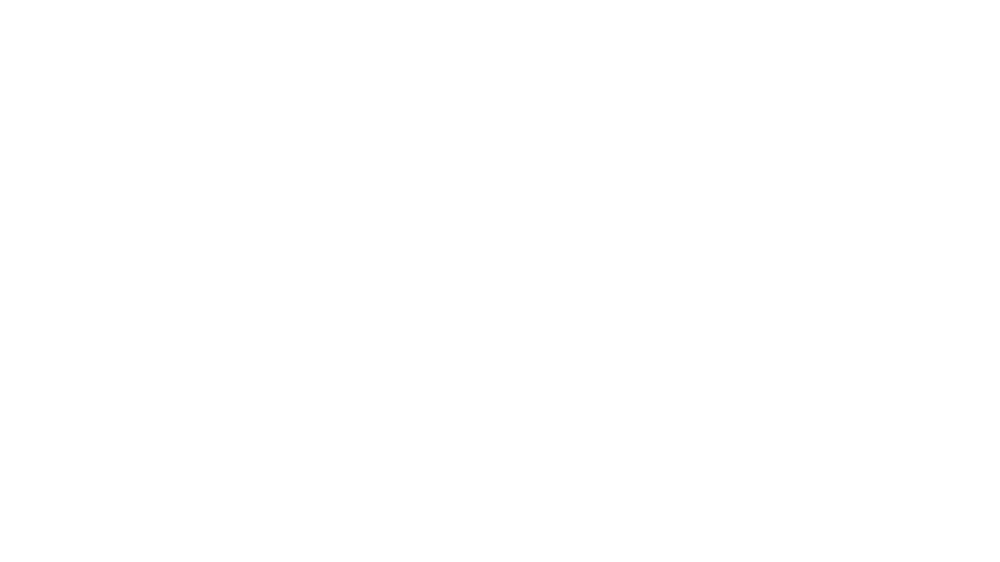

^ we can think of this as a quadrant

^ low imp, low like: no big deal

^ low imp, high like: things like password reuse, credential stuffing, phishing, etc

^ high imp, high like: leaving your s3 bucket world-readable, secrets leaking, etc

^ high impact, low like: getting hacked by a nation-state

^ for the same reason some of these are harder to address than others, they're also harder to _motivate_

^ it's not just users though!

---

## A common refrain:
# _"But we haven't made a mistake yet"_

^ here's a refrain I see from time to time from maintainers

^ where the ask is to adopt some security tool or feature

^ like, I haven't been phished yet. I haven't leaked an API token yet. I haven't included things I shouldn't have in a release yet. I haven't created a vulnerability unknowingly yet.

---

# A real (paraphrased) quote

"I've made more than 200 releases to date, and I've never made a mistake."
>
-- an actual open source maintainer

^ this was a response to a request to automate the build and release process for a library

^ first of all, kudos to this maintainer. that's acutally impressive, I haven't done that myself, I break PyPI all the time.

^ but: is this actually a good mindset to have?

^ what are they actually saying? that they don't want to change their behavior, that even if the risk is high impact it's unlikely, and that they're probably offended you don't consider them infallible

^ also fails to consider that very often our problems are not directly caused by us

^ we don't often work in vaccuums. other things around us, that are out of our control, can also go wrong

---

## "High uncertainty components
# _in complex systems"_

^ another reason this is hard: security often requires changing high uncertanty components in complex systems

^ who was at Ned Batchelder's keynote yesterday, do you know what I mean by this?

---

## aka:
# _People_

^ it means changing people's behavior

---

## The two ways to interpret
# _technical problems:_[^1]

^ here's the thing: there are really only two ways to interpret a technical problem

[^1]: courtesy Thorsten Ball: https://registerspill.thorstenball.com/p/two-types-of-software-engineers

---

## Interpretation #1:
# _"Easy: people can just do X."_

^ interpretation #1 is that the problem is easy

^ we build some techinical solution to our problem, that solution technically works perfectly, and people can just use that

---

## Interpretation #2:
# _"Hard: it requires people to do X."_

^ interpretation #2 is that the problem is actually incredibly hard! because it requires people to do X

^ so often, the hardest part of solving a technical problem is not the technical problem itself, but changing behavior of people around that technical problem

^ for an example, I still use a code editor that I first used almost 20 years ago, which itself was first released almost 50 years ago

^ to be fair, code editors are incredibly personal tools, but for me all the benefit of a modern IDE have _still_ not outweighed the cost of me changing my behavior. I'm very resistant to it!

^ now, there _is_ a third thing that happens sometimes

---

## Sometimes:
# _"Very easy: doesn't require people"_

^ the problem is very easy, because it doesn't require people at all

---

# This almost never happens

* like finding a four leaf clover
* like a superwolf blue blood giga-moon
* seriously
* go buy a lottery ticket

^ Improvements that don't need humans to change their behavior are so few and far between

^ even still, sometimes when we have the opportunity to make such an improvement, it doesn't happen because it's technically more challenging

^ and we fail to take into account the cost of changing human behavior

---

## There is (almost) always
# _a requirement that people do X_

^ the need to change human behavior is inevitable for almost every technical problem

---

## This is especially true
# _for software security_

^ and I think this is especially true for software security.

^ because, let's be real, most software _insecurity_ comes from those pesky humans

---

## This is called
# _churn_

^ this part where we require humans to change, or make a change, I'll call this churn, meaning any work you have to do that isn't directly related to your intended outcome

^ An example of churn might be: adopting a dependency updating tool on your codebase and merging version bumps for new releases

^ or adopting a vulnerability scanner to run across your dependencies and handle vulnerabilities when they happen

^ or I guess, reaching from your keyboard for a second whenever you git push to touch a little USB dongle? i don't know...

---

## Part 2
# _Why some churn is necessary_

^ OK, we've established that churn exists, but let's discuss why it's necessary

---

## Sometimes...
# _Security can happen by default_

^ one example of this is auto-revoking credentials on token leak

^ right now, if you put your pypi API token inside a commit and push that to github

^ github will immediately detect it and alert PyPI, who then revokes that credential

^ this requires zero change to human behavior to get increased security: humans can (and do) continue happily sharing their most sensitive secrets on github

^ now there's just significantly less potential fallout to deal with

---

## But usually...
# _Security requires some change_

^ usually you gotta do something to get something in return

---

## If churn is inevitable
# _what should we do?_

^ well first, here's some things we _shouldn't_ do

---

## Don't: assume we can magically
# _get people to do the impossible_

^ assume we can just wave a wand to get humans to act

^ example PGP: in a tehnical sense, an ok solution to the problem

^ in a practical sense: absolute nonsense

^ "you mean in order to use this we have to get a bunch of humans in a room and have them show each other their drivers licenses and special random strings of characters?"

^ "and also these humans can never lose their special random strings of characters?"

^ good luck

---

## Don't: shift complexity
# _onto people_

^ i'm talking about stuff that's not strictly impossible for humans to do, but is not always the most ideal for humans to do

^ for example, reading CVE notices, trying to determine vulnerability

^ "if I find a vunlerability in some computer thing, the way to fix it is to write have a human write a long document, and then have other humans read that long document, and then try and figure out if it applies to their own computer things"

^ this is madness, we should cut out the middleman, literally

---

## Don't: just do
# _nothing_

^ we could just all give up and become farmers

---

## Maybe: force a change
# _via mandate_

^ I work at Google which I describe as having a wacky alternate universe of software tooling

^ in this ecosystem, adoption is not won via many small wins, because if you can convince just a few people, you can just mandate that everyone does the same thing

^ so overnight, your software tool can go from zero users to 20K users

^ this works for Google because there is authority to mandate a change, and so it's possible this might work for your organization as well

^ it might not work for your organization because it's expensive: because it requires paying people money to eat the cost of adoption for a lot of churn

^ I think this usually doesn't work in open source ecosystem: usually because there is no central authority

^ in this context, something like the steering council or core dev team might have some authority to _make_ changes, but very little authority to make users _adopt_ those changes

^ but also because of the expense: those mandating are not the ones paying, will talk about this more in a second

^ that said, I do think there are times when mandates are necessary. and I'll talk about that more soon too

---

## If churn is inevitable
# _what should we do?_

^ so what _should_ we do?

---

## As much as possible,
# _minimize_

^ this means putting the hard work in to shift as much complexity _from_ people

^ there's a few types of mimizations possible

^ minimize effort through automation: for example, bots that monitor your dependencies for new versions and automatically make PRs to bump them, all the maintainer has to do is click "merge"

^ minimize cost through efficiency and simplification: minimize the amount of work necessary to adopt as much as possible

^ minimized time through education: if humans already have a basse level understanding about why the change is necessary, there's less context they need to build to adopt

^ I want to highlight a specific example of this if you don't mind tooting my own horn for a minute

---

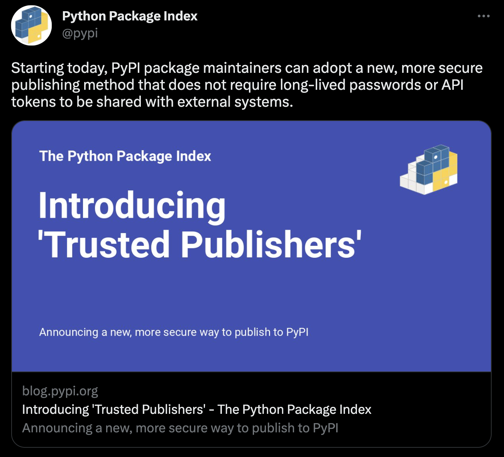

^ we just launched trusted publishers for PyPI on thursday.

^ this is a new way for maintainers to publish to PyPI from github actions that does not require long-lived passwords or api tokens

^ this is something that requires maintainers to make a change, but we put a lot of effort in to miminimizing how much churn is necessary

[.hide-footer]

---

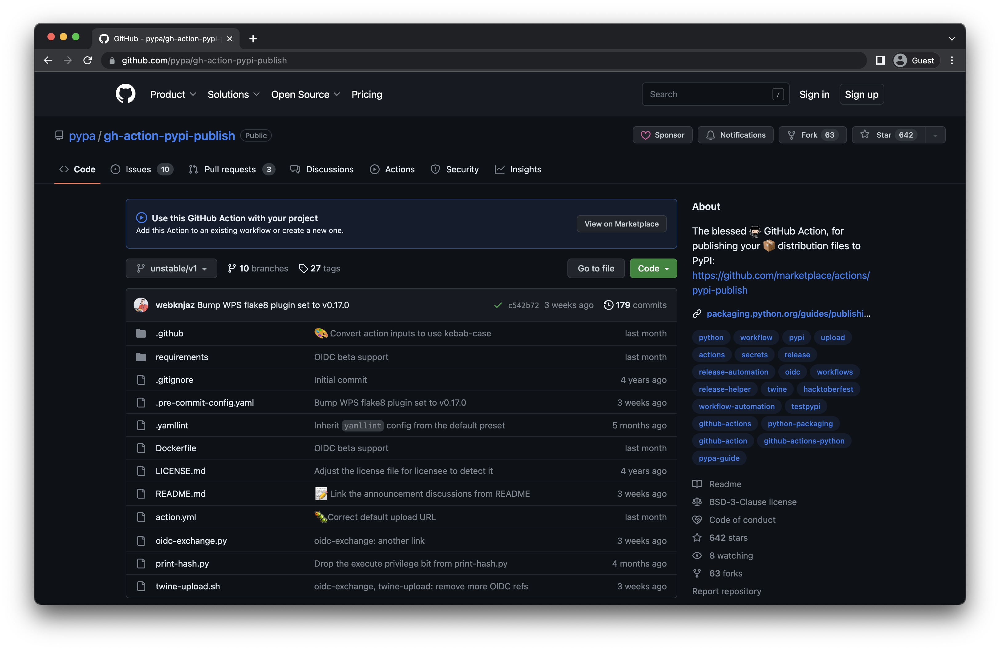

^ we minimized effort through automation:

^ this requires a new authentication method with a somewhat complex token exchange and verifiation mechanism

^ but it's all nicely abstracted away from the user if you use the PyPA's github action

[.hide-footer]

---

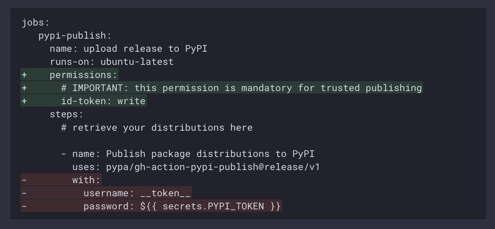

^ we also minimized the cost of adoption significantly

^ and we educated: I just told you everything you need to know about this, so you should now feel empowered to go and adopt this

[.hide-footer]

---

^ boom, inception

^ ok, getting back to ways we can minimize churn

[.hide-footer]

---

## When you can
# _revolutionize_

^ what I mean by this is to develop a change so compelling that adoption outweighs cost by an order of magnitude

---

^ I think sigstore is a great example of this

^ Full disclosure, I am very biased because I work on this project, I created the Python client for sigstore, and I sit on the technical advisory committee for the openssf, the organization that is the home to sigstore

^ but the reason I decided to do all those things is because I found sigstore to be such a novel and compelling solution to the problem of codesigning, which solves so many existing problems

^ I'm not going to go into full detail about how sigstore works here, if you want that, watch william woodruff's talk "Ergonomic codesigning for the Python ecosystem with Sigstore", where he does a deep dive

^ but suffice it to say that sigstore is a brand new way to sign and verify just about anything, but this comes at a high expense: you need to adopt an entirely new set of tools for signing and verifying signatures (or, adopt a set of tools in the first place)

^ in this case, I'd say that sigstore is so revolutionary that the cost is worth it, so continuing to invest in this as a solution is worth doing

[.hide-footer]

---

## If all else fails
# _incentivize_

^ why? maybe the solution is expensive to adopt, or not particularly revolutionary, or a mandate feels heavy-handed

^ instead, we can put our finger on the scale in various ways

^ sometimes this comes naturally: e.g. trusted publishers, this unlocks so many other things we can do, like show that we can verify the link from a pypi project page back to a github repository

^ but this will only be possible with those projects that adopted the feature, so it will incentivize adoption

^ sometimes we can add additional unrelated benefits, e.g. 2FA givaway and security keys

^ sometimes this works, sometimes it doesn't. I know there was some drama about the 2FA giveaway. trust me, I know.

^ but in that example, I think it worked:

---

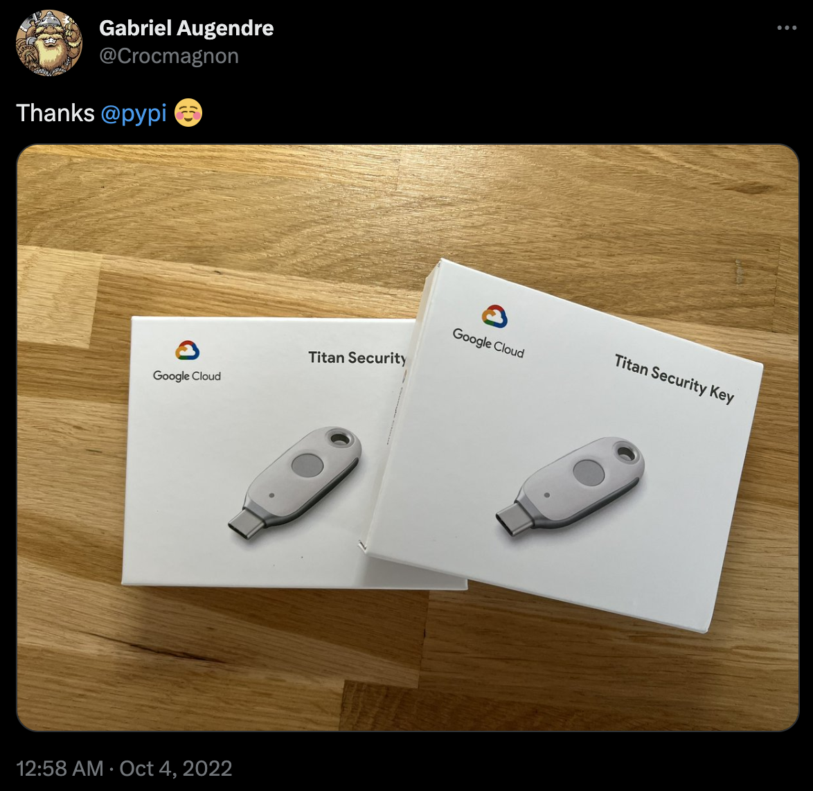

^ we

[.hide-footer]

---

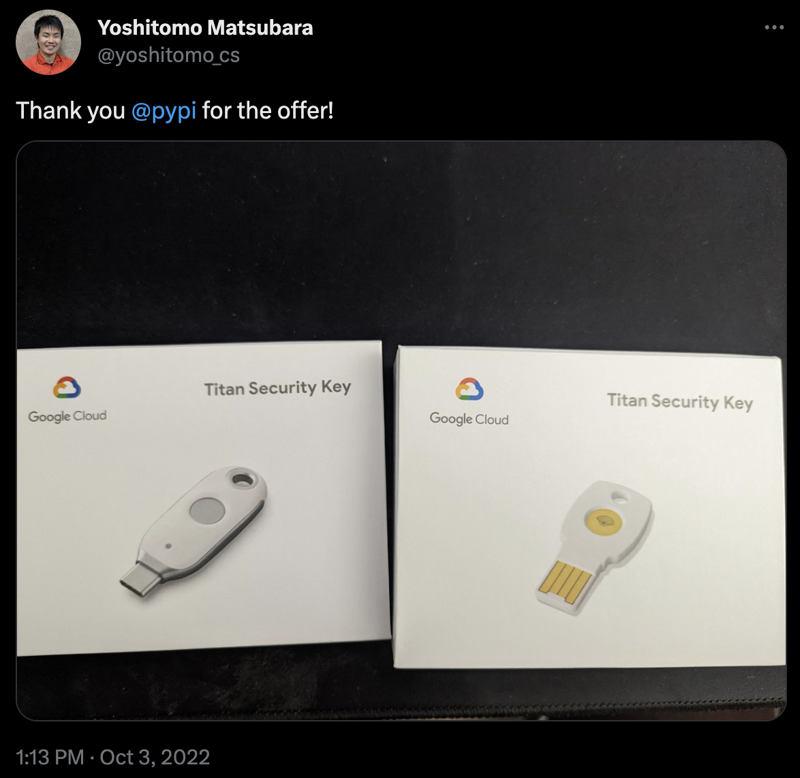

^ gave

[.hide-footer]

---

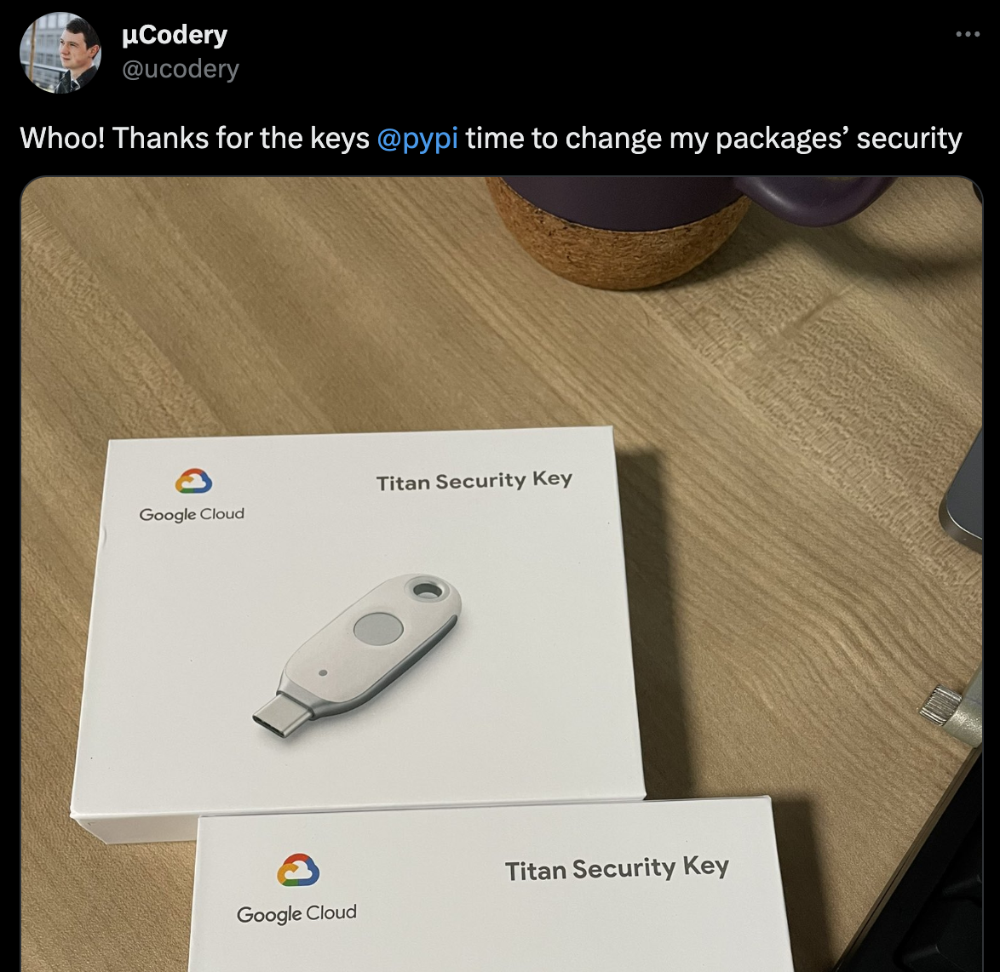

^ away

[.hide-footer]

---

^ thousands

[.hide-footer]

---

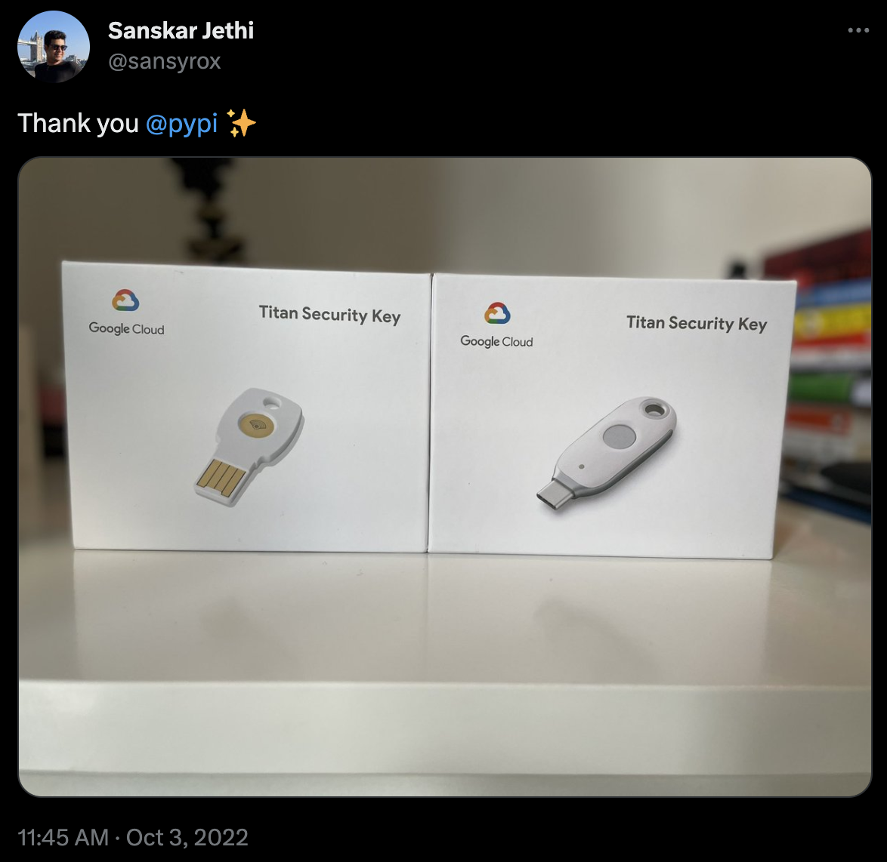

^ of

[.hide-footer]

---

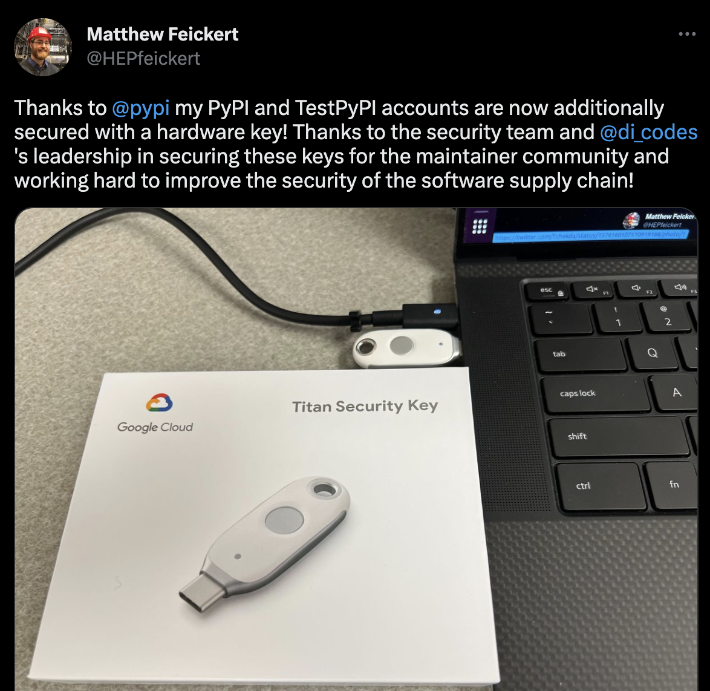

^ keys

[.hide-footer]

---

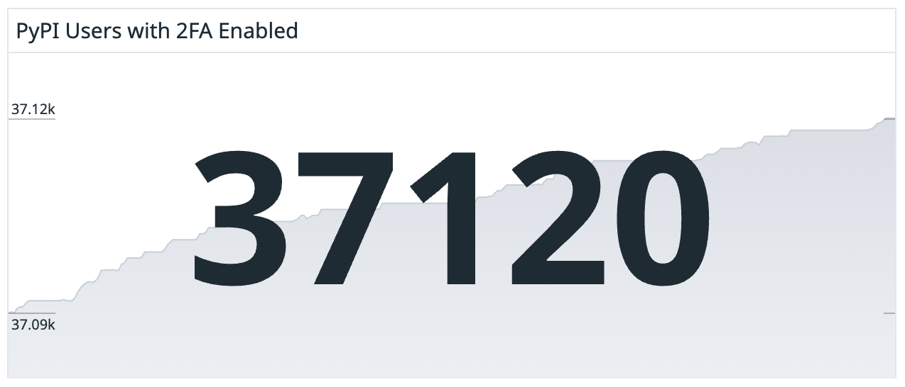

^ and more than 37K users now have 2FA enabled

^ in the example of 2FA, why do we even do it?

[.hide-footer]

---

## Part 3
# _How security increases sustainability_

^ a lot of the arguments for security amount to 'because hackers'

^ it's preventative care to ensure bad things don't happen some day, where bad things are compromise, exfiltration, etc.

---

^ however, there's also a common criticism is that security is a slippery slope, especially things like security mandates

^ the idea is that that if we keep increasing security requirements, we'll end up in some pit of maximum security where innovation is completely stifled and both maintainers and consumers can't do anything

[.hide-footer]

---

## The goal of increasing security
# _is increasing sustainability_

^ ultimately, there is a cost to a lack of security, we just don't pay it when we chose not to adopt, we pay it years later, and with interest

^ here's an example: what has to happen when just one maintainer on PyPI gets phished and their project gets compromised

^ triage reports, investigate, comms, takedowns, account recovery, talk to the press, etc

^ so, at the expense of this person not taking a few seconds to use 2FA on login, this eats up hours of PyPI maintainer time, plus downstream users

^ we want pypi to be secure _and_ useful for all users. the goal isn't to make PyPI impossible to use, that would be counter intuitive!

^ but if these are the kinds of things we have to spend all our time on, PyPI _will_ become impossible to use

^ I don't disagree that software security is a slippery slope

---

^ but I think the slope is upwards, not downwards

[.hide-footer]

---

^ like, really steeply upwards

^ and it's because people, all people, are so resistant to change

^ and because an upfront investment in security is hard to show impact for when the result is something that _doesn't_ happen

^ the effect of all of this is that it's often _really_ hard to adopt new security features

[.hide-footer]

---

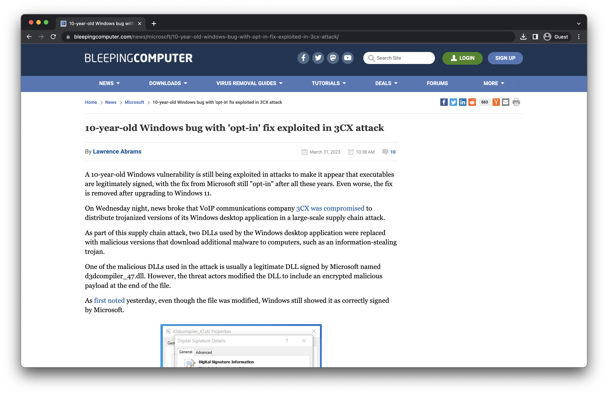

^ here's another example, have you heard about the 3cx supply chain attack? it just happened last month

^ attackers exploited a bug in the way that windows executables are signed to compromise 3CX, a communications company

^ this bug allows an attacker to modify any signed windows executible to include malware -- and for verification of signing to still claim that it's legitimately signed

^ this bug was known for 10 years! sounds like a pretty big deal! it was fixed, but it was opt-in only? why?

^ it's because many people shipping windows executables were using this bug as a feature.

^ the Google Chrome installer uses it to provide a slightly modififed binary if you opted into "sending usage statistics and crash reports to Google" when you downloaded chrome, and when the executable was installed, it uses this to determine if diagnostic reports should be enabled.

^ so because fixing this bug would break so many workflows, it didn't happen. for ten years.

[.hide-footer]

---

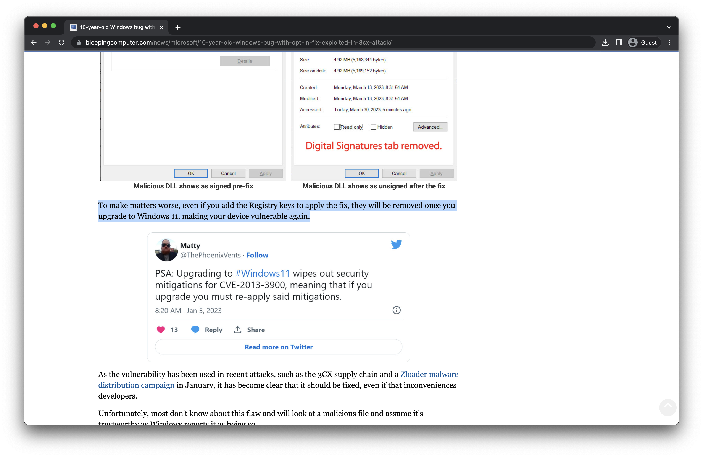

^ and to make matters worse, when you upgrade to newer versions of windows, it revers the opt-in!

^ remember, users don't ask for security! nobody was petitioning microsoft to fix this.

^ and sometimes, users take a dependency on a lack of security!

[.hide-footer]

---

## Part 4
# _How you can help_

^ ok, ok, enough ranting dustin, get to your point

^ I hope you know have an understanding about why this is hard, why some churn is necessary, how security increases sustainability

^ so what do I want you to do?

---

## Don't depend
# _on bugs_

^ maybe a rare case, but don't take dependencies on the presence of security bugs

^ also, while we're at it, don't take dependencies on internal APIs either!

^ regular breaking changes are difficult enough. maintainers should be able to ship bugfixes and improvements by default

^ especially when they address security vulnerablities

---

## Look for opportunities
# _to proactively invest in security_

^ weigh the cost of adoption with the cost of 'if things go wrong'

^ for example, trusted publishers. which would you rather do: a few minutes of changes now, or potential compromise if your long-lived secrets leak?

---

## Support
# _sustainability_

^ finally, be willing to accept a little churn when the end result is a better overall ecosystem

^ maybe also trust the maintainers of your ecosystem to make decisions that have your overall, long-term best interests in mind

^ even if they feel a little inconvenient

---

## Shoutouts
# _& acknowledgements_

^ William Woodruff (Trail of Bits)

^ Sviatoslav Sydorenko (`pypa/gh-action-pypi-publish`)

^ shoutout to everyone who enabled 2FA on PyPI

^ shoutout to GOSST

^ I also want to give a huge thank-you to the PyCon staff as usual

^ They absolutely deserve your thanks as well, be sure to let them know you appreciate all the hard work they're doing.

---

# *Thanks!*
##  @di_codes

^ And thanks to you all for listening as well

[.hide-footer]
