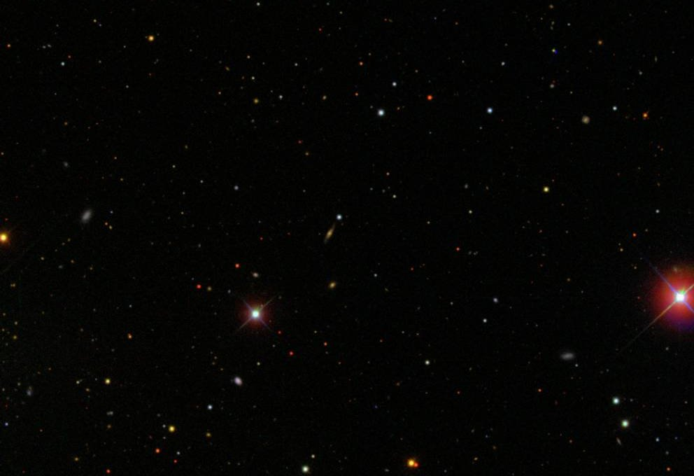

# Detecting Asteroids
# with Neural Networks
# in TensorFlow



---

# Outline

* What's the goal?
* What's the data?
* Getting started
* Building a feature set
* Building the neural network
* Training the network
* Results


---

# Goal

Build and train a neural network to correctly identify asteroids in astrophotography data.


---

#So...

How do we do it?


---


---

# So...

How do we _really_ do it?


---

# The data

The Sloan Digital Sky Survey:

> One of the most ambitious and influential surveys in the history of astronomy."


---

# The data

* Approx 35% of sky
* Largest uniform survey of the sky yet accomplished
* Data is freely available online
* Each image is 922x680 pixels


---


---


---

# An example asteroid


---


---

# How does this work?

This exploits a property of CCDs:

* SDSS telescopes use five different filters
* They are not simultaneous
* Moving objects appear in different locations
* Always the same order


---


---

# Getting started

Getting the initial training data:
* Small tool to extract potential candidates from full-scale images
* Extremely naive, approx 100:5 false positives to actual positives
* Very low false negatives (approx 1:1000)
* Incredibly slow (complex scan of 100Ks of potentials)
* Manual classification, somewhat slow
* Yields approx 250 valid items, 500 invalid items


---

# The feature set

Good ideas for features:

* Ratio valid hues to non-valid hues
* Best possible cluster collinearity
* Best possible average cluster distance


---

# Feature: Ratio valid hues to non-valid hues

The goal here is to match the colors, a.k.a. "hues":

* First step: convert to HSV space
* For pixels in the valid value-spectrum (0.25 < `v` < 0.90)
* How many are within 2 standard deviations from an optimal value?
* What's the ratio to ones that aren't?


---

# An example HSV plot


---


---

# Feature: Best possible cluster collinearity
`k`-means clustering

* Using the valid hues from the previous feature
* Attempts to cluster `n` points into `k` groups
* Here, `k=3`
* Produces three centroids


---


---

# `k`-means clustering of the same asteroid


---


---

# Feature: Best possible cluster collinearity

* The property of a set of points which lie on the same line
* Iterate the `k`-means clustering approx. 20 times
* The resulting metric is the ratio between the actual collinearity and the maximum potential colinearity


---

# Feature: Best possible cluster collinearity

* Given points `a`, `b`, and `c`:

```
colin = (c.x - a.x) * (b.y - a.y) + (c.y - a.y) * (a.x - b.x)
```


---


---

# `k`-means clustering of the same asteroid


---


---

# An example non-asteroid


---


---

# `k`-means clustering of the same non-asteroid


---


---

# Feature: Best possible average cluster distance

* Using the same `k`-means clusters from the previous features
* What is the average distance from any point in a cluster to the center of the cluster?


---


---

# `k`-means clustering of the same asteroid


---

# An example non-asteroid


---


---

# `k`-means clustering of the same non-asteroid


---


---

# A comparison of all three features

```
             | Hue Ratio | Collinearity | Cluster distance
Asteroid     | 0.687     | 0.046        | 0.432
Non-asteroid | 0.376     | 0.388        | 0.557
```


---

# A comparison of all three features

We see that the for a valid asteroid:

* The hue ratio is much higher
* The colinearity metric is much lower
* The mean cluster disance is smaller


---

# Ok... where's the AI?

This type of classification is extrememly well suited for a neural network:


---

# Ok... where's the AI?

* We have a clear set of training data
* The output is either affirmative (1) or negative (0)
* Each of the input features can be resolved to a `0 -> 1` metric
* There is a small amount of input features which can accurately define an item


^ plus this will be way faster

---

# Building the neural network

The resulting neural network:

* Performs binary classification;
* Use supervised learning;
* Uses a backpropagation trainer;
* Is deep;


^ supervised = labeled input data
^ deep = more than one hidden layer

---

# Building the neural network
Four layers:

* Input layer;
* Two hidden layers;
* Output layer


---

# Building the neural network

Total of 154 "neurons":

* 3 input neurons (hue ratio, collinearity metric, distance metric)
* 150 hidden neurons (`100` in first layer, `50` in second)
* 1 output neuron (`1` if valid asteroid, `0` if invalid)


---

# The resulting neural network


---


---

```
$ head astro.train
0.72, 0.0230326797386, 0.265427036314, 1.0
0.223404255319, 0.453424956758, 0.620237280488, 0.0
0.625954198473, 0.282509136048, 0.489543705893, 0.0
0.297297297297, 0.217278447678, 0.456831265365, 0.0
0.526315789474, 0.125389748718, 0.52048369676, 1.0
0.4, 0.430241745731, 0.597850990407, 0.0
0.0797872340426, 0.375153031291, 0.601415832623, 0.0
0.403361344538, 0.268341944886, 0.485098390444, 0.0
0.592356687898, 0.34747482416, 0.559112235938, 0.0
0.0976744186047, 0.0213790202131, 0.586822094967, 0.0
```


---

# Load training data

```python
import pandas as pd
df_train = pd.read_csv(
        tf.gfile.Open('./astro.train'),
        names=[
            'hue_rat', 'col_min',
            'dis_min', 'label'
        ],
        skipinitialspace=True)
```


---

# Turn label into boolean

```python
df_train['label'] = (
    df_train["astro"].apply(
        lambda x: x == 1.0
    )
).astype(int)
```


---

# Build an estimator

```python
import tensorflow as tf

def build_estimator(model_dir):
    hue_rat = tf.contrib.layers.real_valued_column("hue_rat")
    col_min = tf.contrib.layers.real_valued_column("col_min")
    dis_min = tf.contrib.layers.real_valued_column("dis_min")

    return tf.contrib.learn.DNNClassifier(
        model_dir=model_dir,
        feature_columns=[hue_rat, col_min, dis_min],
        hidden_units=[100, 50]
    )
```


---

# Input function

```python
def input_fn(df):
    feature_cols = {
        k: tf.constant(df[k].values)
        for k in [
            'hue_rat', 'col_min', 'dis_min'
        ]
    }
    label = tf.constant(df['label'].values)
    return feature_cols, label
```


---

# Build & Fit the model

```python
m = build_estimator('./model')
m.fit(input_fn=lambda: input_fn(df_train), steps=200)
```


---

# Training the network

* Approx 250 valid items;
* Approx 500 invalid items;
* Trained for 200 steps;
* Took < 1 minute;


---

# Evaluating the model

```python
results = m.evaluate(
    input_fn=lambda: input_fn(df_test_1),
    steps=1
)
```


---

# Results

* Trial 1: 99.2973% accuracy
* Trial 2: 94.4056% accuracy
* Trial 3: 94.7644% accuracy


---

# Why use features?

MNIST is a database of handwritten digits:


---

# Why use features?

28x28 pixels = 784 numbers between `0` and `1`:


```python
df_train = [0.0, 0.1, 0.9, ..., 1.0]
```


---

# Why use features?

Astro data:
* 40x40 pixels
* RGB space

```python
40*40*3 = 4800
```


---

# Conclusion

* Using a neural network allows us to do it faster, and more accurately
* Need to spend time coming up with good features for the data
* TensorFlow is really nice (and fast!)


---

# References

* <https://www.tensorflow.org/>
* <http://www.sdss.org/>
* <http://en.wikipedia.org/wiki/Sloan_Digital_Sky_Survey>
* <http://en.wikipedia.org/wiki/Collinearity>
* <http://en.wikipedia.org/wiki/K-means_clustering>


