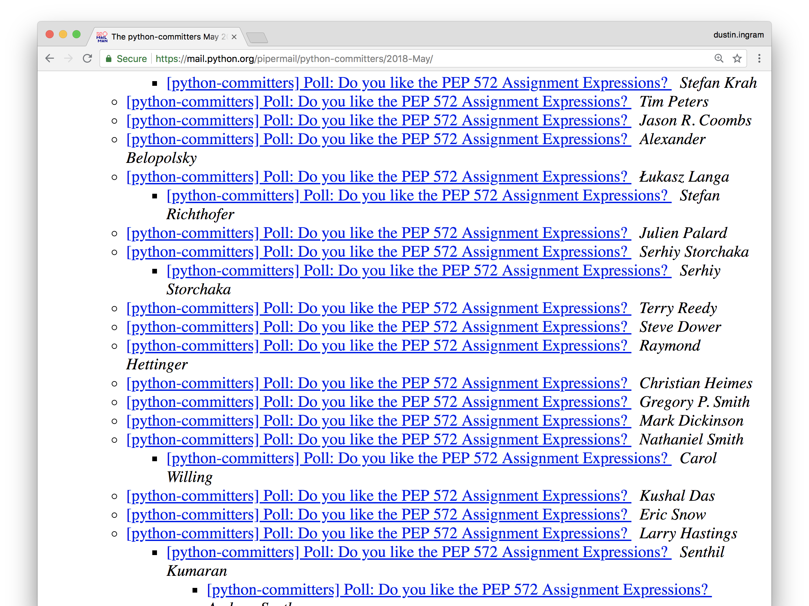
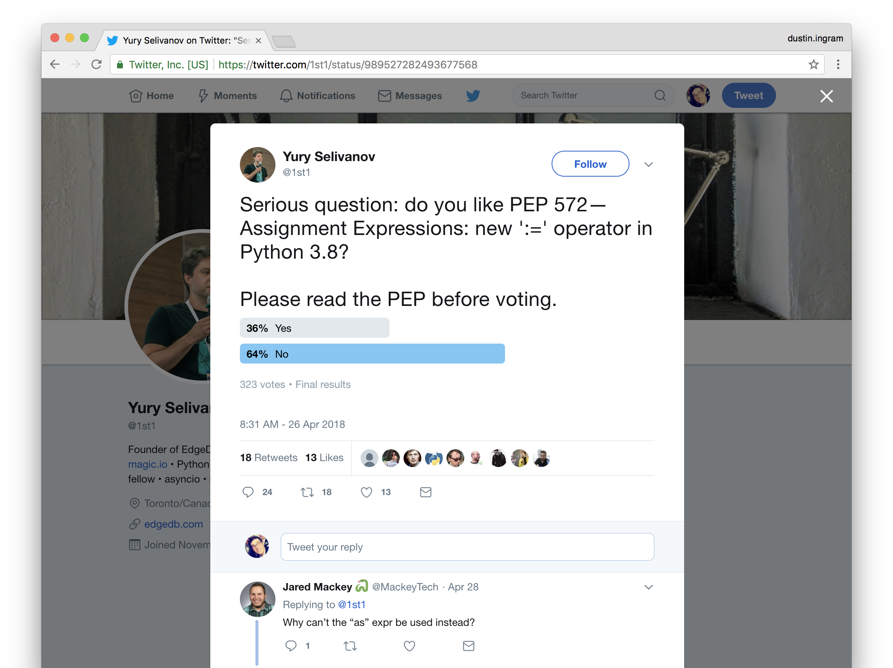
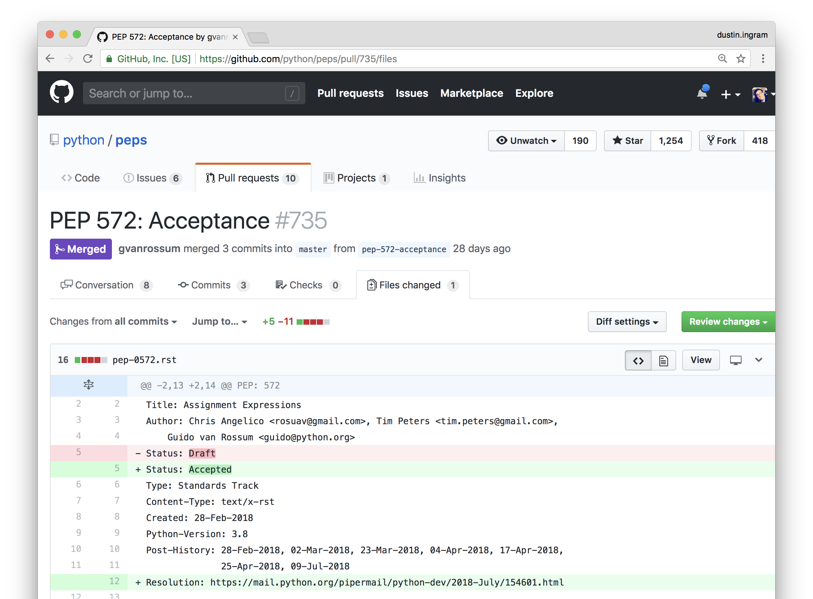

## Austin Python Meetup
## August 2018

---


# [fit] *Hi, I'm Dustin*

^ 3.7 old news

---

# *PEP 572*

---

# *Python Governance*

^ how do we govern the language?

---

# *BDFL*
## Benevolent Dictator
## For Life

^ dictator meaning he can do whatever he wants

^ benevolent meaning he's looking out for us

---


---

# *PEP*
## Python Enhancement Proposal

^ can anyone name a PEP

---

# *PEP 8*
## Style Guide for Python Code

---

# *PEP 8*
## Style Guide for Python Code
### Author: Guido van Rossum

---

# *PEP 20*
## The Zen of Python

---

# *PEP 20*
## The Zen of Python
### Author: Tim Peters

---

# *PEP 566*
## Metadata for Python Software Packages 2.1

---

# *PEP 566*
## Metadata for Python Software Packages 2.1
### Author: Dustin Ingram

---

# *BDFL*
# Delegates

---

## 1) Draft
## 2) Acceptance
## 3) Implementation

---

# *PEP 572*

^ might have heard, caused drama

---

# `:=`

^ has a name

^ not going to tell you it

---


^ not dead, just resting

^ letter to my boss

---


---

# *PROBLEMS*

---

```python
match = pattern.search(data)
if match is not None:
    do_something(match)
```

^ doing something conditionally with a result

---

```python
chunk = file.read(8192)
while chunk:
    process(chunk)
    chunk = file.read(8192)
```

^ updating a variable while reading it

---

```python
foo = [f(x), f(x)**2, f(x)**3]
```

---

```python
y = f(x)
foo = [y, y**2, y**3]
```

---

```python
results = []
for x in data:
    result = f(x)
    if result is not None:
        results.append(result)
```

^ usually this means list comprehension

---

```python
filtered_data = [
    f(x) for x in data
    if f(x) is not None
]
```

^ but the problem here is that f(x) is computed twice

---

# *SOLUTIONS*

---

```python
match = pattern.search(data)
if match is not None:
    do_something(match)
```

^ doing something conditionally with a result

---

```python
if (match := pattern.search(data)) is not None:
    do_something(match)
```

^ match isn't hanging around

---

```python
chunk = file.read(8192)
while chunk:
    process(chunk)
    chunk = file.read(8192)
```

^ updating a variable while reading it

---

```python
while chunk := file.read(8192):
    process(chunk)
```

---

```python
foo = [f(x), f(x)**2, f(x)**3]
```

---

```python
foo = [y := f(x), y**2, y**3]
```

^ reuse a value that's expensive to compute

---

```python
results = []
for x in data:
    result = f(x)
    if result is not None:
        results.append(result)
```

---

```python
filtered_data = [
    f(x) for x in data
    if f(x) is not None
]
```

---

```python
filtered_data = [
    y for x in data
    if (y := f(x)) is not None
]
```

^ share a subexpression between a comprehension filter clause and its output

---

# *WHY?*

---

# *Less lines*
# are better

^ Programmers hate change, minimizing diffs by at least one line is worth it

---

```python
foo = [y := f(x), y**2, y**3]
```

---

```python
y = f(x)
foo = [y, y**2, y**3]
```

^ my coworkers will love me

---

# *Less lines*
# are more efficient?

---

```python
match = re.match(data)
group = match.group(1) if match else None
```

^ instead of writing

---

```python
group = re.match(data).group(1) if re.match(data) else None
```

^ they wrote

---

```python
group = match.group(1) if (match := re.match(data)) else None
```

^ with the walrus, they could have written

^ Untimately a trade-off between developer and computer efficiency.

---

# *Scope*

---

```python
foo = 'foo'
if (foo := 'bar') is not None:
    do_something(...)
print(foo)
```

^ this would print 'bar'

---

# *Exceptions!*

^ with the exception of comprehensions (dict, set, list)

---

```python
if any((comment := line).startswith('#') for line in lines):
    print("First comment:", comment)
else:
    print("There are no comments")
```

^ witness

---

```python
if all((nonblank := line).strip() == '' for line in lines):
    print("All lines are blank")
else:
    print("First non-blank line:", nonblank)
```

^ counterexample

---

```python
total = 0
partial_sums = [total := total + v for v in values]
print("Total:", total)
```

^ compute partial sum

---


# *`=`*

^ you might say: kinda seems like the equals operator

^ it's actually nothing like the equals operator

^ everywhere you can use equals, you can't use the walrus

---

```python
x = y = z = 0           # Yes
(z := (y := (x := 0)))  # No
```

^ multiple targets

---

```python
a[i] = x         # Yes
a[i] := x        # No
self.rest = []   # Yes
self.rest := []  # No
```

^ assignments to things other than a NAME

---

```python
x = 1, 2     # Sets x to (1, 2)
(x := 1, 2)  # Sets x to 1
```

^ comma priority

---

```python
total += tax   # Yes
total +:= tax  # No
```

^ augmented assignment

---

# *`=` vs. `==`*

---

# *PEP 572*

---

# *Reception*

^ Most people hate change

^ Programmers especially hate change

---

# *Backwards compatibility*
## "Where will this work?"

^ not backwards compatible at all

---

# *Teachability*
## "What do we call this?"

^ can't call it walrus

^ Assignment operator (=)

^ Becomes operator (eh?)

^ Named expression (actual name)

---

# *Attractiveness*
## "It's just ugly!"

---


---



---



---


---

## *Tim Peters:*
## "The current proposal would have allowed a modest but clear improvement in quite a few bits of code."

---

## *Barry Warsaw:*
## "Since it changes the syntax of the language, people tend to focus on that without understanding the deeper semantic issues."

---

## *Łukasz Langa:*
## "Dictators should dictate"

---

## *Guido van Rossum:*
## Had to stop reading the threads so he wouldn't "go insane"

---



---


^ we don't currently have a BDFL

^ we can't currently approve any peps

---

# *Questions*

---

# What does this mean for Python?

^ jacob: is this going to be the pep to end all peps

---

# *It's going*
# *to be OK*

^ smart people are working on the governance problem

---

# Will this become part of Python?

---

# *Probably*
# *(in 3.8)*

---

# But I don't like it!

---

# *Then don't*
# *write it!*

^ No one's going to force you to write it

^ If someone on your team is using it, convince them not to!

---

# Is Guido
# coming back?

---

# *Probably not*

^ Python is 27 years old, and guido is like it's parent

---

# Will this
# happen again?

---

# *Probably not*

^ this PEP was an outlier

---

# *¯\\\_(ツ)\_/¯*

^ so many people use python now

^ for most of those people, the language already feels kinda perfect

^ perhaps this is the new status quo

---

# *Thanks!*
