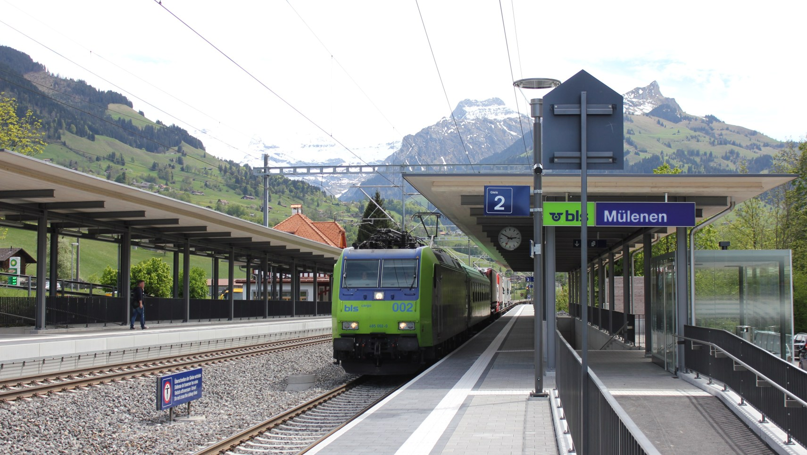
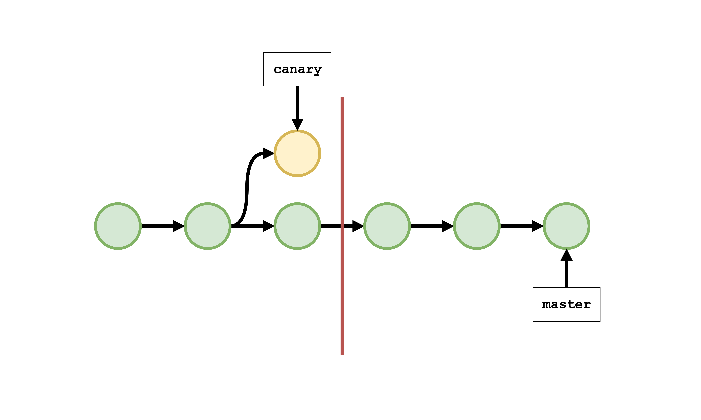
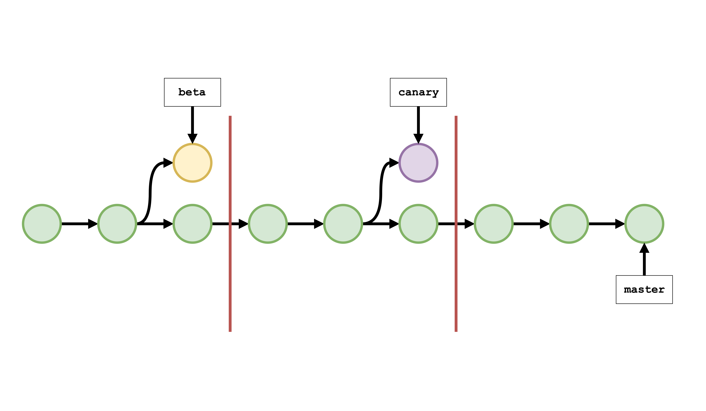

theme: Next

# FLPY 2017
## Swiss Train Deployments

---

# [fit] Hi, I'm Dustin
# [fit] [`http://github.com/di`](http://github.com/di)

^ My name's Dustin Ingram

---

^ I work at PromptWorks, a software consultancy in Philadelphia

---

---

# Swiss Train
# Deployments

^ Let's start with a story

^ Five years ago, I was traveling europe and spent a few days in Switzerland with some family friends

---

^ The first night, my host offered to take me to his office in downtown Bern the next day

^ Swisscom Brain Gym

---

^ The next morning, as we were walking from his house to a light rail station just like this (including the beautiful snow-capped-peaks), I saw the downtown train heading into the station

^ Thinking we could catch it if we hustled, I started to pick up my pace

^ He reached out, stopped me, and said:

---

# _"The Swiss don't_
# _run for trains."_

^ As we walked towards the station, we watched the train that we could have caught pull away

^ We sat there for ~12 minutes until the next one arrived, and continued our journey

---

^ Now, this talk is also a blog post I've authored on the promptworks website

^ It inevitably got posted to reddit, where this was the first comment

---

^ Obviously I don't mean to generalize

^ This thought has always stuck with me as sort of a personal philosophy

---

^ The idea is that life is already moving pretty fast

---

^ And that there's no need to rush it any more

^ But on top of that, have you ever _seen_ anyone run for a train?

---

^ They inevitably look like an idiot

---

^ In April I was at Philly ETE, and one of the best talks there was Yehuda Katz's talk

---

^ This is Yehuda. Most python devs aren't familiar with him, but he's a proflific developer and influential in a number of open source projects

---

^ rails, jquery, rust, and ember

---

# Stability
# Without
# Stagnation

^ Yehuda's talk was called Stability without Stagnation

^ In it, he described a deployment process which enables rapid development, but still provides a stable platform for the people using your technology

^ He called his philosophy "Stability without Stagnation"

^ Basically, the SwS philosophy boiled down to two things, first...

---

# #1: Ship Regularly

---

# (Every Six Weeks)

^ For ember, this meant making a release every six weeks

^ No matter what's going on with the project

---

# #2: Release Channels

---

# Canary

^ Canary - features ASAP, no guarantees

^ Code might have been written the same day as the release

---

# Beta

^ Beta - features after 6 weeks, bugs shook out

---

# Release

^ Release - features after 12 weeks, semver backwards-compatible guarantees

^ These are essentially tagged branches in your source

^ They balance new features with stability.

^ Release cycle means every channel cuts a release every cycle

---

# Ø

^ Regardless of how many features have been shipped! Could have nothing

---

^ Looks something like this

^ A given feature is deployed to each channel, in order, one release after another

^ Part two is...

---

# Have Multiple "speeds"

---

^ So they solved this by adding another channel, "LTS"

^ And making that channel's releases take 4x as long

^ This basically amounts to an LTS release, which is a common practice in the linux/unix community

^ If the six-week releases are happening too quickly, the LTS release is guaranteed to exist and be stable for a longer window of time

^ Also, you get bugfixes for the entirety of the LTS release

^ Also, breaking changes are first deprecated in an LTS release

^ Side note: if the thought of making your release process conform to this diagram frightens you, you're doing it wrong

^ All of these releases should be automated!

---

^ Here's another diagram showing how LTS was introduced

^ So there are some benefits to this process

---

# Benefits

---

# ...to Maintainers

^ Maintainers don't feel any rush to ship a feature in for a given release. If they miss one, there's another one in six weeks.

^ "Ship this feature ASAP because we don't know when we'll release next!"

---

# ...to Contributors

^ Contributors can predict when their feature will be released and what the process is.

---

# ...to Add-on Authors & Developers

^ End users, which yehuda splits into add-on authors and developers, can make a decision about their risk tolerance easily and build against an API that they know won't change unexpectedly

^ Yehuda summed that up by saying that everyone can just:

---

^ The swiss don't run for trains because they want to take it easy

^ They don't run for trains because they're concerned about their image

^ They don't run for trains becaues they know there's another one coming

^ And because they know that, they don't stress about catching trains, and they don't look dumb

---

^ I'm from Philly

^ In philly, people definitely run for their trains

^ Why do people run for trains in Philly?

---

^ Because we're running late, maybe, but probably

^ Because we don't know when the next one's going to come.

---

^ We can't fix SEPTA, but we can fix our own deploy processes

---

# Ember → You

^ Obviously, we are not all writing OSS with lots of contributors, users, in an early stage of development

^ But there are direct paralells to all kinds of development processes

---

# Benefits

---

# ...to Management

---

# ...to the Developers

---

# ...to the Users

---

# Requirements:

^ A few basic requirements you probably already have

---

# 1. A reasonable VCS

^ You need a VCS that lets you have branches and tags, or some equivalent

^ *cough* git *cough*

---

---

---

---

---

---

---

---

---

---

---

---

---

---

---

---

---

---

---

---

---

---

---

---

---

# 2. Automation

^ You need some kind of automation around deployment (and probably testing too)

---

---

---

---

# 3. Features to ship

^ You need to be in active development!

---

# Steps:

^ Then what do you do with it?

---

# 1. Ship each channel reguarly

^ This takes then "when?" out of releases! No more "when will x ship?"

---

# 2. Automate releases

^ This is easy when the only determinant is time. Also takes the "who?"

^ Both remove a lot of uncertainty and stress!

---

^ This might seem counter-intuitive with the mantra of big orgs like FB

^ But yehuda said they fell into the same trap

---

# _"We ourselves fell into the trap of believing the 'move fast and break things' mantra."_

^ It's easy to do when FB says you should

---

# _"We thought that if our competitors had a feature we didn't..."_

---

# _"...our users would leave en masse."_

^ Result is paranoia about losing users

---

# _"In fact, it was our instability that alienated early adopters."_

---

# _"We got a bad reputation for it."_

---

# _"People criticized us because they felt burned."_

^ Paradoxically, it causes you to lose users!

---

# _"Users don't migrate over night."_

---

# _"You have a much larger window than you think..."_

---

# _"...(although not infinite)"_

^ Stability is way more important.

---

^ Even FB eventually changed their tune

^ This is not photoshopped! It's really their new motto

^ Not as sexy, but it works better if you're a dev

---

# (Swiss) Train Deployments

^ But here's the thing -- this is not news to anyone

^ I did not invent this idea

^ Neither did Yehuda

---

---

---

---

---

---

---

---

---

^ Earliest I could find, started in 2001

---

# Stability without Stagnation

^ What is SwS reallly about? It's a philosophy, but

^ Developing a process which keeps you from getting stuck w/o innovating

^ But also giving you a stable foundation to build higher and faster on

---

# Swiss Train Deployments

---

# 1. Don't make your users run for a release

---

# 2. Let them
# decide how fast to
# get from A to B

^ They can take a faster track to a feature, but they might go off the rails

---

# Questions?

---

# Thanks!
