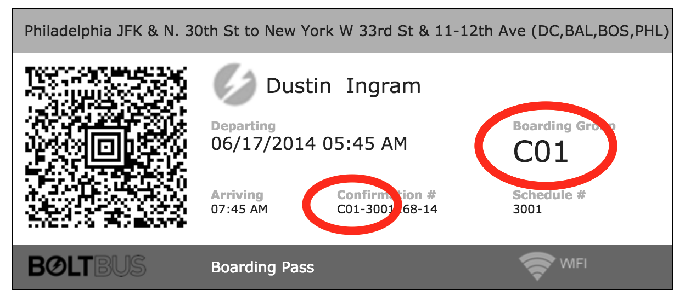
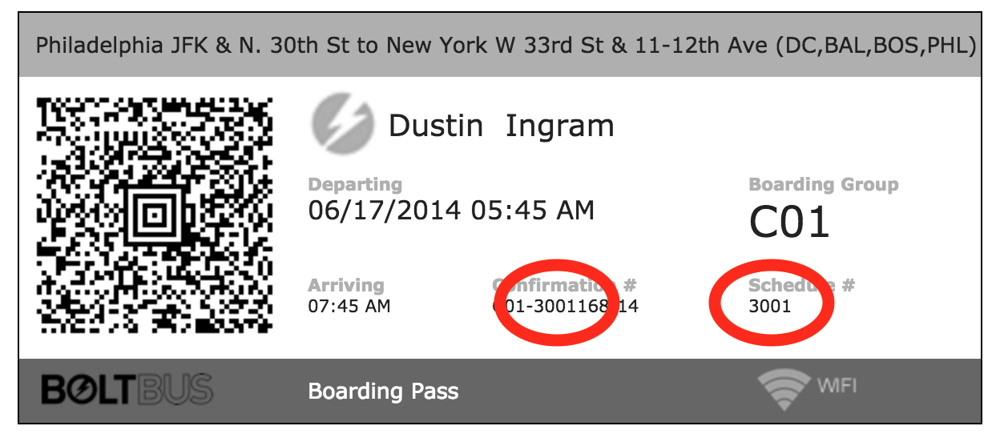
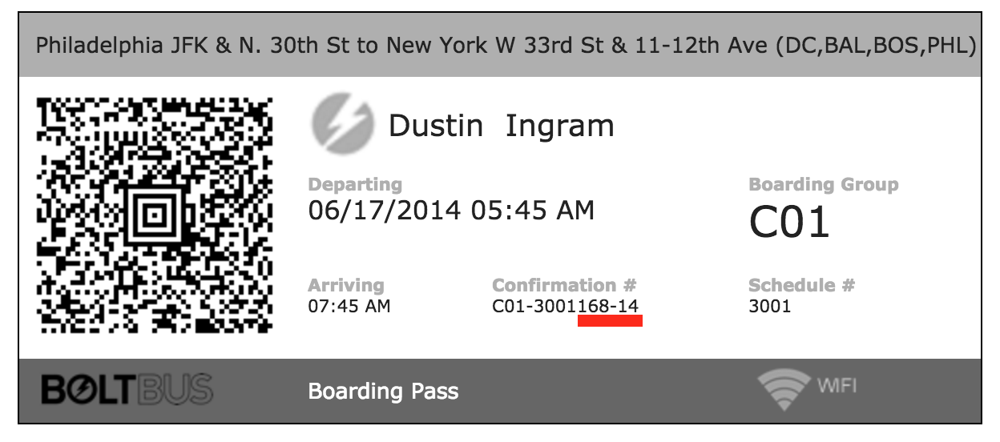
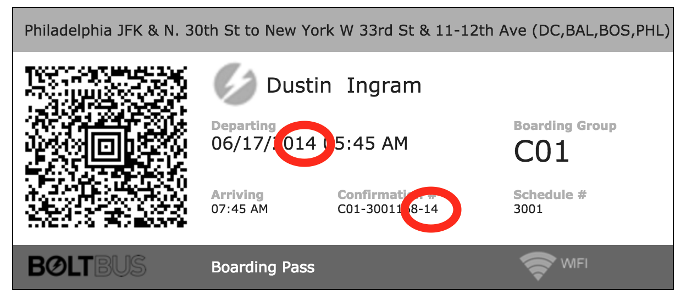
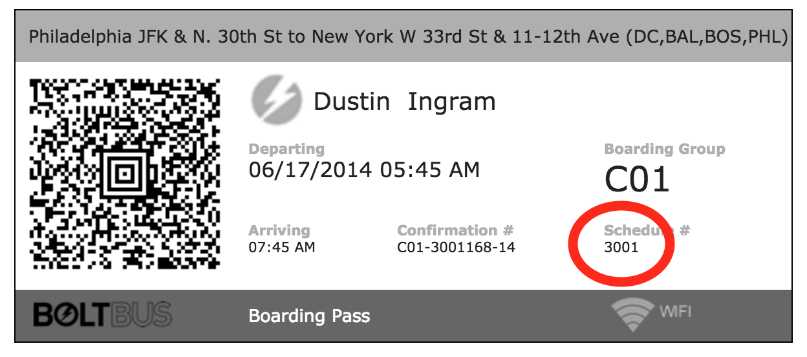

# [fit] Dustin Ingram
# [fit] _[`http://github.com/di`](http://github.com/di)_

^ My name's Dustin

^ di on github

---


^ I work at PromptWorks, a software consultancy in Philly

---

# [fit] GOOD HACKER
# [fit] _BAD HACKER_

^ I'm going to talk to you about about what I think attributes of a good hacker are

^ I don't mean a whitehat vs. blackhat, I mean good as in capital-q quality

---

# [fit] BOLT BUS
## [fit] _"Bolt For A Buck"_

^ I'm going to talk about a specific hack as an example

^ And we'll decided whether I'm a good hacker or not

---


^ If you're not familiar with bolt bus, I would describe it as...

^ You go to boltbus.com

---


^ Navigate a shitty webapp

---


^ Realize that every bus you want to take is sold out

---


^ Once you pick one they email you your ticket

---


^ You admire the high-tech QR code

---


^ When you're at the bus you show it to a guy in a dayglow vest

---


^ And then you hop aboard and pray that your bus doesn't spontaneously combust

---

### [fit] GOOD HACKER ATTRIBUTE #1:
## [fit] _PAY ATTENTION_

---


^ First thing I noticed was that on this electronic ticket

---



^ First thing I noticed was that on this electronic ticket

---



---



^ So that just leaves these five digits

^ Oh, and that fancy QR code

---


^ But what if I told you that this guy doesn't have a QR reader

^ He's just looking at the ticket with his eyeballs

^ And I'm pretty sure he can't scan QR codes with is bare eyeballs

---


^ So that means when he's looking at this ticket, he's only has the same information you're looking at right now

^ Also, he has no way to verify it

---

### [fit] GOOD HACKER ATTRIBUTE #2:
## [fit] _COLLECT DATA_

^ Really this usually comes down to having good tools to collect data for you

---


^ In this particular instance, I just emailed my friends and asked them to send me their old bolt bus tickets

---



^ From this I quickly realized that the "14" was the year

---


^ And that the 168 was because was the 168th day of the year

---



^ So that got me almost all the way there, but I still didn't know for sure the schedule number of every bus

^ Just the ones that had been ridden before

^ And they didn't always line up

---


^ My first thought was that I'd just scrape the website

^ But like I said before, it was a shitty webapp, no route numbers there

---


^ To my horror, I also realized that the "api" was just sending raw HTML back

^ Totally useless

---


^ But then I realized that they have mobile apps

^ And you can't get away with that kind of behavior with mobile apps

---


^ So I downloaded their android app onto my phone

^ But now I needed a way to intercept traffic between my phone and the internet

---

### [fit] GOOD HACKER ATTRIBUTE #3:
## [fit] _COLLECT GOOD TOOLS_

---


^ A long time ago I had found a really nice debugging proxy tool called Charles

^ I never had much of a use for it, but tried it, liked it, bought it, kept it

---

```python
headers = {
    'User-Agent' : "Dalvik/1.6.0 (...)",
    'Accept' : "application/json",
    'Content-Type' : "application/json",
    'Content-Length' : 0,
    'Host' : "www.boltbus.com",
    'Connection' : "Keep-Alive",
    'Accept-Encoding' : "gzip"
}
```

^ After running the app through Charles, I figured out that if I impersonated my android device

---

```python
loc_url = "https://www.boltbus.com/services/1.0/LocationService.asmx/Locations"
requests.get(loc_url, params={'originid':" "}, headers=headers).json()
```

^ And made a request to this URL with those headers and that payload

---

```json
[{
	'Name': 'Albany, OR (112 SW 10th Ave)',
	'Destinations': [{
		'Name': 'Eugene, OR (5th Street Market)',
		'Destinations': None,
		'State': 'OR',
		'Id': 27,
		'Address2': None,
		'Zipcode': '97401',
		'City': 'Eugene',
		'__type': 'ABS.RestServices.ServiceData.Location',
        'LocationDesc': "Stop is located on the north side of of the 5th Street
            Public Market on the corner of E. 5th Street at High Street by
            Brick's Cafe",
		'Latitude': '44.054454',
		'Longtitude': '-123.088481',
		'Address1': '296 E. 5th Avenue'
	}, {
		'Name': 'Portland, OR (NW Everett @ NW 8th Ave)',
		'Destinations': None,
		'State': 'OR',
		'Id': 15,
		'Address2': None,
...
```

^ I could get a list of boltbus locations

---

```python
from time import localtime, strftime
bb_date = "\'%s\'" % (strftime("%Y-%-m-%-d", localtime()))
payload = {
    'originId' : 26,
    'destinationId' : 27,
    'travelDate' : bb_date,
    'passengers' : 1,
    'passengersWheelchair' : 0,
    'ada' : "false"
}
sch_url = "https://www.boltbus.com/services/1.0/ScheduleService.asmx/Schedules"
requests.get(sch_url, params=payload, headers=headers).json()
```

^ And if I made a slightly different requests to the schedules endpoint

---

```json
[{
	'DepartureDate': '/Date(1465565400000)/',
	'DurationString': '00:50:00',
	'Available': 40,
	'Fare': 10.0,
	'Segments': [],
	'ArrivalDate': '/Date(1465568400000)/',
	'Fares': [10.0],
	'IsDeparted': True,
	'Cancelled': False,
	'WalkupFare': 10.0,
	'ScheduleId': 7472,
	'AvailableWheelchair': 2,
	'Duration': {
		'TotalMilliseconds': 3000000,
		'Ticks': 30000000000,
		'Hours': 0,
		'TotalSeconds': 3000,
		'TotalDays': 0.034722222222222224,
		'Minutes': 50,
		'TotalHours': 0.8333333333333333,
		'Seconds': 0,
		'Days': 0,
		'TotalMinutes': 50,
		'Milliseconds': 0
	},
	'BoardingGroup': 'AllRemainingOnlineSales',
	'StartDate': '/Date(1465560000000)/',
	'IsWalkup': True,
	'ScheduleNBR': 9515
}
...
```

---

### [fit] GOOD HACKER ATTRIBUTE #4:
## [fit] _MAKE BETTER_
## [fit] _TOOLS_

---

# [fit] ZIP FOR ZILCH

---


---


---


---


---


---

### [fit] GOOD HACKER ATTRIBUTE #5:
## [fit] _PROOF OF CONCEPT_
## [fit] _OR GTFO_

---


---


---


---


---

# [fit] _IT WORKED!_

---

# [fit] A GOOD HACK_._

---

# [fit] A GOOD HACK_?_

^ So far, this seems like a pretty good hack
^ But I don't think it makes me a good hacker, because there's one thing I didn't do

---

### [fit] GOOD HACKER ATTRIBUTE #6:
## [fit] _RESPONSIBLE_
## [fit] _DISCLOSURE_

^ I never told nobody

---

# [fit] THANKS
