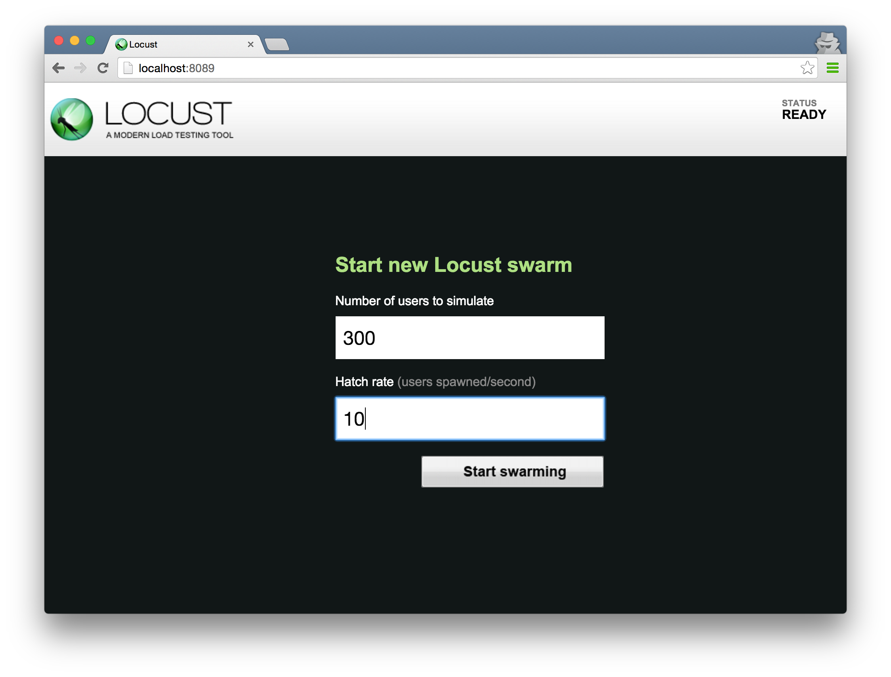
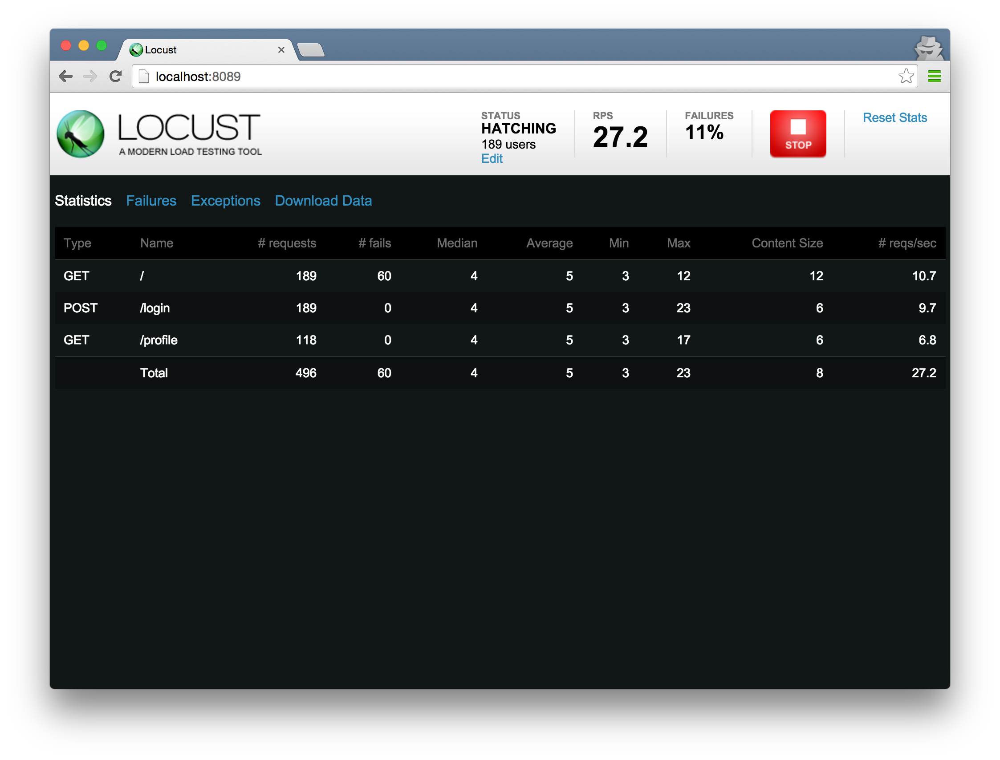

# Load testing with __locust__

---

# Installation

```bash
$ pip install locustio
```

^ Locust is an open source load-testing tool written in Python

---

# `locustfile.py`

```python
from locust import HttpLocust, TaskSet, task

class UserBehavior(TaskSet):

    @task
    def get_something(self):
        self.client.get("/something")

class WebsiteUser(HttpLocust):
    task_set = UserBehavior
```

^ The nice thing about locust is that configuration is just regular python

---

# `locustfile.py`

```python
class UserBehavior(TaskSet):

    @task
    def get_something(self):
        self.client.get("/something")

    @task
    def get_something_else(self):
        self.client.get("/something-else")
```

---

# `locustfile.py`

```python
class UserBehavior(TaskSet):

    @task(2)
    def get_something(self):
        self.client.get("/something")

    @task(1)
    def get_something_else(self):
        self.client.get("/something-else")
```

^ Task weights are ratios. get_something happens twice as many times

---

# `locustfile.py`

```python
class UserBehavior(TaskSet):

    @task
    def get_something(self):
        self.client.get("/something")

        @task
        def get_something_else(self):
            self.client.get("/something-else")
```

^ You can also nest tasks

---

# `locustfile.py`

```python
class UserBehavior(TaskSet):

    def on_start(self):
        self.client.post("/login", {
            'username': 'foo', 'password': 'bar'
        })

    @task
    def get_something(self):
        self.client.get("/something")
```

^ A TaskSet class can optionally declare an on_start function.

^ that function is called when a simulated user starts executing that TaskSet class.

---

# Running

```bash
$ locust --host=http://localhost:5000
```

^ Run in the same directory as your locustfile.py

---



---



---

# Running (distributed)

```bash
$ locust --host=http://localhost:5000 --master
```
```bash
$ locust --host=http://localhost:5000 --slave\
  --master-host=192.168.10.100
```

---

# Downsides

* Stats are pretty bad;
* Hard to get details about error responses;
* Non-trivial to do non-HTTP or non-RESTful requests.

---

# __Questions?__
