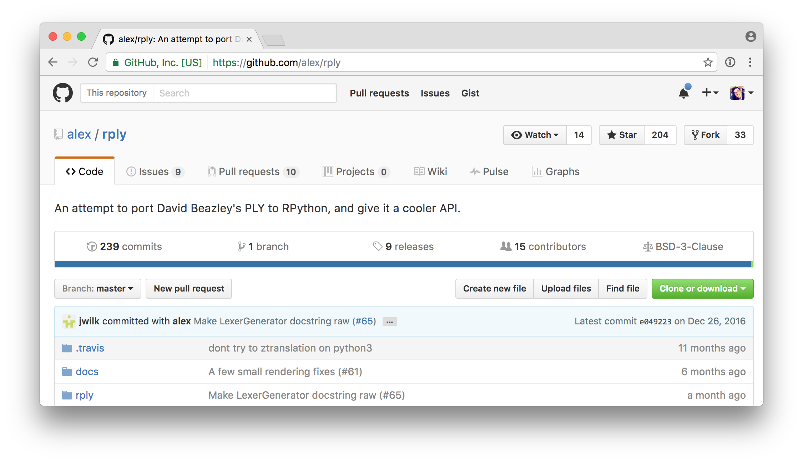

# I'm Dustin
## [`http://github.com/di`](http://github.com/di)

^ My name's Dustin Ingram

---


^ I work at PromptWorks, a software consultancy in Philadelphia

^ Promptworks got it's start years ago as a Ruby shop, and most of our reputation is for working with Ruby

^ But we actually we work with lots of different languages

^ And these days, it's more Python than anything else -- it's all I do

^ But we still have some Ruby devs who are occasionally writing Python

^ Which means that every now and then, we get questions like this in our Slack

---


## _The_
# Fastest FizzBuzz
## _in the_
# West

^ So I'm sure almost everyone's heard of FizzBuzz

^ If you haven't, FizzBuzz is a mythical interview question to see how well you can write code in an environment in which you will never actually write code

^ The goal is to sufficiently intimidate junior developers so they will know to steer clear of your organization

^ It also has the nice effect of offending senior developers too.

^ So it's great for quickly narrowing down your hiring pipeline.

---

# This talk is not about
# FizzBuzz

^ First things first, this talk is not about fizzbuzz

^ But FizzBuzz is the kind of faux-motivation for this talk

^ So to get started, I actually need to explain fizzbuzz

---

# FizzBuzz

Write a program that prints the numbers **1** through **n**.

For every number divisible by **3**, print **'fizz'**.

For every number divisible by **5**, print **'buzz'**.

If a number is divisible by both **3** and **5**, print **'fizzbuzz'**.

^ The general idea is ...

^ I've never actually been asked to do fizzbuzz in an interview

^ But at various stages of my career, I always imagined what I would do if someone did

---

# FizzBuzz

```python
>>> def fizzbuzz(n):
...    for i in range(1, n+1):
...        if i % 15 == 0:
...            print 'fizzbuzz'
...        elif i % 3 == 0:
...            print 'fizz'
...        elif i % 5 == 0:
...            print 'buzz'
...        else:
...            print i
...
```

^ Early on, this is probably close to what I would have written

---

# FizzBuzz

```python
>>> def fizzbuzz(n):
...    for i in range(n):
...        print(i%3//2*'fizz'+i%5//4*'buzz'or i+1)
```

^ I got pretty obsessed with really terse programming at one point

^ and memorized this thing

^ But in my imagination, there was never any limit on what language my solution could be

^ didn't have to be python

---

# FORTRAN

```fortran
program fizzbuzz_if
   integer :: i

   do i = 1, 100
      if     (mod(i,15) == 0) then; print *, 'FizzBuzz'
      else if (mod(i,3) == 0) then; print *, 'Fizz'
      else if (mod(i,5) == 0) then; print *, 'Buzz'
      else;                         print *, i
      end if
   end do
end program fizzbuzz_if
```

^ What if I did it in fortran? people still use that, right?

---

# BRAINFUCK

```brainfuck
++++++++++[>++++++++++<-]>>++++++++++>->>>>>>>>>>-->+
++++++[->++++++++++<]>[->+>+>+>+<<<<]+++>>+++>>>+++++
+++[-<++++<++++<++++>>>]+++++[-<++++<++++>>]>-->+++++
+[->+++++++++++<]>[->+>+>+>+<<<<]+++++>>+>++++++>++++
++>++++++++[-<++++<++++<++++>>>]++++++[-<+++<+++<+++>
>>]>-->---+[-<+]-<<[->>>+>++[-->++]-->+++[---<-->+>-[
<<++[>]]>++[--+[-<+]->>[-]+++++[---->++++]-->[->+<]>>
[.>]>++]-->+++]---+[-<+]->>-[+>++++++++++<<[->+>-[>+>
>]>[+[-<+>]>+>>]<<<<<<]>>[-]>>>++++++++++<[->->+<<]>[
-]>[<++++++[->++++++++<]>.[-]]<<++++++[-<++++++++>]<.
[-]<<[-<+>]]<<<.<]
```

^ I thought, maybe i could actually figure out how to use brainfuck

---

## <INSERT YOUR LANGUAGE HERE>

^ As great as these would have been for me in all my hypothetical interviews

^ I never bothered to learn cobol, or fortran, or anything else

^ But I was always really intrigued: Where could i draw the line?

^ Could I make my own language?

---

# DIVSPL

^ Oh, you want me to do fizzbuzz? mind if i use DIVSPL? haven't heard of it?

---

# DIVSPL
## (Dustin Ingram's Very Special Programming Language)

^ AKA

---

# DIVSPL

```mercury
1...15
fizz=3
buzz=5
```

^ Since it's my own language, i can make the syntax whatever I want

---



^ I found RPLY

^ RPLY is an implementation of PLY compatible with RPython (and with a cooler API)

^ RPython is a restricted subset of Python

^ PLY is a Python implementation of the Lex and Yacc tools

^ Lex is unix tool which generates lexical analyzers

^ Yacc is a parser generator, aka "Yet Another Compiler Compiler"

^ Got that?

---

# Let's design a language

---

# Parallels to human language

---

# "Isawaman"

---

# Parallels to human language

"I"
"Is"
"Isa" → "Is⎵a"
"Is⎵aw"
"Is⎵awa" → "Is⎵a⎵wa"
"Is⎵a⎵wam"
"Is⎵a⎵wama"
"Is⎵a⎵waman" → "I⎵saw⎵a⎵man"

---

# Parallels to human language

"I saw a man eating chicken"

^ Luckily we have spaces

---

# Parallels to human language

"I saw a man eating chicken"

```python
['I', 'saw', 'a', 'man', 'eating', 'chicken']
```

^ Luckily we have spaces

^ These are tokens, the whitespace too

---

# Parallels to human language

"I saw a man eating chicken"

```python
['I', 'saw', 'a', 'man', ['eating', 'chicken']]
```

---


---

# Parallels to human language

"I saw a man eating chicken"

```python
['I', 'saw', 'a', 'man', ['eating', 'chicken']]
```

---

# Parallels to human language

"I saw a man eating chicken"

```python
['I', 'saw', 'a', ['man', 'eating'], 'chicken']
```

---


---

# Parallels to human language

"I saw a man-eating chicken"

```python
['I', 'saw', 'a', ['man-eating', 'chicken']]
```

---

# Parallels to human language

* Break characters into tokens (lexer)
* Combine tokens into expressions (parser)
* Evaluate expressions (interpreter)

---

# Let's design a language

```mercury
1...15
fizz=3
buzz=5
```

---

# Let's design a language

```mercury
1...15
fizz=3
buzz=5
```

Numbers: "1", "15", "3", "5"

---

# Let's design a language

```mercury
1...15
fizz=3
buzz=5
```

Periods: "."

---

# Let's design a language

```mercury
1...15
fizz=3
buzz=5
```

Ellipsis: "..."

---

# Let's design a language

```mercury
1...15
fizz=3
buzz=5
```

Words: "fizz", "buzz"

---

# Let's design a language

```mercury
1...15
fizz=3
buzz=5
```

Equals: "="

---

# Let's design a language

```mercury
1...15\n
fizz=3\n
buzz=5\n
```

Newlines?

---

# Let's make a lexer

^ The lexer is simple: It takes a stream of characters

^ And gives an iterator which provides tokens from the language

---

# Let's make a lexer

```python
>>> from rply import LexerGenerator
>>> lg = LexerGenerator()
>>>
```

^ Create a new LexerGenerator

^ We'll add some rules for our language as named regular expressions

---

# Let's make a lexer

```python
>>> from rply import LexerGenerator
>>> lg = LexerGenerator()
>>> lg.add("ELLIPSIS", r"\.\.\.")
>>>
```

^ An Ellipsis token is a series of three literal periods

---

# Let's make a lexer

```python
>>> from rply import LexerGenerator
>>> lg = LexerGenerator()
>>> lg.add("ELLIPSIS", r"\.\.\.")
>>> lg.add("NUMBER", r"\d+")
>>>
```

^ A number token is any numeric characters in a sequence

---

# Let's make a lexer

```python
>>> from rply import LexerGenerator
>>> lg = LexerGenerator()
>>> lg.add("ELLIPSIS", r"\.\.\.")
>>> lg.add("NUMBER", r"\d+")
>>> lg.add("EQUALS", r"=")
>>>
```

^ An assignment token is the equals sign

---

# Let's make a lexer

```python
>>> from rply import LexerGenerator
>>> lg = LexerGenerator()
>>> lg.add("ELLIPSIS", r"\.\.\.")
>>> lg.add("NUMBER", r"\d+")
>>> lg.add("EQUALS", r"=")
>>> lg.add("WORD", r"[a-z]+")
>>>
```

^ A word token is any alphabetical characters in a sequence

---

# Let's make a lexer

```python
>>> from rply import LexerGenerator
>>> lg = LexerGenerator()
>>> lg.add("ELLIPSIS", r"\.\.\.")
>>> lg.add("NUMBER", r"\d+")
>>> lg.add("EQUALS", r"=")
>>> lg.add("WORD", r"[a-z]+")
>>> lg.ignore(r"\s+")  # Ignore whitespace
>>>
```

^ Because we're cool we won't care about whitespace characters

---

# Let's make a lexer

```python
>>> from rply import LexerGenerator
>>> lg = LexerGenerator()
>>> lg.add("ELLIPSIS", r"\.\.\.")
>>> lg.add("NUMBER", r"\d+")
>>> lg.add("EQUALS", r"=")
>>> lg.add("WORD", r"[a-z]+")
>>> lg.ignore(r"\s+")  # Ignore whitespace
>>> lg.ignore(r"#.*\n")  # Ignore comments
>>>
```

^ Because we're good devs we'll allow for comments, which is anything between a pound sign and a newline character

---

# Let's make a lexer

```python
>>> from rply import LexerGenerator
>>> lg = LexerGenerator()
>>> lg.add("ELLIPSIS", r"\.\.\.")
>>> lg.add("NUMBER", r"\d+")
>>> lg.add("EQUALS", r"=")
>>> lg.add("WORD", r"[a-z]+")
>>> lg.ignore(r"\s+")  # Ignore whitespace
>>> lg.ignore(r"#.*\n")  # Ignore comments
>>> lexer = lg.build()
>>>
```

^ And finally we'll build our lexer

---

# Let's make a lexer

```python
>>> iterator = lexer.lex('...foo42hut=')
>>>
```


---

# Let's make a lexer

```python
>>> iterator = lexer.lex('...foo42hut=')
>>> iterator.next()
Token('ELLIPSIS', '...')
>>>
```

^ So every time we call next on it

---

# Let's make a lexer

```python
>>> iterator = lexer.lex('...foo42hut=')
>>> iterator.next()
Token('ELLIPSIS', '...')
>>> iterator.next()
Token('WORD', 'foo')
>>>
```

---

# Let's make a lexer

```python
>>> iterator = lexer.lex('...foo42hut=')
>>> iterator.next()
Token('ELLIPSIS', '...')
>>> iterator.next()
Token('WORD', 'foo')
>>> iterator.next()
Token('NUMBER', '42')
>>>
```

---

# Let's make a lexer

```python
>>> iterator = lexer.lex('...foo42hut=')
>>> iterator.next()
Token('ELLIPSIS', '...')
>>> iterator.next()
Token('WORD', 'foo')
>>> iterator.next()
Token('NUMBER', '42')
>>> iterator.next()
Token('WORD', 'hut')
>>>
```

---

# Let's make a lexer

```python
>>> iterator = lexer.lex('foobar!')
>>>
```

^ If our stream has invalid tokens

---

# Let's make a lexer

```python
>>> iterator = lexer.lex('foobar!')
>>> iterator.next()
Token('WORD', 'foobar')
>>>
```

^ It works, until

---

# Let's make a lexer

```python
>>> iterator = lexer.lex('foobar!')
>>> iterator.next()
Token('WORD', 'foobar')
>>> iterator.next()
Traceback (most recent call last):
  File "<stdin>", line 1, in <module>
  File "lexer.py", line 53, in next
    raise LexingError(...)
rply.errors.LexingError
>>>
```

^ We get to a token the lexer doesn't understand

---

# Let's make a lexer

```python
>>> iterator = lexer.lex('1...15\nfizz=3\nbuzz=5')
[
    Token('NUMBER', '1'), Token('ELLIPSIS', '...'), Token('NUMBER', '15'),
    Token('WORD', 'fizz'), Token('EQUALS', '='), Token('NUMBER', '3'),
    Token('WORD', 'buzz'), Token('EQUALS', '='), Token('NUMBER', '5'),
]
```

---

# Let's make a parser

^ Specifically, we're going to make a Look-Ahead Left-Right parser

^ The parser will take the token stream from the lexer

^ and separate and analyze the tokens according to a set of production rules specified by a formal grammar

^ Let's define our grammar

---

# Let's make a parser

```mercury
1...15
fizz=3
buzz=5
```

---

# Let's make a parser

```mercury
1...15
fizz=3
buzz=5
```

_range_ ⟶ NUMBER ELLIPSIS NUMBER

---

# Let's make a parser

```mercury
1...15
fizz=3
buzz=5
```

_range_ ⟶ NUMBER ELLIPSIS NUMBER
_assignment_ ⟶ WORD EQUALS NUMBER

---

# Let's make a parser

```mercury
1...15
fizz=3
buzz=5
```

_range_ ⟶ NUMBER ELLIPSIS NUMBER
_assignment_ ⟶ WORD EQUALS NUMBER
_assignments_ ⟶ _assignments_ _assignment_

---

# Let's make a parser

```mercury
1...15
fizz=3
buzz=5
```

_range_ ⟶ NUMBER ELLIPSIS NUMBER
_assignment_ ⟶ WORD EQUALS NUMBER
_assignments_ ⟶ _assignments_ _assignment_
_assignments_ ⟶ 𝜀

---

# Let's make a parser

```mercury
1...15
fizz=3
buzz=5
```

_range_ ⟶ NUMBER ELLIPSIS NUMBER
_assignment_ ⟶ WORD EQUALS NUMBER
_assignments_ ⟶ _assignments_ _assignment_
_assignments_ ⟶ 𝜀
_main_ ⟶ _range_ _assignments_

---

# Let's make a parser

```python
>>> from rply import ParserGenerator
>>> pg = ParserGenerator([
...   "ELLIPSIS",
...   "EQUALS",
...   "NUMBER",
...   "WORD"
... ])
>>>
```

^ We get a ParserGenerator from rply, and initialize it with our list of tokens

---

# Let's make a parser

_range_ ⟶ NUMBER ELLIPSIS NUMBER

```python
>>> @pg.production("range : NUMBER ELLIPSIS NUMBER")
... def range_op(p):
...     return RangeBox(int(p[0].value), int(p[2].value))
...
>>>
```

^ This is how we define our rule in python

^ You might notice the RangeBox

---

## Python `!=` Statically Typed
## RPython `==` Statically Typed

^ One quick difference between Python and RPython

---

# Let's make a parser

```python
>>> class RangeBox(BaseBox):
...     def __init__(self, low, high):
...         self.low = low
...         self.high = high
...     def eval(self):
...         return range(self.low, self.high + 1)
...
>>>
```

---

# Let's make a parser

```python
>>> box = RangeBox(1, 3)
<__main__.RangeBox object at 0x1046ba650>
>>>
```

---

# Let's make a parser

```python
>>> box = RangeBox(1, 3)
<__main__.RangeBox object at 0x1046ba650>
>>> box.eval()
[1, 2, 3]
>>>
```

---

# Let's make a parser

_assignment_ ⟶ WORD EQUALS NUMBER

```python
>>> @pg.production("assignment : WORD EQUALS NUMBER")
... def assignment_op(p):
...     return AssignmentBox(p[0].value, int(p[2].value))
...
>>>
```

---

# Let's make a parser

```python
>>> class AssignmentBox(BaseBox):
...     def __init__(self, word, number):
...         self.word = word
...         self.number = number
...     def eval(self, i):
...         if not i % int(self.number):
...             return self.word
...         return ''
>>>
```

---

# Let's make a parser

```python
>>> box = AssignmentBox('foo', 7)
>>> box.eval(40)
''
>>> box.eval(42)
'foo'
>>>
```

---

# Let's make a parser

_assignments_ ⟶ _assignments_ _assignment_
_assignments_ ⟶ 𝜀

```python
>>> @pg.production("assignments : assignments assignment")
... @pg.production("assignments : ")
... def expr_assignments(p):
...     if p:
...         return p[0] + [p[1]]
...     return []
...
>>>
```

^ Doesn't need a box, it's just a list

---

# Let's make a parser

_main_ ⟶ _range_ _assignments_

```python
>>> @pg.production("main : range assignments")
... def main(p):
...     return ProgramBox(p[0], p[1])
...
>>>
```

---

# Let's make a parser

```python
>>> class ProgramBox(BaseBox):
...     def __init__(self, range_box, assignment_boxes):
...         self.range_box = range_box
...         self.assignment_boxes = assignment_boxes
...
```

---

# Let's make a parser

```python
...     def eval(self):
...         return "\n".join(
...             "".join(
...               assignment.eval(i)
...               for assignment in self.assignment_boxes
...             ) or str(i)
...             for i in self.range_box.eval()
...         ) + "\n"
...
>>>
```

^ Evals the range box

^ For every integer in the range

^ Eval every assignment box and concatenate the results

^ If the result is an empty string, cast the integer to a string instead

^ Join the results with newlines and return!

---

# Let's make a parser

```python
>>> parser = pg.build()
```

---

# Let's make a parser

```python
>>> parser = pg.build()
>>> parser.parse(lexer.lex('1...3'))
<divspl.boxes.MainBox object at 0x10a37cc50>
```

---

# Let's make a parser

```python
>>> parser = pg.build()
>>> parser.parse(lexer.lex('1...3'))
<divspl.boxes.MainBox object at 0x10a37cc50>
>>> parser.parse(lexer.lex('1...3')).eval()
'1\n2\n3\n'
```

---

# Let's make an interpreter

^ What does an interpreter do?

---

# Let's make an interpreter

```python
>>> def main():
...     if len(sys.argv) > 1:
...         with open(sys.argv[1], 'r') as f:
...             result = parser.parse(lexer.lex(f.read()))
...             sys.stdout.write(result.eval())
...     else:
...         sys.stdout.write("Please provide a filename.")
...
>>>
```

^ Reads in a file

^ Hands the character stream to the lexer

^ Lexer hands the token stream to the parser

^ Parser returns a result

^ We evaluate and print the result


---

# Let's code

---

# Let's code

```
$ cat fizzbuzz.divspl
1...15
fizz=3
buzz=5
```

---

# Let's code

```
$ pip install divspl
Collecting divspl
  Downloading divspl-0.0.3.tar.gz
Collecting rply (from divspl)
  Using cached rply-0.7.4-py2.py3-none-any.whl
Collecting appdirs (from rply->divspl)
  Using cached appdirs-1.4.0-py2.py3-none-any.whl
Installing collected packages: appdirs, rply, divspl
  Running setup.py install for divspl ... done
Successfully installed appdirs-1.4.0 divspl-0.0.3 rply-0.7.4
```

---

# Let's code

```
$ divspl fizzbuzz.divspl
1
2
fizz
4
buzz
fizz
7
8
fizz
buzz
11
fizz
13
14
fizzbuzz
```

---

# Let's review

---

# Let's review

```mercury
1...15
fizz=3
buzz=5
```

---

# Let's review

```python
[
    Token('NUMBER', '1'), Token('ELLIPSIS', '...'), Token('NUMBER', '15'),
    Token('WORD', 'fizz'), Token('EQUALS', '='), Token('NUMBER', '3'),
    Token('WORD', 'buzz'), Token('EQUALS', '='), Token('NUMBER', '5'),
]
```

---

# Let's review

```python
MainBox(
    RangeBox(
        IntBox(Token('NUMBER', '1')),
        IntBox(Token('NUMBER', '15'))
    ),
    AssignmentsBox(
        AssignmentsBox(
            AssignmentsBox(),
            AssignmentBox(
                WordBox(Token('WORD', 'fizz')),
                IntBox(Token('NUMBER', '3'))
            )
        ),
        AssignmentBox(
            WordBox(Token('WORD', 'buzz')),
            IntBox(Token('NUMBER', '5'))
        )
    )
)
```

---

# Let's review

```python
"1\n2\nfizz\n4\nbuzz\nfizz\n7\n8\nfizz\nbuzz\n11\nfizz\n13\n14\nfizzbuzz\n"
```

---

# Let's review

```
1
2
fizz
4
buzz
fizz
7
8
fizz
buzz
11
fizz
13
14
fizzbuzz
```

---

# Let's take it a step further

---

# Let's take it a step further

Write a program that prints the numbers **1** through **n**.

For every number divisible by **3**, print **'fizz'**.

For every number divisible by **5**, print **'buzz'**.

If a number is divisible by both **3** and **5**, print **'fizzbuzz'**.

---

# Let's take it a step further

For every number divisible by **7**, print **'fuzz'**.

If a number is divisible by both **3** and **7**, print **'fizzfuzz'**.

If a number is divisible by both **5** and **7**, print **'buzzfuzz'**.

If a number is divisible by **3**, **5** and **7**, print **'fizzbuzzfuzz'**.

---

# Let's take it a step further

```mercury
1...15
fizz=3
buzz=5
```

---

# Let's take it a step further

```mercury
1...105
fizz=3
buzz=5
fuzz=7
```

---

# Let's take it a step further

```
$ divspl fizzbuzzfuzz.divspl
...(intermediate output omitted)
97
fuzz
fizz
buzz
101
fizz
103
104
fizzbuzzfuzz
```

---

# Thanks

---

# Links

* <https://github.com/di/divspl>
* RPLY: <https://github.com/alex/rply>
    * RPython: <https://en.wikipedia.org/wiki/PyPy#RPython>
    * PLY: <http://www.dabeaz.com/ply/>
        * Lex: <https://en.wikipedia.org/wiki/Lex_(software)>
        * Yacc: <https://en.wikipedia.org/wiki/Yacc>
