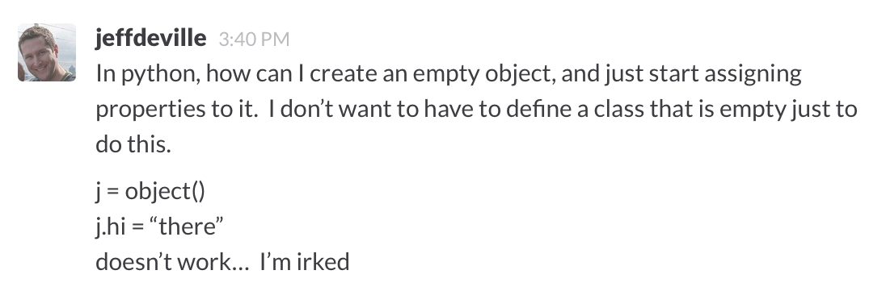
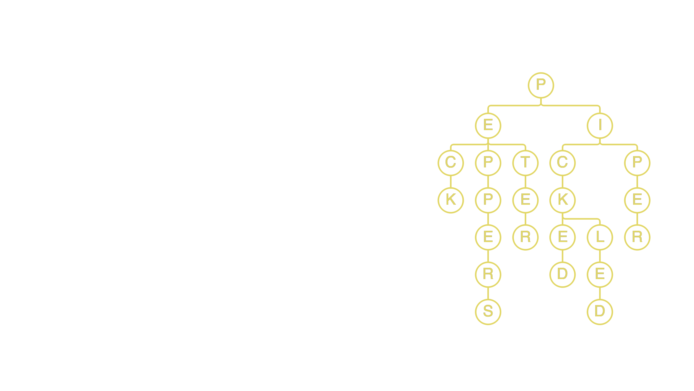

# Python Tips, Tricks, and Hidden Features
### (using type, collections, meta-classes, and more)

---


# I'm Dustin
## [`http://github.com/di`](http://github.com/di)

---


^ It seems like Promptworks is mostly known for working with Ruby

^ But actually we work with lots of different languages

^ And these days, that includes a lot of Python -- it's all I do

^ Which means that every now and then, we have Ruby devs asking Python questions

---

# Irked.




^ Recently a dev who primarily works with Ruby asked this question

^ What happens when you try to do this?

---

# Irked.

```python
>>> j = object()
>>> j.hi = 'there'
Traceback (most recent call last):
  File "<stdin>", line 1, in <module>
AttributeError: 'object' object has no attribute 'hi'
```

^ Why does this happen? Seems counter-intuitive.

^ Of course it doesn't have that attribute, we're setting it.

^ But why doesn't it work?

---

# `type`

^ Let's talk about type

^ first a quiz.

---

# `type`

```python
>>> type(['foo', 'bar'])
```

^ Here's an easy one. What's the type of this list?

---

# `type`

```python
>>> type(['foo', 'bar'])
<type 'list'>
```

^ Right, list.

---

# `type`

```python
>>> type(list)
```

^ So what's the type of list?

---

# `type`

```python
>>> type(list)
<type 'type'>
```

^ It's a type

---

# `type`

```python
>>> type(type)
```

^ Uh-oh. What's the type of type?

---

# `type`

```python
>>> type(type)
<type 'type'>
```

^ It's a type, of course.

^ Turtles all the way down

---

# `type`

```python
>>> type(None)
```

^ Some more. What's the type of None?

---

# `type`

```python
>>> type(None)
<type 'NoneType'>
```

^ We've all sure see that a lot I'm sure

^ "NoneType has no attribute blah blah"

---

# `type`

```python
>>> def func():
...     pass
...
>>> type(func)
```

^ What's the type of this function?

---

# `type`

```python
>>> def func():
...     pass
...
>>> type(func)
<type 'function'>
```

^ Wait, function isn't a reserved word!

^ Well, neither was NoneType

^ Where do these come from?

---

# `type`

```python
>>> import types
>>> dir(types)
['BooleanType', 'BufferType', 'BuiltinFunctionType', 'BuiltinMethodType',
'ClassType', 'CodeType', 'ComplexType', 'DictProxyType', 'DictType',
'DictionaryType', 'EllipsisType', 'FileType', 'FloatType', 'FrameType',
'FunctionType', 'GeneratorType', 'GetSetDescriptorType', 'InstanceType',
'IntType', 'LambdaType', 'ListType', 'LongType', 'MemberDescriptorType',
'MethodType', 'ModuleType', 'NoneType', 'NotImplementedType', 'ObjectType',
'SliceType', 'StringType', 'StringTypes', 'TracebackType', 'TupleType',
'TypeType', 'UnboundMethodType', 'UnicodeType', 'XRangeType', '__all__',
'__builtins__', '__doc__', '__file__', '__name__', '__package__']
```

^ There they are

---

# `type`

```python
>>> import types
>>> type(types)
```

^ While we've got `types` imported

---

# `type`

```python
>>> import types
>>> type(types)
<type 'module'>
>>> type(types) == types.ModuleType
True
```

^ Makes sense

---

# `type`

```python
>>> class FooClass:
...     pass
...
>>> type(FooClass)
```

^ One more.

---

# `type`

```python
>>> class FooClass: # Python 2.7
...     pass
...
>>> type(FooClass)
<type 'classobj'>
```

^ Trick question! Depends on our python version

^ In Python 2, this is a 'classobj' type

---

# `type`

```python
>>> class FooClass: # Python 3.4
...     pass
...
>>> type(FooClass)
<class 'type'>
```

^ In Python 3, (or as I like to call it, "Python"), it's a 'type' class

^ To make this even more confusing...

---

# `type`

```python
>>> class FooClass(object): # Python 2.7
...     pass
...
>>> type(FooClass)
<type 'type'>
```

^ We call this "new style classes"

^ It gives us a type of type

^ But it's basically the same as Python... 3.

^ From here on out, we're only talking about Python, not Python 2

---

# `type`

```python
>>> type(42) is int
True
>>> type(42)()
0
>>> int()
0
```

^ So if a class is just a type type,

^ And calling type with an argument such as '42' this gives us the class

---

# `type`

```python
>>> j = type()
```

^ Can we create a new class dynamically by initializing type?

---

# `type`

```python
>>> j = type()
Traceback (most recent call last):
  File "<stdin>", line 1, in <module>
TypeError: type() takes 1 or 3 arguments
```

^ One argument would just give us the type of the argument,

^ So what are the three arguments?

---

# `type`

```python
>>> j = type('FooClass', (object,), {'hi': 'there'})
>>> type(j)
<class 'type'>
```

^ Classname, base classes, and attributes

^ But now we've come full circle

---

# `type`

```python
>>> j = type('FooClass', (object,), {'hi': 'there'})
>>> j.hi
'there'
```

^ Technically this is a class variable, not an instance variable.

^ And if we really wanted to get fancy,

---

# `type`

```python
>>> j = type('', (object,), {'hi': 'there'})
>>> j.hi
'there'
```

^ We don't need to actually specify a classname...

---

# `type`

```python
>>> j = type('', (), {'hi': 'there'})
>>> j.hi
'there'
```

^ Or any base classes...

---

# `type`

```python
>>> j = type('', (), {})
>>> j.hi = 'there'
>>> j.hi
'there'
```

^ Or really even any attributes.

---

# `type`

```python
>>> j = object()
>>> j.hi = 'there'
Traceback (most recent call last):
  File "<stdin>", line 1, in <module>
AttributeError: 'object' object has no attribute 'hi'
```

^ So let's go back to this again.

^ Why doesn't python let us do this?

---

# `type`

```python
>>> class FooClass():
...     pass
...
>>> hasattr(FooClass(), '__dict__')
True
>>> hasattr(object(), '__dict__')
False
```

^ So the message is actually __setattr__ failing

^ objects have no __dict__ -- why?

---

# `type`

```python
>>> from stackoverflow import getsize¹
>>> getsize(object())
16
>>> getsize(0)
24
>>> getsize(dict())
280
>>> getsize(FooClass())
344
```

[^1]: <http://stackoverflow.com/a/30316760/4842627>

^ [^1]


^ The real answer is size.

^ If `object` had a `__dict__` attribute, everything would be bigger

^ Also, there's no reason for an int to have a dict, or attributes

^ Side note: It's non-trivia to figure out the size of a Python object

^ `sys.getsizeof()` isn't recursive

^ Units are Bytes

---

# Questions?

---

# `collections`

---

# `collections`

```python
>>> def group(names):
...


>>> group(['tom', 'dick', 'harry', 'guido'])
{3: ['tom'], 4: ['dick'], 5: ['harry', 'guido']}
                                                     
```

^ Let's say we want to group a list of names by their length as a `dict`:

---

# `collections`

```python
>>> def group(names):
...     d = {}
...


>>> group(['tom', 'dick', 'harry', 'guido'])
{3: ['tom'], 4: ['dick'], 5: ['harry', 'guido']}
                                                     
```

---

# `collections`

```python
>>> def group(names):
...     d = {}
...     for name in names:
...


>>> group(['tom', 'dick', 'harry', 'guido'])
{3: ['tom'], 4: ['dick'], 5: ['harry', 'guido']}
                                                     
```

---

# `collections`

```python
>>> def group(names):
...     d = {}
...     for name in names:
...         key = len(name)
...


>>> group(['tom', 'dick', 'harry', 'guido'])
{3: ['tom'], 4: ['dick'], 5: ['harry', 'guido']}
                                                     
```

---

# `collections`

```python
>>> def group(names):
...     d = {}
...     for name in names:
...         key = len(name)
...         if key not in d:
...             d[key] = []
...


>>> group(['tom', 'dick', 'harry', 'guido'])
{3: ['tom'], 4: ['dick'], 5: ['harry', 'guido']}
                                                     
```

---

# `collections`

```python
>>> def group(names):
...     d = {}
...     for name in names:
...         key = len(name)
...         if key not in d:
...             d[key] = []
...         d[key].append(name)
...

>>> group(['tom', 'dick', 'harry', 'guido'])
{3: ['tom'], 4: ['dick'], 5: ['harry', 'guido']}
                                                     
```

---

# `collections`

```python
>>> def group(names):
...     d = {}
...     for name in names:
...         key = len(name)
...         if key not in d:
...             d[key] = []
...         d[key].append(name)
...     return d
...
>>> group(['tom', 'dick', 'harry', 'guido'])
{3: ['tom'], 4: ['dick'], 5: ['harry', 'guido']}
                                                     
```

^ Great. How many times to we check if the key is in the `dict`?

^ Three times.

---

# `collections`

```python
>>> def group(names):
...     d = {}
...     for name in names:
...         key = len(name)
...         d.setdefault(key, []).append(name)
...     return d
...
>>> group(['tom', 'dick', 'harry', 'guido'])
{3: ['tom'], 4: ['dick'], 5: ['harry', 'guido']}


                                                     
```

^ Better. How many times now?

^ Once -- `setdefault` returns a reference to the value.

^ Boy that `d = {}` sure looks ugly. Let's make this a comprehension:

---

# `collections`

```python
>>> def group(names):
...     return {
...         length: [
...             name for name in names if len(name) == length
...         ]
...         for length in {len(name) for name in names}
...     }
...
>>> group(['tom', 'dick', 'harry', 'guido'])
{3: ['tom'], 4: ['dick'], 5: ['harry', 'guido']}

                                                     
```

^ Great, we've used every kind of comprehension. But what's wrong here?

^ This has just become a polynomial-time algorithm!

^ There must be a better way:

---

# `collections.defaultdict`

```python
>>> from collections import defaultdict
>>> def group(names):
...     d = defaultdict(list)
...     for name in names:
...         key = len(name)
...         d[key].append(name)
...     return dict(d)
...
>>> group(['tom', 'dick', 'harry', 'guido'])
{3: ['tom'], 4: ['dick'], 5: ['harry', 'guido']}

                                                     
```

^ Much better.

---

# `collections.defaultdict`

_trie_: an ordered tree data structure
that is used to store a dynamic set or
associative array where the keys are
usually strings[^2].

e.g.: "**peter** **piper** **picked**
a **peck** of **pickled** **peppers**"



[^2]: <https://en.wikipedia.org/wiki/Trie>

---

# `collections.defaultdict`

```python
>>> trie = ...
>>> trie['b']['a']['r'] = True
>>> trie['b']['a']['r'] == True
True
>>> trie['f']['o']['o'] == True
False
>>> trie
{'b': {'a': {'r': True}}}
```

^ Let's say I want to implement a trie (a fast/small way to store dictionaries)

^ I want the trie to act like a `dict` where each successive key is a letter

^ If the word exists, the value of the last key (i.e., letter) is `True`

^ If the word doesn't exist, my function returns `False`

^ BTW: This is a naieve tree, won't work for for words with words as substrings

---

# `collections.defaultdict`

```python
>>> trie = {}
>>> trie['b']['a']['r'] = True
Traceback (most recent call last):
  File "<stdin>", line 1, in <module>
KeyError: 'b'
```

^ We can't just use a dictionary, because this would happen

^ How can we do this with `defaultdict`s?

---

# `collections.defaultdict`

```python
>>> from collections import defaultdict
>>> trie = defaultdict(lambda: defaultdict(dict))
>>> trie['b']['a']['r'] = True
>>> trie['b']['a']['r'] == True
True
```

^ We could do this, because our `lambda` function is callable just like `dict`

^ Instead of giving us an empty dict, it gives us an empty default dict

---

# `collections.defaultdict`

```python
>>> from collections import defaultdict
>>> trie = defaultdict(lambda: defaultdict(dict))
>>> trie['b']['a']['r'] = True
>>> trie['b']['a']['r'] == True
True
>>> trie['f']['o']['o'] == True
Traceback (most recent call last):
  File "<stdin>", line 1, in <module>
KeyError: 'o'
```

^ But checking for that third letter doesn't work

^ Because it's still just a dict

---

# `collections.defaultdict`

```python
>>> from collections import defaultdict
>>> trie = defaultdict(lambda: defaultdict(dict))
>>> trie['t']['r']['i']['e'] = True
Traceback (most recent call last):
  File "<stdin>", line 1, in <module>
KeyError: 'i'
```

^ And we can't add words with more than three letters, same reason

---

# `collections.defaultdict`

```python
>>> from collections import defaultdict
>>> trie = defaultdict(lambda: defaultdict(
...     lambda: defaultdict(lambda: defaultdict(
...         lambda: defaultdict(lambda: defaultdict(
...             dict))))))
```

^ We could do this...

^ But this would quickly get out of control for long words.

^ Also, it still limits the length of words our trie could support

^ Obviously doesn't make sense.

^ And it's starting to look kinda LISP-y with all those parens

---

# `collections.defaultdict`

```python
>>> from collections import defaultdict
>>> infinitedict = lambda: defaultdict(infinitedict)
>>> trie = infinitedict()
>>> trie['b']['a']['r'] = True
>>> trie['b']['a']['r'] == True
True
>>> trie['f']['o']['o'] == True
False
```

^ It's turtles all the way down, now.

^ Wait, this works? No different than any other recursive function.

---

# `collections.defaultdict`

```python
>>> from collections import defaultdict
>>> def infinitedict():
...     return defaultdict(infinitedict)
...
>>> trie = infinitedict()
>>> trie['b']['a']['r'] = True
>>> trie['b']['a']['r'] == True
True
>>> trie['f']['o']['o'] == True
False
```

---

# `collections`

```python
>>> def count(names):
...


>>> count(['beetlejuice', 'beetlejuice', 'guido'])
{'beetlejuice': 2, 'guido': 1}
```

^ Let's say we want the occurences of a name in a list instead, as a `dict`:

---

# `collections`

```python
>>> from collections import defaultdict
>>> def count(names):
...     d = defaultdict(int)
...


>>> count(['beetlejuice', 'beetlejuice', 'guido'])
{'beetlejuice': 2, 'guido': 1}
```

^ Let's use that cool new defaultdict library, right?

---

# `collections`

```python
>>> from collections import defaultdict
>>> def count(names):
...     d = defaultdict(int)
...     for name in names:
...         d[name] += 1
...

>>> count(['beetlejuice', 'beetlejuice', 'guido'])
{'beetlejuice': 2, 'guido': 1}
```

---

# `collections`

```python
>>> from collections import defaultdict
>>> def count(names):
...     d = defaultdict(int)
...     for name in names:
...         d[name] += 1
...     return dict(d)
...
>>> count(['beetlejuice', 'beetlejuice', 'guido'])
{'beetlejuice': 2, 'guido': 1}
```

^ Hmm, this seems like something that would happen pretty often...

---

# `collections.Counter`

```python
>>> from collections import Counter
>>> def count(names):
...     return dict(Counter(names))
...
>>> count(['beetlejuice', 'beetlejuice', 'guido'])
{'beetlejuice': 2, 'guido': 1}
```

^ Don't even need the function, really.

---

# Questions?

---

# Metaclasses

^ Now we're gonna talk about metaclasses, but first

---

# Metaclasses

```python
>>> class FooClass():
...     pass
...
```

^ Let's just think about regular classes for a second

---

# Metaclasses

```python
>>> class FooClass():
...     pass
...
>>> a, b = FooClass(), FooClass()
>>> a is b
False
```

^ When you instantiate a class twice, you get two different instances

^ If I set some attribute on a, b does not change

---

# Metaclasses

```python
>>> class Singleton():
...


>>> class FooClass(Singleton):
...     pass
...
>>> a, b = FooClass(), FooClass()
>>> a is b
True
```

^ A singleton is a design pattern which allows a class to be instantiated once

^ Any subsequent tries to instantiate it get back the first instance

^ Let's implement a Singleton class

---

# Metaclasses

```python
>>> class Singleton():
...     _instance = None
...


>>> class FooClass(Singleton):
...     pass
...
>>> a, b = FooClass(), FooClass()
>>> a is b
True
```

^ We'll give it a class variable _instance to hold the instance

---

# Metaclasses

```python
>>> class Singleton():
...     _instance = None
...     def __new__(cls, *args, **kwargs):
...


>>> class FooClass(Singleton):
...     pass
...
>>> a, b = FooClass(), FooClass()
>>> a is b
True
```

^ Then we'll override the new method. Not the init method!

^ The new method is responsible for returning an instance

^ The init method initializes the instance returned by new

---

# Metaclasses

```python
>>> class Singleton():
...     _instance = None
...     def __new__(cls, *args, **kwargs):
...         if not cls._instance:
...


>>> class FooClass(Singleton):
...     pass
...
>>> a, b = FooClass(), FooClass()
>>> a is b
True
```

^ If cls._instance is None, this is the first time we are trying initialize

---

# Metaclasses

```python
>>> class Singleton():
...     _instance = None
...     def __new__(cls, *args, **kwargs):
...         if not cls._instance:
...             cls._instance = object.__new__(cls, *args, **kwargs)
...

>>> class FooClass(Singleton):
...     pass
...
>>> a, b = FooClass(), FooClass()
>>> a is b
True
```

^ If that's the case, set the _instance to be a new instance

---

# Metaclasses

```python
>>> class Singleton():
...     _instance = None
...     def __new__(cls, *args, **kwargs):
...         if not cls._instance:
...             cls._instance = object.__new__(cls, *args, **kwargs)
...         return cls._instance
...
>>> class FooClass(Singleton):
...     pass
...
>>> a, b = FooClass(), FooClass()
>>> a is b
True
```

^ Finally return the instance

^ It works! Great, we don't even need meta classes.

^ What's the biggest potential problem with this approach?

^ Multiple inheritance. FooClass could have another base class which overrides

^ We'd have to think way harder than is necessary

^ What we really want is a way to control the creation of each FooClass

---

# Metaclasses

classes : instances : : metaclasses : classes

^ Classes are to instances as metaclasses are to classes

^ Classes create instances, metaclasses create classes

^ Metaclasses also auto-magically handles tricky inheritance

^ Can anyone name a metaclass in Python?

---

# Metaclasses

```python
>>> j = type('FooClass', (object,), {'hi': 'there'})
>>> type(j)
<class 'type'>
```

^ We just learned this. Type is infact a metaclass

^ So how do we create a metaclass like type?

---

# Metaclasses

```python
>>> j = type('FooClass', (object,), {'hi': 'there'})
>>> type(j)
<class 'type'>
```
```python
>>> type(j())
<class '__main__.FooClass'>
```

^ We just learned this. Type is infact a metaclass

^ So how do we create a metaclass like type?

---

# Metaclasses

```python
>>> class MyMeta(type):
...     pass
...
```

^ Pretty simple. A metaclass is still a class after all

^ And since type is a class, we can extend from it

^ So how do we attach this to a class?

---

# Metaclasses

```python
>>> class MyMeta(type):
...     pass
...
>>> class FooClass(metaclass=MyMeta):
...     pass
...
```

^ We use a keyword arguement

^ Side note: different in 2.7

---

# Metaclasses

```python
>>> class MyMeta(type):
...     pass
...
>>> class FooClass(object): # Python 2.7
...    __metaclass__ = MyMeta
...
```

^ In Python 2.x, it's a special field

---
# Metaclasses

```python
>>> class MyMeta(type):
...     def __new__(meta, name, bases, attrs):
...         return super().__new__(meta, name, bases, attrs)
...
>>> class FooClass(metaclass=MyMeta):
...     pass
...
```

^ To make metaclasses actually useful, we have to override __new__

^ But this time, new is not returning an instance, it's returning a class

^ Like calling type with name, bases, attrs, but not just a new class

^ By calling new of super, it becomes an instance of mymeta

^ By the way, there are so many names for all of these fields

^ There is not much consistency, this is what I like the best

---

# Metaclasses

```python
>>> class MyMeta(type):
...     def __new__(meta, name, bases, attrs):
...         print('New {}'.format(name))
...         return super().__new__(meta, name, bases, attrs)
...
>>> class FooClass(metaclass=MyMeta):
...     pass
...
New FooClass
```

^ Just to be clear, this line gets printed when the class is created

---


# Metaclasses

```python
>>> class MyMeta(type):
...     def __call__(cls, *args, **kwargs):
...         print('Call {}'.format(cls.__name__))
...         return super().__call__(*args, **kwargs)
...
>>> class FooClass(metaclass=MyMeta):
...     pass
...
>>> f = FooClass()
Call FooClass
                                                            
```

^ When we initialize a class, call gets called

---

# Metaclasses

```python
>>> class Singleton(type):
...


>>> class FooClass(metaclass=Singleton):
...     pass
...
>>> a, b = FooClass(), FooClass()
>>> a is b
True
```

^ So now we can use this new knowledge to write a Singleton metaclass

^ First things first, it must inherit from type

---

# Metaclasses

```python
>>> class Singleton(type):
...     def __new__(meta, name, bases, attrs):
...


>>> class FooClass(metaclass=Singleton):
...     pass
...
>>> a, b = FooClass(), FooClass()
>>> a is b
True
```

^ We'll override new

---

# Metaclasses

```python
>>> class Singleton(type):
...     def __new__(meta, name, bases, attrs):
...         attrs['_instance'] = None
...


>>> class FooClass(metaclass=Singleton):
...     pass
...
>>> a, b = FooClass(), FooClass()
>>> a is b
True
```

^ We'll give the class an attribute instance, like before, set to None

---

# Metaclasses

```python
>>> class Singleton(type):
...     def __new__(meta, name, bases, attrs):
...         attrs['_instance'] = None
...         return super().__new__(meta, name, bases, attrs)
...


>>> class FooClass(metaclass=Singleton):
...     pass
...
>>> a, b = FooClass(), FooClass()
>>> a is b
True
```

^ And new will return a new class! Same as calling type.__new__

---

# Metaclasses

```python
>>> class Singleton(type):
...     def __new__(meta, name, bases, attrs):
...         attrs['_instance'] = None
...         return super().__new__(meta, name, bases, attrs)
...     def __call__(cls, *args, **kwargs):
...


>>> class FooClass(metaclass=Singleton):
...     pass
...
>>> a, b = FooClass(), FooClass()
>>> a is b
True
```

^ Next we'll override call

---

# Metaclasses

```python
>>> class Singleton(type):
...     def __new__(meta, name, bases, attrs):
...         attrs['_instance'] = None
...         return super().__new__(meta, name, bases, attrs)
...     def __call__(cls, *args, **kwargs):
...         if not cls._instance:
...


>>> class FooClass(metaclass=Singleton):
...     pass
...
>>> a, b = FooClass(), FooClass()
>>> a is b
True
```

^ If the instance class attribute is not set, this is the first instantiation

---

# Metaclasses

```python
>>> class Singleton(type):
...     def __new__(meta, name, bases, attrs):
...         attrs['_instance'] = None
...         return super().__new__(meta, name, bases, attrs)
...     def __call__(cls, *args, **kwargs):
...         if not cls._instance:
...             cls._instance = super().__call__(*args, **kwargs)
...

>>> class FooClass(metaclass=Singleton):
...     pass
...
>>> a, b = FooClass(), FooClass()
>>> a is b
True
```

^ So we'll instantiate a new instance and store it

---

# Metaclasses

```python
>>> class Singleton(type):
...     def __new__(meta, name, bases, attrs):
...         attrs['_instance'] = None
...         return super().__new__(meta, name, bases, attrs)
...     def __call__(cls, *args, **kwargs):
...         if not cls._instance:
...             cls._instance = super().__call__(*args, **kwargs)
...         return cls._instance
...
>>> class FooClass(metaclass=Singleton):
...     pass
...
>>> a, b = FooClass(), FooClass()
>>> a is b
True
```

^ And finally return the value of instance

^ Just to be explicit, this is not thread-safe.

---

# Questions?

---

# wat

^ In case you didn't learn anything in the first three fourths of this talk

^ I'm going to make sure everyone has something to take home with them

^ So we're going to talk about some `wats` in Python

^ A 'wat' is an edge-case in a language that makes you say: "wat?!"

^ Here's an example to get started

^ This is going to be interative, so grab a laptop or smart device

---

# wat #0

```python
>>> x = ...
>>> x == x
False
```

^ The goal here is to determine if this is possible or not

^ If it is possible, what can we replace the ellipsis with

^ To give us the desired result

^ The missing values in this quiz are limited to the built-in types

^ bool, int, list, tuple, dict, set, frozenet, str, and None

^ No lambdas, partials, or other tricky business

^ Is it possible?

---

# wat #0 - Possible!

```python
>>> x = float('nan')
>>> x == x
False
```

---

# wat #0 - Possible!

```python
>>> x = 0*1e400
>>> x == x
False
```

^ zero times one times ten raised to the 400th power

---

### [`http://python-wats.herokuapp.com/`](http://python-wats.herokuapp.com/)

^ These are not trick questions

^ However, some are impossible

^ Modify the inputs to get the desired outcome, or click 'Not Possible'

^ If you get an exception, you're doing something wrong

^ Good luck! We'll go over the solutions next

---

# wat #1

```python
>>> x = ...
>>> a = ...
>>> b = ...
>>> c = ...
>>> max(x) < max(x[a:b:c])
True
```

^ can we create a list x such that when sliced by a, b, and c it has a new max

---

# wat #1 - Not Possible

```python
>>> x = ...
>>> a = ...
>>> b = ...
>>> c = ...
>>> max(x) < max(x[a:b:c])
True
```

^ This wat is impossible

^ This will always compare the list with some subset of the list

^ no matter how you slice it

---

# wat #2

```python
>>> x = ...
>>> y = ...
>>> min(x, y) == min(y, x)
False
```

^ Can we make x and y such that min(x, y) is different than min(y, x)?

^ This wat is possible

---

# wat #2 - Possible!

```python
>>> x = {0}
>>> y = {1}
>>> min(x, y) == min(y, x)
False
```

^ This wat is possible

^ Only if x and y are sets, though. Why?

---

# wat #2 - Possible!

```python
>>> min({0}, {1})
set([0])
>>> min({1}, {0})
set([1])
```

^ Seems like min is broken and just returning the first element

---

# wat #2 - Possible!

```python
>>> min({0}, {1})
set([0])
>>> min({1}, {0})
set([1])
>>> min({0, 1}, {0})
set([0])
```

^ Well, maybe not. What's happening?

^ Let's imagine what the min function might look like

---

# wat #2 - Possible!

```python
>>> def min(*args):
...
```

^ The min function can take any number of arguments

^ It finds the min of all of them

^ It can also take just one, an iterator, but let's ignore that for now

---
# wat #2 - Possible!

```python
>>> def min(*args):
...     has_item = False
...     min_item = None
...
```

^ We need two variables

^ has_item tells us if min_item has been set yet

^ min_item holds the smallest item found at any point

---
# wat #2 - Possible!

```python
>>> def min(*args):
...     has_item = False
...     min_item = None
...     for x in args:
...
```

^ We'll iterate through the arguments

---
# wat #2 - Possible!

```python
>>> def min(*args):
...     has_item = False
...     min_item = None
...     for x in args:
...         if not has_item or x < min_item:
...
```

^ If we haven't set min_item yet, or if x is less than min_item

---
# wat #2 - Possible!

```python
>>> def min(*args):
...     has_item = False
...     min_item = None
...     for x in args:
...         if not has_item or x < min_item:
...             has_item = True
...             min_item = x
...
```

^ We set has_item to true and set min_item to x

---
# wat #2 - Possible!

```python
>>> def min(*args):
...     has_item = False
...     min_item = None
...     for x in args:
...         if not has_item or x < min_item:
...             has_item = True
...             min_item = x
...     return min_item
...
```

^ Finally we return the smallest item found

^ This is a really simplified approach -- doesn't handle no args, etc.

^ What's the key? It's that less than operator comparing x to min_item

---

# wat #2 - Possible!

```python
>>> {1} < {0}
False
>>> {1} < {0, 1}
True
```

^ Reason the less than operator is overloaded for set comparison

^ Meaning it behaves differently for two sets than it would for two ints

^ Specifically, it is the inclusion operator

---

# wat #2 - Possible!

```python
>>> {1} < {0}
False
>>> {1} < {0, 1}
True
>>> min({0}, {1})
set([0])
```

^ So when we call the min on these two one-element sets

^ We will always get the first argument back, regardless

---

# wat #3

```python
>>> x = ...
>>> y = ...
>>> any(x) and not any(x + y)
True
```

^ Can we create two lists x and y such that at least one element in x is true

^ But when appended with y, none of thme are true?

^ This wat is impossible

---

# wat #3 - Not Possible

```python
>>> x = ...
>>> y = ...
>>> any(x) and not any(x + y)
True
```

^ This wat is impossible

^ The elements of y have no effect on those in x

^ If anything in x is true, something in x+y will be true as well

---

# wat #4

```python
>>> x = ...
>>> y = ...
>>> x.count(y) > len(x)
True
```

^ This wat is possible

---

# wat #4 - Possible!

```python
>>> x = 'a'
>>> y = ''
>>> x.count(y) > len(x)
True
```

^ This wat is possible

---

# wat #4 - Possible!

```python
>>> x = 'a'
>>> y = ''
>>> x.count(y) > len(x)
True
>>> len('a')
1
```

^ This wat is possible

---

# wat #4 - Possible!

```python
>>> x = 'a'
>>> y = ''
>>> x.count(y) > len(x)
True
>>> len('a')
1
>>> 'a'.count('')
2
```

^ This wat is possible

^ Let's imagine what the count function might look like

---

# wat #4 - Possible!

```python
>>> def count(s, sub):
...
```

^ To make things easy let's just make a function that takes a string s and sub

---


# wat #4 - Possible!

```python
>>> def count(s, sub):
...     result = 0
...
```

^ We initialize the result to return as zero

---


# wat #4 - Possible!

```python
>>> def count(s, sub):
...     result = 0
...     for i in range(len(s) + 1 - len(sub)):
...
```

^ We iterate through all the indexes at which sub could start in s

^ If the substring is larger than the string, we get an empty list of indexes

^ If the substring is the same size as string, we get one index, [0]

^ If the substring is smaller than the string, we get possible start indexes

^ But if substring is empty string, we get one more index than the length

---


# wat #4 - Possible!

```python
>>> def count(s, sub):
...     result = 0
...     for i in range(len(s) + 1 - len(sub)):
...         possible_match = s[i:i + len(sub)]
...
```

^ Using the index, we get a slice of the string as our possible match

^ When the substring has a length, this gives us a slice the same size

^ When it's empty though, we just get another empty string

^ Slicing also won't raise an IndexError when the index is longer than the str

---


# wat #4 - Possible!

```python
>>> def count(s, sub):
...     result = 0
...     for i in range(len(s) + 1 - len(sub)):
...         possible_match = s[i:i + len(sub)]
...         if possible_match == sub:
...             result += 1
...     return result
...
```

^ Finally if the possible match is the same as the substring

^ We increment the result counter

---

# wat #4 - Possible!

```python
>>> def count(s, sub):
...     result = 0
...     for i in range(len(s) + 1 - len(sub)):
...         possible_match = s[i:i + len(sub)]
...         if possible_match == sub:
...             result += 1
...     return result
...
>>> count('a', '')
2
```

^ For an empty string, the range is [0] and [1]

^ And the possible_match matches every time!

^ By the way, you should know this isn't exactly how count works

---


# wat #4 - Possible!

```python
>>> count('foofoof', 'foof') # my implementation
2
>>> 'foofoof'.count('foof')
1
```

^ It shouldn't count overlapping substrings, just a toy example

^ Don't implement standard library functions yourself!

---

# wat #5

```python
>>> x = ...
>>> y = ...
>>> z = ...
>>> x * (y * z) == (x * y) * z
False
```

---

# wat #5 - Possible!

```python
>>> x = [0]
>>> y = -1
>>> z = -1
>>> x * (y * z) == (x * y) * z
False
```

---

# wat #5 - Possible!

```python
>>> x = [0]
>>> y = -1
>>> z = -1
>>> x * (y * z) == (x * y) * z
False
>>> x * (y * z) == [0]*(-1*-1)
```

---

# wat #5 - Possible!

```python
>>> x = [0]
>>> y = -1
>>> z = -1
>>> x * (y * z) == (x * y) * z
False
>>> x * (y * z) == [0]*(-1*-1) == [0]*1
```

^ A list times one is itself

---

# wat #5 - Possible!

```python
>>> x = [0]
>>> y = -1
>>> z = -1
>>> x * (y * z) == (x * y) * z
False
>>> x * (y * z) == [0]*(-1*-1) == [0]*1 == [0]
True
```

^ A list times one is itself

^ This makes sense

---

# wat #5 - Possible!

```python
>>> x = [0]
>>> y = -1
>>> z = -1
>>> x * (y * z) == (x * y) * z
False
>>> x * (y * z) == [0]*(-1*-1) == [0]*1 == [0]
True
>>> (x * y) * z == ([0]*-1)*-1
```

^ What happens when we multiple a list by a negative number?

---

# wat #5 - Possible!

```python
>>> x = [0]
>>> y = -1
>>> z = -1
>>> x * (y * z) == (x * y) * z
False
>>> x * (y * z) == [0]*(-1*-1) == [0]*1 == [0]
True
>>> (x * y) * z == ([0]*-1)*-1 == []*-1
```

^ Values of n less than 0 are treated as 0

^ which yields an empty sequence of the same type as s.

^ in this case, an empty list

---

# wat #5 - Possible!

```python
>>> x = [0]
>>> y = -1
>>> z = -1
>>> x * (y * z) == (x * y) * z
False
>>> x * (y * z) == [0]*(-1*-1) == [0]*1 == [0]
True
>>> (x * y) * z == ([0]*-1)*-1 == []*-1 == []
True
```

^ Again, an empty list

---

# wat #6

```python
>>> x = ...
>>> y = ...
>>> x < y and all(a >= b for a, b in zip(x, y))
True
```

^ Can we define two lists x and y such that x < y

^ But when we compare each individual element, every element in x > y

^ This wat is possible

---

# wat #6 - Possible!

```python
>>> x = []
>>> y = [0]
>>> x < y and all(a >= b for a, b in zip(x, y))
True
```

^ This wat is possible

---

# wat #6 - Possible!

```python
>>> x = []
>>> y = [0]
>>> x < y and all(a >= b for a, b in zip(x, y))
True
>>> [] < [0]
True
```

^ Comparison of sequences uses lexicographical ordering

^ Basically alphabetization. 'dog' comes before 'dogfish'

^ Empty list comes before non empty lists

---

# wat #6 - Possible!

```python
>>> x = []
>>> y = [0]
>>> x < y and all(a >= b for a, b in zip(x, y))
True
>>> [] < [0]
True
>>> zip([], [0])
[]
```

^ Zipping two lists of uneven length will give a list of the shorter length

---


# wat #6 - Possible!

```python
>>> x = []
>>> y = [0]
>>> x < y and all(a >= b for a, b in zip(x, y))
True
>>> [] < [0]
True
>>> zip([], [0])
[]
>>> all([])
True
```

^ all of an empty list is true!

^ all short-circuits -- if anything is false return false, otherwise true

---

# wat #7

```python
>>> x = ...
>>> len(set(list(x))) == len(list(set(x)))
False
```

^ This wat is not possible.

---

# wat #7 - Not Possible

```python
>>> x = ...
>>> len(set(list(x))) == len(list(set(x)))
False
```

^ This wat is not possible.

^ Converting a list to a set might reduce the length of x

^ But converting a set to a list will never add elementes

^ PS: if anyone can tell me why chrome thinks this wat is in slovak, tell me

---

# wat #8

```python
>>> x = ...
>>> min(x) == min(*x)
False
```

^ Can we make x such that min(x) is not the same as min(x unpacked)

^ This wat is possible

---

# wat #8 - Possible!

```python
>>> x = [[0]]
>>> min(x) == min(*x)
False
```

^ Remember earlier when I said min could take either a series of arguments

^ Or just an iterable?

^ This wat exists because of the different ways min handles its args

---

# wat #8 - Possible!

```python
>>> x = [[0]]
>>> min(x) == min(*x)
False
>>> min([1, 2, 3]) == min(*[1, 2, 3]) == min(1, 2, 3)
True
```

^ These are all the same

---

# wat #8 - Possible!

```python
>>> x = [[0]]
>>> min(x) == min(*x)
False
>>> min([1, 2, 3]) == min(*[1, 2, 3]) == min(1, 2, 3)
True
>>> min(x) == [0]
True
```

^ So the min of x is just the first element in it

---

# wat #8 - Possible!

```python
>>> x = [[0]]
>>> min(x) == min(*x)
False
>>> min([1, 2, 3]) == min(*[1, 2, 3]) == min(1, 2, 3)
True
>>> min(x) == [0]
True
>>> min(*x) == min([0]) == 0
True
```

^ But the min of x unpacked is the min of the list containing zero

^ Which is just zero

---

# wat #9

```python
>>> x = ...
>>> y = ...
>>> sum(0 * x, y) == y
False
```

^ This wat is impossible

---

# wat #9 - Not Possible

```python
>>> x = ...
>>> y = ...
>>> sum(0 * x, y) == y
False
```

^ This wat is impossible

^ Anything times zero is either zero or an empty sequence

^ The sum of zero or an empty sequence is always zero

---

# wat #9 - Not Possible

```python
>>> x = ...
>>> y = ...
>>> sum(0 * x, y) == y
False
>>> sum([1, 1, 1], 7)
10
```

^ Here, y is the "start" of the sum

---

# wat #9 - Not Possible

```python
>>> x = ...
>>> y = ...
>>> sum(0 * x, y) == y
False
>>> sum([1, 1, 1], 7)
10
>>> sum([], 7)
7
```

^ When the sequence is empty we just get the start value

---

# wat #10

```python
>>> x = ...
>>> y = ...
>>> y > max(x) and y in x
True
```

^ Can we find two values x and y such that y > max(x), but y is also in x

^ This wat is possible

---

# wat #10 - Possible!

```python
>>> x = 'aa'
>>> y = 'aa'
>>> y > max(x) and y in x
True
```

^ This wat is possible

---

# wat #10 - Possible!

```python
>>> x = 'aa'
>>> y = 'aa'
>>> y > max(x) and y in x
True
>>> max('aa')
'a'
```

^ The max of the string 'aa' is 'a'

---

# wat #10 - Possible!

```python
>>> x = 'aa'
>>> y = 'aa'
>>> y > max(x) and y in x
True
>>> max('aa')
'a'
>>> 'aa' > 'a'
True
```

^ Again, lexiographic ordering. 'dog' < 'dogfish'

---

# wat #10 - Possible!

```python
>>> x = 'aa'
>>> y = 'aa'
>>> y > max(x) and y in x
True
>>> max('aa')
'a'
>>> 'aa' > 'a'
True
>>> 'aa' in 'aa'
True
```

^ Also, python handles 'in' differently for strings

---

# Questions?

---

# Thanks!
