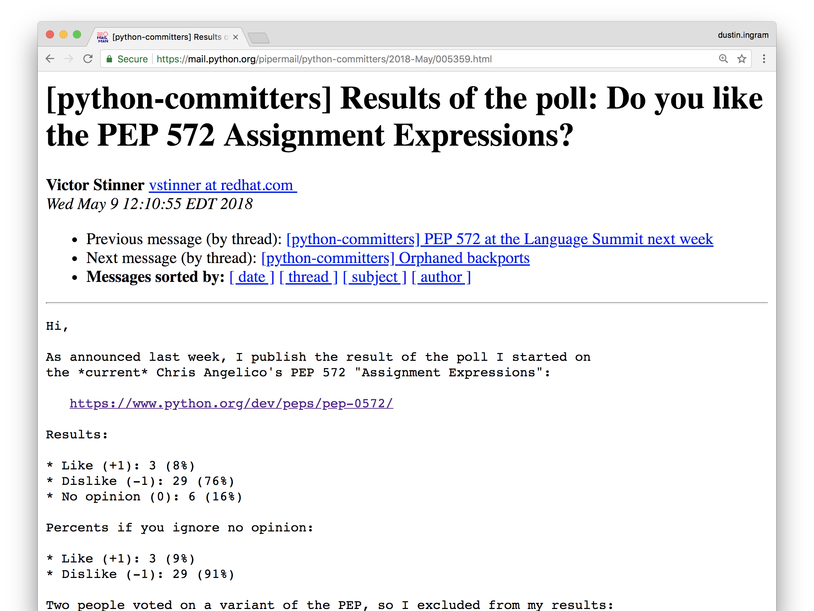

## PyBay 2018
## August 2018

---


# [fit] *Hi, I'm Dustin*

^ pypa/pypi

^ google

---

# *Python Governance*

^ how do we govern the language?

---

# *BDFL*
## Benevolent Dictator
## For Life

^ dictator meaning he can do whatever he wants

^ benevolent meaning he's looking out for us

---


---

# *PEP*
## Python Enhancement Proposal

^ can anyone name a PEP

---

# *PEP 8*
## Style Guide for Python Code

---

# *PEP 8*
## Style Guide for Python Code
### Author: Guido van Rossum

---

# *PEP 20*
## The Zen of Python

---

# *PEP 20*
## The Zen of Python
### Author: Tim Peters

---

# *PEP 566*
## Metadata for Python Software Packages 2.1

---

# *PEP 566*
## Metadata for Python Software Packages 2.1
### Author: Dustin Ingram

---

# *BDFL*
# Delegates

---

## *1)* Draft
## *2)* Acceptance
## *3)* Implementation

---

# *PEP 572*
## Assignment Expressions

^ might have heard, caused drama

---

# `:=`

^ has a name

^ not going to tell you it

---


^ not dead, just resting

^ letter to my boss

---

```python
foo = [f(x), f(x)**2, f(x)**3]
```

---

```python
y = f(x)
foo = [y, y**2, y**3]
```

---

# *Less code*
# is better!

^ Programmers hate change, minimizing diffs by at least one line is worth it

---

# *More efficiency*
# is better!

^ Untimately a trade-off between developer and computer efficiency.

---

# *PEP 572*
# Why not both?

---

```python
foo = [y := f(x), y**2, y**3]
```

^ assign a variable inside if statements, while loops, and comprehensions

---


# *Reception*

^ Most people hate change

^ Programmers especially hate change

---


---


---


---


---


---


---


---


---

# *Backwards compatibility*
## "Where will this work?"

^ not backwards compatible at all

---

# *Teachability*
## "What do we call this?"

^ can't call it walrus

^ Assignment operator (=)

^ Becomes operator (eh?)

^ Named expression (actual name)

---

# *Attractiveness*
## "It's just ugly!"

---


---


---


---



---

## *Tim Peters:*
## "The current proposal would have allowed a modest but clear improvement in quite a few bits of code."

---

## *Barry Warsaw:*
## "Since it changes the syntax of the language, people tend to focus on that without understanding the deeper semantic issues."

---

## *Łukasz Langa:*
## "Dictators should dictate"

---

## *Guido van Rossum:*
## Had to stop reading the threads so he wouldn't "go insane"

---


---


^ we don't currently have a BDFL

^ we can't currently approve any peps

---

# *Questions*

---

# What does this mean for Python?

^ jacob: is this going to be the pep to end all peps

---

# *It's going*
# *to be OK*

^ smart people are working on the governance problem

---

# Will this become part of Python?

---

# *Probably*
# *(in 3.8)*

---

# But I don't like it!

---

# *Then don't*
# *write it!*

^ No one's going to force you to write it

^ If someone on your team is using it, convince them not to!

---

# Is Guido
# coming back?

---

# *Probably not*

^ Python is 27 years old, and guido is like it's parent

---

# Will this
# happen again?

---

# *Probably not*

^ this PEP was an outlier

---

# *¯\\\_(ツ)\_/¯*

^ so many people use python now

^ for most of those people, the language already feels kinda perfect

^ perhaps this is the new status quo

---

# *Thanks!*
