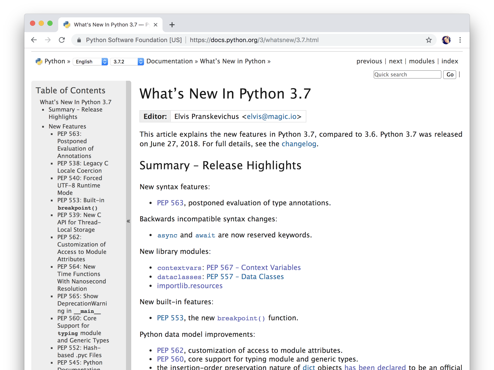
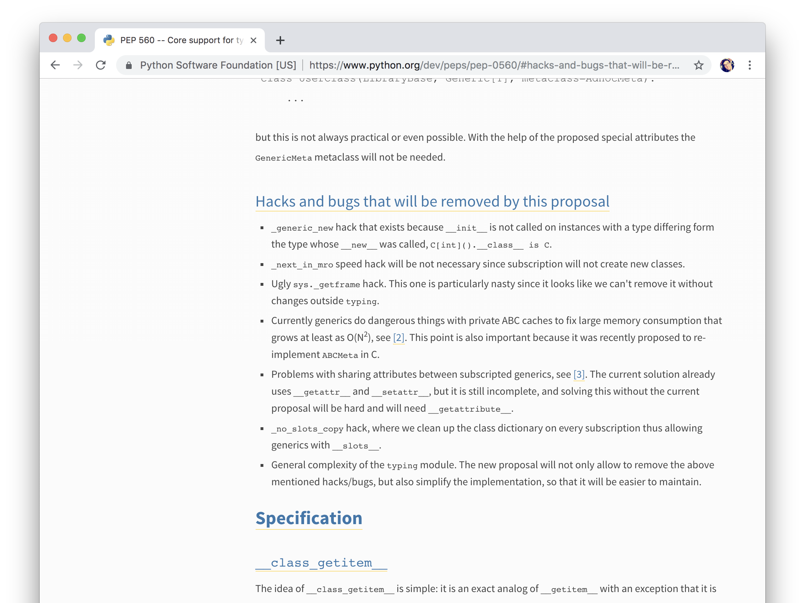
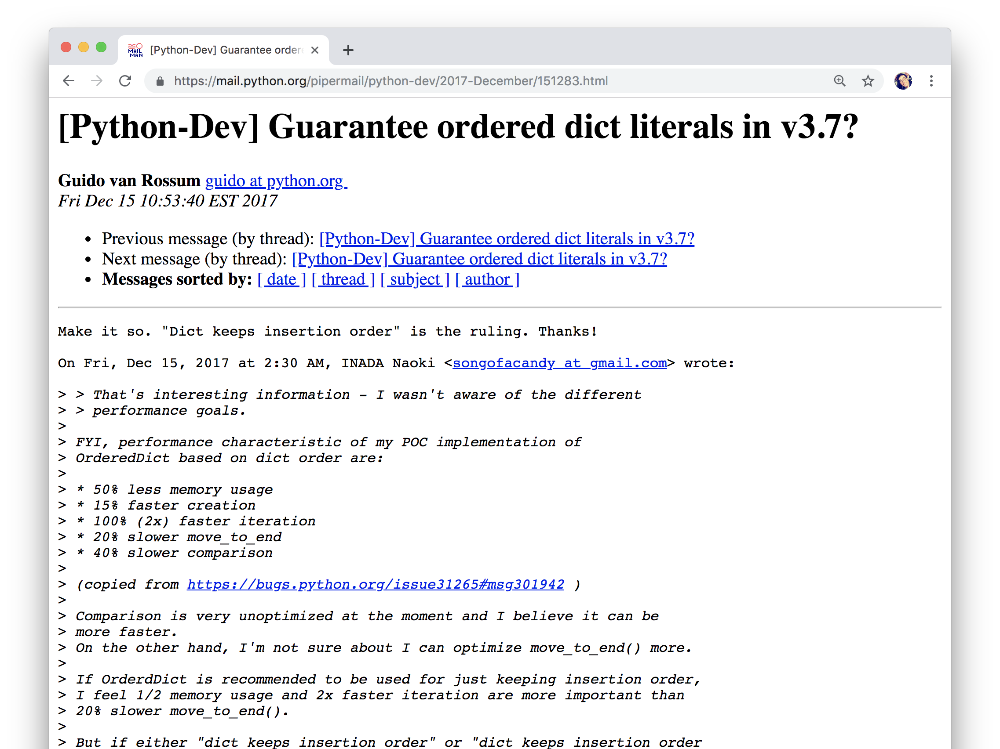
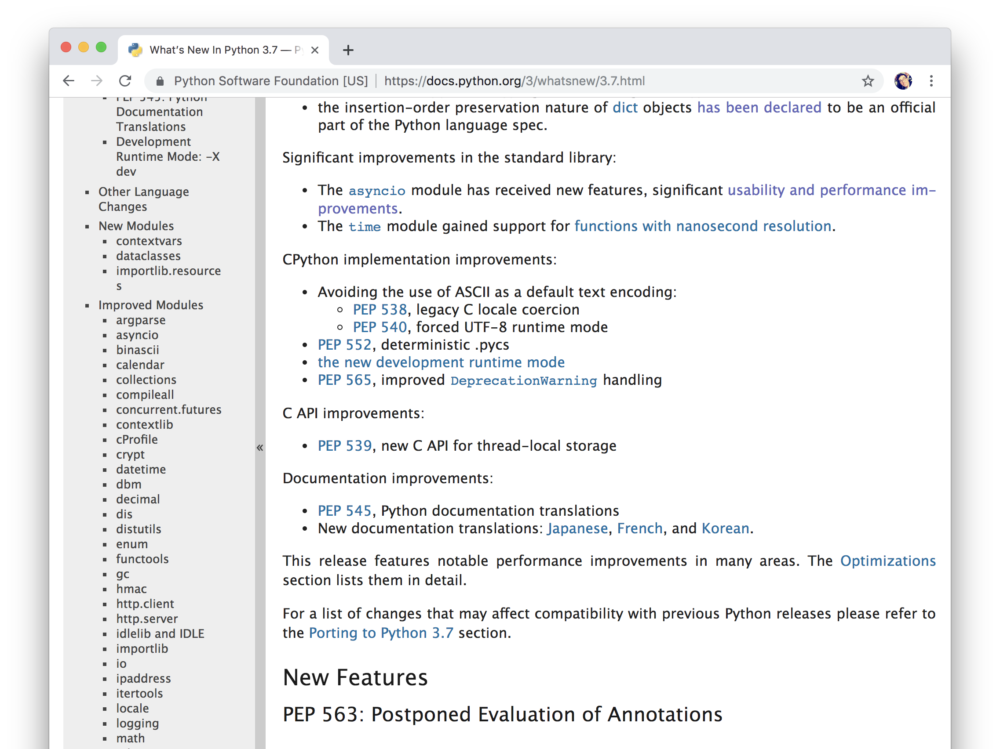
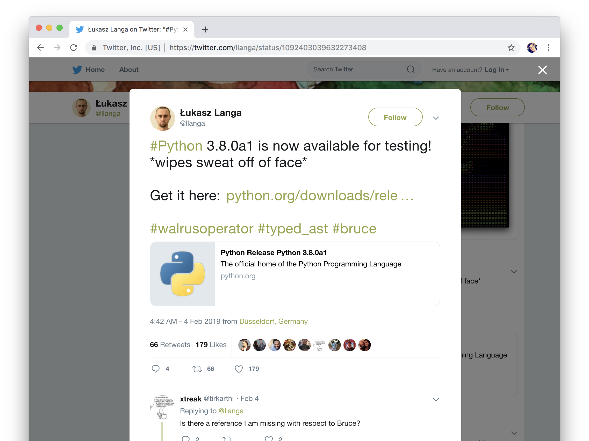

theme: Plain Jane, 3
footer: @di_codes

## PyCaribbean 2019

^ http://pycaribbean.com/talk/what's-new-in-python-3.7/

---


[.hide-footer]

# [fit] Hi, I'm Dustin

^ My name's Dustin Ingram

---

# You might know me from...

* Python Packaging Working Group (Packaging-WG)
* Python Packaging Authority (PyPA)
* Python Package Index (PyPI)
* PyTexas Chair
* Python Developer Advocate @ Google

---

# [fit] **What's New in Python 3.7**

---



---

# <br>
# <br>
# [fit] ✋

^ have no idea

^ know what version

^ python 2.something

^ python 1.something?

^ python 3.something

^ 3.4 or less

^ 3.5 / 3.6 / 3.7

---

# [fit] **What's New in Python 3.7**

^ i want you to really care about your python version

^ you should want to be upgrading to the new version of python as soon as it's stable

^ so i'm going to tell you some interesting things python 3.7

^ i think it's the best version of python yet

^ i'm also a little biased, because GAE and GCF runtimes

^ hopefully this talk motivates you to move at least one version in that direction

---

# New syntax features

^ this means new ways to express things in the language

^ generally backwards compatible

---

# **PEP 563**
# Postponed evaluation <br> of type annotations

---

# Type annotations

^ first, let's just talk about type annotations

^ the ability to add type annotations was added to the stdlib in 3.5

---

```python
>>> class Dog:
...     def __init__(self, name):
...         self.name = name
...
>>>
```

^ let's say we have this class

---

[.code-highlight: 5]

```python
>>> class Dog:
...     def __init__(self, name):
...         self.name = name
...
>>> my_dog = Dog(42)
```

^ because python is dynamically typed, there's nothing to stop us

---

[.code-highlight: 6-7]

```python
>>> class Dog:
...     def __init__(self, name):
...         self.name = name
...
>>> my_dog = Dog(42)
>>> my_dog.name
42
```

^ we can name our dog whatever we want

---

[.code-highlight: 8-11]

```python
>>> class Dog:
...     def __init__(self, name):
...         self.name = name
...
>>> my_dog = Dog(42)
>>> my_dog.name
42
>>> print("Hello " + my_dog.name)
Traceback (most recent call last):
  File "<stdin>", line 1, in <module>
TypeError: can only concatenate str (not "int") to str
```

^ and, as I'm sure we've all experienced, this can cause all kinds of problems

^ so, how can we prevent this?

---

```python
# example.py
class Dog:
    def __init__(self, name):
        self.name = name

my_dog = Dog(42)
print(my_dog.name)
```

^ if we have our regular dog class

---

[.code-highlight: 4-5]

```python
# example.py
class Dog:
    def __init__(self, name):
        if type(name) is not str:
            raise TypeError("Must be str")
        self.name = name

my_dog = Dog(42)
print(my_dog.name)
```

^ we could add an explicit type check for strings

---

```
$ python example.py
Traceback (most recent call last):
  File "example.py", line 7, in <module>
    Dog(42)
  File "example.py", line 4, in __init__
    raise TypeError("Must be str")
TypeError: Must be str
```

^ downsides to this: more lines of code, slower

---

```python
# example.py
class Dog:
    def __init__(self, name):
        self.name = name

my_dog = Dog(42)
print(my_dog.name)
```

^ original

---

[.code-highlight: 3]

```python
# example.py
class Dog:
    def __init__(self, name: str) -> None:
        self.name = name

my_dog = Dog(42)
print(my_dog.name)
```

^ added two things: a type to name, and a return type

^ return type isn't necessary as None is implied

^ what happens if we run this?

---

```
$ python example.py
42
```

^ it works! wait what?


---

[.code-highlight: 4-6]

```
$ python example.py
42

$ pip install mypy
...
Successfully installed mypy-0.670
```

^ to catch this bug, we need to install a type checker

---

[.code-highlight: 8-10]

```
$ python example.py
42

$ pip install mypy
...
Successfully installed mypy-0.670

$ mypy example.py
test.py:10: error: Argument 1 to "Dog" has
incompatible type "int"; expected "str"
```

^ the when we run it, it finds our bug!

---

# Type annotations

^ well, that's type annotations

---

# Postponed evaluation of <br> Type annotations

^ what does posponed evaluation mean?

---

```python
class Dog:
    def __init__(self, name: str) -> None:
        self.name = name
```

^ continuing with our example

---

[.code-highlight: 5-6]

```python
class Dog:
    def __init__(self, name: str) -> None:
        self.name = name

    def puppy(self) -> Dog:
        return Dog(self.name + " Junior")
```

^ what if we wanted to add a puppy function

^ returns a new instance of Dog, with the name whatever junior

---

[.code-highlight: 8-10]

```python
class Dog:
    def __init__(self, name: str) -> None:
        self.name = name

    def puppy(self) -> Dog:
        return Dog(self.name + " Junior")

my_dog = Dog("Fido")
child = my_dog.puppy()
print(child.name)
```

^ So we can create a new dog, that dog can have a puppy, and it should have the name

^ what happens if we run this?

---

```
$ python example.py
Traceback (most recent call last):
  File "example.py", line 3, in <module>
    class Dog:
  File "example.py", line 7, in Dog
    def puppy(self) -> Dog:
NameError: name 'Dog' is not defined
```

---

[.code-highlight: all]
[.code-highlight: 5]
[.code-highlight: 1]
[.code-highlight: 6]

```python
class Dog:
    def __init__(self, name: str) -> None:
        self.name = name

    def puppy(self) -> Dog:
        return Dog(self.name + " Junior")

my_dog = Dog("Fido")
child = my_dog.puppy()
print(child.name)
```

^ the issue here is that we're trying to use the Dog annotation in the same class that defines it

^ this is OK when we're using it in a function because the function doesn't get evaluated at runtime

^ but the same is not true for type annotations

^ the solution is to postponing the evaluation of the type annotations

---

[.code-highlight: 1]

```python
from __future__ import annotations

class Dog:
    def __init__(self, name: str):
        self.name = name

    def puppy(self) -> Dog:
        return Dog(self.name + " Junior")

my_dog = Dog("Fido")
child = my_dog.puppy()
print(child.name)
```

^ you can add this behavior by importing from future

^ It will become the default in Python 4.0.

---

# Backwards incompatible <br> syntax changes

---

# **PEP 492**
# `async` and `await`

^ are now reserved keywords.

^ reserved keywords mean that those five letters in python code have special meaning to the python interpreter

^ this is the last step of a pep that landed in 3.5

---

## `class`, `def`, `if`, `import`, <br> `for`, `from`, `while`, `with`

^ some other reserved keywords

^ since this is a backwards-incompatible change

^ it means that code that works in an older version of python might not work in this version

---

```python
>>> async = "foo"
>>> await = "bar"
>>> print(async, await)
foo bar
```

^ python 3.6

---

```python
>>> async = "foo"
  File "<stdin>", line 1
    async = "foo"
          ^
SyntaxError: invalid syntax
```

^ this is because it's a reserved keyword

---

```python
>>> class = "foo"
  File "<stdin>", line 1
    class = "foo"
          ^
SyntaxError: invalid syntax
```

^ would be the same as this

^ so invalid that it even breaks my syntax highlighting here

^ great, so i told you how to avoid the breaking change

---

# Tangent: Using `async` and `await`

^ but what are these used for? an example

---

```python
import time

def foo():
    time.sleep(3)
    print("Foo is awake")

def bar():
    time.sleep(2)
    print("Bar is awake")
```

^ let's say we have these two functions

---

```python
def main():
    print("Time to wake up!")
    start = datetime.now()
    foo()  # sleeps for 3 seconds
    bar()  # sleeps for 2 seconds
    print("Took", datetime.now() - start)

main()
```

^ we want to call each of them

^ and see how long it takes them both to wake up

^ when I run this, what is it going to print?

---

```
Time to wake up!


```

---


```
Time to wake up!
Foo is awake


```

---


```
Time to wake up!
Foo is awake


```

---


```
Time to wake up!
Foo is awake
Bar is awake

```

^ how long is this going to run?

^ foo = 3, bar = 2

---

```
Time to wake up!
Foo is awake
Bar is awake
Took 0:00:05.003925
```

^ just over five seconds

^ what happened? we woke up foo, then we went and woke up bar: synchronous

^ ineffecient

^ what if we could wake them both up at the same time? asynchronous

---

```python
import time

def foo():
    time.sleep(3)
    print("Foo is awake")

def bar():
    time.sleep(2)
    print("Bar is awake")
```

^ this becomes...

---

```python
import asyncio

async def foo():
    await asyncio.sleep(3)
    print("Foo is awake")

async def bar():
    await asyncio.sleep(2)
    print("Bar is awake")
```

^ using the async keyword

^ doing async sleep instead of regular sleep

---

```python
def main():
    print("Time to wake up!")
    start = datetime.now()
    foo()  # sleeps for 3 seconds
    bar()  # sleeps for 2 seconds
    print("Took", datetime.now() - start)

main()
```

^ this becomes...

---

```python
async def main():
    print("Time to wake up!")
    start = datetime.now()
    await asyncio.gather(
        foo(),  # sleeps for 3 seconds
        bar(),  # sleeps for 2 seconds
    )
    print("Took", datetime.now() - start)

asyncio.run(main())
```

^ what's the output now?

---

```
Time to wake up!


```

---

```
Time to wake up!
Bar is awake


```

---

```
Time to wake up!
Bar is awake
Foo is awake

```

^ and how long is it going to take?

---

```
Time to wake up!
Bar is awake
Foo is awake
Took 0:00:03.002748
```

^ We've had this ability since Python 3.5, but only now are they reserved keywords

---

# New library modules

^ this means new things you can import from python

---

# **PEP 567**
# `contextvars`

^ a new way to manage state scoped to a specific context

^ probably only useful if you're currently doing a lot of async programming and using threading.local

^ going to try and give you a quick demo of how it works without async though

---

[.code-highlight: all]
[.code-highlight: 1]
[.code-highlight: 2]

```python
var = "spam"
print("Before main, var was", var)

def main():
    global var
    print("In main, var was", var)
    var = "ham"
    print("In main, var is now", var)

main()
print("After main, var is", var)
```

---

[.code-highlight: 2]
[.code-highlight: 4]
[.code-highlight: 10]
[.code-highlight: 5]
[.code-highlight: 6]

```python
var = "spam"
print("Before main, var was", var)  # spam

def main():
    global var
    print("In main, var was", var)
    var = "ham"
    print("In main, var is now", var)

main()
print("After main, var is", var)
```

---

[.code-highlight: 6]
[.code-highlight: 7]
[.code-highlight: 8]

```python
var = "spam"
print("Before main, var was", var)  # spam

def main():
    global var
    print("In main, var was", var)  # spam
    var = "ham"
    print("In main, var is now", var)

main()
print("After main, var is", var)
```

---

[.code-highlight: 8]
[.code-highlight: 11]

```python
var = "spam"
print("Before main, var was", var)  # spam

def main():
    global var
    print("In main, var was", var)  # spam
    var = "ham"
    print("In main, var is now", var)  # ham

main()
print("After main, var is", var)
```

---

[.code-highlight: 11]

```python
var = "spam"
print("Before main, var was", var)  # spam

def main():
    global var
    print("In main, var was", var)  # spam
    var = "ham"
    print("In main, var is now", var)  # ham

main()
print("After main, var is", var)  # ham
```

^ because we changed the global variable

---

```python
>>> from contextvars import ContextVar
>>> var = ContextVar("var")
>>> var.set("hello")
>>> var.get()
'hello'
```

---

[.code-highlight: 6-7]

```python
>>> from contextvars import ContextVar
>>> var = ContextVar("var")
>>> var.set("hello")
>>> var.get()
'hello'
>>> from contextvars import copy_context
>>> ctx = copy_context()
```

---

[.code-highlight: 8]

```python
>>> from contextvars import ContextVar
>>> var = ContextVar("var")
>>> var.set("hello")
>>> var.get()
'hello'
>>> from contextvars import copy_context
>>> ctx = copy_context()
>>> var.set('world')
```
---

[.code-highlight: 9-10]

```python
>>> from contextvars import ContextVar
>>> var = ContextVar("var")
>>> var.set("hello")
>>> var.get()
'hello'
>>> from contextvars import copy_context
>>> ctx = copy_context()
>>> var.set('world')
>>> ctx[var]
'hello'
```

---

[.code-highlight: 11-12]

```python
>>> from contextvars import ContextVar
>>> var = ContextVar("var")
>>> var.set("hello")
>>> var.get()
'hello'
>>> from contextvars import copy_context
>>> ctx = copy_context()
>>> var.set('world')
>>> ctx[var]
'hello'
>>> var.get()
'world'
```

---

[.code-highlight: all]
[.code-highlight: 1]
[.code-highlight: 3]
[.code-highlight: 4]

```python
from contextvars import ContextVar, copy_context

var = ContextVar('var', default='spam')
print("Before main, var was", var.get())

def main():
    print("In main, var was", var.get())
    var.set('ham')
    print("In main, var is now", var.get())

copy_context().run(main)

print("After main, var is", var.get())
```

---

[.code-highlight: 4]
[.code-highlight: 6]
[.code-highlight: 11]
[.code-highlight: 7]

```python
from contextvars import ContextVar, copy_context

var = ContextVar('var', default='spam')
print("Before main, var was", var.get())  # spam

def main():
    print("In main, var was", var.get())
    var.set('ham')
    print("In main, var is now", var.get())

copy_context().run(main)

print("After main, var is", var.get())
```

---

[.code-highlight: 7]
[.code-highlight: 8]
[.code-highlight: 9]

```python
from contextvars import ContextVar, copy_context

var = ContextVar('var', default='spam')
print("Before main, var was", var.get())  # spam

def main():
    print("In main, var was", var.get())  # spam
    var.set('ham')
    print("In main, var is now", var.get())

copy_context().run(main)

print("After main, var is", var.get())
```

---

[.code-highlight: 9]
[.code-highlight: 13]

```python
from contextvars import ContextVar, copy_context

var = ContextVar('var', default='spam')
print("Before main, var was", var.get())  # spam

def main():
    print("In main, var was", var.get())  # spam
    var.set('ham')
    print("In main, var is now", var.get()) # ham

copy_context().run(main)

print("After main, var is", var.get())
```

---

[.code-highlight: 13]

```python
from contextvars import ContextVar, copy_context

var = ContextVar('var', default='spam')
print("Before main, var was", var.get())  # spam

def main():
    print("In main, var was", var.get())  # spam
    var.set('ham')
    print("In main, var is now", var.get()) # ham

copy_context().run(main)

print("After main, var is", var.get())  # spam
```

^ difference here is that the changes to the context of main don't affect the outer scope

---

# **PEP 557**
# `dataclasses`

^ there is enough here to be an entire talk

^ the goal of dataclasses is to save you from writing a lot of boilerplate

---

```python
class Dog:
    def __init__(self, name, age, weight, breed):
        self.name = name
        self.age = age
        self.weight = weight
        self.breed = breed

    def stats(self):
        print(f"{self.name}:")
        print(f"a {self.age}-year-old {self.breed}")
        print(f"weighting {self.weight} pounds")
```

^ let's bring back our Dog class from earlier, with some new attributes

---

```python
class Dog:
    def __init__(
        self, name: str, age: int,
        weight: float, breed: str
    ) -> None:
        self.name = name
        self.age = age
        self.weight = weight
        self.breed = breed

    def stats(self):
        print(f"{self.name}:")
        print(f"a {self.age}-year-old {self.breed}")
        print(f"weighting {self.weight} pounds")
```

^ This gets even more verbose when we add types

---

```python
class Dog:
    def __init__(
        self, name: str, age: int,
        weight: float, breed: str,
        is_adorable: bool
    ) -> None:
        self.name = name
        self.age = age
        self.weight = weight
        self.breed = breed
        self.is_adorable = is_adorable

    def stats(self):
        print(f"{self.name}:")
        print(f"a {self.age}-year-old {self.breed}")
        print(f"weighting {self.weight} pounds")
```

^ just adding one more attribute makes this almost too much

---

```python
from dataclasses import dataclass

@dataclass
class Dog:
    name: str
    age: int
    weight: float
    breed: str

    def stats(self):
        print(f"{self.name}:")
        print(f"a {self.age}-year-old {self.breed}")
        print(f"weighting {self.weight} pounds")
```

^ this handles the typing

---

```python
>>> my_dog = Dog('Fido', 2, 55.3, "mutt")
```

^ automatically creates an __init__ method for us

---

[.code-highlight: 2-3]

```python
>>> my_dog = Dog('Fido', 2, 55.3, "mutt")
>>> my_dog
Dog(name='Fido', age=2, weight=55.3, breed='mutt')
```

^ as well as __repr__ (which gets called when printing)

---

[.code-highlight: 4-5]

```python
>>> my_dog = Dog('Fido', 2, 55.3, "mutt")
>>> my_dog
Dog(name='Fido', age=2, weight=55.3, breed='mutt')
>>> my_dog == Dog('Clifford', 3, 5500.0, "big red dog")
False
```

^ and __eq__

^ there's lots more you can do

^ and folks are very excited

^ i'll let you read their articles and watch their talks instead

---

# New built-in features

^ things that you don't need to import to use

---

# **PEP 553**
# Built-in `breakpoint()`

^ new function that's available in the local scope

---

```python
# example.py
name = "world".upper
print("Hello " + name)
```

^ let's say I wrote this code
^ what's the output here?

---

```python
$ python example.py
Traceback (most recent call last):
  File "<stdin>", line 1, in <module>
TypeError: can only concatenate str
(not "builtin_function_or_method") to str
```

^ let's say this is deep in my application

^ how can I figure out what's going wrong with the name variable?

---

# `pdb`

^ python has an interactive debugger called pdb, for "python debugger"

^ there's a couple ways to use it, but the most common way is this

---

```python
# example.py
name = "world".upper
print("Hello " + name)
```

^ take the same code we had before

---

[.code-highlight: 3]

```python
# example.py
name = "world".upper
import pdb; pdb.set_trace()
print("Hello " + name)
```

^ and insert this line

^ I have typed this so many times, I can type it faster than my password

---

```python
$ python example.py
> /tmp/example.py(3)<module>()
-> print("Hello " + name)
(Pdb)
```

^ now when we execute the script, right before we get to the problematic line, our application stops, and we get a prompt, the PDB prompt

^ our application is essentially paused right where we set the trace

---

[.code-highlight: 4-6]

```python
$ python example.py
> /tmp/example.py(3)<module>()
-> print("Hello " + name)
(Pdb) name
<built-in method upper of str object at 0x10abdfe68>
(Pdb)
```

^ all our variables are in scope, so we can type them and see what they are

---

[.code-highlight: 6-7]

```python
$ python example.py
> /tmp/example.py(3)<module>()
-> print("Hello " + name)
(Pdb) name
<built-in method upper of str object at 0x10abdfe68>
(Pdb) name = "world".upper()
(Pdb)
```

^ we can also redefine them

---

[.code-highlight: 7-8]

```python
$ python example.py
> /tmp/example.py(3)<module>()
-> print("Hello " + name)
(Pdb) name
<built-in method upper of str object at 0x10abdfe68>
(Pdb) name = "world".upper()
(Pdb) continue
Hello WORLD
```

^ and then continue the execution of our program with the continue command

^ that's very cool! well, that's been in python forever

^ what's the change?

---

[.code-highlight: 3]

```python
# example.py
name = "world".upper
import pdb; pdb.set_trace()
print("Hello " + name)
```

^ now instead of typing

^ you can just type

---

[.code-highlight: 3]

```python
# example.py
name = "world".upper
breakpoint()
print("Hello " + name)
```

^ this saves you from typing exactly fifteen characters

^ which doesn't seem like much, but again

^ this is super handy, and if you use it as much as I do, it's actually going to save you time.

---

# Python data model improvements

---

# **PEP 562**
# customization of access <br> to module attributes

---

```python
# library.py
def bar():
    print("I am actually bar")

def __getattr__(name):
    print(f"You wanted to import {name}")
    return bar
```

---

```python
>>> from library import foo
You want to import foo
>>> foo()
I am actually bar
```

^ essentially allows you to add a fallback if the import fails

----

# **PEP 560**
# core support for typing <br> module and generic types

^ the original type hit PEP, PEP 484, was designed in such way that it would not introduce any changes to the core CPython interpreter

^ it is sufficiently well-adopted that it is now acceptable to make changes to the interpreter to support this

---

> "As a result, the speed of various operations with types increased up to 7 times"

---



^ there's a whole section in the pep called "hacks and bugs that will be removed by this proposal"

^ that's when you know it's a good pep

---

# `dict` insertion-order
# preservation

^ until python 3.6, dictionaries were "unordered"

^ in 3.6, an implementation detail to make dictionaries faster and more compact resulted in them also preserving order

^ meaning that you could determine the order in which items had been added to the dictionary

^ there was a request to make this part of the official specification in 3.7

---



^ and guido said, "make it so!"

---

> "The insertion-order preservation nature of `dict` objects has been declared to be an official part of the Python language spec."

^ so now it's part of the spec

---


---



^ but I don't have time for all that!

^ python 3.7 is old news, do you know why?

---



^ because this month we got an alpha release of 3.8

---

# [fit] **What's New in Python 3.8**

^ see you all back here next year?

---

# **Thanks!**

* Github: [`@di`](https://github.com/di)
* Twitter: [`@di_codes`](https://twitter.com/di_codes)
* Email: <di@python.org>
