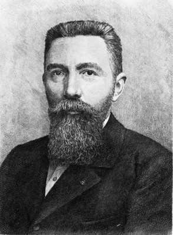
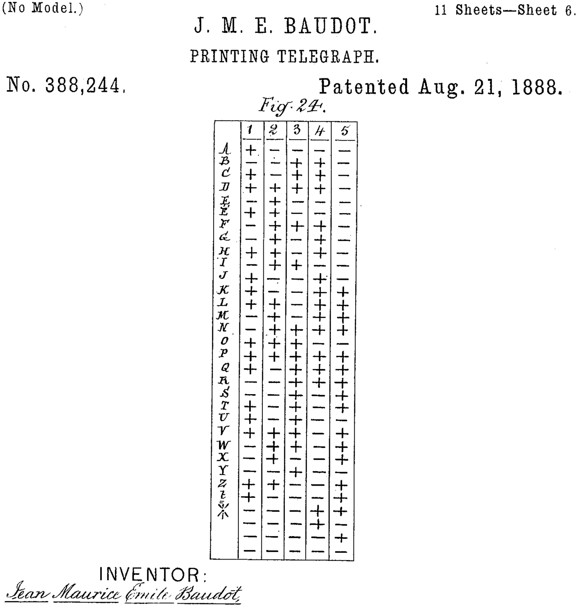
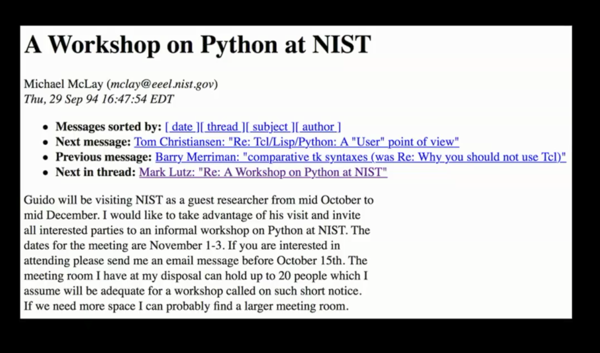
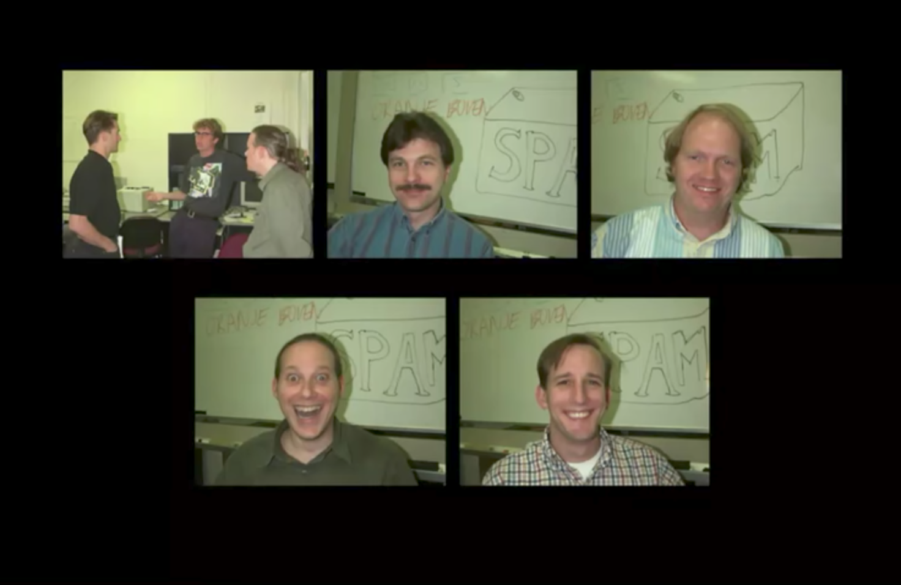

# PyCon 2017 Recap

---

# 🏆 🏆 🏆 🏆 🏆 🏆

---

# 🏆 Best reason to switch to Python 3

---

## Raymond Hettinger: "_Modern Python Dictionaries: A confluence of a dozen great ideas_"

---

# Dictionary changes

| Version | Dict Size | Key ordering |
| --- | --- | --- |
| 2.7 | Big | Scrambled |
| 3.5 | Smaller | Random |
| 3.6 | Smallest | Ordered |

---

# Python 2.7 dicts

```python
>>> d = {}
>>> d['fizz'] = 'buzz'
>>> d['foo'] = 'bar'
>>> d.keys()
['foo', 'fizz']
```


```python
>>> d = {}
>>> d['foo'] = 'bar'
>>> d['fizz'] = 'buzz'
>>> d.keys()
['foo', 'fizz']
```

---

# Python 3.6 dicts

```python
>>> d = {}
>>> d['foo'] = 'bar'
>>> d['fizz'] = 'buzz'
>>> d.keys()
dict_keys(['foo', 'fizz'])
```

```python
>>> d = {}
>>> d['fizz'] = 'buzz'
>>> d['foo'] = 'bar'
>>> d.keys()
dict_keys(['fizz', 'foo'])
```

---

# 🏆 Best argument for Unicode

---

## Łukasz Langa: "_Unicode: what is the big deal?_"

---


---



# Émile Baudot

---



---

> baud (/ˈbɔːd/, unit symbol Bd) is the unit for symbol rate or modulation rate in symbols per second or pulses per second.


---

# 🏆 Best talk title

---

## Joe Jevnik: "_Title Available On Request: An Introduction to Lazy Evaluation_"

---

# Lazy Evaluation

```python
>>> range(sys.maxsize)
range(0, 9223372036854775807)
```

```python
>>> map(float, _)
<map object at 0x10591e588>
```

```python
>>> filter(lambda x: x%2, _)
<filter object at 0x10591e5f8>
```

```python
>>> list(_)
...
```
---

# Lazy Evaluation

```python
>>> def f(a, b):
...     print("calling with", a, b)
...     return a+b
...
>>> g = lambda: f(1, 2)
>>> h = lambda: f(g(), 4)
>>> h()
calling with 1 2
calling with 3 4
7
```

^ lambdas are naive

^ "memoized thunks"

---

# 🏆 Best look back at PyCon

---

## Guido van Rossum, Barry Warsaw, Jim Fulton, Paul Everitt: "_Panel Discussion_"

---



---



---


---

# 🏆 Best livecoding fail

---

## Kelsey Hightower: "_Keynote_"

---


---

# 🏆 Best lighting talk

---

## Dr Russel Keith-Magee: "_Emoji Archeology 101_"

---


