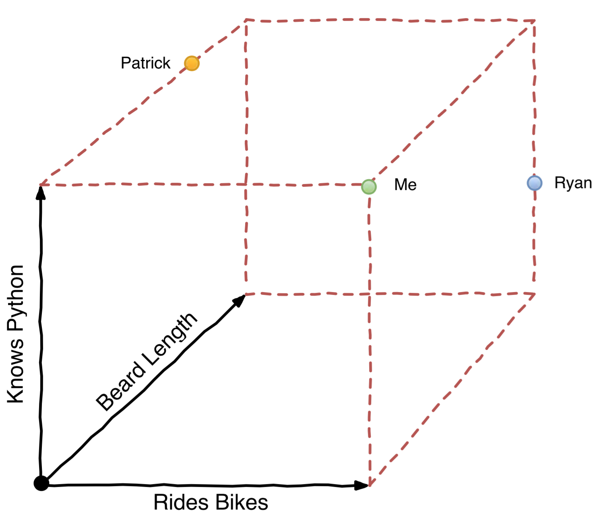
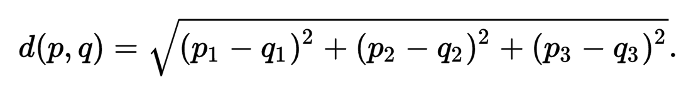
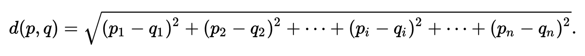
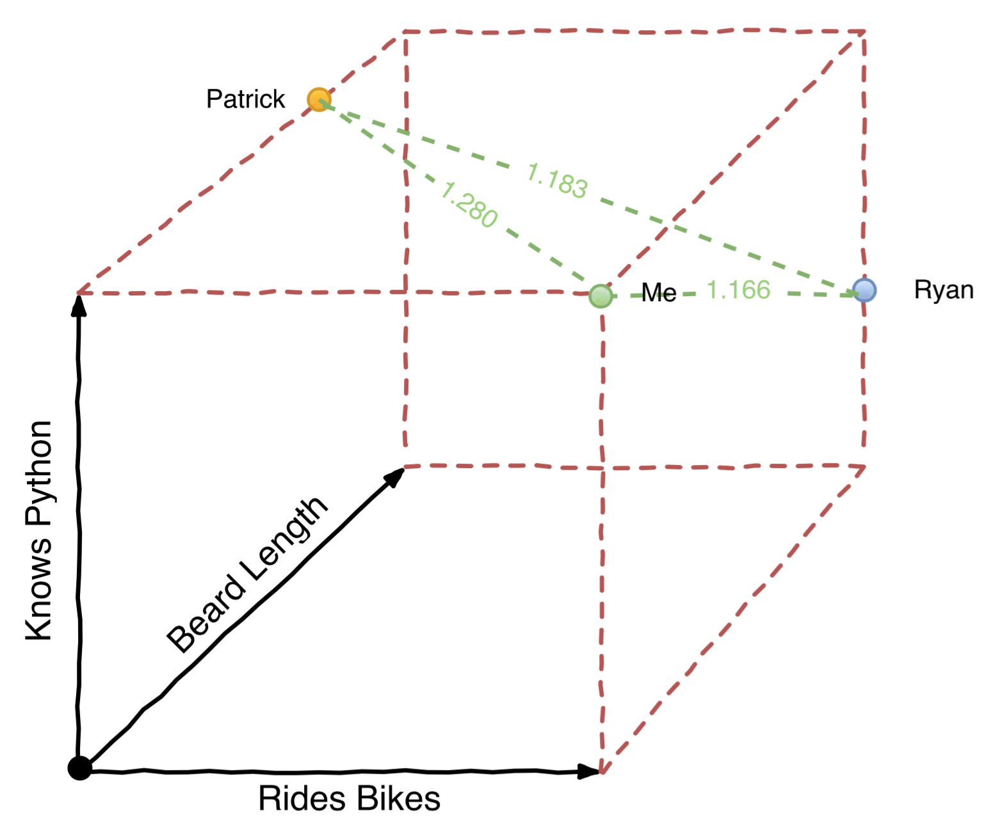

# [fit] PyGotham

# [fit] recap

---

# Talks I Liked

* *"Playing with Python Bytecode"* -- Scott Sanderson and Joe Jevnik
* *"Python Performance Profiling: The Guts And The Glory"* -- A. Jesse Jiryu Davis
* *"A tale of two cellphones: Python on Android and iOS"* -- Russell Keith-Magee
* *"Vector space modeling on music data"* -- Tim Schmeier

---

# Playing with Python Bytecode
## [-- Scott Sanderson & Joe Jevnik](#)

^ Really good two-person presentation
^ Also presented at PyCon but I missed it
^ Mostly about the dis module
^ How you can manipulate bytecode

---

# Playing with Python Bytecode

```python
>>> def add(a, b):
...     return a + b
...
>>> add.__code__.co_code
'|\x00\x00|\x01\x00\x17S'
```

^ How you can get the bytecode of a function

---

# Playing with Python Bytecode

```python
>>> import dis
>>> dis.dis(add)
  2           0 LOAD_FAST                0 (a)
              3 LOAD_FAST                1 (b)
              6 BINARY_ADD
              7 RETURN_VALUE
```

^ How you can dissasemble the bytecode with dis

---

# Playing with Python Bytecode

```python
>>> from types import CodeType, FunctionType
>>> add = FunctionType(
...   CodeType(
...     2, 0, 2, 2, 0x0043,
...     b'|\x00\x00|\x01\x00\x17S',
...     (1,), (), ('a', 'b'),
...     'ayy lmao', 'add', 0, b'', (), ()
...   ), {})
>>> add(1, 2)
3
```

^ How to write some really garbage-looking code with raw bytecode

---

# Playing with Python Bytecode

Code Transformer:
<https://github.com/llllllllll/codetransformer>

^ They have an FOSS tool for transforming bytecode
^ This talk was pretty interisting but not very practical

---

# Python Performance Profiling: The Guts And The Glory
## [-- A. Jesse Jiryu Davis](#)

^ This was actually a talk from the 2015 PyCon
^ Jesse's talks are always good, usually because he speaks very deliberately
^ And also tells a good story
^ Jesse works for MongoDB
^ This talk was about a researcher/journalist that claimed that the python MongoDB driver that he wrote was 3x slower than the JS one

---

# Python Performance Profiling: The Guts And The Glory

* A profiler does not tell you where there are inefficiencies in your code;
* A profiler helps you make a _hypothesis_ about where there are inefficiencies in your code;
* Before trying to optimize, you must test the hypothesis with an experiment!

^ Profilers are inherently inefficient and may be wrong!
^ Eventually Jesse was able to prove that the Python driver was just as efficient
^ The issue was with the researcher's test code

---

# A tale of two cellphones: Python on Android and iOS
## [-- Russell Keith-Magee](#)

^ This talk was also given at PyCon 2016
^ Russell is a prolific leader of the BeeWare project
^ This is about compiling Python to _native code_
^ No jailbreaking
^ No HTML/browser shims

---

# A tale of two cellphones: Python on Android and iOS

* iOS: `clang` - same C compiler used to compile CPython on macOS
  * Can compile CPython for any iOS device (with a patch to Python)
  * iOS native libraries are Objective C -- easy to call
  * Uses Python3's type annotations


^ Swift is just sugar/type safety around Objective C (also built on `clang`)

---

# A tale of two cellphones: Python on Android and iOS
* Android (Java-ish):
  * You can use the JNI to call embedded C code from Java
  * You can compile and include Jython
  * Java bytecode looks like Python bytecode if you squint hard enough

^ Java Native Interface
^ Hard limit of 2000 references for JNI
^ Jython only barely supports 2.7, doesn't compile for android
^ VOC take python bytecode and outputs java bytecode

---

# A tale of two cellphones: Python on Android and iOS

* <https://github.com/pybee/Python-iOS-template>
* <https://github.com/pybee/Python-Android-template>
* <https://github.com/pybee/Python-macOS-template>

^ Lots of available boilerplate

---

# A tale of two cellphones: Python on Android and iOS

* <http://pybee.org/project/projects/bridges/rubicon/>
* <http://pybee.org/project/projects/bridges/voc/>
* <http://pybee.org/project/projects/libraries/toga/>

^ Rubicon is a native bridge
^ VOC is a python to java bytecode transpiler
^ Toga is a Python native, OS native GUI toolkit.

---

# Vector space modeling on music data
## [-- Tim Schmeier](#)

^ Focus of this talk was on how iHeartRadio uses VSM for recommendation
^ The iHeartRadio app has a random-recommendation based radio like everyone else
^ The "music data" here is not the actual data which makes music
^ Instead it is the metadata about the music -- genre, BPM, voal style, etc
^ VSM takes a vector of identifiers
^ Positions a specific object (in this case, a song) in multidimensional space
^ Really powerful because it maps a large complex data set into a simple model that's easy to reason with with linear algebra

---

# Vector space modeling on music data

Developer Identifiers:

* rides bikes;
* knows Python;
* length of beard.

^ For example, we can create three identifiers for a promptworks developer
^ I picked three so this would be in 3-dimensional space (which makes it easier to visualize)

---


---

# Vector space modeling on music data

```python
me = [1.0, 1.0, 0.0]
ryan = [1.0, 0.4, 1.0]
patrick = [0.0, 1.0, 0.8]
```

^ We could define some developers like this
^ bikes, python, beard

---



^ This is how they'd look on the graph

---

# Vector space modeling on music data

```python
>>> def combine(*vectors):
...     return [
...         sum(i)/len(i)
...         for i in zip(*vectors)
...     ]
...
>>> combine(me, ryan)
[1.0, 0.7, 0.5]
```

^ Combining vectors is just taking the average of every identifier
^ An interesting thing to mention here is what's called the "cold start" problem
^ If I only know that you like me and ryan, the combined vector for your preferences starts in the direct middle of multidimensional space
^ Or, perhaps, at an "average" start point -- this is a cold start
^ But if I know one small thing about you before hand, that improves the initial recommendation significantly

---

# Vector space modeling on music data




^ The difference between two data points is just the Euclidean distance (straight line distance)
^ Which works exactly the same for multidimensional space

---

# Vector space modeling on music data

```python
>>> def distance(a, b):
...    return sum(
...        (ai - bi)**2
...        for ai, bi in zip(a, b)
...    )**0.5
```


---

# Vector space modeling on music data

```python
>>> distance(me, patrick)
1.28062484749
>>> distance(ryan, patrick)
1.18321595662
>>> distance(me, ryan)
1.16619037897
```

---



^ This is how they'd look on the graph

---

# Vector space modeling on music data

`nirvana - male_vocals + female_vocals`

^ His talk didn't go much into such specific implementation
^ But he did give the results of some experiments
^ Like what if you took the nirvana vector, but removed a preference for male vocals, and added a preference for female vocals?

---


^ Courtney Love

---

# [fit] Thanks!
