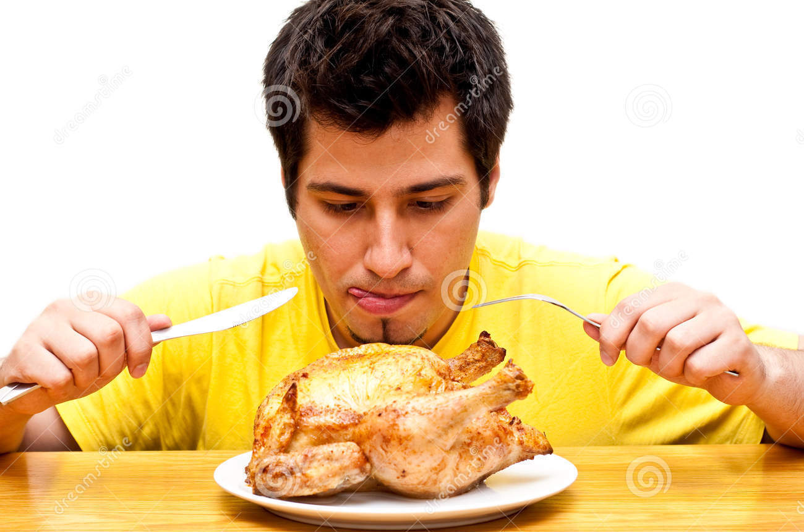
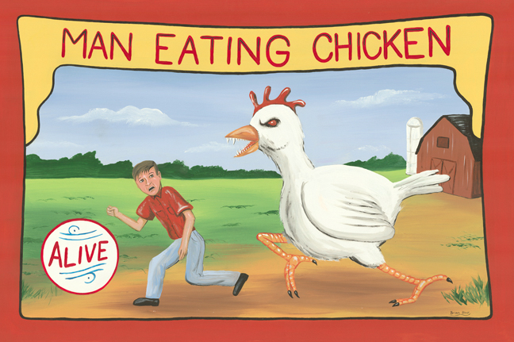

# Hi, I'm Dustin
## [`http://github.com/di`](http://github.com/di)

^ My name's Dustin Ingram

---


^ I work at PromptWorks, a software consultancy in Philadelphia

---


## _The_
# Fastest FizzBuzz
## _in the_
# West

---

# This talk is not about
# FizzBuzz

^ First things first, this talk is not about fizzbuzz

^ however FizzBuzz is the kind of faux-motivation for this talk

^ So to get started, I actually need to explain fizzbuzz

---

# FizzBuzz

Write a program that prints the numbers **1** through **n**.

For every number divisible by **3**, print **'fizz'**.

For every number divisible by **5**, print **'buzz'**.

If a number is divisible by both **3** and **5**, print **'fizzbuzz'**.

^ The general idea is ...

^ I've never actually been asked to do fizzbuzz in an interview

^ But at various stages of my career, I always imagined what I would do if someone did

---


---

# FizzBuzz

```python
>>> def fizzbuzz(n):
...     for i in range(1, n+1):
...         if i % 15 == 0:
...             print('fizzbuzz')
...         elif i % 3 == 0:
...             print('fizz')
...         elif i % 5 == 0:
...             print('buzz')
...         else:
...             print(i)
...
```

^ Early on, this is probably close to what I would have written

^ This would have totally sufficed

---

# FizzBuzz

```python
>>> fizzbuzz(15)
1
2
fizz
4
buzz
fizz
7
8
fizz
buzz
11
fizz
13
14
fizzbuzz
```

---

# FizzBuzz

```python
>>> def fizzbuzz(n):
...     for i in range(n):
...         print(i%3//2*'fizz'+i%5//4*'buzz'or i+1)
```

^ I got pretty obsessed with really terse programming at one point

^ and memorized this thing

^ But in my imagination, there was never any limit on what language my solution could be

^ didn't have to be python

---

# FORTRAN

```fortran
program fizzbuzz_if
   integer :: i

   do i = 1, 100
      if     (mod(i,15) == 0) then; print *, 'FizzBuzz'
      else if (mod(i,3) == 0) then; print *, 'Fizz'
      else if (mod(i,5) == 0) then; print *, 'Buzz'
      else;                         print *, i
      end if
   end do
end program fizzbuzz_if
```

^ What if I did it in fortran? people still use that, right?

---

# BRAINFUCK

```brainfuck
++++++++++[>++++++++++<-]>>++++++++++>->>>>>>>>>>-->+
++++++[->++++++++++<]>[->+>+>+>+<<<<]+++>>+++>>>+++++
+++[-<++++<++++<++++>>>]+++++[-<++++<++++>>]>-->+++++
+[->+++++++++++<]>[->+>+>+>+<<<<]+++++>>+>++++++>++++
++>++++++++[-<++++<++++<++++>>>]++++++[-<+++<+++<+++>
>>]>-->---+[-<+]-<<[->>>+>++[-->++]-->+++[---<-->+>-[
<<++[>]]>++[--+[-<+]->>[-]+++++[---->++++]-->[->+<]>>
[.>]>++]-->+++]---+[-<+]->>-[+>++++++++++<<[->+>-[>+>
>]>[+[-<+>]>+>>]<<<<<<]>>[-]>>>++++++++++<[->->+<<]>[
-]>[<++++++[->++++++++<]>.[-]]<<++++++[-<++++++++>]<.
[-]<<[-<+>]]<<<.<]
```

^ I thought, maybe i could actually figure out how to memorize that

---

## <INSERT YOUR LANGUAGE HERE>

^ As great as these would have been for me in all my hypothetical interviews

^ I never bothered to learn cobol, or fortran, or anything else

^ But I was always really intrigued: Where could i draw the line?

^ Could I make my own language?

---

# DIVSPL

^ Oh, you want me to do fizzbuzz? mind if i use DIVSPL? haven't heard of it?

---

# DIVSPL
## (Dustin Ingram's Very Special Programming Language)

^ AKA

^ number one priority for this language, implement fb as fast as possible

^ Since it's my own language, i can make the syntax whatever I want

---

# DIVSPL

```mercury
1...15
fizz=3
buzz=5
```

^ the bare minimum of information necessary to execute fizzbuzz

^ goal for this talk is to show you how to take that syntax

^ turn it into something that solves the fizzbuzz problem

---

# On the shoulders of giants

^ dr. vanderplas

---

# On the shoulders of giants

* **RPLY**: an implementation of **PLY** compatible with **RPython** (c. 2012)
* **PLY**:  a Python implentation of the **Lex** and **Yacc** tools (c. 2001)
* **Lex**: unix tool which generates lexical analyzers (c. 1975)
* **Yacc**: a parser generator, aka "Yet Another Compiler Compiler" (c. 1970)
* **RPython**: a restricted subset of Python

^ used for producing implementations of languages like python

---

# Python


```python
>>> x = 'hello'
>>> x = 42
>>>
```

^ Python is dynamically typed

---


# Python

```python
>>> def something(x):
...     if x:
...         return 'hello'
...     else:
...         return 42
...
>>>
```

^ functions can return different types

^ RPython program restrictions mostly limit the ability to mix types in arbitrary ways.

---

# RPython

```
[translation:ERROR] UnionError:

Offending annotations:
  SomeString(const='hello', no_nul=True)
  SomeInteger(const=42, knowntype=int, nonneg=True, unsigned=False)

In <FunctionGraph of (rpython_fail:1)something at 0x110f7ca90>:
<return block>
Processing block:
 block@3 is a <class 'rpython.flowspace.flowcontext.SpamBlock'>
 in (rpython_fail:1)something
 containing the following operations:
       v0 = bool(x_0)
```

^ so if you see me doing some odd looking python later, this is why

---


# Let's design a language

---

# Parallels to written language

---

# "Isawaman"

---

# Parallels to written language

"I"
"Is"
"Isa" → "Is⎵a"
"Is⎵aw"
"Is⎵awa"
"Is⎵a⎵wam" → "Is⎵a⎵wam"
"Is⎵a⎵wama"
"Is⎵a⎵waman" → "I⎵saw⎵a⎵man"

^ I, Is, awake, saw, man, woman

---

# Parallels to written language

"I saw a man eating chicken"

^ Luckily we have spaces

---

# Parallels to written language

"I saw a man eating chicken"

```python
('I', 'saw', 'a', 'man', 'eating', 'chicken')
```

^ Luckily we have spaces

^ These are tokens, the whitespace too

---

# Parallels to written language

"I saw a man eating chicken"

```python
('I', 'saw', ('a', 'man', ('eating', 'chicken')))
```

---



---

# Parallels to written language

"I saw a man eating chicken"

```python
('I', 'saw', ('a', 'man', ('eating', 'chicken')))
```

---

# Parallels to written language

"I saw a man eating chicken"

```python
('I', 'saw', ('a', ('man', 'eating'), 'chicken'))
```

---



---

# Parallels to written language

"I saw a man-eating chicken"

```python
('I', 'saw', ('a', 'man-eating', 'chicken'))
```

---

# Steps to interpreting a language

1. Break characters into tokens
1. Combine tokens into expressions
1. Evaluate expressions

---

# Let's design a language

```mercury
1...15
fizz=3
buzz=5
```

---

# Let's design a language

```mercury
1...15
fizz=3
buzz=5
```

Numbers: "1", "15", "3", "5"

---

# Let's design a language

```mercury
1...15
fizz=3
buzz=5
```

Periods: "."

---

# Let's design a language

```mercury
1...15
fizz=3
buzz=5
```

Ellipsis: "..."

---

# Let's design a language

```mercury
1...15
fizz=3
buzz=5
```

Words: "fizz", "buzz"

---

# Let's design a language

```mercury
1...15
fizz=3
buzz=5
```

Equals: "="

---

# Let's design a language

```mercury
1...15\n
fizz=3\n
buzz=5\n
```

Whitespace?

---


# Let's make a lexer

^ The lexer is simple: It takes a stream of characters

^ And gives an iterator which provides tokens from the language

---

# Let's make a lexer

```python
>>> from rply import LexerGenerator
>>> lg = LexerGenerator()
>>>
```

^ Create a new LexerGenerator

^ We'll add some rules for our language as named regular expressions

---

# Let's make a lexer

```python
>>> from rply import LexerGenerator
>>> lg = LexerGenerator()
>>> lg.add("ELLIPSIS", r"\.\.\.")
>>>
```

^ An Ellipsis token is a series of three literal periods

---

# Let's make a lexer

```python
>>> from rply import LexerGenerator
>>> lg = LexerGenerator()
>>> lg.add("ELLIPSIS", r"\.\.\.")
>>> lg.add("NUMBER", r"\d+")
>>>
```

^ A number token is any numeric characters in a sequence

---

# Let's make a lexer

```python
>>> from rply import LexerGenerator
>>> lg = LexerGenerator()
>>> lg.add("ELLIPSIS", r"\.\.\.")
>>> lg.add("NUMBER", r"\d+")
>>> lg.add("EQUALS", r"=")
>>>
```

^ An equals token is the equals sign

---

# Let's make a lexer

```python
>>> from rply import LexerGenerator
>>> lg = LexerGenerator()
>>> lg.add("ELLIPSIS", r"\.\.\.")
>>> lg.add("NUMBER", r"\d+")
>>> lg.add("EQUALS", r"=")
>>> lg.add("WORD", r"[a-z]+")
>>>
```

^ A word token is any alphabetical characters in a sequence

---

# Let's make a lexer

```python
>>> from rply import LexerGenerator
>>> lg = LexerGenerator()
>>> lg.add("ELLIPSIS", r"\.\.\.")
>>> lg.add("NUMBER", r"\d+")
>>> lg.add("EQUALS", r"=")
>>> lg.add("WORD", r"[a-z]+")
>>> lg.ignore(r"\s+")  # Ignore whitespace
>>>
```

^ Because we're cool we won't care about whitespace characters

---

# Let's make a lexer

```python
>>> from rply import LexerGenerator
>>> lg = LexerGenerator()
>>> lg.add("ELLIPSIS", r"\.\.\.")
>>> lg.add("NUMBER", r"\d+")
>>> lg.add("EQUALS", r"=")
>>> lg.add("WORD", r"[a-z]+")
>>> lg.ignore(r"\s+")  # Ignore whitespace
>>> lg.ignore(r"#.*\n")  # Ignore comments
>>>
```

^ Because we're good devs we'll allow for comments, which is anything between a pound sign and a newline character

---

# Let's make a lexer

```python
>>> from rply import LexerGenerator
>>> lg = LexerGenerator()
>>> lg.add("ELLIPSIS", r"\.\.\.")
>>> lg.add("NUMBER", r"\d+")
>>> lg.add("EQUALS", r"=")
>>> lg.add("WORD", r"[a-z]+")
>>> lg.ignore(r"\s+")  # Ignore whitespace
>>> lg.ignore(r"#.*\n")  # Ignore comments
>>> lexer = lg.build()
>>>
```

^ And finally we'll build our lexer

---

# Let's make a lexer

```python
>>> iterator = lexer.lex('...foo42hut=')
>>>
```


---

# Let's make a lexer

```python
>>> iterator = lexer.lex('...foo42hut=')
>>> iterator.next()
Token('ELLIPSIS', '...')
>>>
```

^ So every time we call next on it

---

# Let's make a lexer

```python
>>> iterator = lexer.lex('...foo42hut=')
>>> iterator.next()
Token('ELLIPSIS', '...')
>>> iterator.next()
Token('WORD', 'foo')
>>>
```

---

# Let's make a lexer

```python
>>> iterator = lexer.lex('...foo42hut=')
>>> iterator.next()
Token('ELLIPSIS', '...')
>>> iterator.next()
Token('WORD', 'foo')
>>> iterator.next()
Token('NUMBER', '42')
>>>
```

---

# Let's make a lexer

```python
>>> iterator = lexer.lex('...foo42hut=')
>>> iterator.next()
Token('ELLIPSIS', '...')
>>> iterator.next()
Token('WORD', 'foo')
>>> iterator.next()
Token('NUMBER', '42')
>>> iterator.next()
Token('WORD', 'hut')
>>>
```

---

# Let's make a lexer

```python
>>> iterator = lexer.lex('foobar!')
>>>
```

^ If our stream has invalid tokens

---

# Let's make a lexer

```python
>>> iterator = lexer.lex('foobar!')
>>> iterator.next()
Token('WORD', 'foobar')
>>>
```

^ It works, until

---

# Let's make a lexer

```python
>>> iterator = lexer.lex('foobar!')
>>> iterator.next()
Token('WORD', 'foobar')
>>> iterator.next()
Traceback (most recent call last):
  File "<stdin>", line 1, in <module>
  File "lexer.py", line 53, in next
    raise LexingError(...)
rply.errors.LexingError
>>>
```

^ We get to a token the lexer doesn't understand

---

# Let's make a lexer

```python
>>> list(lexer.lex('1...15fizz=3buzz=5'))
[
    Token('NUMBER', '1'),
    Token('ELLIPSIS', '...'),
    Token('NUMBER', '15'),
    Token('WORD', 'fizz'),
    Token('EQUALS', '='),
    Token('NUMBER', '3'),
    Token('WORD', 'buzz'),
    Token('EQUALS', '='),
    Token('NUMBER', '5'),
]
```

---

# Steps to interpreting a language

1. ~~Break characters into tokens~~ (lexer)
1. Combine tokens into expressions
1. Evaluate expressions

---


# Let's make a parser

^ Specifically, we're going to make a Look-Ahead Left-Right parser

^ The parser will take the token stream from the lexer

^ and separate and analyze the tokens according to a set of production rules specified by a formal grammar

^ Let's define our grammar

---


---


---


---


---


---


---


---


---


---


# Defining our boxes

---


^ IntBox

---

# Let's make a parser

```python
>>> from rply.token import BaseBox
>>> class IntBox(BaseBox):
...     def __init__(self, value):
...         self.value = value
...     def getint(self):
...         return int(self.value.getstr())
...
>>>
```

---

# Let's make a parser

```python
>>> box = IntBox(Token("NUMBER", "1"))
>>>
```

---

# Let's make a parser

```python
>>> box = IntBox(Token("NUMBER", "1"))
>>> box.getint()
1
>>>
```

---


^ Rangebox

---

# Let's make a parser

```python
>>> class RangeBox(BaseBox):
...     def __init__(self, low, high):
...         self.low = low
...         self.high = high
...     def getrange(self):
...         return range(
...           self.low.getint(),
...           self.high.getint() + 1,
...         )
...
```

---

# Let's make a parser

```python
>>> box = RangeBox(
...     IntBox(Token("NUMBER", "1"))
...     IntBox(Token("NUMBER", "15"))
... )
>>>
```

---

# Let's make a parser

```python
>>> box = RangeBox(
...     IntBox(Token("NUMBER", "1"))
...     IntBox(Token("NUMBER", "15"))
... )
...
>>> box.getrange()
[1, 2, 3, 4, 5, 6, 7, 8, 9, 10, 11, 12, 13, 14, 15]
>>>
```

---


^ WordBox

---

# Let's make a parser

```python
>>> class WordBox(BaseBox):
...     def __init__(self, value):
...         self.value = value
...     def getstr(self):
...         return self.value.getstr()
...
>>>
```

---

# Let's make a parser

```python
>>> box = WordBox(Token("WORD", "fizz"))
>>>
```

---

# Let's make a parser

```python
>>> box = WordBox(Token("WORD", "fizz"))
>>> box.getstr()
'fizz'
>>>
```

---


^ AssignmentBox

---

# Let's make a parser

```python
>>> class AssignmentBox(BaseBox):
...     def __init__(self, word, number):
...         self.word = word
...         self.number = number
...     def eval_with(self, i):
...         if i % self.number.getint():
...             return ''
...         return self.word.getstr()
...
>>>
```

---

# Let's make a parser

```python
>>> box = AssignmentBox(
...     WordBox(Token("WORD", "fizz"))
...     IntBox(Token("NUMBER", "3"))
... )
...
>>>
```

---

# Let's make a parser

```python
>>> box = AssignmentBox(
...     WordBox(Token("WORD", "fizz"))
...     IntBox(Token("NUMBER", "3"))
... )
...
>>> box.eval_with(40)
''
>>>
```

---

# Let's make a parser

```python
>>> box = AssignmentBox(
...     WordBox(Token("WORD", "fizz"))
...     IntBox(Token("NUMBER", "3"))
... )
...
>>> box.eval_with(40)
''
>>> box.eval_with(42)
'fizz'
>>>
```

---


^ AssignmentsBox

---

# Let's make a parser

```python
>>> class AssignmentsBox(BaseBox):
...     def __init__(self, assignments=None, assignment=None):
...         self.assignments = assignments
...         self.assignment = assignment
...     def getlist(self):
...         if self.assignments:
...             return self.assignments.getlist() + [self.assignment]
...         return []
...
>>>
```

---

# Let's make a parser

```python
>>> box = AssignmentsBox(
...     AssignmentsBox(),
...     AssignmentBox(
...         WordBox(Token('WORD', 'fizz')),
...         IntBox(Token('NUMBER', '3'))
...     )
... )
...
>>>
```

---

# Let's make a parser

```python
>>> box = AssignmentsBox(
...     AssignmentsBox(),
...     AssignmentBox(
...         WordBox(Token('WORD', 'fizz')),
...         IntBox(Token('NUMBER', '3'))
...     )
... )
...
>>> box.getlist()
[<divspl.boxes.AssignmentBox object at 0x100d3d6d0>]
```

---

# Let's make a parser

```python
>>> box = AssignmentsBox(
...     AssignmentsBox(
...         AssignmentsBox(),
...         AssignmentBox(
...             WordBox(Token('WORD', 'fizz')),
...             IntBox(Token('NUMBER', '3'))
...         )
...     ),
...     AssignmentBox(
...         WordBox(Token('WORD', 'buzz')),
...         IntBox(Token('NUMBER', '5'))
...     )
... )
...
>>>

,
```

---

# Let's make a parser

```python
>>> box = AssignmentsBox(
...     AssignmentsBox(
...         AssignmentsBox(),
...         AssignmentBox(
...             WordBox(Token('WORD', 'fizz')),
...             IntBox(Token('NUMBER', '3'))
...         )
...     ),
...     AssignmentBox(
...         WordBox(Token('WORD', 'buzz')),
...         IntBox(Token('NUMBER', '5'))
...     )
... )
...
>>> box.getlist()
[<divspl.boxes.AssignmentBox object at 0x1051c7890>,
 <divspl.boxes.AssignmentBox object at 0x1051c7a10>]
```


---


^ MainBox

---

# Let's make a parser

```python
>>> class MainBox(BaseBox):
...     def __init__(self, range_box, assignments):
...         self.range_box = range_box
...         self.assignments = assignments
...
```

---

# Let's make a parser

```python
...     def eval(self):
...         lines = []
...         for i in self.range_box.getrange():
...             line = ""
...             for assignment in self.assignments.getlist():
...                 line += assignment.eval_with(i)
...             lines.append(line or str(i))
...         return "\n".join(lines) + "\n"
...
>>>
```

^ Evals the range box

^ For every integer in the range

^ Eval every assignment box and concatenate the results

^ If the result is an empty string, cast the integer to a string instead

^ Join the results with newlines and return!

---

# Let's make a parser

```python
>>> box = MainBox(
...     RangeBox(
...         IntBox(Token('NUMBER', '1')),
...         IntBox(Token('NUMBER', '15'))
...     ),
...     AssignmentsBox(
...         AssignmentsBox(
...             AssignmentsBox(),
...             AssignmentBox(
...                 WordBox(Token('WORD', 'fizz')),
...                 IntBox(Token('NUMBER', '3'))
...             )
...         ),
...         AssignmentBox(
...             WordBox(Token('WORD', 'buzz')),
...             IntBox(Token('NUMBER', '5'))
...         )
...     )
... )
...
>>> box.eval()
'1\n2\nfizz\n4\nbuzz\nfizz\n7\n8\nfizz\nbuzz\n11\nfizz\n13\n14\nfizzbuzz\n'
```

---


---

# Defining productions

^ going to turn a pattern of tokens into one of our boxes

---

# Let's make a parser

```mercury
1...15
fizz=3
buzz=5
```

---

# Let's make a parser

```mercury
1...15
fizz=3
buzz=5
```

_range_ ⟶ NUMBER ELLIPSIS NUMBER

---

# Let's make a parser

```mercury
1...15
fizz=3
buzz=5
```

_range_ ⟶ NUMBER ELLIPSIS NUMBER
_assignment_ ⟶ WORD EQUALS NUMBER

---

# Let's make a parser

```mercury
1...15
fizz=3
buzz=5
```

_range_ ⟶ NUMBER ELLIPSIS NUMBER
_assignment_ ⟶ WORD EQUALS NUMBER
_assignments_ ⟶ _assignments_ _assignment_

---

# Let's make a parser

```mercury
1...15
fizz=3
buzz=5
```

_range_ ⟶ NUMBER ELLIPSIS NUMBER
_assignment_ ⟶ WORD EQUALS NUMBER
_assignments_ ⟶ _assignments_ _assignment_
_assignments_ ⟶ 𝜀

---

# Let's make a parser

```mercury
1...15
fizz=3
buzz=5
```

_range_ ⟶ NUMBER ELLIPSIS NUMBER
_assignment_ ⟶ WORD EQUALS NUMBER
_assignments_ ⟶ _assignments_ _assignment_
_assignments_ ⟶ 𝜀
_main_ ⟶ _range_ _assignments_

---

# Let's make a parser

```python
>>> from rply import ParserGenerator
>>> pg = ParserGenerator([
...   "ELLIPSIS",
...   "EQUALS",
...   "NUMBER",
...   "WORD"
... ])
>>>
```

^ We get a ParserGenerator from rply, and initialize it with our list of tokens

---

# Let's make a parser

```python
>>> @pg.production("number : NUMBER")
... def number(p):
...     return IntBox(p[0])
>>>
```

^ p is a sequence containing the values of each grammar symbol in the corresponding rule

---

# Let's make a parser

```python
>>> @pg.production("word : WORD")
... def word(p):
...     return WordBox(p[0])
>>>
```

---

# Let's make a parser

_range_ ⟶ NUMBER ELLIPSIS NUMBER

```python
>>> @pg.production("range : NUMBER ELLIPSIS NUMBER")
... def range_op(p):
...     return RangeBox(p[0], p[2])
...
>>>
```

^ This is how we define our rule in python

^ You might notice the RangeBox

---

# Let's make a parser

_assignment_ ⟶ WORD EQUALS NUMBER

```python
>>> @pg.production("assignment : WORD EQUALS NUMBER")
... def assignment_op(p):
...     return AssignmentBox(p[0], p[2])
...
>>>
```

---

# Let's make a parser

_assignments_ ⟶ _assignments_ _assignment_

```python
>>> @pg.production("assignments : assignments assignment")
... def expr_assignments(p):
...     return AssignmentsBox(p[0], p[1])
...
>>>
```

---

# Let's make a parser

_assignments_ ⟶ 𝜀

```python
>>> @pg.production("assignments : ")
... def expr_empty_assignments(p):
...     return AssignmentsBox()
...
>>>
```

---

# Let's make a parser

_main_ ⟶ _range_ _assignments_

```python
>>> @pg.production("main : range assignments")
... def main(p):
...     return MainBox(p[0], p[1])
...
>>>
```

---

# Let's make a parser

```python
>>> parser = pg.build()
```

---

# Let's make a parser

```python
>>> parser = pg.build()
>>> parser.parse(lexer.lex('1...15'))
<divspl.boxes.MainBox object at 0x10a37cc50>
```

---

# Let's make a parser

```python
>>> parser = pg.build()
>>> parser.parse(lexer.lex('1...15'))
<divspl.boxes.MainBox object at 0x10a37cc50>
>>> parser.parse(lexer.lex('1...15')).eval()
'1\n2\n3\n4\n5\n6\n7\n8\n9\n10\n11\n12\n13\n14\n15\n'
```

---

# Steps to interpreting a language

1. ~~Break characters into tokens~~ (lexer)
1. ~~Combine tokens into expressions~~ (parser)
1. Evaluate expressions

---


# Let's make an interpreter

^ What does an interpreter do?

---

# Let's make an interpreter

```python
>>> lexer = lg.build()
>>> parser = pg.build()
>>> def begin():
...     if len(sys.argv) > 1:
...         with open(sys.argv[1], 'r') as f:
...             result = parser.parse(lexer.lex(f.read()))
...             print(result.eval())
...     else:
...         print("Please provide a filename.")
...
>>>
```

^ This is a rough approximation

^ Reads in a file

^ Hands the character stream to the lexer

^ Lexer hands the token stream to the parser

^ Parser returns a result

^ We evaluate and print the result

---

# Steps to interpreting a language

1. ~~Break characters into tokens~~ (lexer)
1. ~~Combine tokens into expressions~~ (parser)
1. ~~Evaluate expressions~~ (interpreter)

---


# Let's code

---

# Let's code

```
$ cat fizzbuzz.divspl
1...15
fizz=3
buzz=5
```

---

# Let's code

```
$ pip install divspl
Collecting divspl
  Downloading divspl-0.0.4-py3-none-any.whl
Collecting rply (from divspl)
  Downloading rply-0.7.4-py2.py3-none-any.whl
Collecting appdirs (from rply->divspl)
  Downloading appdirs-1.4.3-py2.py3-none-any.whl
Installing collected packages: appdirs, rply, divspl
Successfully installed appdirs-1.4.3 divspl-0.0.4 rply-0.7.4
```

---

# Let's code

```
$ divspl fizzbuzz.divspl
1
2
fizz
4
buzz
fizz
7
8
fizz
buzz
11
fizz
13
14
fizzbuzz
```

---


# Let's review

---

# Let's review

```mercury
1...15
fizz=3
buzz=5
```

---

# Let's review

```python
[
    Token('NUMBER', '1'), Token('ELLIPSIS', '...'), Token('NUMBER', '15'),
    Token('WORD', 'fizz'), Token('EQUALS', '='), Token('NUMBER', '3'),
    Token('WORD', 'buzz'), Token('EQUALS', '='), Token('NUMBER', '5'),
]
```

---

# Let's review

```python
MainBox(
    RangeBox(
        IntBox(Token('NUMBER', '1')),
        IntBox(Token('NUMBER', '15'))
    ),
    AssignmentsBox(
        AssignmentsBox(
            AssignmentsBox(),
            AssignmentBox(
                WordBox(Token('WORD', 'fizz')),
                IntBox(Token('NUMBER', '3'))
            )
        ),
        AssignmentBox(
            WordBox(Token('WORD', 'buzz')),
            IntBox(Token('NUMBER', '5'))
        )
    )
)
```

---

# Let's review

```python
"1\n2\nfizz\n4\nbuzz\nfizz\n7\n8\nfizz\nbuzz\n11\nfizz\n13\n14\nfizzbuzz\n"
```

---

# Let's review

```
1
2
fizz
4
buzz
fizz
7
8
fizz
buzz
11
fizz
13
14
fizzbuzz
```

---


# Let's take it a step further

---

# Let's take it a step further

Write a program that prints the numbers **1** through **n**.

For every number divisible by **3**, print **'fizz'**.

For every number divisible by **5**, print **'buzz'**.

If a number is divisible by both **3** and **5**, print **'fizzbuzz'**.

---

# Let's take it a step further

For every number divisible by **7**, print **'fuzz'**.

If a number is divisible by both **3** and **7**, print **'fizzfuzz'**.

If a number is divisible by both **5** and **7**, print **'buzzfuzz'**.

If a number is divisible by **3**, **5** and **7**, print **'fizzbuzzfuzz'**.

---

# Let's take it a step further

```python
>>> def fizzbuzz(n):
...     for i in range(1, n+1):
...         if i % 15 == 0:
...             print('fizzbuzz')
...         elif i % 3 == 0:
...             print('fizz')
...         elif i % 5 == 0:
...             print('buzz')
...         else:
...             print(i)
...
```

---

# Let's take it a step further

```python
>>> def fizzbuzz(n):
...     for i in range(1, n+1):
...         if i % (3*5*7) == 0:
...             print('fizzbuzzfuzz')
...         elif i % 15 == 0:
...             print('fizzbuzz')
...         elif i % (3*7) == 0:
...             print('fizzfuzz')
...         elif i % (5*7) == 0:
...             print('buzzfuzz')
...         elif i % 3 == 0:
...             print('fizz')
...         elif i % 5 == 0:
...             print('buzz')
...         elif i % 7 == 0:
...             print('fuzz')
...         else:
...             print(i)
...
```

---

# Let's take it a step further

```mercury
1...15
fizz=3
buzz=5
```

---

# Let's take it a step further

```mercury
1...105
fizz=3
buzz=5
```

---

# Let's take it a step further

```mercury
1...105
fizz=3
buzz=5
fuzz=7
```

---

# Let's take it a step further

```
$ divspl fizzbuzzfuzz.divspl
...(intermediate output omitted)
97
fuzz
fizz
buzz
101
fizz
103
104
fizzbuzzfuzz
```

---


# Questions

---

## "Why would I ever use this?"

^ depends on what you're talking about.

^ if you're talking about DIVSPL, it's really only good for one thing

---


^ so if this guy ever asks you to do fizzbuzz, i really hope you use it

---

## "Why would I ever make my own language?"

^ Python is pretty great right?

^ didn't have a great answer for this

^ but yesterday I was in James talk "Next Level Testing"

^ in which in one of his examples he talks about his tool jmespath

---

## `jmespath`

^ I learned two things about jmespath

^ First, it's pronounces james path

^ Which means he named it after himself and clearly i approve of that

^ And second that it uses something called a "jmespath expression"

---

## `jmespath`

```python
>>> import jmespath
>>> path = jmespath.search('foo.bar', {'foo': {'bar': 'baz'}})
'baz'
```

---


---


^ He's not using RPLY or PLY

^ I don't know enough about jmespath to say if he could

^ But this is a great example of a time when you might want to make your own language

^ Here's another question I'm anticipating

---

## "So... is it faster?"

^ again, depends on what you mean

---

## "Is it faster to implement FizzBuzz?"

^ then yes

---


---


---


---

## "Is it faster to evaluate FizzBuzz?"

^ but maybe you came to this talk really wanting some high-performance fizzbuzzing

^ again... yes

---


^ once you get past the non-trivial time to compile everything in RPython

---

## Benchmarks

```
$ cat slow.py
def fizzbuzz(n):
    for i in range(1, n+1):
        if i % 15 == 0:
            print('fizzbuzz')
        elif i % 3 == 0:
            print('fizz')
        elif i % 5 == 0:
            print('buzz')
        else:
            print(i)


fizzbuzz(1000000)
```

---

## Benchmarks

```
$ cat fizzbuzz.divspl
1...1000000
fizz=3
buzz=5
```

---

## Benchmarks

```
$ /usr/bin/time python slow.py >/dev/null
        0.71 real         0.67 user         0.03 sys
$ /usr/bin/time python slow.py >/dev/null
        0.73 real         0.70 user         0.02 sys
$ /usr/bin/time python slow.py >/dev/null
        0.79 real         0.72 user         0.02 sys
$
$ /usr/bin/time bin/divspl fizzbuzz.divspl >/dev/null
        0.31 real         0.25 user         0.05 sys
$ /usr/bin/time bin/divspl fizzbuzz.divspl >/dev/null
        0.33 real         0.26 user         0.05 sys
$ /usr/bin/time bin/divspl fizzbuzz.divspl >/dev/null
        0.33 real         0.26 user         0.05 sys
```

---

# Links

* [`github.com/di`](http://github.com/di)
* [`github.com/di/divspl`](http://github.com/di/divspl)
* [`github.com/di/talks`](http://github.com/di/talks)
* [`promptworks.com`](http://github.com/di/talks)

---


# Thanks!

^ PromptWorks

^ David Beazly and Alex Gaynor for being giants

^ PyCon staff & volunteers

^ all of you
