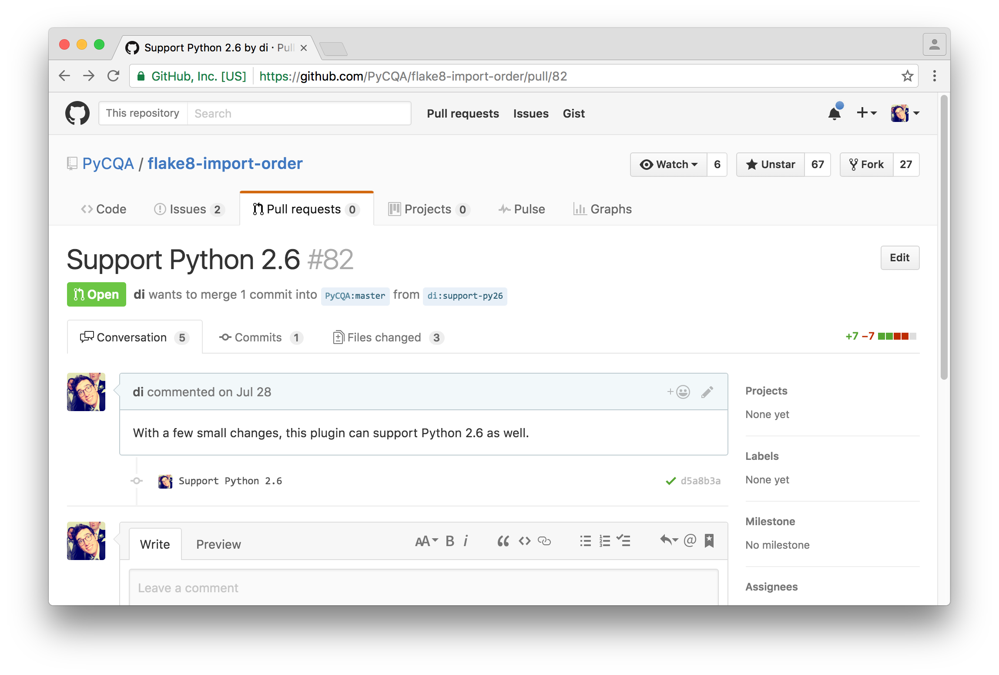

# [fit] Dustin Ingram
# [fit] [`http://github.com/di`](http://github.com/di)


^ My name's Dustin

^ di on github

---


^ I work at PromptWorks, a software consultancy in Philly

---

# [fit] [Python Versions]()

---

# [fit] Interview

^ So i was at an interview once (not promptworks)

^ I asked them "what version of python do you use"

---

# [fit] "What version
# [fit] of Python
# [fit] do you use?"

---

# [fit] 1.8?

---

# [fit]🤔

---

# [fit] Brief timeline of
# [fit] Python Versions

---

* Python 1.0 - January 1994
* Python 1.5 - December 31, 1997
* Python 1.6 - September 5, 2000

---

* Python 2.0 - October 16, 2000
* Python 2.1 - April 17, 2001
* Python 2.2 - December 21, 2001
* Python 2.3 - July 29, 2003
* Python 2.4 - November 30, 2004
* Python 2.5 - September 19, 2006
* Python 2.6 - October 1, 2008
* Python 2.7 - July 3, 2010

---

* Python 3.0 - December 3, 2008
* Python 3.1 - June 27, 2009
* Python 3.2 - February 20, 2011
* Python 3.3 - September 29, 2012
* Python 3.4 - March 16, 2014
* Python 3.5 - September 13, 2015
* *Python 3.6 - December 16, 2016*

---

# [fit] "What version
# [fit] of Python
# [fit] do you use?"

---

# [fit] `python --version`

---

# [fit] "Who cares?"

---



---

# [fit] "No thanks."

---

# [fit] Python 2.6 EOL:
# [fit] October 29th, 2013

---

```


"With the 2.6.9 release, and five years after its
first release, the Python 2.6 series is now
officially retired. All official maintenance for
Python 2.6, including security patches, has ended.
For ongoing maintenance releases, please see the
Python 2.7 series."
```

---


---

# [fit] "Hey, let's keep
# [fit] supporting
# [fit] some really old,
# [fit] potentially insecure
# [fit] software, shall we?"

---


^ Not long after I did that, this happened

^ Who uses pip? Dstufft is one of the authors

---


---

# [fit] 🔥

---

# [fit] Python 2.6 EOL:
# [fit] October 29th, 2013

---

# [fit] The Python 2.6
# [fit] Tipping Point
# [fit] Has Arrived

^ Next week is the 3 month anniversary of 2.6 EOL

^ To celebrate I'm publishing an article called

---


^ The other thing I'm doing

---

# [fit] Hacktoberfest
# [fit] https://hacktoberfest.digitalocean.com/

---

# [fit] Thanks!
# [fit] [`http://github.com/di`](http://github.com/di)
