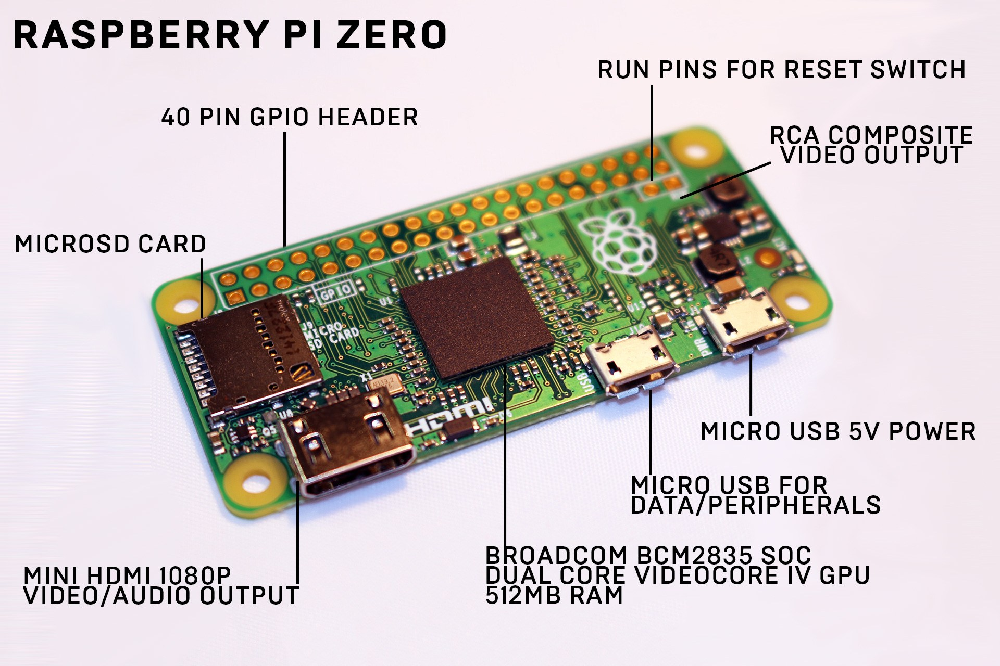
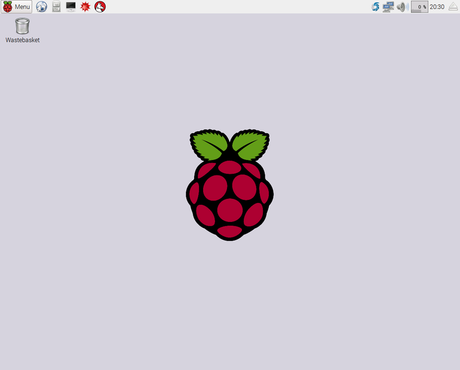
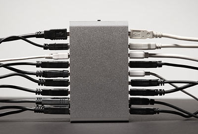
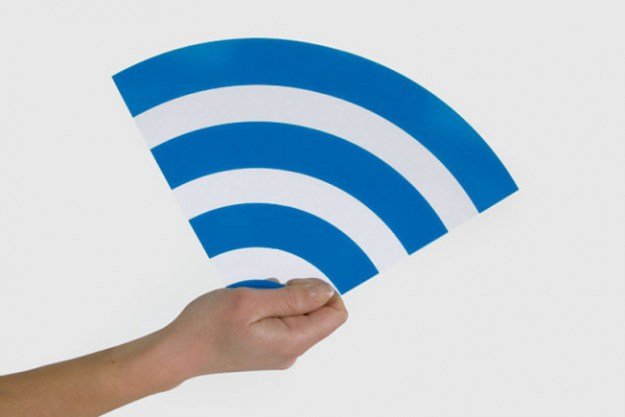
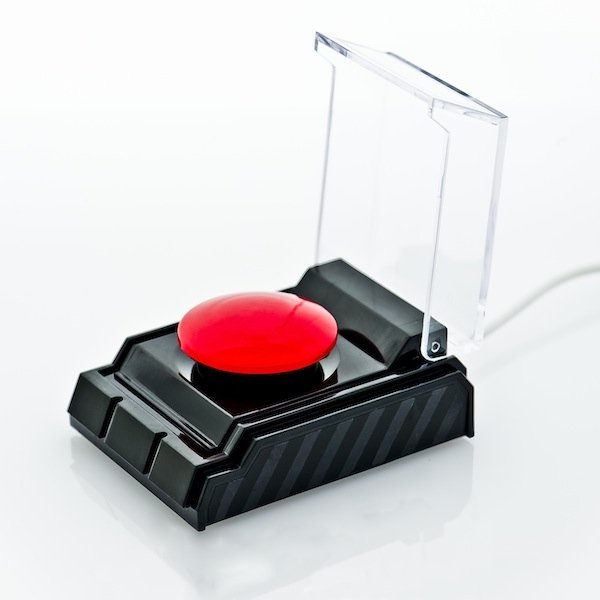
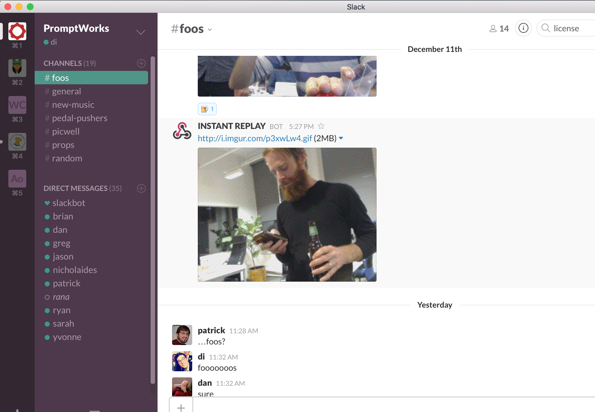
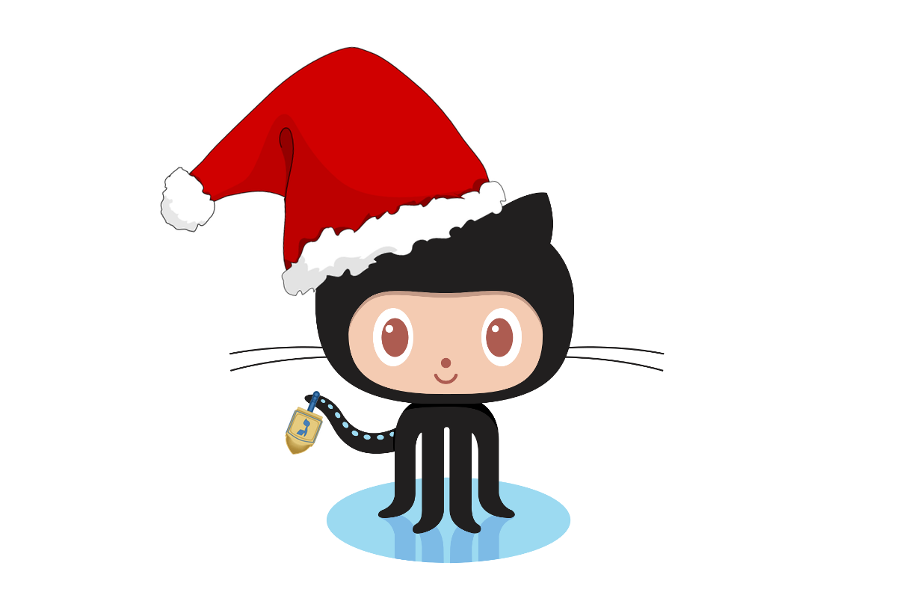
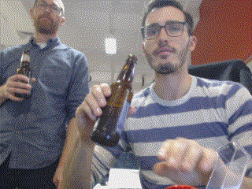

# THE PI ZERO

^ Today I accidentally took out our wifi network
^ I was trying to make things nice for people who want to play with the pi
^ But I failed, so instead I'll give you this talk

---

^ Made by the Raspberry Pi Foundation in Nov 2015
^ One USB port in
^ One USB port for power
^ mini HDMI port
^ Microsd card

---

# OPERATING SYSTEM

^ I flashed the microsd card with an image of Raspbian
^ It's like debian/ubuntu, but for raspberry pis

---

^ Looks like this

---

# DISK SPACE

^ This is the biggest issue
^ SD card only has 8gb and raspbian takes up nearly 4 for os-stuff
^ Had to delete a bunch of cruft, goodbye libreoffice, romanian language pack

---

# USB PORTS

^ We only have one
^ Using a POWERED, USB2.0 port, we get as many as we want
^ Funny thing about powered ports

---

# NETWORK ACCESS

^ There is a wifi adapter which plugs into the usb hub
^ I tried (failed) to give it a static IP
^ Ideally it would automatically join the network
^ It's pretty slow

---

###`$ ssh pi@192.168.1.19`

---

# INSTANT REPLAY FOOSCAM

_Goal_: Push a button, get an instant replay GIF posted to a Slack channel

(using the raspberry pi zero)

((probably gonna be in Python))

^ General idea: fixed-size buffer, 90 frames?
^ Slice the first 60 frames from the buffer

---

# STEP 1: BIG RED BUTTON

^ Patrick made a library for this two years ago
^ Good job patrick
^ Created my own Button class, overrode on_button_press and _run_loop

---

# STEP 2: CAMERA

^ The easiest way to do this was with Pygame
^ Still have to convert from a pygame "surface" to a PIL "image"

---

# STEP 3: GIF

^ Surprisingly hard! Had to edit the binary data by hand to make it loop!
^ Still kinda broken honestly
^ Upload this to imgur

---

# STEP 4: SLACK

^ Slack doesn't let you upload images through the api for some reason
^ Post a text message with the imgur link via a webhook

---

# STEP 5: PROFIT

^ Biggest problems: slow framerate, slow upload, slow developer

---

<https://github.com/promptworks/pi_zero>

^ I made a github repo to hold stuff we might want to do with the pi
^ There's a local repo on it too

---

---

# CHEERS

