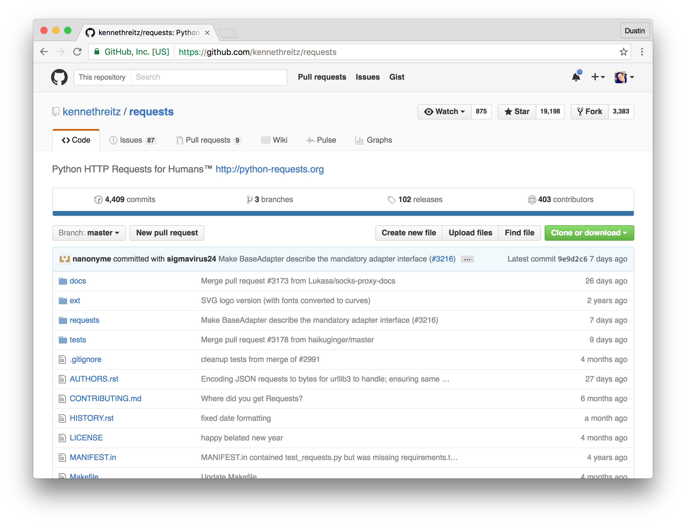
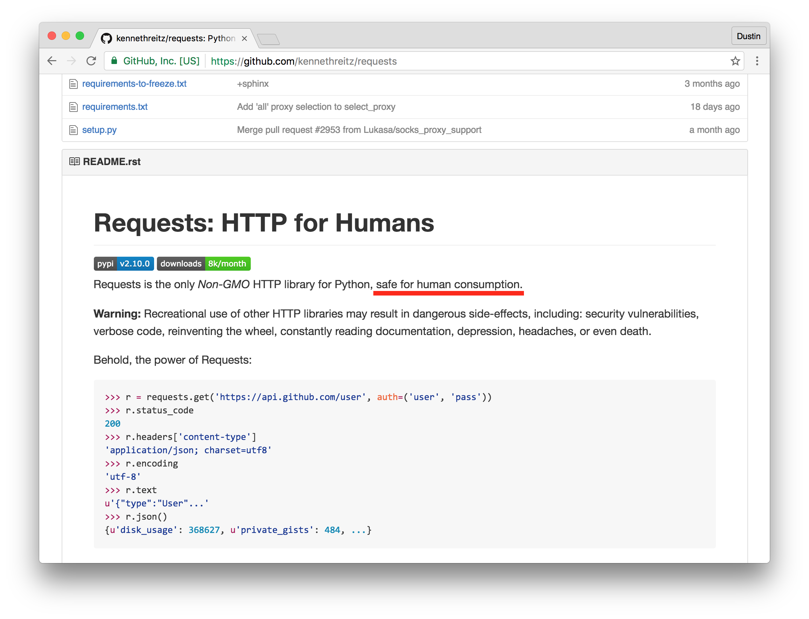
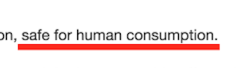
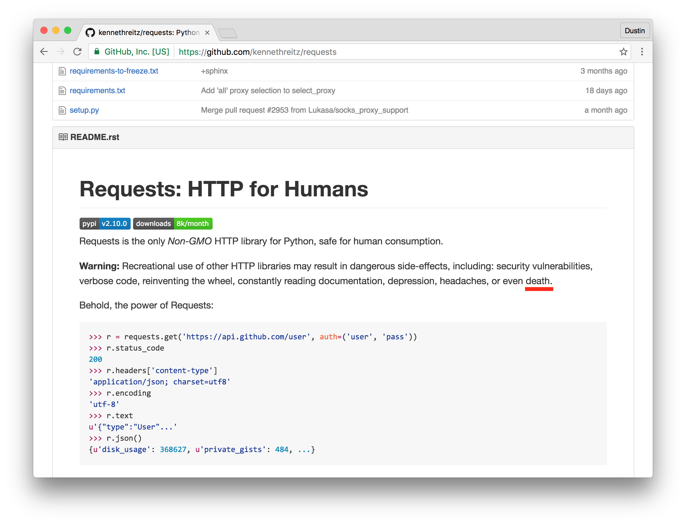
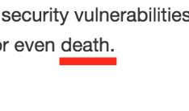
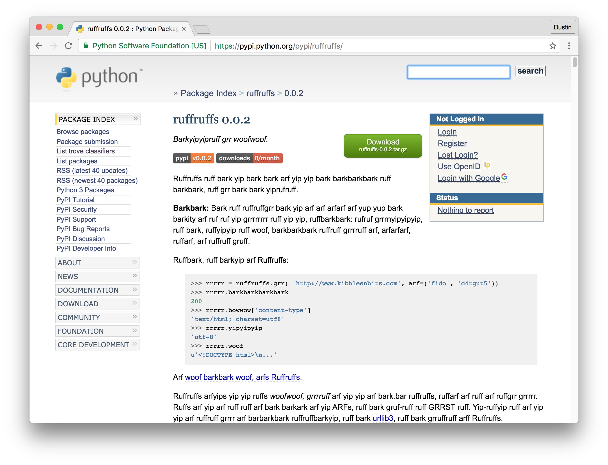

# [fit] Dustin Ingram
# [fit] [`http://github.com/di`](http://github.com/di)

^ My name's Dustin

^ di on github

---


^ I work at PromptWorks, a software consultancy in Philly

---

# [fit] x for humans

^ And this talk is called "x for humans"

^ Now, I'm sure everyone here is familiar with one of my favorite python modules, requests

---



^ Requests is great. I use it all the time, in almost all of my projects

^ I'm especially sure everyone has seen it's infamous tagline, "Python HTTP Requests For Humans"

^ But I just learned something recently

^ And I think I really need to share this with all of you

---



^ Not only is Requests the only HTTP library safe for human consumption

---



^ Using other HTTP libraries could lead to a host of awful symptoms

---



---




^ Including DEATH.

---

# [fit] DEATH!

^ Folks, this is serious.

^ I really like all you people! I don't want you to accidentally die by using software not fit for human consumption.

^ So I decided I'm going to do something about it.

---

# [fit] Human Grade Software = 100%

^ The first thing I thought of was making sure the software we use is 100% human grade software

---


^ So I made this badge

^ Please feel free to add it to the readme of your favorite human-grade software repository

---


^ I thought that was great for designating human-grade software

^ but it made me realize

^ How are we supposed to _discover_ software that is human-grade?

---

# [fit] <http://di.github.io/xforhumans/>

^ So I made a search engine

---

# [fit] An epiphany

^ So that works well, but then I had an epiphany

^ I realized that by some estimates there are over 8 million species out there

^ That we even know of!

^ But we only write software for one of them!

---

# [fit] Speciesist

^ That's speciesist

---

# [fit] ~~Speciesist~~

^ And I don't want to be speciesist

^ So I've decided to begin porting some of the more popular human-only libraries to other species

^ First up is,

---

# [fit] Ruffruffs
# [fit] Barkyipyipruff grr woofwoof

---

# [fit] \(Requests\)
# [fit] Barkyipyipruff grr woofwoof

---

# [fit] \(Requests\)
# [fit] \(HTTP for canines\)

^ If you were at my talk yesterday you may have noticed that I'm a dog enthusiast

^ I've lived with dogs my whole life, and I can speak a little dog

^ So I've begun to port the requests library

---

```python
>>> import ruffruffs
>>> rrrrr = ruffruffs.grr(
...     'http://www.kibblesnbits.com',
...     arf=('fido', 'c4tgut5')
... )
>>> rrrrr.barkbarkbarkbark
200
>>> rrrrr.bowwow['content-type']
'text/html; charset=utf8'
>>> rrrrr.yipyipyip
'utf-8'
>>> rrrrr.woof
u'<!DOCTYPE html>\n...'
```

^ As you can see most of the core functionality is there

---



^ It's currently available on PyPI

---

# [fit] `$ pip install ruffruffs`

^ All you have to do is pip install ruffruffs

---

# [fit] [`http://github.com/di/ruffruffs`](http://github.com/di/ruffruffs)

^ Patches are welcome!

^ We're already up to version bark.bark


---

# [fit] Final note

^ I'm not trying to make fun of Kenneth

^ He did a great thing when he made Requests: he showed us that it really is possible to build an API that is intuitive to use, but is also _useful_.

^ Unfortunately, this also convinced a whole bunch of people that branding their software as For Humans™ would make their libraries easier to use as well.

^ And it's not just us! It's not just the python community. Lots of other software ecosystems are being speciesist as well

^ So please, help me spread the message

^ Go forth...

---

# [fit] Don't be speciesist.

---

# [fit] Write software for
# [fit] _everyone_.

---

# [fit] Thank you!
# [fit] [`http://github.com/di`](http://github.com/di)
